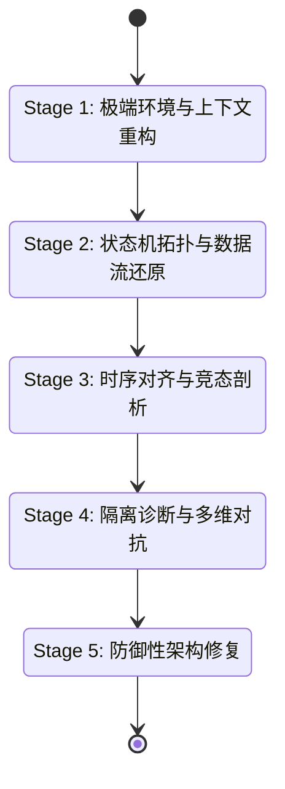

# Mobile QA B2C - 复杂功能异常深度归因专家工作流 (Functionality Deep-Dive Workflow)

## 1. 设计背景与核心理念

针对移动端复杂、隐蔽、难以复现的功能异常（如：状态机紊乱、多线程/协程竞态、缓存穿透、生命周期异步耦合、静默数据损坏等），现有的“通用 6 阶段工作流”往往因为其“快照式”和“平铺直叙”的分析模式而显得捉襟见肘。

本方案旨在剥离出一个**专门针对复杂逻辑漏洞的外科手术式工作流**。该工作流彻底放弃了通用场景下的宽泛排查，转而采用**高维度的侦探模型**，强调极强的代码检索能力、全局架构视野和敏感的逻辑推理能力。

### 1.1 核心设计原则
*   **状态机拓扑还原优先**：拒绝“顺藤摸瓜”式的单线思维，强制要求还原完整的业务状态机。
*   **时序与数据流的精确对齐**：将异步回调、生命周期事件和用户交互在绝对时间轴上对齐，寻找微秒级的竞态。
*   **物理级隔离测试**：通过 Mock 或数据劫持，强行切断表现层与逻辑层的耦合，进行控制变量分析。
*   **防御性与不可变性修复**：修复方案必须具备系统级的鲁棒性（如考虑 Process Death、配置变更）。

---

## 2. 工作流架构设计 (5 阶段专家模型)

该子工作流不再使用 `Intake -> Spec -> RCA -> Fix` 的通用模型，而是重构为以下 5 个深度专业阶段：

---

## 3. 详细阶段说明与执行规约

### Stage 1: 极端环境与上下文重构 (Context Reconstruction)
**目标**：还原那些导致问题偶现的“隐蔽环境因子”。
*   **核心动作**：
    *   **环境剥离分析**：不仅读取设备型号，必须检索日志中当时的内存水位（LMK 警告）、Thermal State（降频）、网络抖动（Jitter）。
    *   **生命周期/系统干预审查**：重点排查在异常发生前 10 秒内，是否发生了后台挂起、权限动态撤销、配置变更（如深色模式切换导致的 Activity Recreate）。
*   **Agent 约束**：严禁在此阶段给出任何代码修复建议，只允许输出《极端环境因子关联报告》。

### Stage 2: 状态机拓扑与数据流还原 (State Topology & Data Flow)
**目标**：建立全局架构视角的“心理地图”，防止只见树木不见森林。
*   **核心动作**：
    *   **逆向状态机绘制**：基于入口代码和报错点，强制 AI 检索所有相关的 `Enum/Sealed Class` 和状态变量，输出一个完整的 Mermaid 状态转移图，并标注出当前卡死的“孤岛状态”或“非法跳转”。
    *   **数据流污点追踪 (Taint Analysis)**：从数据源（DB/Network）到消费端（UI/Disk），逐层检索代码，追踪核心 Data Model 实例。
    *   **不可变性审查**：寻找在哪个拦截器、哪个 ViewModel 的异步闭包中，数据的不可变性（Immutability）被意外破坏了（脏写）。
*   **Agent 约束**：必须精确到具体的类名、方法名和代码行号，输出《全局状态与数据流向图》。

### Stage 3: 时序对齐与竞态剖析 (Temporal Correlation)
**目标**：解决偶发性、难以复现的异步逻辑 Bug。
*   **核心动作**：
    *   **多维时间轴对齐**：将用户操作事件（Touch）、网络请求发出/回调、协程/线程挂起恢复点、系统生命周期回调，放置在统一的绝对时间轴上。
    *   **并发漏洞扫描**：检索所有共享资源的读写点。专门针对移动端特性（如 Android 的 `suspend` 恢复时机、iOS 的 `DispatchQueue.main.async` 嵌套）进行死锁和“先读后写”时序漏洞建模。
    *   **符号执行推理**：AI 需要推理“是否存在一种极端的时序交错（如连击+网络超时同时发生），能打破现有的锁或判空逻辑”。
*   **Agent 约束**：如果推断出竞态，必须给出能够 100% 复现该竞态的"极端时序序列脚本"。

### Stage 4: 隔离诊断与多维对抗 (Isolation & Multi-Agent Debate)
**目标**：斩断复杂耦合，精确定位根因。
*   **核心动作**：
    *   **逻辑层物理隔离**：AI 推演如果在此处注入 Mock 数据或强制断网，系统会作何反应（控制变量法）。
    *   **远端与缓存一致性对齐**：拉取本地 DB/KV 缓存逻辑，对比远端下发契约，寻找“缓存穿透”、“脏读”或“版本漂移”。
    *   **深度质疑协议 (Deep Challenger)**：
        *   *生命周期盲区攻击*：“如果此时宿主 Activity/ViewController 已经销毁，这个闭包执行会导致什么？”
        *   *内存泄露攻击*：“这个单例持有 Context，是否导致了整个链路的静默崩溃？”
*   **Agent 约束**：多 Agent 对抗必须收敛于一个具有唯一逻辑自洽性的根因，否则要求补充特定的内存或时序日志。

### Stage 5: 防御性架构修复 (Defensive Architecture Fix)
**目标**：不仅要修 Bug，更要提升架构的鲁棒性，防止同类问题再次发生。
*   **核心动作**：
    *   **架构级重构建议**：对于严重的状态耦合，不再提供简单的 `if (xxx != null)` 补丁，而是提供基于 MVI/MVVM 单向数据流或 `StateFlow/Combine` 的重构方案。
    *   **生命周期感知注入**：修复代码必须显式处理进程死亡和配置更改，优先使用 `repeatOnLifecycle` 或生命周期感知的订阅。
    *   **防呆与熔断机制**：在关键链路加入状态校验熔断器（Assertion/Fallback），确保下次即使状态错乱也不会引发雪崩。
*   **Agent 约束**：输出《防御性修复与架构演进方案》，包含修改前后的逻辑对比拓扑图。

---

## 4. 专家工作流的 I/O 契约 (I/O Contracts)

为了保证这个子工作流的严谨性，定义以下核心产物契约：

1.  **输入**：
    *   通用 Intake 阶段收集的 Issue Card。
    *   所有可用的全量日志、APM 性能快照、全量代码库访问权限。
2.  **关键输出产物**：
    *   `deep-dive-topology.md`：包含状态机图、数据流向和时序对齐轴。
    *   `concurrency-analysis-report.md`：并发与竞态深度分析报告。
    *   `defensive-fix-design.md`：包含架构重构和防御性代码的修复设计。

## 5. 适用场景边界
此工作流**不适用**于：
*   明确的 UI 像素级错位、颜色错误。
*   简单的空指针、数组越界（有明确堆栈且必现）。
*   后端接口固定报错（500/404）。

此工作流**强烈建议触发**于：
*   **“偶发”、“难以复现”、“一直存在但找不到规律”**的功能异常。
*   涉及支付、核心交易链路的状态流转错误。
*   Crash 栈指向系统底层（如 `MessageQueue`、`Looper`、`libcore`），实际是由上层内存踩踏或野指针引发的疑难杂症。
