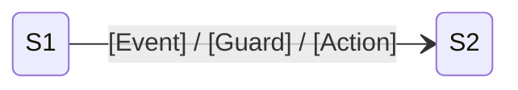

# Deep-Dive Topology — {Issue-ID}

## State Definitions
| State ID | Class | State | Trigger | Liveness |
|----------|-------|-------|---------|----------|
| S1 | [Class] | [State] | [条件] | [Live/Suspect] |

## State Diagram

## Isolated States
- [Sx] [描述]

## Illegal Transitions
- [Sa -> Sb] [描述]

## Data Flow
| Model | Source | Consumer | Mutability | Risk |
|-------|--------|----------|------------|------|
| [Model] | [DB/Network] | [UI/Disk] | [Mutable/Immutable] | [High/Medium/Low] |

## Dirty Writes
| Location | Description | Line |
|----------|-------------|------|
| [Class.method] | [描述] | [L123 / Line-Uncertain] |
