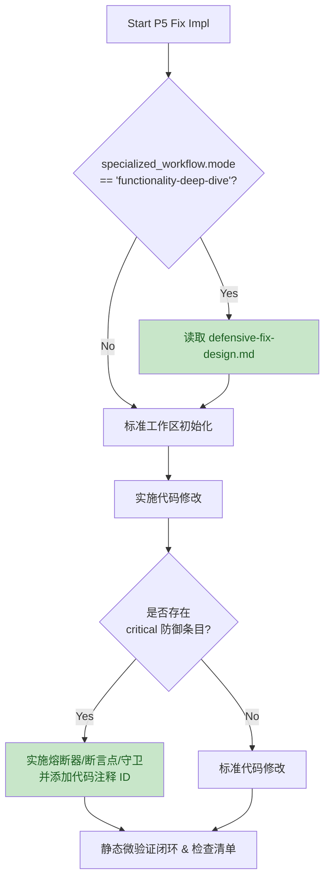
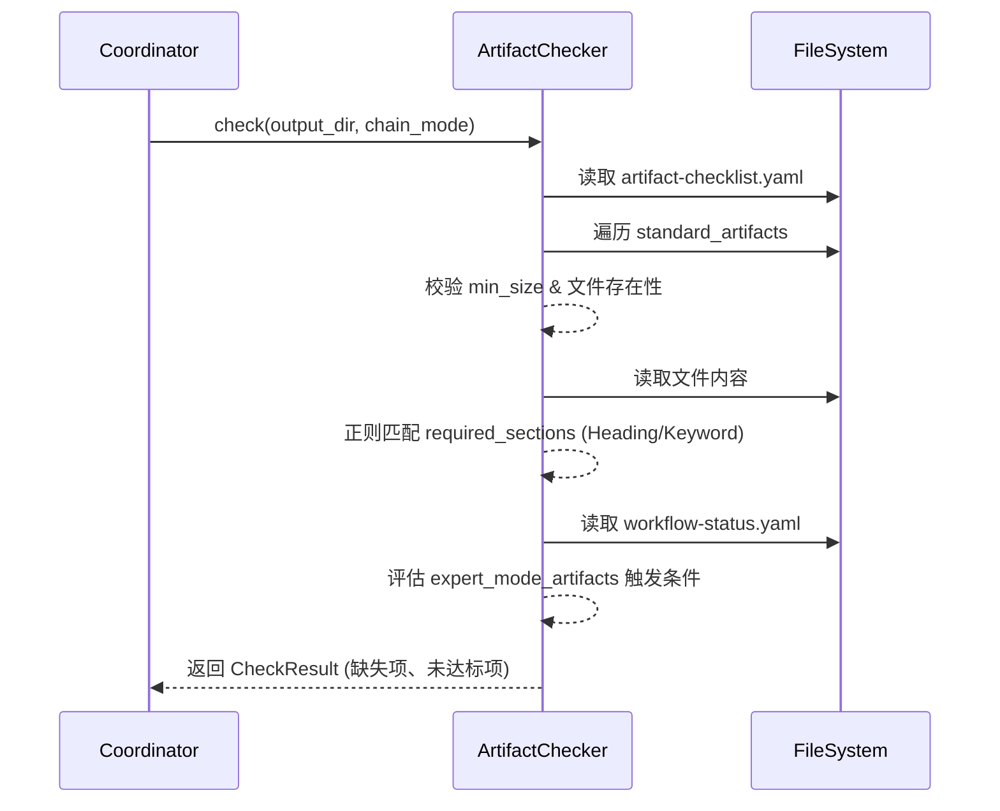

# Loupe AI 自检自测系统 V1.2 代码审查报告

**审查日期**: 2026-04-17
**审查范围**: 最新 Commit (`HEAD~1` 到 `HEAD`)
**参考依据**: [Loupe AI 自检自测系统设计方案 V3（终版）] 详细施工文档 (V1.2)

---

## 1. 变更意图概览 (Change Overview)

本次代码提交主要对应施工文档中的 **Batch 0** (部分) 与 **Batch 1/2** 的基础框架搭建，主要实现了以下核心能力：
1. **P5 实施阶段闭环改造**：在 `p5-fix-impl.md` 中增加对 `defensive-fix-design.md` 的动态加载和防御性修复要求。
2. **评估框架 (Eval-Framework) 产物校验增强**：实现了 `artifact_checker.py` 及其配套配置，新增轻量级 `required_sections` (关键段落) 的存在性校验。
3. **薄弱环节定位器**：实现了 `weakness_detector.py`，支持基于 Case 类型和阶段的多维交叉分析。
4. **测试用例库扩充**：新增了 `seed-10` 系列基础案例的目录和占位。
5. **上下文补充**：在 `context-bundle.md` 中追加了专项模式的输入清单。

整体变更与 V1.2 施工文档的要求高度一致，未对原有非专项流程造成破坏。

---

## 2. 核心逻辑可视化 (Flow Analysis)

### 2.1 业务流：P5 防御性修复实施流 (Business Flow)

### 2.2 技术流：产物校验机制 (Technical Flow)

---

## 3. 逐文件深度 Review 与鲁棒性分析

### 3.1 `mobile-qa-workflow/phases/p5-fix-impl.md`
- **功能完整性**：完全实现了 QA 建议 #1。正确添加了 `<step n="2">` 负责加载防御性修复方案，以及在后续实施和 Checklist 阶段新增了对应的防御性要求（如熔断器、断言等）。
- **向后兼容性**：原有 `<step n="2">` 到 `<step n="6">` 的序号均正确顺延（顺延至 3 到 7）。原有逻辑 `<goto step="5"/>` 被正确修正为 `<goto step="6"/>`，不会打乱标准流程的跳转。
- **鲁棒性评估**：✅ **优秀**。使用了 `<check if="...">` 严格隔离了专项逻辑，`optional="true"` 确保了即使 `defensive-fix-design.md` 文件不存在也不会导致工作流崩溃。

### 3.2 `eval-framework/artifact_checker.py` & `artifact-checklist.yaml`
- **功能完整性**：实现了轻量级的 Markdown 标题和关键字提取校验，匹配 V1.2 中 QA 建议 #3 的增强产物校验规则。
- **鲁棒性隐患 1 (正则匹配局限性)**：
  - `rf"^#{1,6}\s+.*{re.escape(h)}.*$"` 仅支持 `#` 语法的标题，如果 LLM 生成了 `===` 或 `---` 的底线标题，会发生漏判。但结合了 `\*\*{re.escape(h)}\*\*` 以及直接文本匹配的 Fallback，整体可用性较高。
- **鲁棒性隐患 2 (配置与代码的硬编码耦合)**：
  - 在 `yaml` 配置中：`conditional_on: "workflow-status.yaml → specialized_workflow.status ∈ {DD-Completed, Merged}"` 是自然语言描述。
  - 在代码 `_check_expert_condition` 中，直接硬编码了读取 `workflow-status.yaml` 并判断状态 `sw_status in ("DD-Completed", "Merged")`。
  - **影响**：若后续 YAML 规则变更，代码需要同步硬改，扩展性略有瑕疵，但在当前特定 MVP 阶段可接受。

### 3.3 `eval-framework/weakness_detector.py`
- **功能完整性**：实现了 `WeaknessDetector`，可以按分类、按阶段、以及交叉分析计算低分 Case。
- **鲁棒性评估**：✅ **良好**。
  - 数学运算安全：使用了 `statistics.mean(scores) if scores else 0`，并在阶段分析时使用了 `if not scores: continue`，彻底杜绝了 `ZeroDivisionError`。
  - 优先级计算合理：`priority = int(w.gap * len(w.affected_cases) * 10)`，兼顾了分差与影响面。

### 3.4 `eval-framework/session_manager.py` (包含于 Diff 截断输出中)
- **功能完整性**：封装了子进程轮询、超时控制和日志输出。
- **鲁棒性隐患 3 (进程超时处理)**：
  - 代码 `stdout_bytes, stderr_bytes = session.process.communicate(timeout=5)`：如果在结束阶段发生 5 秒超时，进程被 `kill()`。
  - **影响**：在某些高并发或 IO 阻塞情况下，5 秒的缓冲收集时间可能偏短。如果超时触发 `kill`，会导致返回的 `exit_code = -1` 且可能丢失该进程尚未 flush 的 `stdout/stderr` 日志。
  - **建议**：未来可考虑流式读取或适当放宽 `communicate` 的超时时间。

---

## 4. 结论与建议 (Conclusion)

**总体评价：通过 (Approve)**。
本次代码变更逻辑严密，对 V1.2 设计文档的还原度高。工作流阶段的跳转序号维护正确，且核心的 Python 分析脚本 (如 `weakness_detector`, `artifact_checker`) 均做了良好的空值防护和异常捕获，**不会影响原有功能的运行**。

**后续改进建议 (非阻断，可记录于 Tech Debt)**：
1. `artifact_checker.py` 中 `_check_expert_condition` 的硬编码逻辑未来可重构为简单的 AST/表达式引擎，真正实现通过 YAML 驱动条件校验。
2. 密切关注 `session_manager.py` 中 `communicate(timeout=5)` 的执行表现，若发现大批量 `-1` 退出码，需增加超时时间或优化日志截获机制。
