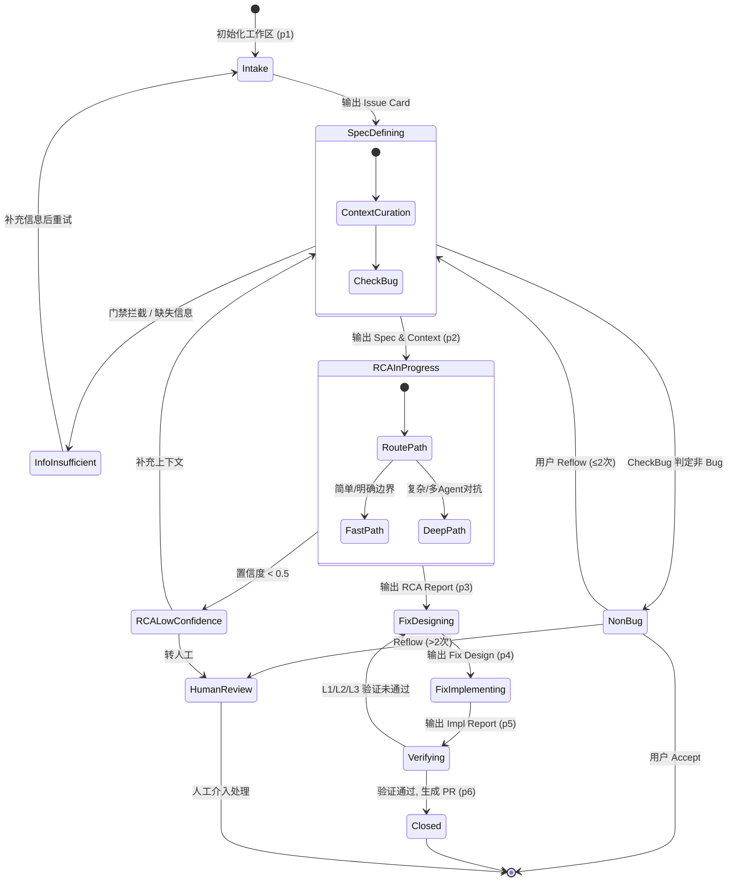
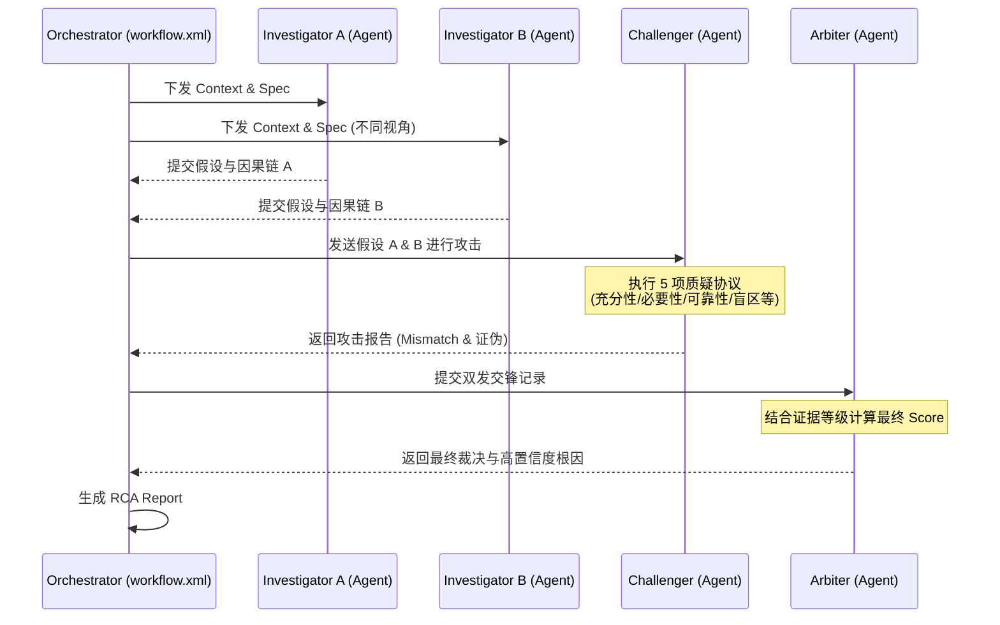

# Mobile QA B2C Workflow - 工程架构与详细分析文档

## 1. 项目工程简介

**Mobile QA B2C Workflow** 是一个专为移动端（Android/iOS）质量问题（如 Crash、性能瓶颈、功能异常、UI 错乱、网络错误、兼容性问题等）设计的自动化、标准化的 AI 诊断与修复工作流。

该工程基于 **大语言模型（LLM）的智能体（Agent）编排技术**，采用严格的阶段化（Phased）流水线和状态机（State Machine）驱动机制。它旨在将高度依赖人工经验的移动端排查过程，转化为一个可预测、可审计、具有容错机制和人机协同（Human-in-the-loop）能力的标准化工程流程。

### 1.1 核心架构思想
*   **状态机驱动**：通过 `workflow-status.yaml` 维护全局状态，支持工作流的暂停、恢复、重试和人工介入。
*   **标签化控制流**：在 Prompt 中自创了一套 XML 标签语义（如 `<flow>`, `<step>`, `<switch>`, `<check>`, `<action>`），用于强约束 LLM 的执行顺序，防止步骤跳跃或合并。
*   **多智能体对抗（Multi-Agent Debate）**：在复杂的根因分析（RCA）和修复设计阶段，引入 Investigator、Challenger、Arbiter 等子 Agent 进行多视角对抗，以提高结论的准确性和置信度。
*   **模板化 I/O 契约**：每个阶段必须严格输出符合预定义 Markdown 模板的产物，下游阶段直接依赖上游产物，形成严密的输入输出（I/O）契约。

---

## 2. 核心模块与目录解析

当前工作流的文件目录结构经过精心设计，遵循高内聚、低耦合的原则：

### 2.1 `core/` (核心引擎层)
这是整个工作流的大脑，负责调度和规则定义。
*   **`workflow.xml`**: 主编排器（Orchestrator）。基于 XML 语法定义了阶段路由逻辑、I/O 契约以及异常状态（如信息不足、非 Bug、置信度低）下的处理分支。
*   **`core-rules.xml`**: 全局核心规则。定义了 LLM 必须遵守的硬性指令（Mandates）、支持的 XML 流程控制标签，以及人工审查（Human-Review）的触发协议。
*   **`workflow-model.yaml`**: 定义了工作流的 6 个标准阶段序列。
*   **`default-config.yaml` & `workflow-status-template.yaml`**: 工作区的默认配置和状态机的初始模板。

### 2.2 `phases/` (执行阶段层)
具体实施质量排查的 6 个标准阶段（Pipeline）：
1.  **`p1-intake.md` (问题受理)**: 收集问题描述，提取三级信息，进行问题分类和优先级评估。
2.  **`p2-spec-definition.md` (Spec 定义)**: 定义 Expected Behavior 和 Actual Behavior，过滤非 Bug，并进行上下文策展（Context Curation）。
3.  **`p3-root-cause.md` (根因分析)**: 核心分析阶段。使用 OVHSC 推理链（观察-假设-验证-评分-因果链），并根据问题复杂度动态路由到单视角快速路径或多视角深度对抗路径。
4.  **`p4-fix-design.md` (修复方案设计)**: 基于 RCA 结果，结合四重论证（完整性、安全性、正确性、最小性）设计修复方案，评估跨端一致性。
5.  **`p5-fix-impl.md` (修复实施)**: 生成实际代码修改，进行静态微验证（Lint/AST）检查。
6.  **`p6-verification.md` (验证与闭环)**: 进行 L1 (Spec 静态符合性)、L2 (回归安全性)、L3 (静态与动态质量) 的三级验证，最终输出知识卡片并生成 PR/MR。

### 2.3 `agents/` (子智能体层)
用于复杂推理阶段的多 Agent 协作角色：
*   **`investigator.md`**: 负责正向提出假设和搜集证据。
*   **`challenger.md`**: 充当“反方”，基于因果充分性、必要性、盲区等协议对假设进行严苛攻击。
*   **`arbiter.md`**: 仲裁者，评估 Investigator 和 Challenger 的交锋，给出最终裁定。
*   **`curator.md`**: 上下文策展人，负责对海量日志和代码片段进行降维、去重和置信度打分。
*   **`fix-proposer.md`**: 修复方案提出者。

### 2.4 `templates/` (标准产物模板)
定义了各阶段流转的标准化数据载体，包括：`issue-card.md`, `spec.md`, `context-bundle.md`, `rca-report.md`, `fix-design.md`, `impl-report.md`, `verification-report.md`, `knowledge-card.md`。

### 2.5 根目录核心文件
*   **`SKILL.md`**: Trae IDE 的 Skill 入口配置，负责解析输入参数、初始化物理隔离的工作区（基于时间戳的 `issue_id`），并加载核心编排器。
*   **`system-prompt.md`**: 这是一个整合版文件，为不支持外部文件读取的纯对话式大模型平台（如 Dify、Coze）提供了“开箱即用”的内联（Inline）完整系统提示词。

---

## 3. 架构与流程图

### 3.1 总体架构与阶段流转 (状态机)

### 3.2 根因分析(RCA) 多 Agent 对抗架构

当问题复杂度高（如跨端逻辑矛盾、缺乏 Crash 栈等）时，触发多智能体深度对抗：

---

## 4. 关键工程设计亮点

1. **确定性控制 (Deterministic Control)**
   通过定义 `<flow>`, `<switch>`, `<try/catch>` 等类似编程语言的标签结构，将自然语言转变为可解析的 AST（抽象语法树）风格指令，大幅降低了 LLM 在长工作流中“幻觉”或“迷失”的概率。
2. **物理隔离的工作区**
   每次诊断自动生成类似 `YYYYMMDD-HHmmss` 的 `issue_id`，所有配置、状态 (`workflow-status.yaml`) 和输出产物均落盘在此独立文件夹下。这使得工作流可以随时中断和恢复，完美支持异步操作。
3. **证据可信度二维分级**
   在上下文策展（Context Curation）中，将证据按 Reliability (A/B/C) 和 Liveness (Live/Suspect/Dead) 进行二维评估。明确规定“纯 C 级证据回退”和“Dead 证据不入推理”，从源头上保证了 RCA 的质量。
4. **防御性兜底机制**
   在 `Fix-Impl` 阶段强调“防御性编程”和“异常降级”，针对移动端特有的“远端漂移 (Remote Drift)”问题，支持跨端协调或远端配置修复指令，而不是盲目修改客户端代码。
