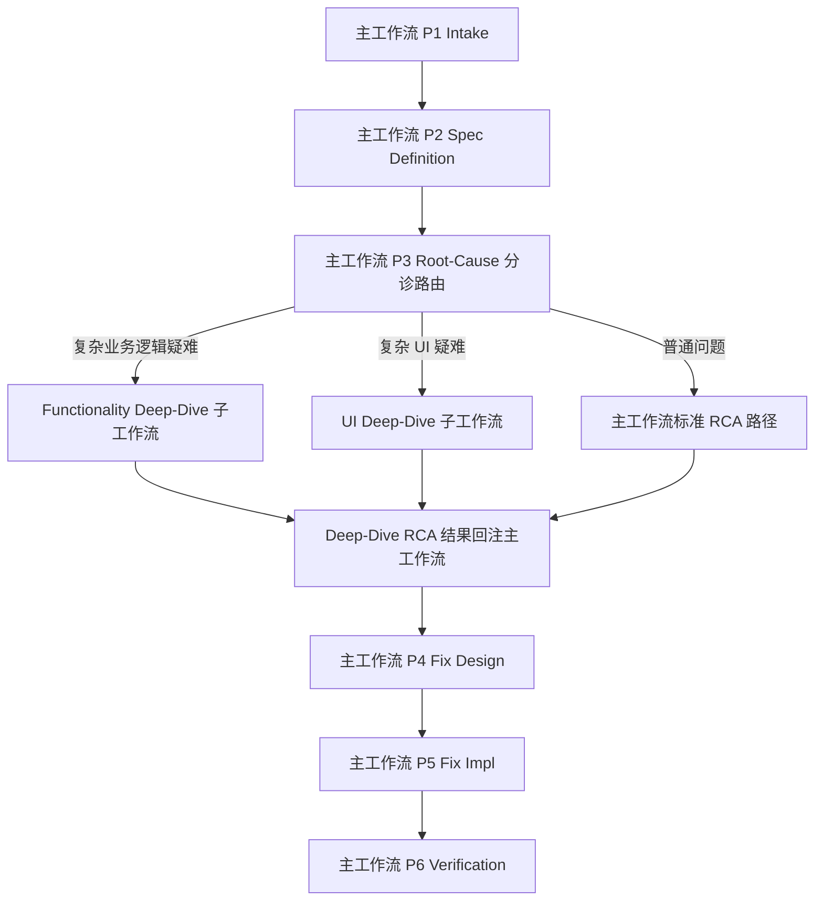
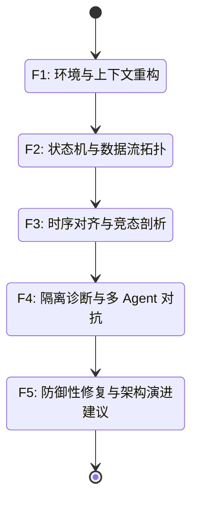
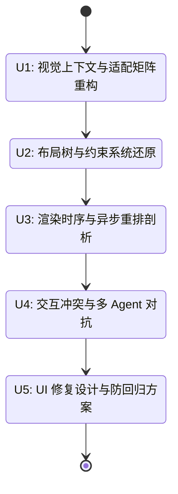

# Deep-Dive 独立子工作流架构方案（V3，效果优先版）

> **编制日期**：2026-04-16  
> **设计原则**：分析效果优先，工程改造量次之  
> **适用目标**：最大化提升复杂、疑难、偶发、长链路问题在 UI / 业务逻辑场景下的分析深度、归因准确率与修复质量  
> **结论先行**：V3 不再把 Deep-Dive 视为主工作流 Phase 内增强分支，而是设计为由主工作流**路由触发的独立专项子工作流**。  

---

## 一、V3 核心结论

### 1.1 总体判断

若以“复杂疑难问题的分析与修复效果”为第一优先级，最佳架构不是 V2 的“嵌入式增强模式”，而是：

1. **保留主工作流**，负责 Intake / Spec / 分诊 / Fix 闭环
2. **新增独立专项子工作流**，负责复杂场景下的深度分析
3. **按问题类型拆分专项子工作流**
   - `Functionality Deep-Dive Workflow`：面向业务逻辑、状态机、竞态、缓存一致性、生命周期耦合类疑难问题
   - `UI Deep-Dive Workflow`：面向布局错乱、异步重排、渲染时序、约束冲突、适配矩阵、动画/手势冲突类疑难问题
4. **主工作流只做路由与结果回注**，不承担专项深度分析本体

### 1.2 为什么 V3 比 V2 更优

V2 的优点是落地快、对现有工程侵入小；但它的上限受限于“通用工作流上下文”。

V3 的优势在于：

- **分析上下文更纯**：专项工作流不必反复兼容 Crash / 网络 / 兼容性等通用路径，可以把推理资源集中到真正困难的问题结构上。
- **产物可以更重**：允许输出更厚、更专业、更审计友好的中间产物，而不用压缩进通用模板。
- **Agent 能力可以更深**：专项 Agent 可针对 UI 或业务逻辑疑难做专门训练和协议设计，不被通用协议稀释。
- **修复设计更准确**：复杂问题往往不是单点修复，V3 更适合处理“主根因 + 贡献因子 + 脆弱结构点 + 防御性演进”。
- **对 UI 疑难问题尤其重要**：UI 深度分析与业务逻辑深度分析方法论差异很大，混在一起会互相污染。

---

## 二、V3 架构总览

### 2.1 总体架构



### 2.2 主从职责边界

#### 主工作流负责

- 问题受理与基础分类
- Spec 定义与基础上下文收集
- 判定是否需要进入专项 Deep-Dive
- 调用对应子工作流
- 接收子工作流产物并回注主产物
- 后续 Fix Design / Fix Impl / Verification 闭环

#### 子工作流负责

- 专项深度分析的完整过程
- 专项中间产物生成
- 多 Agent 深度对抗
- 主根因与贡献因子归并
- 防御性修复建议或 UI 修复建议

---

## 三、为什么要拆成两个独立子工作流

### 3.1 Functionality Deep-Dive 不应覆盖 UI 疑难

功能疑难问题的核心对象是：

- 状态机
- 数据流
- 并发时序
- 生命周期
- 缓存一致性
- 业务规则链

而 UI 疑难问题的核心对象是：

- View Hierarchy / Layout Tree
- 约束求解与优先级
- 渲染时序
- 异步数据回流后的布局重排
- 动画与手势系统
- 屏幕/字号/语言/暗黑模式/安全区适配矩阵

这两类问题虽然都可能“偶发且难复现”，但分析模型并不相同。

### 3.2 如果不拆，会出现的问题

- 状态机/竞态分析会污染 UI 证据结构
- UI 约束与布局树会污染业务逻辑 RCA 结构
- Agent prompt 变得过宽，降低推理专注度
- 模板越来越胖，最终既不利于功能疑难，也不利于 UI 疑难

### 3.3 V3 的专项拆分建议

#### 子工作流 A：Functionality Deep-Dive

聚焦：

- 偶发功能异常
- 状态流转错误
- 数据异常
- 并发写入 / 竞态
- 缓存漂移
- 生命周期耦合
- 多模块业务链异常

#### 子工作流 B：UI Deep-Dive

聚焦：

- 偶发布局错乱
- 异步加载后的布局重排异常
- AutoLayout / ConstraintLayout 约束冲突
- View 生命周期与动画冲突
- 多层嵌套滚动 / 手势冲突
- 字号 / 语言 / 密度 / 安全区 / 暗黑模式适配异常

---

## 四、主工作流如何路由到 V3 子工作流

### 4.1 路由总原则

主工作流 P3 不再尝试自己“深入解决所有复杂问题”，而是在完成：

1. 边界判断
2. 基础复杂度评估
3. 基础证据阈值检查

之后，做一层新的专项分诊：

- 普通 RCA
- Functionality Deep-Dive
- UI Deep-Dive

### 4.2 路由判定矩阵

| 条件 | 普通 RCA | Functionality Deep-Dive | UI Deep-Dive |
|------|----------|--------------------------|--------------|
| 主分类=功能 | 可能 | 高概率 | 否 |
| 主分类=UI/UX | 可能 | 否 | 高概率 |
| complexity=simple | 是 | 否 | 否 |
| complexity=medium | 视情况 | 可触发 | 可触发 |
| complexity=complex | 视情况 | 强触发 | 强触发 |
| 偶发/难复现 | 低 | 高 | 高 |
| 需要状态机/竞态/缓存分析 | 否 | 高 | 低 |
| 需要布局树/约束/渲染分析 | 否 | 低 | 高 |

### 4.3 Functionality Deep-Dive 触发条件

满足以下任一组合即可触发：

1. `主分类 == 功能` 且 `complexity_level == complex`
2. 问题包含以下任一特征：
   - 偶发性
   - 状态机跳转异常
   - 并发/竞态
   - 缓存一致性
   - 生命周期异步耦合
   - Crash 栈指向系统底层但怀疑业务上层
3. 快速路径反事实校验失败，且异常不是纯 UI 结构问题

### 4.4 UI Deep-Dive 触发条件

满足以下任一组合即可触发：

1. `主分类 == UI/UX` 且 `complexity_level in {medium, complex}`
2. 问题包含以下任一特征：
   - 偶发布局错乱
   - 数据加载后才出现 UI 异常
   - 旋转/切后台/回前台后布局失真
   - 约束冲突只在部分设备/字号/语言出现
   - 动画/手势/滚动冲突
   - 暗黑模式、RTL、折叠屏、安全区相关异常
3. 标准 UI 路径无法通过单次布局树或截图对比定位根因

---

## 五、Functionality Deep-Dive 子工作流设计

### 5.1 定位

这是一个面向**业务逻辑复杂疑难问题**的独立专项工作流，目标不是快速得出“一个可能原因”，而是建立**完整状态拓扑、时序模型与根因集合结构**。

### 5.2 建议阶段模型



### 5.3 核心输入

- `issue-card.md`
- `spec.md`
- `context-bundle.md`
- 可用日志 / APM / 抓包 / 代码库
- 主工作流路由结果与复杂度评估

### 5.4 核心输出

- `environment-factor-report.md`
- `deep-dive-topology.md`
- `concurrency-analysis-report.md`
- `functionality-deep-dive-rca.md`
- `defensive-fix-design.md`

### 5.5 最终回注给主工作流的精简结果

回注文件建议：

- `deep-dive-summary.md`

其中包含：

- Primary Root Cause
- Contributing Factors
- 关键证据摘要
- 是否建议防御性修复
- 是否需要 Human Review

---

## 六、UI Deep-Dive 子工作流设计

### 6.1 定位

这是一个面向**UI 复杂疑难问题**的独立专项工作流，目标是建立“布局结构 + 渲染时序 + 适配矩阵 + 交互冲突模型”的完整解释。

### 6.2 建议阶段模型



### 6.3 每阶段关注重点

#### U1 视觉上下文与适配矩阵重构

- 设备尺寸 / 密度 / 安全区 / 字号 / 语言 / 暗黑模式
- 系统设置差异
- 问题只在何种矩阵组合下出现

#### U2 布局树与约束系统还原

- View Hierarchy / Layout Tree
- ConstraintLayout / AutoLayout 约束关系
- 优先级冲突
- IntrinsicContentSize / Measure-Layout 链

#### U3 渲染时序与异步重排剖析

- 首屏渲染
- 数据异步回流
- Layout Pass / Render Pass
- 动画开始/结束与数据刷新顺序
- 页面切换/回前台/旋转带来的重排

#### U4 交互冲突与多 Agent 对抗

- 手势竞争
- 嵌套滚动
- 点击区域与命中测试
- 动画与交互阻塞
- 生命周期切换后的视图状态残留

#### U5 UI 修复设计与防回归方案

- 约束修复
- 渲染时机修复
- 适配矩阵修复
- 降级方案
- 回归矩阵设计

### 6.4 核心输出

- `ui-context-matrix-report.md`
- `layout-topology-report.md`
- `render-timeline-report.md`
- `ui-deep-dive-rca.md`
- `ui-fix-design-addendum.md`

### 6.5 回注主工作流的精简结果

建议回注：

- `ui-deep-dive-summary.md`

包含：

- Primary UI Root Cause
- 触发矩阵
- 关键约束/布局/时序结论
- 修复建议摘要
- 防回归测试矩阵

---

## 七、V3 的主工作流集成方式

### 7.1 集成原则

主工作流不直接执行 Deep-Dive 细节，而是：

1. 判断是否进入子工作流
2. 调用子工作流
3. 等待子工作流产物
4. 将结果映射回主工作流标准产物

### 7.2 集成点设计

#### P2 后

- 完成基础 Spec 与基础 Context Bundle
- 若基础信息都不够，不允许进入 Deep-Dive

#### P3 前半段

- 做边界与复杂度评估
- 做专项子工作流路由

#### P3 中段

- 若进入 Deep-Dive，则挂起标准 RCA 深度分析
- 调用对应子工作流

#### P3 后段

- 子工作流返回 `deep-dive-summary.md`
- 主工作流生成标准 `rca-report.md`，但引用专项结论

#### P4

- 若存在 `defensive-fix-design.md` 或 `ui-fix-design-addendum.md`
- 则将其作为 `fix-design.md` 的附录输入

### 7.3 主工作流新增状态建议

如果允许改主状态机，建议新增：

```yaml
specialized_workflow_mode: null      # functionality-deep-dive | ui-deep-dive | null
specialized_workflow_status: null    # pending | running | completed | failed
specialized_artifacts: []
```

与 V2 不同，V3 这里新增状态是合理的，因为它真的存在“独立子流程执行中”的语义。

---

## 八、V3 的产物体系设计

### 8.1 主工作流标准产物不废弃

仍保留：

- `issue-card.md`
- `spec.md`
- `context-bundle.md`
- `rca-report.md`
- `fix-design.md`
- `impl-report.md`
- `verification-report.md`

### 8.2 新增专项产物分层

#### Functionality Deep-Dive 产物

- `environment-factor-report.md`
- `deep-dive-topology.md`
- `concurrency-analysis-report.md`
- `functionality-deep-dive-rca.md`
- `defensive-fix-design.md`
- `deep-dive-summary.md`

#### UI Deep-Dive 产物

- `ui-context-matrix-report.md`
- `layout-topology-report.md`
- `render-timeline-report.md`
- `ui-deep-dive-rca.md`
- `ui-fix-design-addendum.md`
- `ui-deep-dive-summary.md`

### 8.3 回注映射关系

| 子工作流产物 | 回注主产物 |
|--------------|------------|
| `deep-dive-summary.md` | `rca-report.md` |
| `defensive-fix-design.md` | `fix-design.md` |
| `ui-deep-dive-summary.md` | `rca-report.md` |
| `ui-fix-design-addendum.md` | `fix-design.md` |

---

## 九、V3 的 Agent 体系建议

### 9.1 Functionality Deep-Dive Agent 体系

- `context-reconstructor`
- `state-analyst`
- `temporal-analyst`
- `challenger`
- `arbiter`
- `defensive-fix-architect`

### 9.2 UI Deep-Dive Agent 体系

- `ui-context-analyst`
- `layout-analyst`
- `render-timing-analyst`
- `gesture-interaction-analyst`
- `challenger`
- `arbiter`
- `ui-fix-architect`

### 9.3 为什么专项 Agent 比复用 Investigator 更强

- 可以显式声明能力边界
- prompt 更短、更聚焦
- 输出模板更稳定
- 便于后续做专项案例沉淀与评估

---

## 十、V3 与 V2 的对比

| 维度 | V2 嵌入式增强 | V3 独立子工作流 |
|------|---------------|-----------------|
| 工程改造量 | 中 | 高 |
| 与现有流程兼容性 | 高 | 中 |
| 功能疑难分析上限 | 中高 | 高 |
| UI 疑难分析上限 | 中 | 很高 |
| 中间产物表达能力 | 中 | 高 |
| Agent 专项深度 | 中 | 高 |
| 长期演进性 | 中 | 高 |

### 10.1 结论

- 若目标是“尽快落地、尽量少改工程”，选 V2。
- 若目标是“复杂疑难问题分析效果最好”，选 V3。

在你当前明确的优先级下，应选择 **V3**。

---

## 十一、分阶段实施建议

### Phase A：先落 Functionality Deep-Dive 独立子工作流

原因：

- 业务逻辑疑难问题是现阶段最痛点
- 当前已有设计基础
- 和现有文档积累最接近

### Phase B：再落 UI Deep-Dive 独立子工作流

原因：

- UI 疑难模型更独特
- 更适合在功能 Deep-Dive 跑通后独立建设

### Phase C：打通回注与统一评估

- 主工作流路由稳定
- Fix Design / Verification 正式消费专项附录
- 建立专项案例评测集

---

## 十二、最终建议

### 12.1 推荐决策

建议正式采纳以下架构路线：

1. **主工作流保留**
2. **Functionality Deep-Dive 独立化**
3. **UI Deep-Dive 独立化**
4. **通过主工作流分诊与回注完成统一闭环**

### 12.2 一句话总结

> **如果目标是“把复杂疑难问题真正分析透、修得准”，Deep-Dive 就不该只是主流程里的一段增强逻辑，而应该是被主流程调度的独立专项工作流。**

