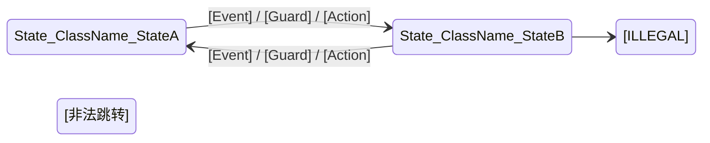

# Functionality Deep-Dive 子工作流 — 详细施工方案

> **基于**：`FUNCTIONALITY_DEEP_DIVE_WORKFLOW.md` 设计方案 + `FUNCTIONALITY_DEEP_DIVE_WORKFLOW_REVIEW_REPORT.md` 质检报告
> **编制日期**：2026-04-16
> **目标**：将 Deep-Dive 子工作流从"设计草案"升级为"可被主工作流编排器调度、可被 Agent 体系执行"的工程化落地状态
> **原则**：Deep-Dive 不是替代主工作流，而是主工作流在特定条件下的**增强模式**

---

## 一、施工全景图

### 1.1 变更范围总览

| 序号 | 变更项 | 变更类型 | 涉及文件 | 优先级 | 所属阶段 |
|------|--------|---------|---------|--------|---------|
| W1 | 主工作流 P3 增加第三层路由 | 修改 | `phases/p3-root-cause.md` | P0 | Phase 1 |
| W2 | 主工作流 P2 增加环境因子增强步骤 | 修改 | `phases/p2-spec-definition.md` | P0 | Phase 1 |
| W3 | 状态模板增加 Deep-Dive 字段 | 修改 | `core/workflow-status-template.yaml` | P0 | Phase 1 |
| W4 | 编排器增加 Deep-Dive 路由分支 | 修改 | `core/workflow.xml` | P0 | Phase 1 |
| W5 | 默认配置增加 Deep-Dive 产物路径 | 修改 | `core/default-config.yaml` | P0 | Phase 1 |
| W6 | 设计文档修正 P0 级问题 | 修改 | `FUNCTIONALITY_DEEP_DIVE_WORKFLOW.md` | P0 | Phase 1 |
| W7 | Investigator 能力扩展 | 修改 | `agents/investigator.md` | P1 | Phase 2 |
| W8 | Challenger 深度质疑协议扩展 | 修改 | `agents/challenger.md` | P1 | Phase 2 |
| W9 | P4 评估矩阵 Deep-Dive 变体 | 修改 | `phases/p4-fix-design.md` | P1 | Phase 2 |
| W10 | 平台检查清单补充盲区 | 修改 | `reference/platform-checklist.md` | P1 | Phase 2 |
| W11 | 新增环境因子阈值参考 | 新增 | `reference/environment-factor-thresholds.md` | P1 | Phase 2 |
| W12 | 新增 Deep-Dive 专项策略 | 修改 | `reference/analysis-strategies.md` | P1 | Phase 2 |
| W13 | 新增 deep-dive-topology 模板 | 新增 | `templates/deep-dive-topology.md` | P1 | Phase 2 |
| W14 | 新增 concurrency-analysis-report 模板 | 新增 | `templates/concurrency-analysis-report.md` | P1 | Phase 2 |
| W15 | 新增 defensive-fix-design 模板 | 新增 | `templates/defensive-fix-design.md` | P1 | Phase 2 |
| W16 | 设计文档补充移动端专业盲区 | 修改 | `FUNCTIONALITY_DEEP_DIVE_WORKFLOW.md` | P2 | Phase 3 |
| W17 | 推理链规范增加 Deep-Dive 引导 | 修改 | `reference/reasoning-chain.md` | P2 | Phase 3 |
| W18 | system-prompt.md 同步更新 | 修改 | `system-prompt.md` | P2 | Phase 3 |

### 1.2 阶段映射关系（核心架构决策）

Deep-Dive 5 阶段**嵌入**主工作流的位置如下：

```
主工作流 P1-Intake
    ↓
主工作流 P2-Spec-Definition
    ├─ Step 1-6: 原有流程不变
    ├─ Step 7: 上下文策展（原有）
    ├─ ★ Step 7.5: [Deep-Dive Stage 1] 极端环境与上下文重构（条件触发）
    └─ Step 8-9: 原有流程不变
    ↓
主工作流 P3-Root-Cause
    ├─ Step 1-3: 原有流程不变
    ├─ Step 4: 双层路由（原有）
    ├─ ★ Step 4.5: [Deep-Dive Stage 2+3] 状态拓扑 + 时序剖析（条件触发）
    ├─ Step 5: OVHSC 推理链（原有，但接收 Stage 2+3 的增强输入）
    │   └─ Challenger 执行时 ★ [Deep-Dive Stage 4] 深度质疑维度（条件追加）
    └─ Step 6-8: 原有流程不变
    ↓
主工作流 P4-Fix-Design
    ├─ Step 1-2: 原有流程不变
    ├─ ★ Step 2.5: [Deep-Dive Stage 5] 防御性修复增强（条件触发）
    │   └─ 评估矩阵使用 Deep-Dive 变体权重
    └─ Step 3-6: 原有流程不变
    ↓
主工作流 P5/P6: 原有流程不变
```

---

## 二、Phase 1 施工详案：集成补强（P0 级，0-2 周）

### W1: 主工作流 P3 增加第三层路由

**文件**：`mobile-qa-workflow/phases/p3-root-cause.md`

**变更位置**：Step 4 的 `<action>` 块中，在深度路径触发条件之后、`<switch condition="分析路径">` 之前

**变更内容**：在深度路径的 `<case>` 分支中，增加 Deep-Dive 子工作流的触发判断和前置步骤

```xml
<!-- 在 <case if="深度路径"> 内部，标记 analysis_path = deep 之后插入 -->

<check if="主分类 == '功能' 且 complexity_level == 'complex'">
    <action>评估 Deep-Dive 触发条件：
        【Deep-Dive 触发条件】满足以下全部时触发：
        1. 主分类 == "功能"
        2. complexity_level == "complex"
        3. 问题表现包含以下任一特征：
           - 偶发性（非100%复现）
           - 涉及状态机跳转异常
           - 涉及并发/竞态
           - 涉及缓存一致性
           - Crash 栈指向系统底层但怀疑是上层问题
        4. 快速路径反事实校验失败
    </action>
    <check if="Deep-Dive 触发条件满足">
        <action>标记 deep_dive_mode = true</action>
        <action>更新 {workflow_status}：deep_dive_mode = true, deep_dive_stage = 1</action>
        <action>执行 Deep-Dive Stage 2+3 前置增强步骤（见 Step 4.5）</action>
    </check>
</check>
```

**新增 Step 4.5**：在 Step 4 和 Step 5 之间插入

```xml
<step n="4.5" goal="Deep-Dive 前置增强：状态拓扑与数据流还原 + 时序对齐与竞态剖析">
    <check if="deep_dive_mode == true">
        <load target="mobile-qa-workflow/FUNCTIONALITY_DEEP_DIVE_WORKFLOW.md" prompt="加载 Deep-Dive 子工作流 Stage 2 和 Stage 3 的执行规约"/>

        <action>【Stage 2: 状态机拓扑与数据流还原】
            1. 逆向状态机绘制：检索所有相关的 Enum/Sealed Class 和状态变量，
               输出 Mermaid 状态转移图，标注"孤岛状态"和"非法跳转"
            2. 数据流污点追踪：从数据源（DB/Network）到消费端（UI/Disk）逐层追踪
            3. 不可变性审查：寻找异步闭包中数据不可变性被破坏的位置
            输出《全局状态与数据流向图》到 {workspace_folder}/deep-dive-topology.md
        </action>

        <action>更新 {workflow_status}：deep_dive_stage = 2</action>

        <action>【Stage 3: 时序对齐与竞态剖析】
            1. 多维时间轴对齐：将 Touch 事件、网络回调、协程恢复点、
               生命周期回调放置在统一时间轴上
            2. 并发漏洞扫描：检索所有共享资源读写点，针对 suspend 恢复时机、
               DispatchQueue 嵌套进行时序漏洞建模
            3. 符号执行推理：推理是否存在极端时序交错能打破现有锁或判空逻辑
            输出《并发与竞态深度分析报告》到 {workspace_folder}/concurrency-analysis-report.md
        </action>

        <action>更新 {workflow_status}：deep_dive_stage = 3</action>

        <action>将 deep-dive-topology.md 和 concurrency-analysis-report.md 的关键发现
               作为补充证据追加到 {context_bundle}，标注证据来源为 [Deep-Dive-Enhanced]</action>
    </check>
    <check if="deep_dive_mode != true">
        <action>跳过本步骤，直接进入 Step 5</action>
    </check>
</step>
```

---

### W2: 主工作流 P2 增加环境因子增强步骤

**文件**：`mobile-qa-workflow/phases/p2-spec-definition.md`

**变更位置**：在 Step 7（上下文策展）之后、Step 8（二维证据分级）之前，插入 Step 7.5

**变更内容**：

```xml
<step n="7.5" goal="Deep-Dive 环境因子增强（条件触发）">
    <check if="主分类 == '功能' 且 问题表现包含偶发性特征">
        <action>【增量环境因子采集】
            基于已有 {context_bundle}，补充采集以下环境因子（仅采集已有信息中缺失的项）：
            1. 内存水位：检索日志中是否有 LMK 警告（onTrimMemory 回调记录）
            2. Thermal State：检索是否有降频记录（PowerManager.THERMAL_STATUS_*
               / NSProcessInfo.thermalState）
            3. 网络抖动：检索异常时间窗口内的网络质量指标（Jitter > 200ms / 丢包率 > 2%）
            4. 生命周期干预：排查异常发生前 10 秒内的后台挂起、权限撤销、配置变更事件
            5. 系统资源压力：检索 CPU 使用率峰值、磁盘 I/O 等待、GPU 内存压力
        </action>
        <action>输出《极端环境因子关联报告》到 {workspace_folder}/environment-factor-report.md，
               格式参照 reference/environment-factor-thresholds.md 中的阈值标准</action>
        <action>将环境因子关联结论追加到 {context_bundle} 的证据清单，
               标注来源为 [Environment-Factor-Enhanced]</action>
        <action>更新 {workflow_status}：deep_dive_stage = 1</action>
    </check>
</step>
```

---

### W3: 状态模板增加 Deep-Dive 字段

**文件**：`mobile-qa-workflow/core/workflow-status-template.yaml`

**变更位置**：在 `lint_retry_count: 0` 之后、`# [END_PRESERVE_FORMAT]` 之前

**变更内容**：增加以下字段

```yaml
deep_dive_mode: false
deep_dive_stage: null
deep_dive_artifacts: []
```

完整变更后该区域为：

```yaml
lint_retry_count: 0
deep_dive_mode: false
deep_dive_stage: null
deep_dive_artifacts: []
# [END_PRESERVE_FORMAT]
```

---

### W4: 编排器增加 Deep-Dive 路由分支

**文件**：`mobile-qa-workflow/core/workflow.xml`

**变更位置**：在 Step 4 的 `<switch condition="{current_state}">` 中，`<case if="Boundary-Refined">` 之前插入

**变更内容**：

```xml
<case if="Deep-Dive-InProgress">
    <action>Deep-Dive 子工作流正在执行中，继续当前阶段</action>
    <goto step="2"/>
</case>
```

同时在 `<io-contract>` 中补充 Deep-Dive 产物路径声明：

```xml
<!-- 在 qa-root-cause 的 output 中增加 -->
<phase name="qa-root-cause" input="issue-card.md, spec.md, context-bundle.md" output="rca-report.md, deep-dive-topology.md(conditional), concurrency-analysis-report.md(conditional)"/>
```

---

### W5: 默认配置增加 Deep-Dive 产物路径

**文件**：`mobile-qa-workflow/core/default-config.yaml`

**变更位置**：在 `output_knowledge_card: null` 之后

**变更内容**：

```yaml
output_deep_dive_topology: null
output_concurrency_analysis_report: null
output_defensive_fix_design: null
output_environment_factor_report: null
```

---

### W6: 设计文档修正 P0 级问题

**文件**：`mobile-qa-workflow/FUNCTIONALITY_DEEP_DIVE_WORKFLOW.md`

#### 修正 1：Stage 3 的"100%复现"要求

**原文**（第68行）：
```
*   **Agent 约束**：如果推断出竞态，必须给出能够 100% 复现该竞态的"极端时序序列脚本"。
```

**改为**：
```
*   **Agent 约束**：如果推断出竞态，必须给出高概率复现的时序序列描述（包含关键事件的先后顺序和必要的时间窗口约束），并标注复现概率估计（High/Medium/Low）。如需构造确定性复现路径，建议通过 Thread.sleep/CountDownLatch 注入强制时序，而非依赖自然时序。
```

#### 修正 2：Stage 4 的"唯一根因"约束

**原文**（第78行）：
```
*   **Agent 约束**：多 Agent 对抗必须收敛于一个具有唯一逻辑自洽性的根因，否则要求补充特定的内存或时序日志。
```

**改为**：
```
*   **Agent 约束**：多 Agent 对抗必须收敛于一个具有逻辑自洽性的根因集合（允许 1-N 个根因），各根因之间必须明确逻辑关系：独立叠加 / 因果链 / 互斥分支。若对抗无法收敛，则要求补充特定的内存或时序日志。
```

#### 修正 3：Stage 1 的"严禁给出任何代码修复建议"约束

**原文**（第52行）：
```
*   **Agent 约束**：严禁在此阶段给出任何代码修复建议，只允许输出《极端环境因子关联报告》。
```

**改为**：
```
*   **Agent 约束**：严禁在此阶段给出修复方案，但允许标注环境因子与代码位置的关联关系。只允许输出《极端环境因子关联报告》。
```

#### 修正 4：Stage 2 的"必须精确到代码行号"约束

**原文**（第60行）：
```
*   **Agent 约束**：必须精确到具体的类名、方法名和代码行号，输出《全局状态与数据流向图》。
```

**改为**：
```
*   **Agent 约束**：必须精确到具体的类名和方法名；若能定位到代码行号则必须标注，若无法定位则标注 [Line-Uncertain] 并说明推断依据。输出《全局状态与数据流向图》。
```

#### 修正 5：I/O 契约补充与主工作流的衔接定义

**原文**（第90-100行）整体替换为：

```markdown
## 4. 专家工作流的 I/O 契约 (I/O Contracts)

### 4.1 与主工作流的集成关系

本子工作流**不是独立流程**，而是主工作流在特定条件下的**增强模式**。各阶段嵌入主工作流的位置：

| Deep-Dive Stage | 嵌入位置 | 触发条件 |
|-----------------|---------|---------|
| Stage 1: 环境重构 | P2 Step 7.5（上下文策展之后） | 主分类=="功能" 且 问题偶发 |
| Stage 2: 状态拓扑 | P3 Step 4.5（双层路由之后、OVHSC之前） | deep_dive_mode==true |
| Stage 3: 时序剖析 | P3 Step 4.5（与 Stage 2 连续执行） | deep_dive_mode==true |
| Stage 4: 隔离对抗 | P3 Step 5（Challenger 扩展质疑维度） | deep_dive_mode==true |
| Stage 5: 防御修复 | P4 Step 2.5（修复方案增强） | deep_dive_mode==true |

**触发条件**（全部满足时激活）：
1. 主分类 == "功能"
2. complexity_level == "complex"
3. 问题表现包含：偶发性 / 状态机异常 / 并发竞态 / 缓存一致性 / 系统底层栈
4. 快速路径反事实校验失败

### 4.2 输入

*   主工作流 P2 输出的 `{context_bundle}` + `{spec_document}`（Stage 1 的基础输入）
*   主工作流 P3 Step 4 输出的路由决策和复杂度评估（Stage 2/3 的触发条件）
*   所有可用的全量日志、APM 性能快照、全量代码库访问权限

### 4.3 关键输出产物及与主工作流的对齐

| Deep-Dive 产物 | 对齐到主工作流产物 | 关系 |
|----------------|-------------------|------|
| `environment-factor-report.md` | `context-bundle.md` | 补充附件，追加到证据清单 |
| `deep-dive-topology.md` | `context-bundle.md` | 补充附件，作为 Investigator 增强输入 |
| `concurrency-analysis-report.md` | `rca-report.md` | 补充章节，嵌入"推理过程"之后 |
| `defensive-fix-design.md` | `fix-design.md` | 扩展附件，评估矩阵使用 Deep-Dive 变体权重 |

### 4.4 状态机集成

Deep-Dive 模式的状态通过 `workflow-status.yaml` 中的以下字段管理：
- `deep_dive_mode`: 是否进入深度归因模式（true/false）
- `deep_dive_stage`: 当前阶段（1-5 / null）
- `deep_dive_artifacts`: 已生成的深度归因产物列表
```

---

## 三、Phase 2 施工详案：工程化补强（P1 级，2-4 周）

### W7: Investigator 能力扩展

**文件**：`mobile-qa-workflow/agents/investigator.md`

**变更位置**：在 `# Capabilities` 部分末尾追加

**变更内容**：

```markdown
- **Deep-Dive 增强能力**（当 deep_dive_mode == true 时激活）：
  - 逆向状态机绘制：检索 Enum/Sealed Class 和状态变量，输出 Mermaid 状态转移图
  - 数据流污点追踪：从数据源到消费端逐层追踪核心 Data Model 实例
  - 不可变性审查：识别异步闭包中数据不可变性被破坏的位置
  - 多维时间轴对齐：将用户操作、网络回调、协程恢复点、生命周期回调放置在统一时间轴
  - 并发漏洞扫描：针对 suspend 恢复时机、DispatchQueue 嵌套进行时序漏洞建模
  - 符号执行推理：推理极端时序交错能否打破现有锁或判空逻辑
```

**变更位置**：在 `# Constraints` 部分末尾追加

**变更内容**：

```markdown
- **Deep-Dive 约束**（当 deep_dive_mode == true 时生效）：
  - 状态机分析**必须**输出 Mermaid 状态转移图，标注孤岛状态和非法跳转
  - 时序分析**必须**给出高概率复现的时序序列描述，标注复现概率估计（High/Medium/Low）
  - 精确定位要求：类名和方法名必须给出；代码行号若无法定位则标注 [Line-Uncertain]
  - 若 `deep-dive-topology.md` 或 `concurrency-analysis-report.md` 已存在，**必须**将其作为输入参考
```

**变更位置**：在 `# Output Format` 的代码块中，`### CHAIN` 之后追加

**变更内容**：

```markdown
### DEEP-DIVE ENHANCEMENT（仅 deep_dive_mode == true 时输出）

#### 状态机拓扑


#### 时序对齐轴
| 时间戳 | 事件类型 | 事件描述 | 线程/队列 | 关联状态 |
|--------|---------|---------|----------|---------|
| T+0ms | Touch | 用户点击按钮 | Main | StateA |
| T+50ms | Network | 请求发出 | IO | StateA |
| T+200ms | Lifecycle | Activity.onPause | Main | StateA→StateB |
| T+350ms | Network | 响应回调 | Main | ⚠️ StateB（竞态窗口） |

#### 竞态复现路径
- 复现概率估计: [High/Medium/Low]
- 关键时序约束: [描述]
- 强制复现建议: [Thread.sleep/CountDownLatch 注入点]
```

---

### W8: Challenger 深度质疑协议扩展

**文件**：`mobile-qa-workflow/agents/challenger.md`

**变更位置**：在"条件两维"之后、"修复场景"之前，插入"Deep-Dive 条件扩展维度"

**变更内容**：

```markdown
**Deep-Dive 条件扩展维度**（当 deep_dive_mode == true 且场景为归因质疑时追加）：

8. **生命周期盲区攻击**：*触发条件：deep_dive_mode == true。*
   - Android: "如果此时宿主 Activity 已销毁，Fragment 是否仍存活？ViewModel 持有的 LiveData 是否仍在发射？`repeatOnLifecycle` 是否已停止收集？"
   - iOS: "如果此时 ViewController 已 dealloc，weak self 是否已变 nil？NotificationCenter 观察者是否已移除？Timer 是否已 invalidate？"

9. **内存泄露攻击**：*触发条件：deep_dive_mode == true。*
   - Android: "这个单例是否持有 Activity Context？静态集合是否持续累积未清理的引用？匿名内部类是否隐式持有外部类引用？"
   - iOS: "这个 block 是否形成循环引用（self → property → block → self）？NSTimer 的 target-action 是否造成 retain？delegate 是否声明为 weak？"

10. **缓存一致性攻击**：*触发条件：deep_dive_mode == true 且问题涉及数据异常。*
   - "本地缓存与远端数据是否存在版本漂移？缓存更新是否有原子性保证？多进程/多线程读写缓存是否有竞态？"
```

**变更位置**：在 `# Output Format` 的表格中，`| C7 |` 行之后追加

**变更内容**：

```markdown
| C8 | 生命周期盲区 (仅 Deep-Dive) | ... | ... | ... |
| C9 | 内存泄露 (仅 Deep-Dive) | ... | ... | ... |
| C10 | 缓存一致性 (仅 Deep-Dive) | ... | ... | ... |
```

**变更位置**：在存活率评估中修改

**原文**：
```
- 实际执行质疑维度数: M (5~7)
```

**改为**：
```
- 实际执行质疑维度数: M (5~10，Deep-Dive 模式下为 8~10)
```

---

### W9: P4 评估矩阵 Deep-Dive 变体

**文件**：`mobile-qa-workflow/phases/p4-fix-design.md`

**变更位置**：在 Step 3（方案确认与评估矩阵）中

**变更内容**：在评估矩阵定义之后增加 Deep-Dive 变体

```xml
<check if="deep_dive_mode == true">
    <action>使用 Deep-Dive 增强评估矩阵（调整权重 + 新增维度）：
        | 维度 | 权重(标准) | 权重(Deep-Dive) | 变更说明 |
        |------|-----------|----------------|---------|
        | 根因覆盖度 | 30% | 25% | 略降，因多根因场景覆盖更复杂 |
        | 副作用风险 | 25% | 20% | 略降，为鲁棒性维度让出空间 |
        | 变更最小性 | 15% | 10% | 降低，允许防御性目的适度扩大变更 |
        | 跨平台一致性 | 10% | 10% | 不变 |
        | 可回滚性 | 10% | 10% | 不变 |
        | 长期可维护性 | 10% | 15% | 提升，防御性修复注重长期收益 |
        | 架构鲁棒性提升 | - | 10% | 新增，评估对同类问题的预防能力 |
    </action>
    <action>Minimality 论证中允许"为防御性目的适度扩大变更范围"的例外说明，
           但必须同时提供"渐进式落地路径"（先局部修复止血，再分阶段重构）</action>
</check>
```

---

### W10: 平台检查清单补充盲区

**文件**：`mobile-qa-workflow/reference/platform-checklist.md`

**变更位置**：Android 部分"存储"章节之后、iOS 部分之前

**变更内容**：增加以下章节

```markdown
### 并发与状态（Deep-Dive 专项）
- [ ] SharedViewModel + 多 Fragment 观察者是否存在竞态？（LiveData 发射时序 vs Fragment 生命周期）
- [ ] DataStore 的 updateData 是否在多协程场景下保证原子性？
- [ ] WorkManager 的 Worker UUID 变更是否导致幂等性失效？
- [ ] Room WAL 模式下的并发读写是否有脏读风险？
- [ ] Flow/SharedFlow 的 replay cache 与新订阅者的时序是否正确？
- [ ] AB 实验 / Feature Flag 远端下发与本地状态读取之间是否存在竞态？

### 热修复与动态化（Deep-Dive 专项）
- [ ] 热修复框架（Sophix/Tinker）的类加载时序是否导致偶发 NoSuchMethodError？
- [ ] 动态化框架（Lynx/WebView）的 JS-Native 桥接是否有消息丢失？
```

**变更位置**：iOS 部分"存储"章节之后、"界面"之前

**变更内容**：增加以下章节

```markdown
### 并发与状态（Deep-Dive 专项）
- [ ] Swift Concurrency 的 actor isolation 是否正确？跨 actor 访问是否有 data race？
- [ ] Sendable 合规性是否检查？非 Sendable 类型是否跨并发域传递？
- [ ] CoreData 的 NSManagedObjectContext 是否严格遵守 context-per-thread？
- [ ] Combine 的 @Published 在 willSet/didSet 时序上是否有陷阱？
- [ ] UserDefaults 的 KVO 通知与实际写入的时序是否一致？
- [ ] AB 实验 / Feature Flag 远端下发与本地状态读取之间是否存在竞态？

### 热修复与动态化（Deep-Dive 专项）
- [ ] 动态库（dylib）加载顺序是否影响单例初始化时序？
- [ ] WebView 的 JS-Native 桥接（WKScriptMessageHandler）是否有消息丢失？
```

**变更位置**：在"API 版本合规检查"之后增加

**变更内容**：

```markdown
---

## 环境因子异常阈值参考（Deep-Dive 专项）

### Android
| 因子 | 正常范围 | 异常阈值 | 检测方式 |
|------|---------|---------|---------|
| 内存水位 (LMK) | TRIM_MEMORY_RUNNING_LOW 以上 | TRIM_MEMORY_UI_HIDDEN 及以下 | onTrimMemory 回调日志 |
| Thermal State | NOMINAL / LIGHT | SERIOUS / CRITICAL | PowerManager.getThermalStatus() |
| 网络抖动 (Jitter) | < 100ms | > 200ms | ConnectivityMetrics / 自建探测 |
| 丢包率 | < 1% | > 2% | TrafficStats / 自建探测 |
| CPU 使用率峰值 | < 80% | > 95% 持续 3 秒 | Debug.getCpuUsage() / APM |
| 省电模式 | 未开启 | 开启（Doze / App Standby） | PowerManager.isPowerSaveMode() |

### iOS
| 因子 | 正常范围 | 异常阈值 | 检测方式 |
|------|---------|---------|---------|
| 内存水位 | < 80% 可用 | > 90% 可用（接近 Jetsam 阈值） | os_proc_available_memory() |
| Thermal State | nominal / fair | serious / critical | NSProcessInfo.thermalState |
| 网络抖动 (Jitter) | < 100ms | > 200ms | NWPathMonitor / 自建探测 |
| 丢包率 | < 1% | > 2% | NWPathMonitor / 自建探测 |
| CPU 使用率峰值 | < 80% | > 95% 持续 3 秒 | host_processor_info / APM |
| 低电量模式 | 未开启 | 开启 | ProcessInfo.processInfo.isLowPowerModeEnabled |
```

---

### W11: 新增环境因子阈值参考

**文件**：`mobile-qa-workflow/reference/environment-factor-thresholds.md`（新建）

**内容**：将 W10 中"环境因子异常阈值参考"部分独立为此文件，内容完全一致，作为 Deep-Dive Stage 1 的参考知识库。此文件被 P2 Step 7.5 通过 `<load>` 引用。

---

### W12: 新增 Deep-Dive 专项策略

**文件**：`mobile-qa-workflow/reference/analysis-strategies.md`

**变更位置**：在"功能专项策略"部分之后、"UI/UX 专项策略"之前

**变更内容**：增加以下章节

```markdown
### 功能深度专项策略（Deep-Dive 模式专用）

以下策略仅在 `deep_dive_mode == true` 时可用，由编排器在分配 Investigator 策略时优先选择：

- **Strategy-StateTopology**: 从完整状态机拓扑出发，逆向绘制所有 Enum/Sealed Class 状态变量，
  标注孤岛状态和非法跳转。输出 Mermaid 状态转移图。
- **Strategy-TaintTracking**: 从数据源（DB/Network）到消费端（UI/Disk）执行逐层污点追踪，
  标注每个 Data Model 实例的读写点和不可变性破坏点。
- **Strategy-TemporalAlignment**: 将用户操作、网络回调、协程恢复点、生命周期回调
  放置在统一时间轴上，识别竞态窗口和时序漏洞。
- **Strategy-IsolationProbing**: 通过 Mock 注入或强制断网推演系统反应，
  执行控制变量分析，切断表现层与逻辑层耦合。

#### 编排器分配规则（Deep-Dive 模式）

当 `deep_dive_mode == true` 时：
- 必须包含 1 个边界驱动策略 + 1 个 Deep-Dive 专项策略 + 1 个通用策略
- 推荐：Strategy-DynamicBottomUp + Strategy-StateTopology + Strategy-Regression
- 或：Strategy-DiffFocus + Strategy-TemporalAlignment + Strategy-Pattern
```

---

### W13: 新增 deep-dive-topology 模板

**文件**：`mobile-qa-workflow/templates/deep-dive-topology.md`（新建）

**内容**：

```markdown
# Deep-Dive Topology — {Issue-ID}

## 元信息
- **关联 Issue**: [Issue Card ID]
- **生成阶段**: Deep-Dive Stage 2
- **平台**: [Android / iOS / Both]

## 状态机拓扑

### 状态定义
| 状态 ID | 类名 | 状态名 | 触发条件 | 活跃判定 |
|---------|------|--------|---------|---------|
| S1 | [ClassName] | [StateName] | [条件] | [Live/Suspect/Dead] |
| S2 | ... | ... | ... | ... |

### 状态转移图

```mermaid
stateDiagram-v2
    direction LR
    S1 --> S2 : [Event] / [Guard] / [Action]
    S2 --> S3 : [Event] / [Guard] / [Action]
    S2 -[ILLEGAL]-> S4 : [非法跳转描述]
```

### 孤岛状态
| 状态 ID | 描述 | 原因 | 风险等级 |
|---------|------|------|---------|
| [S4] | [无法到达的状态] | [缺少入边] | [High/Medium/Low] |

### 非法跳转
| 起始状态 | 目标状态 | 跳转条件 | 应有守卫 | 风险等级 |
|---------|---------|---------|---------|---------|
| [S2] | [S4] | [描述] | [缺失的守卫条件] | [High/Medium/Low] |

## 数据流污点追踪

### 核心数据模型
| 模型类 | 数据源 | 消费端 | 不可变性 | 脏写风险 |
|--------|--------|--------|---------|---------|
| [ModelClass] | [DB/Network] | [UI/Disk] | [是/否] | [High/Medium/Low/None] |

### 脏写点清单
| 位置 | 类名.方法名 | 行号 | 脏写描述 | 风险等级 |
|------|-----------|------|---------|---------|
| [file:line] | [Class.method] | [L123 / Line-Uncertain] | [描述] | [High/Medium/Low] |

## 时序对齐轴

### 时间精度
- **精度等级**: [Microsecond / Millisecond / Order-Only]
- **精度来源**: [Systrace / APM埋点 / 用户描述]

### 事件时间线
| 时间戳 | 事件类型 | 事件描述 | 线程/队列 | 关联状态 | 竞态标记 |
|--------|---------|---------|----------|---------|---------|
| T+0ms | [Touch/Network/Lifecycle/Coroutine] | [描述] | [Main/IO/Background] | [S1] | |
| T+Xms | ... | ... | ... | ... | ⚠️ [竞态窗口] |

### 竞态窗口
| 窗口编号 | 起止时间 | 交错事件 | 风险描述 | 复现概率 |
|---------|---------|---------|---------|---------|
| RW1 | T+Ams ~ T+Bms | [事件1] vs [事件2] | [描述] | [High/Medium/Low] |

## 竞态复现路径

### 复现概率估计: [High / Medium / Low]

### 关键时序约束
1. [约束1：事件A必须在事件B之前/之后Xms内发生]
2. [约束2：...]

### 强制复现建议
- 注入点: [Class.method (file:line)]
- 注入方式: [Thread.sleep(Xms) / CountDownLatch / Handler.postDelayed]
- 预期效果: [描述]
```

---

### W14: 新增 concurrency-analysis-report 模板

**文件**：`mobile-qa-workflow/templates/concurrency-analysis-report.md`（新建）

**内容**：

```markdown
# Concurrency Analysis Report — {Issue-ID}

## 元信息
- **关联 Issue**: [Issue Card ID]
- **关联 Topology**: [deep-dive-topology.md 引用]
- **生成阶段**: Deep-Dive Stage 3
- **平台**: [Android / iOS / Both]

## 并发模型分析

### 线程/队列模型
| 线程/队列 | 用途 | 关联代码 | 交互点 |
|----------|------|---------|--------|
| Main Thread | UI 更新 | [Class.method] | [与 IO 线程的回调] |
| IO Dispatcher | 网络请求 | [Class.method] | [向 Main 发送结果] |
| ... | ... | ... | ... |

### 共享资源清单
| 资源 | 类型 | 读写线程 | 保护机制 | 竞态风险 |
|------|------|---------|---------|---------|
| [变量/集合/DB] | [Mutable/Immutable] | [Thread1(写), Thread2(读)] | [锁/原子类/无] | [High/Medium/Low/None] |

## 竞态漏洞扫描

### Android 专项
| 漏洞编号 | 类型 | 位置 | 描述 | 风险等级 |
|---------|------|------|------|---------|
| [R1] | [suspend恢复时序] | [Class.method:line] | [描述] | [High/Medium/Low] |
| [R2] | [先读后写] | [Class.method:line] | [描述] | [High/Medium/Low] |

### iOS 专项
| 漏洞编号 | 类型 | 位置 | 描述 | 风险等级 |
|---------|------|------|------|---------|
| [R1] | [DispatchQueue嵌套] | [Class.method:line] | [描述] | [High/Medium/Low] |
| [R2] | [actor隔离违反] | [Class.method:line] | [描述] | [High/Medium/Low] |

## 符号执行推理

### 推理场景
- **场景描述**: [如：连击 + 网络超时同时发生]
- **初始状态**: [状态机当前状态]
- **时序交错序列**: [Event1 → Event2 → ... → 异常状态]

### 推理结论
- **能否打破现有锁/判空逻辑**: [是/否]
- **打破条件**: [描述]
- **复现概率估计**: [High/Medium/Low]

## 隔离诊断推演

### Mock 注入推演
| 注入点 | Mock 内容 | 预期系统反应 | 实际推断 | 一致性 |
|--------|---------|------------|---------|--------|
| [NetworkLayer] | [返回固定数据] | [UI显示固定数据] | [推断结果] | [一致/不一致] |

### 缓存一致性对齐
| 数据项 | 本地缓存值 | 远端契约值 | 一致性 | 漂移类型 |
|--------|-----------|-----------|--------|---------|
| [Key] | [Value] | [Value] | [一致/不一致] | [穿透/脏读/版本漂移/None] |

## 综合结论

### 根因集合
| 根因编号 | 描述 | 代码位置 | 证据支撑 | 与其他根因关系 |
|---------|------|---------|---------|--------------|
| RC1 | [描述] | [Class.method:line] | [E1, E2] | [独立/因果链上游/叠加] |
| RC2 | [描述] | [Class.method:line] | [E3] | [因果链下游/叠加] |

### 残余不确定性
- [尚未完全排除的可能性]
- [建议补充的日志或监控]
```

---

### W15: 新增 defensive-fix-design 模板

**文件**：`mobile-qa-workflow/templates/defensive-fix-design.md`（新建）

**内容**：

```markdown
# Defensive Fix Design — {Issue-ID}

## 元信息
- **关联 Issue**: [Issue Card ID]
- **关联 Fix Design**: [fix-design.md 引用]
- **关联 RCA**: [rca-report.md 引用]
- **生成阶段**: Deep-Dive Stage 5

## 适度性评估

### 问题严重程度 vs 修复范围
| 优先级 | 允许的修复范围 | 本次选择 |
|--------|--------------|---------|
| P0 | 架构级重构 | [是/否] |
| P1 | 模块级加固 + 局部重构 | [是/否] |
| P2 | 局部加固 + 熔断器 | [是/否] |
| P3 | 仅熔断器/断言 | [是/否] |

### 渐进式落地路径
| 阶段 | 修复内容 | 变更范围 | 风险等级 | 前置条件 |
|------|---------|---------|---------|---------|
| Phase 1 (止血) | [最小修复] | [N个文件] | [Low] | 无 |
| Phase 2 (加固) | [防御性代码] | [N个文件] | [Medium] | Phase 1 验证通过 |
| Phase 3 (重构) | [架构优化] | [N个文件] | [High] | Phase 2 验证通过 + Human-Review |

### 过度设计审查
- 涉及文件数: [N]（>3 个文件需 Human-Review: [是/否]）
- 是否引入新架构模式: [是/否]
- 是否可回退到 Phase 1 止血方案: [是/否]

## 修改前状态机拓扑


## 修改后状态机拓扑


## 差异标注

| 变更类型 | 状态/转换 | 修改前 | 修改后 | 修复目的 |
|---------|----------|--------|--------|---------|
| 新增 | [State_X / Event_Y] | - | [描述] | [补全缺失跳转] |
| 删除 | [非法跳转] | [描述] | - | [消除非法路径] |
| 修改 | [Guard条件] | [旧条件] | [新条件] | [增加守卫] |

## 熔断器/断言点清单

| 编号 | 位置 | 类型 | 检查条件 | 失败策略 | 关联根因 |
|------|------|------|---------|---------|---------|
| F1 | [Class.method:line] | [Assertion/Fallback/StateReset] | [条件] | [降级/重置/告警] | [RC1] |
| F2 | ... | ... | ... | ... | ... |

## 生命周期感知注入点清单

### Android
| 编号 | 位置 | 注入方式 | 生命周期事件 | 处理逻辑 |
|------|------|---------|------------|---------|
| L1 | [Class.method] | [repeatOnLifecycle] | [ON_STARTED] | [开始收集 Flow] |
| L2 | [Class.method] | [LifecycleObserver] | [ON_DESTROY] | [清理资源] |

### iOS
| 编号 | 位置 | 注入方式 | 生命周期事件 | 处理逻辑 |
|------|------|---------|------------|---------|
| L1 | [Class.method] | [withCheckedContinuation] | [viewWillDisappear] | [取消 Task] |
| L2 | [Class.method] | [NotificationCenter observer] | [deinit] | [移除观察者] |

## Deep-Dive 增强评估矩阵

| 评估维度 | 权重(Deep-Dive) | 评分(1-5) | 加权得分 | 评分理由 |
|---------|----------------|----------|---------|---------|
| 根因覆盖度 | 25% | | | |
| 副作用风险 | 20% | | | |
| 变更最小性 | 10% | | | [允许防御性目的适度扩大] |
| 跨平台一致性 | 10% | | | |
| 可回滚性 | 10% | | | |
| 长期可维护性 | 15% | | | |
| 架构鲁棒性提升 | 10% | | | |
| **总计** | **100%** | | | |

## Minimality 例外说明
- [如涉及3个以上文件，说明为什么无法更小范围修复]
- [渐进式落地路径的 Phase 1 是否满足最小性：是/否]
```

---

## 四、Phase 3 施工详案：专业深度补强（P2 级，4-8 周）

### W16: 设计文档补充移动端专业盲区

**文件**：`mobile-qa-workflow/FUNCTIONALITY_DEEP_DIVE_WORKFLOW.md`

**变更位置**：在第5节"适用场景边界"之后，增加第6节

**变更内容**：

```markdown
## 6. 移动端专项检查补充

### 6.1 Android 端 Deep-Dive 专项检查项

| 检查项 | 适用阶段 | 描述 |
|--------|---------|------|
| SharedViewModel 竞态 | Stage 3 | 多 Fragment 通过 SharedViewModel 共享状态时，LiveData 发射时序与 Fragment 生命周期的竞态 |
| DataStore 原子性 | Stage 3 | DataStore 的 updateData 在多协程场景下的原子性保证 |
| WorkManager 幂等性 | Stage 2 | Worker UUID 变更导致重复执行或状态丢失 |
| Room WAL 并发 | Stage 3 | WAL 模式下并发读写可能产生脏读 |
| Flow/SharedFlow 时序 | Stage 3 | replay cache 与新订阅者的时序问题 |
| AB 实验竞态 | Stage 3 | 远端配置下发与本地状态读取之间的竞态 |
| 热修复类加载时序 | Stage 1 | Sophix/Tinker 类加载时序导致偶发 NoSuchMethodError |
| 省电模式行为变化 | Stage 1 | Doze/App Standby 限制后台任务、延迟 Alarm |

### 6.2 iOS 端 Deep-Dive 专项检查项

| 检查项 | 适用阶段 | 描述 |
|--------|---------|------|
| Actor isolation 违反 | Stage 3 | Swift Concurrency 跨 actor 访问的 data race |
| Sendable 合规性 | Stage 3 | 非 Sendable 类型跨并发域传递 |
| CoreData 线程约束 | Stage 3 | NSManagedObjectContext 未严格遵守 context-per-thread |
| Combine @Published 时序 | Stage 3 | willSet/didSet 时序上的陷阱 |
| UserDefaults KVO 时序 | Stage 3 | KVO 通知与实际写入的时序不一致 |
| Block 循环引用 | Stage 4 | self → property → block → self 循环引用链 |
| NSTimer retain | Stage 4 | target-action 模式造成 retain |
| 动态库加载顺序 | Stage 1 | dylib 加载顺序影响单例初始化时序 |

### 6.3 时序精度降级策略

| 可用数据源 | 时间精度 | 对齐方式 | 标注 |
|-----------|---------|---------|------|
| Systrace / Instruments 时间线 | 微秒级 | 绝对时间戳对齐 | [Microsecond-Precision] |
| APM 埋点 / 网络抓包 | 毫秒级 | 相对时间差对齐 | [Millisecond-Precision] |
| 系统日志 / 崩溃栈 | 秒级 | 事件序对齐（仅排序） | [Second-Precision] |
| 仅用户操作描述 | 无精度 | 因果序对齐（仅先后） | [Order-Only] |

### 6.4 防御性修复适度性原则

1. **范围匹配原则**：修复范围应与问题严重程度匹配
   - P0 问题：允许架构级重构
   - P1 问题：允许模块级加固 + 局部重构
   - P2 问题：仅允许局部加固 + 熔断器
   - P3 问题：仅允许熔断器/断言

2. **渐进式落地原则**：重构方案必须提供渐进式落地路径
   - Phase 1（止血）：最小修复，消除直接症状
   - Phase 2（加固）：添加防御性代码和熔断器
   - Phase 3（重构）：架构优化，根除同类问题

3. **过度设计审查原则**：
   - 涉及 3 个以上文件的重构必须经过 Human-Review
   - 引入新架构模式（如 MVI/Redux）必须经过 Human-Review
   - 每个 Phase 必须可独立验证和回退
```

---

### W17: 推理链规范增加 Deep-Dive 引导

**文件**：`mobile-qa-workflow/reference/reasoning-chain.md`

**变更位置**：在"分类专项推理引导"的"功能类问题"章节末尾

**变更内容**：增加 Deep-Dive 模式引导

```markdown
### 功能类问题 — Deep-Dive 增强引导

**当 deep_dive_mode == true 时，在标准 OVHSC 推理链之前，必须先完成以下增强步骤**：

**OBSERVE 增强前置**：
1. 读取 `deep-dive-topology.md`，将状态机孤岛状态和非法跳转作为 OBSERVE 的额外原子现象
2. 读取 `concurrency-analysis-report.md`，将竞态窗口和缓存不一致作为 OBSERVE 的额外原子现象
3. 读取 `environment-factor-report.md`，将异常环境因子作为 OBSERVE 的条件变量

**HYPOTHESIZE 增强约束**：
- 每个假设必须标注其与状态机拓扑的关系（哪个状态/转换关联）
- 涉及竞态的假设必须标注竞态窗口编号（引用 concurrency-analysis-report）
- 允许多根因假设，但必须明确根因间逻辑关系

**VERIFY 增强手段**：
- 隔离验证：如果 Mock 注入推演结果与假设预测一致，作为 B 级正向证据
- 缓存验证：如果缓存一致性对齐发现不一致，作为 A/B 级正向证据（取决于数据源可靠性）
- 时序验证：如果时序对齐轴中存在竞态窗口与假设匹配，作为 B 级正向证据

**CHAIN 增强格式**：
- 因果链中每个环节必须标注其在状态机拓扑中的位置
- 涉及竞态的环节必须标注竞态窗口编号
- 多根因时使用分叉/汇合图示
```

---

### W18: system-prompt.md 同步更新

**文件**：`mobile-qa-workflow/system-prompt.md`

**变更位置**：在 Phase 3 的 Step 3 之后、Step 4 之前

**变更内容**：增加 Deep-Dive 路由和前置步骤的内联描述

```xml
<step n="3.5" goal="Deep-Dive 子工作流路由（条件触发）">
    <check if="主分类=='功能' 且 complexity_level=='complex' 且 问题偶发/涉及竞态/状态机异常/缓存一致性">
        <action>标记 deep_dive_mode = true</action>
        <action>执行 Deep-Dive Stage 2+3：状态拓扑还原 + 时序对齐与竞态剖析</action>
        <action>输出 deep-dive-topology.md + concurrency-analysis-report.md</action>
        <action>将关键发现作为补充证据追加到 Context Bundle</action>
    </check>
</step>
```

**变更位置**：在 Phase 4 的 Step 2 中，增加 Deep-Dive 评估矩阵变体

```xml
<check if="deep_dive_mode == true">
    <action>使用 Deep-Dive 增强评估矩阵：根因覆盖度(25%) | 副作用风险(20%) | 变更最小性(10%) | 跨平台一致性(10%) | 可回滚性(10%) | 长期可维护性(15%) | 架构鲁棒性提升(10%)</action>
    <action>输出 defensive-fix-design.md 作为 fix-design.md 的扩展附件</action>
</check>
```

---

## 五、施工验收标准

### 5.1 Phase 1 验收标准（集成补强）

| 验收项 | 验收方法 | 通过条件 |
|--------|---------|---------|
| P3 第三层路由可触发 | 模拟一个功能类 complex 问题 | 编排器正确设置 deep_dive_mode=true |
| P2 环境因子增强可执行 | 模拟一个偶发功能问题 | 输出 environment-factor-report.md |
| 状态模板字段完整 | 创建新工作区 | workflow-status.yaml 包含 deep_dive_* 字段 |
| 编排器路由分支生效 | deep_dive_mode=true 时 | 编排器正确路由到 Deep-Dive 步骤 |
| 设计文档 P0 问题已修正 | 逐项检查 | 4 处 P0 修正全部落地 |
| 产物对齐关系明确 | 检查 I/O 契约 | 4 个 Deep-Dive 产物与主工作流产物对齐关系已定义 |

### 5.2 Phase 2 验收标准（工程化补强）

| 验收项 | 验收方法 | 通过条件 |
|--------|---------|---------|
| Investigator Deep-Dive 能力可用 | deep_dive_mode=true 时执行 | 输出包含状态机拓扑和时序对齐轴 |
| Challenger 深度质疑维度生效 | deep_dive_mode=true 时执行 | 质疑报告包含 C8/C9/C10 维度 |
| P4 评估矩阵变体生效 | deep_dive_mode=true 时执行 | 使用 Deep-Dive 权重计算得分 |
| 平台检查清单盲区已补充 | 逐项检查 | Android 6项 + iOS 6项 + 阈值表已添加 |
| 3 个新模板可用 | 使用模板输出产物 | 产物格式符合模板定义 |
| Deep-Dive 专项策略可分配 | 检查策略池 | 4 个新策略已加入且分配规则已更新 |

### 5.3 Phase 3 验收标准（专业深度补强）

| 验收项 | 验收方法 | 通过条件 |
|--------|---------|---------|
| 设计文档盲区已补充 | 逐项检查 | Android 8项 + iOS 8项检查项已添加 |
| 时序精度降级策略可用 | 模拟不同日志精度场景 | Agent 正确标注精度等级 |
| 防御性修复适度性原则生效 | 模拟 P2 问题防御性修复 | 修复范围不超出"局部加固+熔断器" |
| 推理链 Deep-Dive 引导生效 | deep_dive_mode=true 时执行 OVHSC | 推理链包含状态机/竞态/环境因子增强 |
| system-prompt.md 同步完整 | 逐项比对 | 内联版本与文件版本逻辑一致 |

---

## 六、回放验证方案

施工完成后，建议使用以下 2-3 个历史案例进行回放验证：

### 案例 1：状态机孤岛状态（Android）
- **场景**：订单状态从"支付中"直接跳到"已完成"，跳过"支付确认"状态
- **验证点**：Stage 2 是否能绘制出完整状态机并标注非法跳转
- **预期**：deep-dive-topology.md 中标注 S2→S4 为 [ILLEGAL]，Investigator 据此快速定位根因

### 案例 2：协程竞态（Android）
- **场景**：快速切换页面时，ViewModel 的 Flow 收集在旧 Fragment 中仍在执行
- **验证点**：Stage 3 是否能识别出 repeatOnLifecycle 缺失导致的竞态窗口
- **预期**：concurrency-analysis-report.md 中标注竞态窗口 RW1，复现概率 Medium

### 案例 3：CoreData 线程违规（iOS）
- **场景**：后台线程直接读写主线程 NSManagedObjectContext 导致偶发数据丢失
- **验证点**：Stage 3 是否能识别出 context-per-thread 违规
- **预期**：Challenger 的 C8（生命周期盲区攻击）或 C10（缓存一致性攻击）命中此问题

---

## 七、风险与回退策略

| 风险 | 影响 | 缓解措施 | 回退方案 |
|------|------|---------|---------|
| Deep-Dive 模式 Token 消耗过大 | 分析成本超预期 | Stage 2+3 输出限制在 4K tokens 以内；状态机图限制在 20 个节点以内 | 将 deep_dive_mode 强制设为 false，回退到标准深度路径 |
| 状态机图生成质量不稳定 | Mermaid 语法错误或逻辑不完整 | 在模板中提供完整示例；Investigator 输出后由主 Agent 校验 Mermaid 语法 | 跳过状态机图，仅输出文本版状态描述 |
| 深度质疑维度过多导致 Challenger 输出过长 | 超出上下文窗口 | C8/C9/C10 仅在 deep_dive_mode==true 时触发；每维度限制 200 字 | 仅执行核心五维，跳过 Deep-Dive 扩展维度 |
| 防御性修复评估矩阵权重调整引发争议 | 不同团队对权重有不同偏好 | 权重作为配置项而非硬编码，可在 default-config.yaml 中调整 | 回退到标准评估矩阵权重 |

---

## 八、施工时间线

```
Week 1: W1 + W3 + W4 + W5（核心路由和状态集成）
Week 2: W2 + W6（P2 增强 + 设计文档 P0 修正）
Week 3: W7 + W8 + W12（Agent 能力扩展 + 策略池扩展）
Week 4: W9 + W10 + W11（评估矩阵 + 检查清单 + 阈值表）
Week 5: W13 + W14 + W15（3 个新模板）
Week 6: W16 + W17 + W18（专业深度补强 + system-prompt 同步）
Week 7-8: 回放验证 + 问题修复 + 文档完善
```
