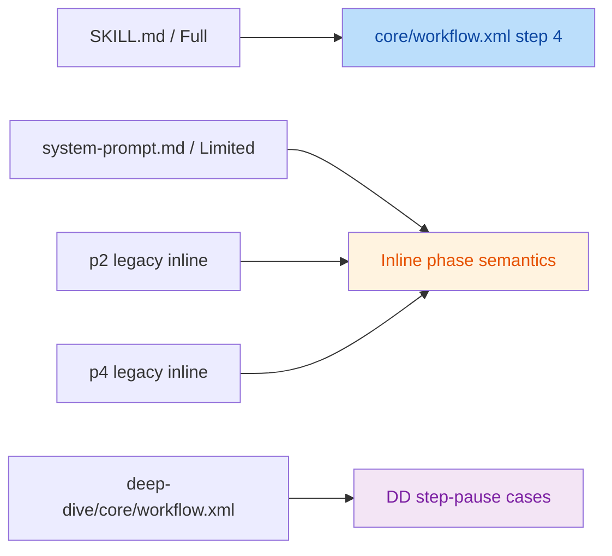

# Mobile QA Workflow State Sync Optimization Review

- Review target: [MOBILE_QA_WORKFLOW_STATE_SYNC_OPTIMIZATION_2026-04-21.md](file:///Users/bytedance/Code/loupe/doc/MOBILE_QA_WORKFLOW_STATE_SYNC_OPTIMIZATION_2026-04-21.md)
- Review date: 2026-04-21
- Review scope: `mobile-qa-workflow/` full chain, `functionality-deep-dive/`, `system-prompt.md`, platform guide, migration and CI guards
- Review method: document-to-code cross-check, architecture survey, protocol validation, compatibility review
- Final verdict: **conditionally adopt**

## Executive Summary

The target document has a strong core thesis: current complexity is primarily caused by duplicated state semantics, transitional protocol layers, and cross-file synchronization debt. That judgment is supported by the repository.

However, the document still has **4 issues that should be corrected before it is used as an implementation baseline**:

1. It classifies `O13` as fully cross-platform safe, but the current Full/Limited `Spec-Uncertain` interaction contract is already divergent.
2. It classifies `O3` as zero-risk, but the repository still explicitly preserves legacy deep-dive agents for old-session recovery.
3. It describes `core/workflow.xml` step 4 as the unique `step-pause` entry, which is not true for the current repository state.
4. It over-counts the number of files that maintain the full `current_state` enum set, which inflates some complexity estimates and cleanup ROI claims.

## Module Survey

| Module | Role | Key files |
|---|---|---|
| Entry layer | Full/Limited platform entry and recovery contract | [SKILL.md](file:///Users/bytedance/Code/loupe/mobile-qa-workflow/SKILL.md), [system-prompt.md](file:///Users/bytedance/Code/loupe/mobile-qa-workflow/system-prompt.md), [PLATFORM-GUIDE.md](file:///Users/bytedance/Code/loupe/mobile-qa-workflow/PLATFORM-GUIDE.md) |
| Orchestrator layer | Main routing, status-machine transition, step-pause dispatch | [workflow.xml](file:///Users/bytedance/Code/loupe/mobile-qa-workflow/core/workflow.xml), [core-rules.xml](file:///Users/bytedance/Code/loupe/mobile-qa-workflow/core/core-rules.xml), [workflow-status-template.yaml](file:///Users/bytedance/Code/loupe/mobile-qa-workflow/core/workflow-status-template.yaml) |
| Main phases | P1-P6 intake, spec, RCA, fix design, implementation, verification | [p1-intake.md](file:///Users/bytedance/Code/loupe/mobile-qa-workflow/phases/p1-intake.md), [p2-spec-definition.md](file:///Users/bytedance/Code/loupe/mobile-qa-workflow/phases/p2-spec-definition.md), [p3-root-cause.md](file:///Users/bytedance/Code/loupe/mobile-qa-workflow/phases/p3-root-cause.md), [p4-fix-design.md](file:///Users/bytedance/Code/loupe/mobile-qa-workflow/phases/p4-fix-design.md), [p5-fix-impl.md](file:///Users/bytedance/Code/loupe/mobile-qa-workflow/phases/p5-fix-impl.md), [p6-verification.md](file:///Users/bytedance/Code/loupe/mobile-qa-workflow/phases/p6-verification.md) |
| Agent layer | Curator/investigator/challenger/arbiter/fix/coder execution contract | [core-rules.xml](file:///Users/bytedance/Code/loupe/mobile-qa-workflow/core/core-rules.xml#L64-L99), [p3-root-cause.md](file:///Users/bytedance/Code/loupe/mobile-qa-workflow/phases/p3-root-cause.md#L70-L143), [p4-fix-design.md](file:///Users/bytedance/Code/loupe/mobile-qa-workflow/phases/p4-fix-design.md#L43-L114) |
| Deep-dive subworkflow | Complex functionality/state/concurrency deep analysis | [functionality-deep-dive/core/workflow.xml](file:///Users/bytedance/Code/loupe/mobile-qa-workflow/functionality-deep-dive/core/workflow.xml), [functionality-deep-dive/agents/README.md](file:///Users/bytedance/Code/loupe/mobile-qa-workflow/functionality-deep-dive/agents/README.md), [functionality-deep-dive/core/default-config.yaml](file:///Users/bytedance/Code/loupe/mobile-qa-workflow/functionality-deep-dive/core/default-config.yaml) |
| Guardrails | Schema/protocol validation and migration | [.github/workflows/qa-workflow-schema-check.yml](file:///Users/bytedance/Code/loupe/.github/workflows/qa-workflow-schema-check.yml), [check-config-schema.sh](file:///Users/bytedance/Code/loupe/mobile-qa-workflow/scripts/check-config-schema.sh), [migrate-workflow-status-v3-to-v4.py](file:///Users/bytedance/Code/loupe/mobile-qa-workflow/scripts/migrate-workflow-status-v3-to-v4.py) |

## Change Intent

Intent inferred from the target document:

- Reduce sync debt before simplifying surface complexity
- Eliminate duplicated state semantics where the behavior is truly equivalent
- Keep output contracts and eval behavior stable
- Improve maintainability without sacrificing cross-platform operability

This intent is sound and worth keeping.

## Architecture Snapshot

**Current multi-entry reality**



**`Spec-Uncertain` contract drift**

```mermaid
flowchart LR
    A[Full platform] --> B[workflow.xml]
    B --> C[result_field=spec_uncertain_choice]
    C --> D[allowed_values=Confirm]

    E[Limited platform] --> F[system-prompt.md]
    F --> G[inline P2 step-pause]
    G --> H[allowed_values=1|2|S]

    style B fill:#c8e6c9,color:#1a5e20
    style F fill:#fff3e0,color:#e65100
    style D fill:#c8e6c9,color:#1a5e20
    style H fill:#ffebee,color:#b71c1c
```

## Findings

| No. | Severity | Issue Title | Suggestion | Code Link |
|---|---|---|---|---|
| 1 | High | `O13` is not yet cross-platform equivalent | Before labeling `O13` as safe, first define the canonical `Spec-Uncertain` reply contract and align Full and Limited behavior in the same change set. | [Review doc:L652-L669](file:///Users/bytedance/Code/loupe/doc/MOBILE_QA_WORKFLOW_STATE_SYNC_OPTIMIZATION_2026-04-21.md#L652-L669) |
| 2 | Medium | `O3` overstates legacy-agent deletion as zero-risk | Downgrade the claim from zero-risk to compatibility-sensitive, or require a proven legacy recovery migration/removal plan before deletion. | [Review doc:L296-L301](file:///Users/bytedance/Code/loupe/doc/MOBILE_QA_WORKFLOW_STATE_SYNC_OPTIMIZATION_2026-04-21.md#L296-L301) |
| 3 | Medium | Architecture section states a unique `step-pause` entry that does not exist today | Reword the architecture section to say "main-workflow primary dispatch entry" and explicitly list the two legacy phase exceptions plus deep-dive orchestrator cases. | [Review doc:L31-L45](file:///Users/bytedance/Code/loupe/doc/MOBILE_QA_WORKFLOW_STATE_SYNC_OPTIMIZATION_2026-04-21.md#L31-L45) |
| 4 | Medium | `current_state` enum duplication scope is overstated | Split "full enum mirrors" from "partial references/writes" so the complexity inventory and ROI numbers stay precise. | [Review doc:L108-L129](file:///Users/bytedance/Code/loupe/doc/MOBILE_QA_WORKFLOW_STATE_SYNC_OPTIMIZATION_2026-04-21.md#L108-L129) |

## Detailed Analysis

### 1. `O13` is not yet cross-platform equivalent

The document's adjusted compatibility section marks `O13` as "completely cross-platform safe", but the repository currently exposes two different `Spec-Uncertain` interaction contracts:

- Full path: [workflow.xml:L184-L205](file:///Users/bytedance/Code/loupe/mobile-qa-workflow/core/workflow.xml#L184-L205) expects `result_field=spec_uncertain_choice` and `allowed_values=Confirm`.
- Limited path: [system-prompt.md:L226-L240](file:///Users/bytedance/Code/loupe/mobile-qa-workflow/system-prompt.md#L226-L240) still keeps the inline P2 `step-pause` and exposes choices `1|2|S`.

That means `O13` is directionally correct, but not "already behavior-equivalent". If adopted exactly as written, one platform must change behavior. This matters even more because `O17` later proposes generating `system-prompt.md` from `core/`; without resolving the contract first, the generator will simply crystallize one side and silently break the other.

Recommended correction:

- Amend `O13` to require a **canonical `Spec-Uncertain` reply schema** before migration.
- Move the cross-platform acceptance bar from "safe" to "safe after protocol unification".
- Add an explicit gate: Full + Limited + one smaller LLM must all pass the same `Spec-Uncertain` recovery case.

### 2. `O3` overstates zero-risk deletion of legacy deep-dive agents

The document says old deep-dive agents can be physically removed with no impact because new sessions no longer use them. The repository does not justify that claim yet:

- The subworkflow still advertises legacy restoration: [functionality-deep-dive/core/workflow.xml:L21-L30](file:///Users/bytedance/Code/loupe/mobile-qa-workflow/functionality-deep-dive/core/workflow.xml#L21-L30)
- The deep-dive agent README explicitly says the old files are kept for historical recovery: [agents/README.md:L10-L17](file:///Users/bytedance/Code/loupe/mobile-qa-workflow/functionality-deep-dive/agents/README.md#L10-L17)
- `core-rules.xml` still exposes these agent names as compatibility entries: [core-rules.xml:L86-L98](file:///Users/bytedance/Code/loupe/mobile-qa-workflow/core/core-rules.xml#L86-L98)

The problem is not that deletion is always wrong. The problem is that the document jumps from "new sessions do not use them" to "deletion is zero-risk" without demonstrating that no recovery path can still reference them.

Recommended correction:

- Reclassify `O3` as a compatibility change, not a cleanup-only change.
- Require one of:
  - a verified migration path for old sessions, or
  - a move to `archive/` with compatibility aliases, or
  - explicit retirement of old-session recovery support in docs and CI.

### 3. The architecture section overstates `step-pause` centralization

The target document states that `core/workflow.xml` step 4 is the unique `step-pause` dispatch entry. That is not true in the current repo state:

- Main workflow still has two allowlisted phase-internal pauses:
  - [p2-spec-definition.md:L48-L63](file:///Users/bytedance/Code/loupe/mobile-qa-workflow/phases/p2-spec-definition.md#L48-L63)
  - [p4-fix-design.md:L132-L142](file:///Users/bytedance/Code/loupe/mobile-qa-workflow/phases/p4-fix-design.md#L132-L142)
- The D14 rule itself explicitly documents these exceptions: [core-rules.xml:L113-L124](file:///Users/bytedance/Code/loupe/mobile-qa-workflow/core/core-rules.xml#L113-L124)
- The deep-dive orchestrator has its own `step-pause` cases:
  - [functionality-deep-dive/core/workflow.xml:L57-L70](file:///Users/bytedance/Code/loupe/mobile-qa-workflow/functionality-deep-dive/core/workflow.xml#L57-L70)

This is a documentation-accuracy issue more than a design issue, but it matters because the later optimization narrative depends on an accurate count of how centralized the pause protocol already is.

Recommended correction:

- Replace "唯一" with a qualified statement such as "main-workflow primary dispatch entry".
- Add one line clarifying that the repository still contains two legacy phase exceptions and a separate deep-dive orchestrator path.

### 4. The `current_state` duplication inventory mixes full mirrors with partial references

The target document correctly identifies state duplication as a major source of complexity. But the specific inventory in `§2.1.1` is too broad:

- Full 15-value enum mirror exists in [workflow-status-template.yaml:L4-L10](file:///Users/bytedance/Code/loupe/mobile-qa-workflow/core/workflow-status-template.yaml#L4-L10) and [system-prompt.md:L104-L110](file:///Users/bytedance/Code/loupe/mobile-qa-workflow/system-prompt.md#L104-L110).
- `core-rules.xml` references `current_state` generically and governs protocol, but does not carry the full enum list: [core-rules.xml:L100-L124](file:///Users/bytedance/Code/loupe/mobile-qa-workflow/core/core-rules.xml#L100-L124)
- [SKILL.md](file:///Users/bytedance/Code/loupe/mobile-qa-workflow/SKILL.md) and [PLATFORM-GUIDE.md](file:///Users/bytedance/Code/loupe/mobile-qa-workflow/PLATFORM-GUIDE.md) describe fields and recovery semantics, but do not maintain the full 15-state set.
- Phase files write individual values and can drift, but they are not "full enum mirrors".

Why this matters:

- The cleanup direction is still correct.
- But the quantitative claim "6+ enum authorities" overstates the number of true full-copy synchronization points.
- That weakens the precision of the cost/benefit framing in the later batches.

Recommended correction:

- Split the inventory into:
  - full enum authorities/mirrors
  - partial consumers/writers
  - protocol references

## Strengths

- The document correctly identifies the main technical debt source as duplicated semantics rather than raw business complexity.
- The `P0 -> P1 -> P2` batching style is practical and implementation-friendly.
- The compatibility-aware second pass in `§9` is valuable and materially improves the proposal.
- The document correctly spots real repository problems such as `RCA-InProgress` drift, legacy step-pause debt, and deep-dive key-name divergence.

## Adoption Recommendation

Adopt after correcting the 4 findings above.

Recommended adoption order:

1. Keep the overall thesis and the batching strategy.
2. Fix the factual inventory in `§1.1` and `§2.1.1`.
3. Reclassify `O3` and `O13` with stricter compatibility wording.
4. Only then use this document as the baseline for implementation planning.

## Confidence

- Overall review confidence: **high**
- Rationale:
  - The findings were validated against source files, platform entry documents, migration scripts, and CI guards.
  - Two independent validation passes agreed that all four issues are real.
  - Severity calibration differs slightly across validators for findings 1 and 4, but not on existence.
