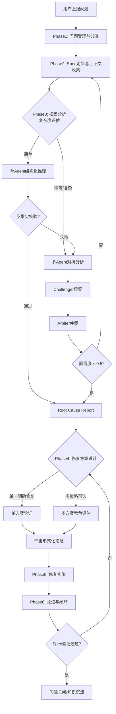
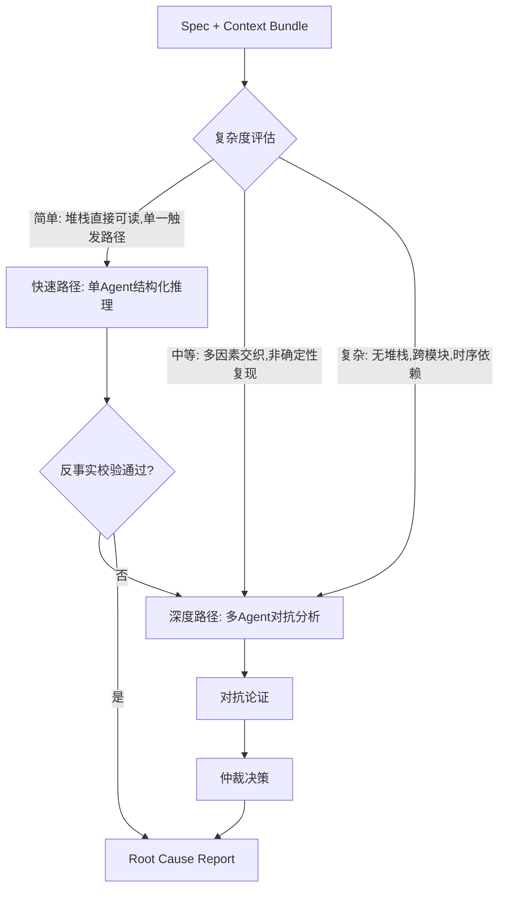
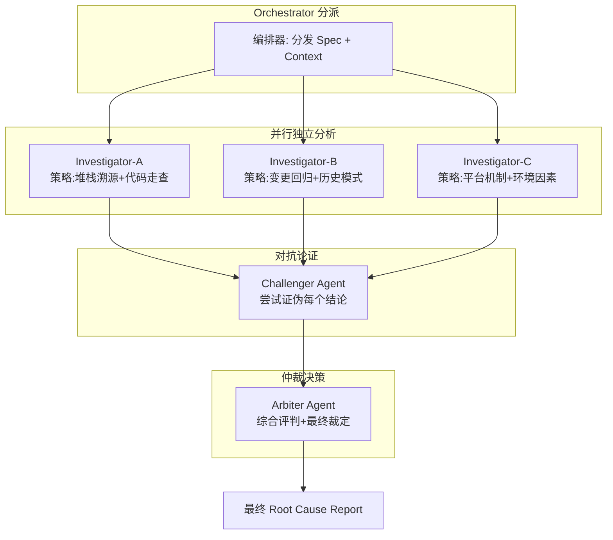
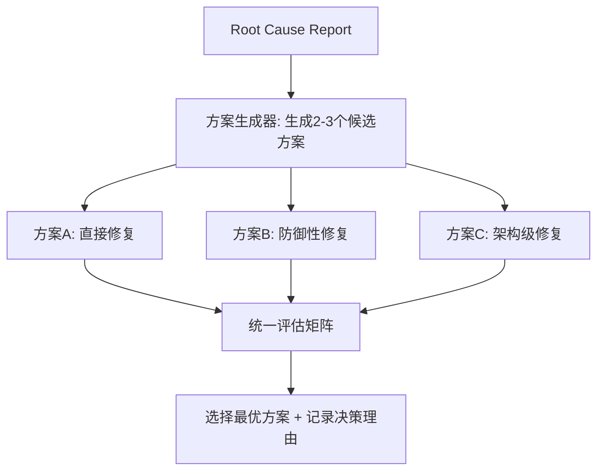
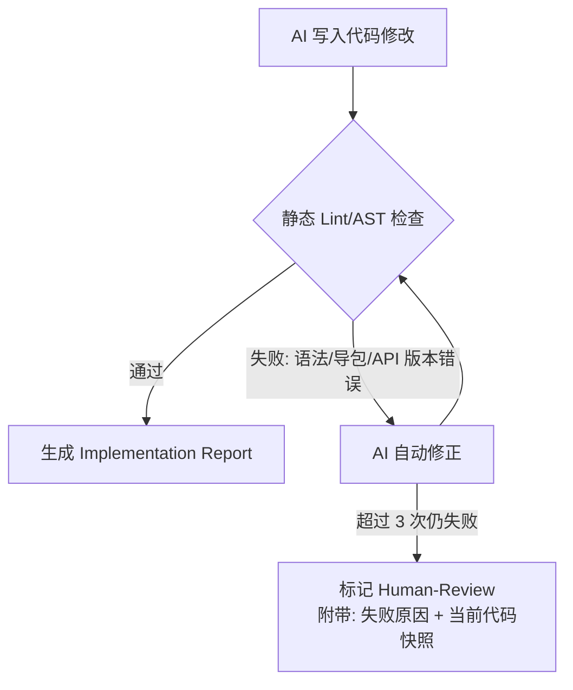
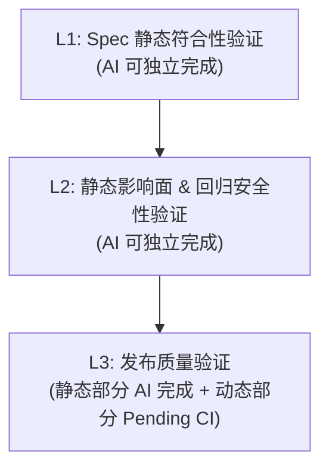
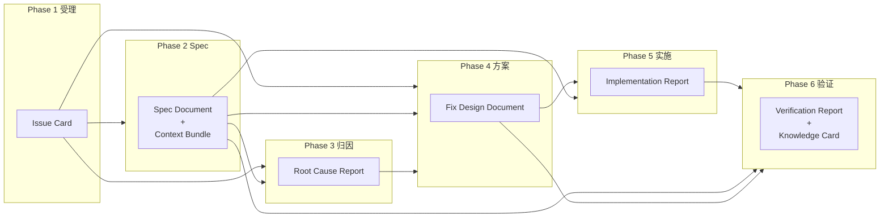

# 面向 Android & iOS 的 B2C 质量问题工作流设计方案

## 一、整体架构

### 1.1 设计理念

采用 **"Spec 驱动 + AI 辅助"** 的双轮驱动模式：
- **Spec 范式**：每个问题必须先定义明确的行为规约（Expected / Actual / Invariant），作为归因和验证的"锚点"
- **AI 辅助**：在上下文收集、根因分析、修复建议、测试生成等环节引入 AI 自动化能力
- **B2C 导向**：面向终端用户上报场景，兼容模糊描述、非技术语言的问题输入

### 1.2 Skill 体系总览

```
.cursor/skills/
├── mobile-qa-orchestrator/       # 主编排器 - 工作流入口与调度
│   ├── SKILL.md
│   └── reference.md
├── mobile-qa-intake/             # Phase 1: 问题受理与分类
│   ├── SKILL.md
│   └── templates/
│       └── issue-template.md
├── mobile-qa-spec-definition/    # Phase 2: Spec 定义与上下文收集
│   ├── SKILL.md
│   └── templates/
│       └── spec-template.md
├── mobile-qa-root-cause/         # Phase 3: 根因分析
│   ├── SKILL.md
│   └── reference.md
├── mobile-qa-fix-design/         # Phase 4: 修复方案设计
│   ├── SKILL.md
│   └── reference.md
├── mobile-qa-fix-impl/           # Phase 5: 修复实施
│   ├── SKILL.md
│   └── reference.md
└── mobile-qa-verification/       # Phase 6: 验证与闭环
    ├── SKILL.md
    └── reference.md
```

### 1.3 工作流总流程



---

## 二、各阶段详细设计

### Phase 1: 问题受理与分类 (mobile-qa-intake)

**目标**：将非结构化的用户问题转化为结构化的工单

**输入依赖**：
- 用户原始输入（自然语言描述、截图、日志、录屏等非结构化信息）

**AI 能力**：
- 自然语言理解：从用户模糊描述中提取关键信息（设备、系统版本、操作路径、异常表现）
- 自动分类：将问题映射到标准类别体系（支持复合分类）
- 信息完整性检查：评估用户提供的信息是否满足后续分析所需的最小集合

**问题类别体系**（标准分类树）：

| 一级分类 | 二级分类 | 典型特征 |
|---------|---------|---------|
| 稳定性 | Crash / ANR / Freeze / OOM | 有堆栈、有系统日志 |
| 性能 | 启动慢 / 卡顿 / 掉帧 / 耗电 / 发热 | 有性能指标数据 |
| 功能 | 逻辑错误 / 数据异常 / 状态丢失 | 有明确的预期 vs 实际差异 |
| UI/UX | 布局异常 / 适配问题 / 动画异常 | 有截图或录屏 |
| 网络 | 请求失败 / 超时 / 数据不一致 | 有网络日志或抓包 |
| 兼容性 | 机型适配 / 系统版本兼容 / 第三方 SDK | 特定设备或版本复现 |
| 安全 | 数据泄露 / 权限滥用 / 注入风险 | 安全扫描或渗透测试报告 |

**分类机制**：支持主分类 + 次分类，应对复合问题场景：

```
分类规则:
- 主分类: 问题最直接的表现类别（用户最先感知到的异常）
- 次分类: 问题可能涉及的关联类别（根因可能在此）
- 分类置信度: AI 对分类判断的确信程度

示例:
- 用户反馈"点击支付按钮没反应" -> 主分类: 功能 | 次分类: 网络（可能是请求未发出）
- 用户反馈"特定手机上页面显示错乱" -> 主分类: UI/UX | 次分类: 兼容性
- 当次分类存在时，Phase 2 的 Spec 扩展模块和上下文收集同时加载主分类和次分类对应的模板
```

**信息获取优先级原则（B2C 场景核心原则）**：

B2C 用户耐心有限，且往往不具备技术背景。AI 在判断信息是否缺失前，必须首先穷尽自动化手段，**以最小化打扰用户为优先目标**：

```
信息获取三级策略（按顺序执行，前一级能满足则不进入下一级）:

1. 自动拉取（零打扰）:
   - 通过 UserID/DeviceID 对接内部 APM 平台（Crashlytics/Slardar/Firebase）
     自动拉取: 近期崩溃日志、设备型号、OS 版本、APP 版本、网络状态快照
   - 通过问题上报时间戳匹配对应的服务端日志
   - 从用户账号信息推断: 平台(Android/iOS)、APP 版本、地区/语言

2. AI 推断（零打扰）:
   - 从用户描述中推断: 平台、设备特征、操作路径
   - 从日志/堆栈中推断: 复现路径、触发条件
   - 推断结果标注为 [AI-Inferred]，在 Context Bundle 中以 C 级证据处理

3. 定向追问（最小打扰）:
   - 仅在前两级均无法获取必需信息时才向用户追问
   - 追问必须: 一次性汇总所有缺失项（不得分多轮追问）
   - 追问必须: 以选择题/封闭式提问为主，减少用户输入负担
   - 追问示例:
     ✓ "您的手机是 iPhone 还是 Android？（点击选择）"
     ✗ "请问您使用的是什么设备、系统版本，以及具体的操作步骤？"
```

**最小信息集门禁**：

Issue 进入 Phase 2 前必须满足最小信息集要求。在执行门禁判定前，必须先完成上述三级信息获取流程。

| 信息项 | 必需程度 | 缺失时的处理 |
|-------|---------|------------|
| 问题描述（做了什么/出了什么问题） | 必需 | 追问（无法自动获取） |
| 平台（Android/iOS） | 必需 | 优先自动推断（APM/账号信息）；推断不出则追问 |
| 可复现性（必现/偶现/仅一次） | 必需 | 优先从 APM 历史崩溃频率推断；推断不出则追问 |
| APP 版本 | 强烈建议 | 优先 APM 自动拉取；拉取不到则从上下文推断；仍不出则追问 |
| 设备/OS 版本 | 强烈建议 | 优先 APM 自动拉取；拉取不到则从上下文推断；仍不出则追问 |
| 复现路径（操作步骤） | 按分类而定 | 功能/UI 类必需；稳定性类可从堆栈推断 |
| 截图/录屏 | 按分类而定 | UI/UX 类必需；其他类可选 |
| 堆栈/日志 | 按分类而定 | 稳定性类：优先 APM 自动拉取；其他类可选 |
| 网络日志/抓包 | 按分类而定 | 网络类强烈建议；优先对接内部网络监控平台自动拉取 |

```
门禁判定:
- 必需项全部具备（含自动获取/推断）-> 通过，进入 Phase 2
- 必需项缺失且自动化手段已穷尽 -> 工作流状态设为 Info-Insufficient，
  向用户发起一次性定向追问（选择题优先）
- 强烈建议项缺失 -> 可进入 Phase 2，但在 Spec 中标注 [Context-Gap] 并记录缺失项
- 自动拉取/推断的信息 -> 在 Context Bundle 中标注来源和可信度等级
```

**输出产物**：结构化工单（Issue Card）

```markdown
## Issue Card
- **ID**: [自动生成]
- **标题**: [一句话问题描述]
- **主分类**: [一级分类] > [二级分类]
- **次分类**: [一级分类] > [二级分类] | 无
- **分类置信度**: [High/Medium/Low]
- **平台**: Android / iOS / Both
- **优先级**: P0-Critical / P1-High / P2-Medium / P3-Low
- **影响范围**: [用户量/功能模块/版本范围]
- **原始描述**: [用户原话]
- **关键信息摘要**: [AI 提取的结构化信息]
- **信息完整度**: [完整 / 部分缺失(列出缺失项)]
```

### Phase 2: Spec 定义与上下文收集 (mobile-qa-spec-definition)

**目标**：为问题建立精确的行为规约，并收集完整的分析上下文

**输入依赖**：
- Issue Card（Phase 1 产物：分类、平台、优先级等结构化元信息）

#### 2.1 Spec 基础模型 + 分类扩展

**所有问题共享的 Spec 基础三要素**：

```markdown
## Behavior Spec (Base)
### Expected Behavior（预期行为）
[在什么条件下，系统应该如何表现]

### Actual Behavior（实际行为）
[系统实际表现了什么，与预期的差异点]

### Invariant（不变量约束）
[无论如何，系统必须满足的约束条件]
```

**关键：不同问题分类必须加载对应的 Spec 扩展模块，否则分析会因为缺少关键锚点而流于表面。**

**功能类 Spec 扩展**：
```markdown
### Functional Spec Extension
#### 业务规则（Business Rules）
- [BR1] 当[前置条件]时，操作[X]应产生结果[Y]
- [BR2] ...
（从 PRD/产品文档提取，若不存在则与用户/PM确认）

#### 状态转换图（State Transitions）
[当前功能涉及的状态机]
状态A --事件1--> 状态B --事件2--> 状态C
标注: 问题发生在哪个状态转换上

#### 输入输出映射（I/O Mapping）
| 输入场景 | 预期输出 | 实际输出 | 是否异常 |
|---------|---------|---------|---------|
| 正常输入 | ... | ... | |
| 边界输入 | ... | ... | |
| 异常输入 | ... | ... | |

#### 数据流关键节点（Data Checkpoints）
数据从[来源] -> [处理层1] -> [处理层2] -> [展示层]
标注: 在哪个节点数据开始偏离预期
```

**UI/UX 类 Spec 扩展**：

> **UI/UX 证据优先级原则**：UI/UX 问题的分析和验证必须以**结构化数据为主、截图为辅**。
> 当前 VLM 对移动端像素级差异（如 2dp 的间距偏差、细微颜色差异）存在显著幻觉，
> 不可将截图视觉比对作为主要证据。优先级如下：
> 1. **结构化数据（最高可信度）**：Layout Inspector 导出 / View Debugger 导出 / ConstraintLayout XML / AutoLayout 代码约束
> 2. **数值化描述（高可信度）**：精确标注差异的数值（偏移量 dp/px、颜色值、字号）
> 3. **截图对比（辅助参考，C 级证据）**：截图仅用于辅助理解问题现象，不可作为精确差异判断的依据

```markdown
### UI/UX Spec Extension
#### 视觉参照（Visual Reference）
- 设计稿链接/截图: [Figma/Sketch/截图路径]（辅助参考）
- 实际渲染截图: [用户提供或复现截图]（辅助参考，C 级证据）
- **结构化差异描述**（主要证据，优先填写）:
  - 布局文件引用: [Layout XML / SwiftUI 代码 / XIB/Storyboard 路径]
  - Layout Inspector / View Debugger 导出: [结构化视图树数据]
  - 精确差异标注: [元素名 / 属性 / 期望值 vs 实际值]
    示例: `btnSubmit.marginBottom = 16dp (设计稿) vs 0dp (实际), 偏差 16dp`

#### 布局约束定义（Layout Constraints）
- 容器: [父容器尺寸 + 布局方式]
- 目标元素: [约束关系: 上下左右间距/对齐/比例]
- Android: [ConstraintLayout/LinearLayout 约束 XML]
- iOS: [Auto Layout constraints 代码 / Frame 计算逻辑]

#### 适配场景矩阵（Adaptation Matrix）
| 维度 | 目标值 | 实际表现 |
|------|-------|---------|
| 屏幕尺寸 | [支持范围] | [哪些尺寸异常] |
| 分辨率/密度 | [支持范围] | [哪些密度异常] |
| 暗色模式 | [是否支持] | [是否正常] |
| 动态字号 | [是否支持] | [是否正常] |
| 安全区域 | [刘海/药丸/折叠屏] | [是否适配] |
| RTL 布局 | [是否支持] | [是否正常] |

#### 动画/交互定义（若涉及）
- 动画参数: [时长/曲线/关键帧]
- 手势响应: [触发条件/响应行为]
```

**网络类 Spec 扩展**：
```markdown
### Network Spec Extension
#### API 契约（API Contract）
- 接口: [Method] [URL]
- 请求体: [Schema + 必填/可选标注]
- 响应体: [成功Schema + 各错误码Schema]
- 超时策略: [连接超时/读写超时/总超时]
- 重试策略: [重试次数/退避策略/幂等性]

#### 错误处理链（Error Handling Chain）
网络层(OkHttp/URLSession) -> 协议层(HTTP状态码) 
  -> 业务层(业务错误码) -> 展示层(用户提示)
标注: 在哪一层的错误处理不符合预期

#### 环境依赖（Environment Dependencies）
- 网络条件: [WiFi/4G/5G/弱网/断网]
- 代理/VPN: [是否影响]
- 证书/DNS: [是否有特殊配置]
- CDN/负载均衡: [是否涉及]

#### 并发与时序（Concurrency & Timing）
- 并发请求: [同一接口是否有并发调用？是否需要去重/排队？]
- 请求依赖链: [A完成后才能B？是否存在时序竞争？]
- 缓存策略: [本地缓存与服务端数据的一致性策略]
```

**兼容性类 Spec 扩展**：
```markdown
### Compatibility Spec Extension
#### 问题设备画像（Problem Device Profile）
| 属性 | 问题设备 | 正常设备 | 差异点 |
|------|---------|---------|-------|
| 品牌/型号 | | | |
| OS版本 | | | |
| 芯片/架构 | | | |
| 屏幕参数 | | | |
| 可用内存/存储 | | | |
| 厂商定制ROM | | | |

#### API 可用性对照（API Availability）
| 使用的API | 最低支持版本 | 问题设备版本 | 是否可用 | 替代方案 |
|-----------|------------|-----------|---------|---------|
| ... | ... | ... | | |

#### 第三方 SDK 版本矩阵（若涉及）
| SDK名称 | 当前版本 | 兼容最低OS | 已知问题 |
|---------|---------|-----------|---------|
| ... | ... | ... | |
```

#### 2.2 Spec 校准机制

**解决"Expected Behavior 本身可能有争议"的问题**：

```
Spec 来源优先级:
1. 产品文档/PRD 中的明确定义 (最高可信度)
2. 设计稿/交互稿中的明确标注
3. 同类竞品的通行行为 (参考可信度)
4. 用户的口述预期 (需交叉验证)

当 Spec 存在模糊性时:
- 标记为 [Spec-Uncertain], 列出多种可能的 Expected Behavior
- 向用户/PM 发起确认请求，附带选项和利弊说明
- 在确认前，对每种可能的 Spec 分别执行分析（避免阻塞）
- 最终 Root Cause Report 中标注 "Spec 依赖: 结论基于 Spec 解读 X"
```

#### 2.3 "非 Bug" 逃逸路径

**B2C 场景下的常见非 Bug 情况，应在 Spec 阶段尽早识别**：

```
非 Bug 判定检查项:
- [ ] Working-As-Designed: 行为符合产品设计，用户预期与设计不一致
- [ ] User-Misoperation: 用户操作方式不在预期使用路径内
- [ ] Environment-Specific: 问题仅在用户特殊环境下出现（Root/越狱/非法改装）
- [ ] Known-Limitation: 已知限制，在文档中有声明
- [ ] Duplicate: 与已有 Issue 重复

若判定为非 Bug:
-> 输出 "Non-Bug Resolution Report"，包含:
   - 判定类别
   - 判定依据（引用设计文档/产品确认）
   - 用户沟通建议（如何向用户解释）
   - 改进建议（是否值得优化体验，即使不是Bug）
-> 跳过 Phase 3-5，直接进入闭环
-> 触发体验改进路由（见下）

非 Bug 判定后的体验改进路由:
-> 对 User-Misoperation 和 Working-As-Designed 类型，在关闭前额外评估:
   评估问题: "当前的设计/交互是否存在可以优化的体验问题？"
   
   评估标准:
   - 多个用户对同一功能产生相同误解 -> 信号强度: 高，建议触发路由
   - 用户描述中透露明确的期望行为差异 -> 信号强度: 中，建议触发路由
   - 仅为个人偏好差异，无通用改进价值 -> 信号强度: 低，跳过路由
   
   若评估认为有改进价值:
   -> 自动生成 Feature Request 或 UX Improvement 工单，包含:
      - 来源 Issue 链接（本 Non-Bug Issue）
      - 用户原始反馈（脱敏后的核心诉求）
      - 改进方向建议（基于 Non-Bug 分析得出的体验优化点）
      - 信号强度评级（高/中/低）
   -> 工单派发给: PM（Feature Request）或设计团队（UX Improvement）
   -> 本 Issue 正常关闭，改进工单独立流转

非 Bug 判定的回流机制:
-> 如果用户对非 Bug 判定提出异议，可触发回流:
   - 用户提供新证据/新复现路径 -> 重新进入 Phase 2，带着新信息重新评估
   - 用户指出判定依据有误（如引用的设计文档版本过旧） -> 更新 Spec 来源后重新判定
   - 回流时在 Issue Card 中标注 [Re-Evaluated]，保留原判定记录作为分析参考
-> 同一问题最多回流 2 次，超过则标记为 Human-Review 由人工最终裁定
```

#### 2.4 证据可信度分级

**所有收集到的证据必须标注可信度等级，该等级直接影响 Phase 3 推理链中的证据权重。**

| 等级 | 定义 | 权重系数 | 典型来源 |
|------|------|---------|---------|
| **A级 - 可复现实证** | 可独立复现验证的客观证据 | 1.0 | 稳定复现的堆栈/日志；抓包数据；Layout Inspector 导出；可复现的操作路径 |
| **B级 - 间接证据** | 无法直接复现但来源可靠的客观记录 | 0.7 | 偶现问题的单次日志；用户提供的截图/录屏；服务端日志（非实时）；Git blame 变更记录 |
| **C级 - 口述/推断** | 人工描述或 AI 推断，未经实证验证 | 0.4 | 用户口头描述的操作路径；AI 基于模式匹配的推断；未验证的相似案例关联 |

```
在推理链 SCORE 步骤中的应用:
- 正向证据得分 = SUM(每条正向证据的权重系数)
- 反驳证据扣分 = SUM(每条反驳证据的权重系数)
- A级证据的反驳可直接否决假设
- 仅由C级证据支撑的假设，置信度上限为 0.5（Medium）
```

#### 2.5 上下文收集清单（分类深化版）

**基础上下文（所有分类共需）**：
- 设备信息 / APP 版本 / OS 版本
- 复现路径（用户描述 + AI 推断）
- 相关代码（AI 基于模块定位）
- 历史变更（Git blame/log）
- 相似案例（知识库检索）

**功能类专项上下文**：
- 用户操作的完整事件序列（埋点日志）
- 数据快照对比（操作前后的关键数据状态）
- 接口请求响应日志（如果功能涉及网络交互）
- 相关的 Feature Flag / AB 实验配置

**UI/UX 类专项上下文**：
- 问题截图 + 对应的设计稿截图
- Layout Inspector / View Hierarchy 导出（Android）
- View Debugger / Reveal 导出（iOS）
- 设备屏幕参数（尺寸/密度/安全区域）
- 当前系统设置（字号/暗色模式/语言/RTL）

**网络类专项上下文**：
- 完整的请求/响应（Headers + Body + Timing）
- 网络环境信息（WiFi/移动数据/信号强度/代理）
- 服务端对应日志（如果可获取）
- DNS 解析结果 / IP 归属
- 同一接口的历史成功/失败比例

**兼容性类专项上下文**：
- 问题设备 vs 正常设备的完整参数对比
- 该设备/OS版本的已知兼容性问题列表
- 厂商定制系统的已知差异（如 MIUI/EMUI/ColorOS 特性）
- Build.prop / 系统属性（Android）/ UIDevice 信息（iOS）
- 依赖的第三方 SDK 在该设备上的兼容性声明

**输出产物**：Spec Document（含分类扩展模块）+ Context Bundle

**Context Bundle 标准化模板**：

```markdown
## Context Bundle

### 元信息
- **关联 Issue**: [Issue Card ID]
- **收集时间**: [时间戳]
- **主分类**: [对应 Issue Card 主分类]
- **次分类**: [对应 Issue Card 次分类]

### 证据清单
| 编号 | 证据类型 | 可信度等级 | 内容摘要 | 来源 | 原始数据引用 |
|------|---------|-----------|---------|------|------------|
| E1 | [堆栈/日志/截图/抓包/口述/...] | [A/B/C] | [一句话摘要] | [Crashlytics/用户提供/代码分析/...] | [链接或内联] |
| E2 | ... | ... | ... | ... | ... |

### 相关代码定位
| 模块/文件 | 关联原因 | 定位方式 |
|----------|---------|---------|
| [file path] | [堆栈指向/功能归属/变更历史] | [堆栈帧#N/Git blame/模块映射] |

### 历史变更摘要
| Commit | 时间 | 作者 | 变更摘要 | 可疑程度 |
|--------|------|------|---------|---------|
| [hash] | [date] | [author] | [摘要] | [高/中/低] |

### 相似案例
| 案例 ID | 相似度 | 问题摘要 | 根因摘要 | 参考价值 |
|---------|-------|---------|---------|---------|
| [ID] | [高/中/低] | [摘要] | [摘要] | [可直接复用/仅参考/仅排除] |

### 信息缺口
- [列出尚未收集到但对分析有价值的信息，标注缺失原因]
```

### Phase 3: 根因分析 (mobile-qa-root-cause) -- 核心阶段

**目标**：基于 Spec 和上下文，通过结构化推理链 + 多 Agent 对抗分析，系统化定位根因

**输入依赖**：
- Issue Card（全局元信息：分类、优先级，用于复杂度评估和路径选择）
- Spec Document（归因锚点：Expected/Actual/Invariant + 分类扩展模块）
- Context Bundle（证据集合：带可信度分级的证据清单、相关代码、历史变更、相似案例）

#### 3.1 问题复杂度分级与分析路径选择

根因分析的第一步是评估问题复杂度，决定走**快速路径**还是**深度路径**：



**复杂度评估标准（按问题分类细化）**：

**稳定性/性能类**：
- 简单：堆栈完整且直指业务代码；100%复现；单一触发路径
- 中等：堆栈指向框架层需溯源；条件复现；涉及 2-3 模块
- 复杂：无有效堆栈/堆栈被混淆；非确定性复现；跨进程/线程时序

**功能类**：
- 简单：单一操作路径下结果明确错误；数据流可线性追踪；不涉及状态切换
- 中等：多步骤操作后才出现异常；涉及状态机跳转；或涉及前后端交互
- 复杂：偶发性数据异常；涉及并发写入/缓存一致性；多模块联动的状态耦合；前后端均可能有问题

**UI/UX 类**：
- 简单：所有设备一致出现；肉眼可见的硬编码/资源错误；单一视图层级问题
- 中等：特定屏幕尺寸/密度/系统配置才出现；涉及动态布局计算；交互与动画时序问题
- 复杂：偶发布局错乱；涉及异步数据加载后的布局重排；多层嵌套滑动冲突；与系统行为耦合（输入法/旋转/分屏）

**网络类**：
- 简单：请求固定失败（4xx/5xx）；错误提示与实际错误码不匹配；明确的 Schema 不符
- 中等：间歇性失败（超时/断连）；特定网络环境下出现；缓存未更新导致数据陈旧
- 复杂：偶发数据不一致；并发请求竞态；涉及 CDN/DNS/证书链；前后端均可能是根因

**兼容性类**：
- 简单：明确的 API 不可用（Crash 日志中有 NoSuchMethod/Unrecognized Selector）
- 中等：特定厂商ROM的行为差异；系统权限策略差异；第三方 SDK 在特定设备上的问题
- 复杂：偶发于特定设备+特定OS版本组合；涉及厂商未公开的系统修改；多 SDK 间冲突

**深度路径（多 Agent 对抗）触发条件**：

多 Agent 对抗分析成本较高，不应对所有中等/复杂问题无差别启用。必须满足以下条件之一才进入深度路径：

```
触发条件（满足任一即可）:
1. 快速路径反事实校验失败（必然触发）
2. 问题优先级为 P0/P1 且复杂度评估为中等或复杂
3. 问题涉及跨模块/跨端，且 Context Bundle 中存在矛盾证据
4. 相似案例库中存在同类问题被误判的历史记录

不触发的情况（即使复杂度评估为中等）:
- P2/P3 优先级且快速路径反事实校验通过 -> 直接采信快速路径结论
- Context Bundle 中 A 级证据充分且指向单一假设 -> 无需多角度对抗
```

**最小证据阈值**：

进入任何分析路径前，必须确认 Context Bundle 达到最低质量要求。证据不足时应回退到 Phase 2 补充，而非在噪声中分析。

```
最小证据阈值:
- 至少 1 条 A 级或 2 条 B 级证据（纯 C 级证据禁止进入分析）
- 对应分类的 Spec 扩展模块中，至少 50% 的关键字段已填充
- 如果不满足 -> 工作流状态回退到 Spec-Defining，列出需要补充的具体证据项

深度路径的额外阈值:
- 至少 2 条 A 级证据，或 1 条 A 级 + 2 条 B 级
- 不满足额外阈值但满足基本阈值 -> 仅走快速路径，不触发多 Agent
```

**Context Bundle 降维与裁剪策略**：

多 Agent 深度路径中，Context Bundle 可能包含大量代码文件和日志，导致 Token 超限。编排器在分发上下文前必须执行裁剪：

```
Context Bundle 裁剪优先级（从高到低保留）:
1. A 级证据（完整保留，不可裁剪）
2. Spec Document 核心字段（Expected/Actual/Invariant + 分类扩展）
3. B 级证据（超出 Token 预算时，优先保留与假设直接相关的部分）
4. 相关代码（仅保留堆栈帧/推断定位的具体函数，不传入整个文件）
5. 历史变更摘要（仅保留"可疑程度: 高"的 Commit，其余截断）
6. C 级证据（在 Token 预算紧张时最先裁剪，裁剪时在 Bundle 摘要中标注）

Token 预算上限（建议）:
- 单个 Investigator Agent 上下文: 不超过 80K tokens
- 超出时按上述优先级从低到高裁剪，直到满足预算
- 裁剪后在 Context Bundle 摘要头部标注: [已裁剪: 原始 N 条证据 -> 保留 M 条]
```

**多 Agent 对抗轮次上限**：

```
对抗轮次控制规则:
- Investigator 分析: 1 轮（并行），不可重试
- Challenger 质疑: 1 轮（基于 Investigator 结论执行一次性质疑）
- Arbiter 裁定: 1 轮，但允许向 Investigator 发起最多 1 次"定向补问"
  （仅当某一关键假设存在信息空缺，补问内容必须是明确的封闭式问题）
- 最大对抗总轮次: 3 轮（Investigator + Challenger + Arbiter，含 1 次补问）
- 超过上限仍未收敛 -> 强制 Arbiter 执行降级裁定（见下）

Arbiter 强制降级裁定规则:
- 触发条件: 达到轮次上限 或 所有 Investigator 结论完全发散无重叠
- 降级裁定输出:
  1. 列出所有存活假设（不做选择）
  2. 为每个假设标注: 支持证据数量 + 最强证据等级
  3. 给出"当前最可能假设"（仅基于证据覆盖度机械排序，不做推断）
  4. 置信度强制降为 Low（<0.5）
  5. 工作流状态转为 Human-Review，附带降级裁定报告
```

#### 3.2 结构化推理链规范 (Chain-of-Reasoning Spec)

**无论走哪条路径，每个分析 Agent 都必须遵循以下结构化推理链**。这是保证归因质量的核心规范：

```
┌─────────────────────────────────────────────────────┐
│  Step 1: OBSERVE - 现象锚定                          │
│  将 Actual Behavior 分解为可独立分析的原子现象         │
│  每个原子现象必须可引用具体证据（日志行号/堆栈帧/截图） │
├─────────────────────────────────────────────────────┤
│  Step 2: HYPOTHESIZE - 假设生成                      │
│  对每个原子现象，生成 >= 2 个候选假设                  │
│  每个假设必须声明:                                    │
│    - 因果机制: 为什么这个原因会导致这个现象             │
│    - 可证伪条件: 如果假设为真，还应观察到什么(A)        │
│    - 可否定条件: 如果假设为真，不应观察到什么(B)        │
├─────────────────────────────────────────────────────┤
│  Step 3: VERIFY - 证据校验                           │
│  对每个假设执行三重校验:                               │
│    [正向] 在上下文中寻找支持证据                       │
│    [反向] 在上下文中寻找反驳证据                       │
│    [反事实] 如果此假设成立，预测的现象A是否存在？       │
│              不应存在的现象B是否确实不存在？             │
├─────────────────────────────────────────────────────┤
│  Step 4: SCORE - 置信度量化                          │
│  对存活假设计算置信度分数:                             │
│    正向证据得分 = SUM(证据可信度权重系数: A=1.0/B=0.7/C=0.4)│
│    反事实验证得分 = 通过数 x 0.3                       │
│    反驳证据扣分 = SUM(反驳证据可信度权重系数)            │
│    约束: 仅由C级证据支撑的假设，置信度上限 0.5          │
│    综合得分映射: >=0.8 High, 0.5-0.8 Medium, <0.5 Low │
├─────────────────────────────────────────────────────┤
│  Step 5: CHAIN - 因果链构建                          │
│  将得分最高的假设串联为完整因果链:                      │
│    触发条件 -> 中间状态1 -> 中间状态2 -> 最终现象       │
│  因果链中每个环节都必须有证据支撑                      │
└─────────────────────────────────────────────────────┘
```

**推理链产出格式**：

```markdown
## Reasoning Chain Output

### Observations (原子现象)
- [O1] 描述 | 证据来源: [日志L23 / 堆栈帧#3 / ...]
- [O2] 描述 | 证据来源: [...]

### Hypotheses (候选假设)
#### H1: [假设描述]
- 因果机制: [为什么 H1 -> O1]
- 可证伪预测: 若H1为真，应观察到 [P1, P2]
- 可否定预测: 若H1为真，不应观察到 [N1]
- 正向证据: [E1(+), E2(+)] 
- 反驳证据: [E3(-)] 
- 反事实验证: P1[通过/失败], P2[通过/失败], N1[通过/失败]
- 置信度分数: 0.XX

#### H2: [假设描述]
- (同上结构)

### Causal Chain (因果链)
[触发条件] --(证据E1)--> [中间状态] --(证据E2)--> [最终现象]

### Conclusion
- 最终根因: [H?]
- 综合置信度: [分数]
- 残余不确定性: [尚未排除的可能性及原因]
```

#### 3.3 分类专项推理引导 (Category-Specific Reasoning Guide)

**通用推理链规范（3.2）是骨架，本节为各类别提供"肌肉"——告诉 AI 在每一步具体该关注什么。**

**功能类问题推理引导**：
```
OBSERVE 阶段重点:
- 将"功能不正常"分解为具体的数据/状态偏差点
- 对照 Spec 中的 I/O Mapping，逐条标注哪些输出不符
- 对照状态转换图，定位状态偏离发生在哪个转换上
- 在数据流关键节点逐点检查，定位数据首次偏离的位置

HYPOTHESIZE 阶段重点:
- 优先考虑: 条件分支遗漏/边界值处理缺失/状态机跳转丢失/异步回调时序
- 必须检查: 服务端数据是否符合预期（排除前端接了脏数据的可能）
- 必须检查: Feature Flag / AB 实验配置是否影响了行为

VERIFY 阶段重点:
- 关键验证手段: 在数据流每个节点打桩检查数据是否符合预期
- 反事实: 如果假设成立，相同操作路径下不同输入是否也会异常？
- 边界: 改变输入为边界值，行为是否符合假设预测？
```

**UI/UX 类问题推理引导**：
```
OBSERVE 阶段重点:
- 精确标注视觉差异: 位置偏移(px/dp)、尺寸错误、颜色/字号不匹配、间距异常
- 区分静态渲染问题 vs 动态布局问题(数据加载后才出现)
- 区分全局问题(所有页面) vs 局部问题(特定页面/组件)
- 检查 Layout Inspector/View Debugger 中的实际约束值

HYPOTHESIZE 阶段重点:
- 优先考虑: 硬编码数值 / 约束缺失 / 约束冲突 / 资源适配不全(mdpi/hdpi/...)
- 动态问题优先考虑: 异步数据回来后的布局更新时机 / measure-layout 循环
- 适配问题优先考虑: 安全区域计算 / 状态栏/导航栏高度 / 折叠屏状态
- Android 特有: dp/sp/px 转换 / ConstraintLayout barrier/guideline
- iOS 特有: safeAreaInsets / intrinsicContentSize / Auto Layout 优先级

VERIFY 阶段重点:
- 关键验证手段: 在多种屏幕尺寸/密度下复现对比
- 反事实: 如果是约束X导致的问题，修改该约束后布局是否正常？
- 对照: 问题元素在其他页面的同类使用是否也有问题？
```

**网络类问题推理引导**：
```
OBSERVE 阶段重点:
- 完整记录: 请求URL/Method/Headers/Body -> 响应Code/Headers/Body/耗时
- 区分: 请求未发出 / 请求发出但无响应 / 响应已收到但解析失败 / 解析成功但业务处理失败
- 对比: 同一请求在正常/异常环境下的差异
- 时间线: 多个相关请求的发出和响应时序

HYPOTHESIZE 阶段重点:
- 按错误处理链逐层检查: 网络层 -> 协议层 -> 解析层 -> 业务层 -> 展示层
- 客户端 vs 服务端归属判定:
  * 服务端返回错误码 -> 优先怀疑服务端/请求参数
  * 客户端超时但服务端日志正常 -> 怀疑网络环境/客户端超时配置
  * 数据不一致 -> 同时检查客户端缓存策略和服务端数据
- 必须检查: 请求参数拼装是否正确(尤其动态参数/签名/token过期)
- 必须检查: 是否有请求拦截器/中间件修改了请求或响应

VERIFY 阶段重点:
- 关键验证手段: 用相同参数直接调 API (curl/Postman) 对比结果
- 抓包: 对比客户端实际发出的请求 vs 代码中构造的请求
- 反事实: 如果是服务端问题，其他客户端(Web/其他版本)是否也有同样问题？
```

**兼容性类问题推理引导**：
```
OBSERVE 阶段重点:
- 精确的设备差异对比: 问题设备 vs 正常设备的参数逐项比对
- 确认问题的"设备边界": 同品牌不同型号？同OS不同版本？同版本不同品牌？
- 检查是否与厂商定制行为相关(权限管理/后台限制/通知策略)

HYPOTHESIZE 阶段重点:
- API 可用性: 使用了高版本 API 但未做版本检查/降级?
- 厂商差异: 厂商ROM修改了标准行为(常见于通知/后台/权限/存储)?
- 硬件差异: GPU渲染差异/摄像头API差异/传感器精度差异?
- SDK 冲突: 不同 SDK 版本间的二进制兼容性/资源冲突/初始化顺序?
- Android 碎片化: targetSdkVersion 升级带来的行为变更?
- iOS 版本: 系统行为变更(如 iOS 隐私策略/后台模式/推送机制迭代)?

VERIFY 阶段重点:
- 关键验证手段: 在问题设备上用条件编译/动态配置绕过可疑代码
- 反事实: 如果是 API X 的兼容性问题，是否只有使用了 API X 的功能受影响？
- 对照: 同一设备上的其他 App 是否有类似问题？(区分App问题和系统问题)
```

#### 3.4 客户端-服务端边界判定协议

**当问题可能横跨前后端时（功能类和网络类常见），必须先执行边界判定**：

```
边界判定三步法:
Step 1: 抓包/日志确认实际请求和响应内容
Step 2: 判定归属
  - 请求参数构造错误 -> 客户端问题
  - 服务端返回数据不符合 API 契约 -> 服务端问题 -> 输出服务端 Issue 交接文档
  - 双方都符合契约但结果不对 -> 契约本身有歧义 -> 需要前后端对齐
  - 无法确定 -> 两侧同时分析，在 Root Cause Report 中标注 "跨端问题"
Step 3: 如果是服务端问题
  -> 输出 "Server-Side Issue Handoff" 文档:
     - 问题描述 + 客户端侧的证据
     - 期望的 API 行为(基于 API Contract)
     - 实际的 API 行为(附抓包证据)
     - 影响范围(客户端侧)
  -> 客户端侧可先做防御性处理(容错)
```

#### 3.5 跨平台问题 Sub-Issue 拆分协议

**当问题被判定为跨平台问题（Both 平台），且 Android 和 iOS 涉及不同代码库时，同一 Agent 上下文同时处理双端代码会导致分析质量下降。此时必须执行 Sub-Issue 拆分**：

```
Sub-Issue 拆分触发条件（满足任一即可）:
1. Issue Card 中 Platform = Both
2. Root Cause 假设指向平台特异性代码（非共享业务逻辑层）
3. Fix Design 需要在 Android 和 iOS 分别修改代码

Sub-Issue 拆分流程:
Step 1: 编排器从当前 Issue 生成两个子工单:
  - Sub-Issue-Android: {父Issue-ID}-android
    - 继承父 Issue 的 Spec Document（共享行为规约）
    - 独立的 Context Bundle（仅包含 Android 端相关证据和代码）
  - Sub-Issue-iOS: {父Issue-ID}-ios
    - 继承父 Issue 的 Spec Document（共享行为规约）
    - 独立的 Context Bundle（仅包含 iOS 端相关证据和代码）

Step 2: 两个 Sub-Issue 各自独立经历 Phase 3/4/5
  - 各自产出独立的 Root Cause Report 和 Fix Design Document
  - 各自在独立分支上实施修复（fix/ai-issue-{父ID}-android 和 fix/ai-issue-{父ID}-ios）

Step 3: 跨端一致性对比（由父 Issue Arbiter Agent 执行）
  - 输入: Sub-Issue-Android 的 Fix Design Document + Sub-Issue-iOS 的 Fix Design Document
  - 执行对比:
    - L2 行为一致性: 两端修复后是否产生相同的业务结果？
    - L3 容错一致性: 两端的异常处理和降级策略是否对齐？
    - 差异识别: 是平台合理差异还是需要对齐的不一致？
  - 输出: 跨端一致性报告（附带允许差异的理由说明）

Step 4: 父 Issue 状态
  - 仅在两个 Sub-Issue 均验证通过后，父 Issue 才能关闭
  - Knowledge Card 在父 Issue 级别生成，包含双端分析的综合经验

Sub-Issue 与父 Issue 的关联要求:
- Sub-Issue 的所有产物（Report/Fix/PR）必须引用父 Issue ID
- 父 Issue 的状态视图必须显示两个 Sub-Issue 的当前状态
- 若一端无需修复（如问题仅发生在一端），说明原因后可跳过该端的 Sub-Issue
```

#### 3.6 多 Subagent 对抗分析架构 (Adversarial Multi-Agent)

**当问题进入深度路径时，启动多 Agent 对抗分析机制**：



**角色定义与职责**：

**Investigator Agents (调查员, 2-3个并行)**:
- 各自接收完全相同的 Spec + Context Bundle
- 各自采用不同的分析策略切入（策略由编排器分配，确保多样性）
- 独立产出符合 3.2 规范的 Reasoning Chain Output
- **彼此不可见对方的分析过程和结论**

**分析策略池**（编排器根据问题分类选择 2-3 个策略分配给不同 Investigator）:

通用策略（适用全部分类）:
- **Strategy-Regression**: 从 git log/blame 出发，定位可疑变更，关注引入时间点
- **Strategy-Pattern**: 从知识库相似案例出发，模式匹配，关注已知问题模式

稳定性/性能专项策略:
- **Strategy-StackTrace**: 从崩溃堆栈/异常点出发，逐帧溯源，关注直接代码缺陷
- **Strategy-Platform**: 从平台机制特性出发，检查生命周期/内存/线程模型违规

功能专项策略:
- **Strategy-DataFlow**: 从数据流转路径出发，逐节点追踪数据变化
- **Strategy-StateMachine**: 从状态机模型出发，检查状态转换的完整性和正确性
- **Strategy-BizRule**: 从业务规则出发，逐条验证代码实现是否覆盖

UI/UX 专项策略:
- **Strategy-LayoutTree**: 从 View Hierarchy 出发，分析约束/布局参数的计算结果
- **Strategy-ResourceChain**: 从资源加载链出发，检查多密度/多尺寸/多主题资源是否正确
- **Strategy-RenderTiming**: 从渲染时序出发，检查异步数据加载后的布局刷新时机

网络专项策略:
- **Strategy-RequestChain**: 从请求构造到响应处理的完整链路逐层排查
- **Strategy-ContractDiff**: 对比 API 契约定义与实际请求响应的差异
- **Strategy-EnvironmentDiff**: 对比正常/异常网络环境下的行为差异

兼容性专项策略:
- **Strategy-DeviceDiff**: 从问题设备与正常设备的参数差异出发，定位敏感点
- **Strategy-APISurface**: 从使用的系统 API 出发，检查版本兼容性和厂商修改
- **Strategy-SDKInteraction**: 从第三方 SDK 版本和交互出发，检查兼容性声明

**编排器分配规则**:
- 必须包含 1 个通用策略 + 1-2 个分类专项策略
- 确保至少有 2 个策略从不同维度切入（避免"换个说法得出同样结论"的假收敛）

**Challenger Agent (挑战者)**:
- 接收所有 Investigator 的 Reasoning Chain Output
- 对每个结论执行系统化质疑:

```markdown
## Challenge Protocol (挑战协议)

对每个 Investigator 的结论执行以下质疑:

### 1. 因果充分性质疑
"假设根因X被修复，问题是否一定消失？是否存在X被修复但问题依旧的场景？"

### 2. 因果必要性质疑  
"是否存在其他原因Y，同样能解释所有观察到的现象？Y的可能性是否被充分排除？"

### 3. 证据可靠性质疑
"所引用的证据是否存在多义性？同一证据是否可以支持不同结论？"

### 4. 遗漏检查
"是否存在未被解释的现象？因果链中是否有未验证的跳跃？"

### 5. 平台盲区检查
"分析是否充分考虑了平台特异性？Android/iOS在此场景下的行为差异是否被纳入？"
```

- 对每个结论输出: **存活(Survived)** / **削弱(Weakened, 附具体弱点)** / **否决(Refuted, 附反驳证据)**

**Arbiter Agent (仲裁者)**:
- 接收所有 Investigator 的结论 + Challenger 的质疑结果
- 执行最终裁定:

```markdown
## Arbitration Protocol (仲裁协议)

### Step 1: 汇总对比
将所有存活/削弱的假设列表，按维度对比:
- 证据覆盖度: 能解释多少个原子现象
- 反事实通过率: 预测验证的通过比例
- 抗质疑强度: 经过 Challenger 后的剩余置信度
- 因果链完整度: 从触发到现象的链条是否有断裂

### Step 2: 一致性分析
- 多个 Investigator 是否指向同一根因? (收敛 -> 高置信)
- 指向不同根因? (发散 -> 可能多因素或分析不足)
- 部分重叠? (可能存在根因链, 一个是另一个的上游)

### Step 3: 最终裁定
- 收敛情况: 直接采信，最终置信度 = avg(各Agent置信度) x 收敛加权
- 发散情况: 
  - 判断是否为多根因问题(分别列出)
  - 或标记为"需补充信息"，列出需要额外收集的上下文
  - 或降级置信度，附带完整的不确定性说明

### Step 4: 置信度校准
最终置信度 = base_score x convergence_factor x challenge_survival_rate
- base_score: 最佳假设的原始得分
- convergence_factor: 1.2(3/3收敛), 1.0(2/3收敛), 0.7(完全发散)
- challenge_survival_rate: 通过质疑的比例
```

#### 3.7 平台专项推理模板

AI 在推理过程中必须参照的平台专项知识，以结构化 Checklist 形式内嵌到推理链中：

**Android 专项推理检查项**：
- 生命周期: 当前 Activity/Fragment 状态是否与操作预期一致？是否在 onDestroy 后仍持有引用？
- 线程模型: 异常操作是否发生在主线程？是否存在跨线程访问 UI 的情况？Handler/Looper 状态是否正常？
- 内存: 是否存在 Context 泄漏链？Bitmap 是否及时回收？是否触发 GC 导致卡顿？
- 进程: 多进程场景下 SharedPreferences/ContentProvider 是否存在竞争？进程优先级是否导致被杀？
- 混淆: 堆栈是否需要 mapping.txt 还原？泛型擦除是否导致类型转换异常？

**iOS 专项推理检查项**：
- 内存管理: ARC 下是否存在循环引用(delegate/block/timer)？是否在 dealloc 后访问了 self？
- 线程: 是否在非主线程操作 UI？GCD 队列是否存在死锁？@synchronized 范围是否合理？
- RunLoop: 是否因 RunLoop Mode 切换导致 Timer/ScrollView 行为异常？
- 系统 API: 是否使用了被 deprecated 的 API？iOS 版本间行为差异是否被处理？
- 符号化: dSYM 是否与 build 版本匹配？系统库堆栈是否需要进一步符号化？

#### 3.8 输出产物：Root Cause Report (增强版)

```markdown
## Root Cause Report (Enhanced)

### 基本信息
- **关联 Issue**: [Issue Card ID]
- **分析路径**: 快速路径 / 深度路径(N个Agent)
- **分析耗时**: [时间]

### 根因结论
- **根因分类**: [代码缺陷/竞态条件/资源泄漏/配置错误/API误用/设计缺陷/第三方缺陷/环境因素]
- **根因描述**: [一段话精确描述因果机制]
- **代码位置**: [file:line - function_name]
- **最终置信度**: [0.XX] ([High/Medium/Low])
  - 基础得分: [X] | 收敛系数: [X] | 质疑存活率: [X]

### 完整因果链
[触发条件] --(证据E1)--> [状态变化1] --(证据E2)--> [状态变化2] --(证据E3)--> [最终异常]

### 证据清单
| 编号 | 类型 | 内容摘要 | 支持假设 | 权重 |
|------|------|---------|---------|------|
| E1 | 堆栈帧 | ... | H1,H2 | 高 |
| E2 | 日志 | ... | H1 | 中 |
| E3 | 代码变更 | ... | H1 | 高 |

### 分析过程摘要(深度路径)
- **Investigator-A 结论**: [摘要] | 置信度: [X]
- **Investigator-B 结论**: [摘要] | 置信度: [X]  
- **Investigator-C 结论**: [摘要] | 置信度: [X]
- **收敛性**: [收敛/部分收敛/发散]
- **Challenger 质疑结果**: [存活/削弱/否决] 细节
- **Arbiter 裁定理由**: [一段话]

### 影响评估
- **影响范围**: [功能/用户量/版本]
- **关联风险**: [是否存在同类隐患]

### 残余不确定性
- [尚未完全排除的可能性及原因]
- [如需进一步确认，建议补充的信息]
```

---

### Phase 4: 修复方案设计 (mobile-qa-fix-design) -- 核心阶段

**目标**：基于经过论证的根因，设计可证明正确的修复方案

**输入依赖**：
- Issue Card（全局元信息：平台、优先级，影响修复策略保守度和跨平台要求）
- Spec Document（正确性锚点：修复后行为必须满足 Spec 定义）
- Root Cause Report（归因依据：因果链、证据清单、置信度，是修复设计的前提）

#### 4.1 修复方案的形式化论证框架

**核心理念**：修复方案不仅要"看起来对"，还要能通过形式化论证证明其正确性和安全性。

```
┌─────────────────────────────────────────────────────┐
│  Argument 1: 根因覆盖性论证 (Completeness)           │
│  "此修复是否完全消除了根因因果链？"                     │
│  - 逐环节检查因果链中哪些环节被修复切断                 │
│  - 论证被切断的环节是否充分（不会绕过）                 │
├─────────────────────────────────────────────────────┤
│  Argument 2: 副作用安全性论证 (Safety)                │
│  "此修复是否会引入新的问题？"                          │
│  - 修改点的上下游调用链分析                            │
│  - 修改涉及的共享状态/资源分析                         │
│  - 并发场景下的安全性分析                              │
│  - 平台差异性影响分析                                  │
├─────────────────────────────────────────────────────┤
│  Argument 3: Spec 一致性论证 (Correctness)            │
│  "修复后的行为是否满足 Spec 定义？"                     │
│  - 逐条检查 Expected Behavior 是否被满足               │
│  - 逐条检查 Invariant 是否被维护                       │
│  - 边界条件和异常路径是否被覆盖                         │
├─────────────────────────────────────────────────────┤
│  Argument 4: 最小性论证 (Minimality)                  │
│  "此修复是否是满足条件的最小变更？"                     │
│  - 是否存在更小范围的修改能达到同等效果                  │
│  - 当前修改中是否包含非必要的"顺手"改动                 │
└─────────────────────────────────────────────────────┘
```

#### 4.2 多方案竞争评估机制

**对于 Medium/Low 置信度的根因，或存在多种修复策略的场景，启动多方案竞争**：



**统一评估矩阵**：

```markdown
## Fix Evaluation Matrix

| 评估维度 | 权重 | 方案A评分 | 方案B评分 | 方案C评分 |
|---------|------|----------|----------|----------|
| 根因覆盖度 | 30% | | | |
| 副作用风险 | 25% | | | |
| 变更最小性 | 15% | | | |
| 跨平台一致性(三层) | 10% | | | |
| 可回滚性 | 10% | | | |
| 长期可维护性 | 10% | | | |

评分标准: 1-5分
- 5: 优秀，完全满足
- 4: 良好，基本满足
- 3: 中等，有小瑕疵
- 2: 较差，有明显不足
- 1: 不可接受

最终得分 = SUM(维度评分 x 权重)
```

#### 4.3 跨平台一致性三层分级

> **前置说明**：当 Issue Card 中 Platform = Both 且涉及平台特异性代码时，应先执行 Phase 3.5 的 Sub-Issue 拆分协议，由各端 Agent 独立完成 Fix Design，再由 Arbiter 进行跨端一致性对比。本节的三层分级是跨端对比时的评估标准。

**修复跨平台问题时，需按以下三层标准评估一致性。层级越高要求越严格：**

| 层级 | 要求 | 判定标准 | 允许差异的场景 |
|------|------|---------|-------------|
| **L1 - 视觉一致性** | 两端 UI 呈现在视觉上等效 | 关键元素的位置、尺寸比例、颜色、间距在视觉上无明显差异 | 平台原生控件风格差异（如 DatePicker、ActionSheet）；系统字体渲染差异 |
| **L2 - 行为一致性** | 两端功能逻辑和交互流程对齐 | 同一用户操作产生同一业务结果；状态转换路径一致 | 平台原生交互范式差异（如 iOS 侧滑返回 vs Android 物理返回键）；系统级行为差异（如通知权限申请流程） |
| **L3 - 容错一致性** | 两端异常处理和降级策略对齐 | 同一异常条件下的错误提示、降级行为、数据保护策略一致 | 平台特有的异常场景（如 Android 进程被杀恢复 vs iOS 后台挂起） |

```
评估规则:
- 修复方案必须逐层评估，并在 Fix Design Document 中记录
- L2(行为一致) 的优先级高于 L1(视觉一致)
- L3(容错一致) 是底线，除非有明确的平台限制原因，否则必须对齐
- 允许差异的场景必须在方案中显式声明理由，不可默认忽略
```

#### 4.4 修复策略知识库

**按问题类型预置修复策略模板，引导 AI 选择合适的修复方向。每个策略都标注了"治标"和"治本"层次，AI 必须优先尝试治本，只有在时间/风险约束下才退而求其次治标。**

**稳定性问题修复策略**:
- Crash-NPE/空指针:
  - 治本: 追溯空值来源，修复产生空值的真因
  - 治标: 防御性空检查 + 异常降级（仅当真因在上游模块/短期无法修改时）
  - 反模式警告: 禁止仅加空检查就关单，必须说明为什么不修真因
- Crash-ClassCast: 类型检查加固 + 泛型约束收紧
- Crash-OOM: 内存释放修复 + 大对象池化 + 降级策略
- ANR: 耗时操作异步化 + 锁粒度优化 + 死锁解除
- Freeze: 阻塞点定位与异步改造 + UI线程保护

**性能问题修复策略**:
- 启动慢: 延迟初始化 + 依赖链优化 + 预加载策略
- 卡顿: 主线程瘦身 + 布局层级优化 + 绘制优化
- 内存泄漏: 引用链切断 + WeakReference替换 + 生命周期绑定

**功能问题修复策略**:
- 逻辑错误:
  - 治本: 修复逻辑缺陷本身 + 补充覆盖此路径的单测
  - 加固: 在入口增加参数校验/断言，防止非法输入到达缺陷代码
  - 必须: 检查同一函数/模块中是否存在同类逻辑遗漏
- 状态管理:
  - 治本: 梳理状态转换图，补全缺失的状态转换处理
  - 加固: 添加非法状态检测 + 状态重置兜底
  - 持久化: 如果涉及状态恢复(App重启/后台回来)，确保持久化和恢复逻辑一致
- 数据一致性:
  - 治本: 事务化操作 + 冲突检测
  - 加固: 幂等性保证 + 操作结果校验
  - 兜底: 数据修复/重新拉取策略
- 异步回调:
  - 治本: 确保回调执行时上下文(Activity/VC)仍然有效
  - 加固: 增加生命周期校验 + 弱引用持有
  - 时序: 保证多个异步操作的回调顺序与业务语义一致

**UI/UX 问题修复策略**:
- 布局错位/尺寸错误:
  - 治本: 修正约束定义/布局参数，确保与设计稿一致
  - 检查: 使用相对单位(dp/pt/%)代替绝对像素值
  - Android: ConstraintLayout 优先，避免多层嵌套 LinearLayout/RelativeLayout
  - iOS: 优先 Auto Layout，确保 intrinsicContentSize 正确
- 屏幕适配问题:
  - 治本: 使用响应式布局，基于屏幕尺寸类别(Compact/Regular)切换布局策略
  - 刘海/药丸/折叠屏: 使用系统安全区域API(WindowInsets/safeAreaInsets)，不硬编码
  - 多密度: 确保关键图片资源覆盖 1x/2x/3x(iOS) 或 mdpi~xxxhdpi(Android)，或使用矢量图
- 暗色模式异常:
  - 治本: 使用语义化颜色(ColorRes/ColorAsset)而非硬编码色值
  - 检查: 图片资源是否提供暗色模式变体 / 是否有 tint 适配
- 动态字号/可访问性:
  - 治本: 文本尺寸使用 sp(Android)/Dynamic Type(iOS)
  - 检查: 大字号下布局是否溢出/截断
- 动画异常:
  - 治本: 修正动画参数(时长/曲线/关键帧)
  - 检查: 动画取消/中断路径是否正确处理
  - 性能: 确保动画在非主线程(如 iOS Core Animation/Android RenderThread)执行

**网络问题修复策略**:
- 请求失败(4xx/5xx):
  - 治本: 修复请求参数构造(缺字段/格式错误/签名算法/Token刷新逻辑)
  - 加固: 完善错误码-用户提示的映射，避免笼统的"网络错误"
  - 兜底: 关键操作增加重试+本地缓存降级
- 超时:
  - 治本: 优化请求耗时(减小请求体/服务端优化/CDN就近接入)
  - 配置: 合理设置超时阈值(分连接/读/写)，弱网下适当延长
  - 体验: 增加加载状态/取消能力/离线提示
- 数据不一致:
  - 治本: 规范缓存策略(Cache-Control/ETag/版本号对比)
  - 加固: 关键数据使用拉取+校验模式，发现不一致时自动修复
  - 并发: 对同一资源的并发请求去重(如 OkHttp 请求合并)
- 解析失败:
  - 治本: 增加字段可选性容错(服务端新增字段不崩/缺少字段有默认值)
  - 加固: JSON/Protobuf 解析增加 try-catch + 降级
  - 契约: 建立 API 变更通知机制，前后端同步更新

**兼容性问题修复策略**:
- API 不可用:
  - 治本: 添加版本检查 + 低版本替代实现(AndroidX Compat / iOS @available检查)
  - 检查: minSdkVersion/Deployment Target 与实际使用API的最低版本是否匹配
- 厂商ROM差异:
  - 治本: 对已知有差异的厂商做特定适配(通过Build.MANUFACTURER/BRAND判断)
  - 加固: 将厂商相关逻辑抽象为适配层，与业务代码解耦
  - 数据库: 维护"厂商已知差异"清单，定期更新
- 第三方SDK兼容:
  - 治本: 升级到兼容版本 / 联系SDK方修复
  - 临时: 版本锁定 + Workaround 绕过
  - 隔离: 通过接口抽象隔离SDK依赖，降低SDK替换成本
- 屏幕/硬件差异:
  - 治本: 使用系统抽象API而非硬件特定API
  - 加固: 在使用硬件能力前做 Feature 检测(PackageManager.hasFeature/CLLocationManager.authorizationStatus等)
  - 降级: 不支持的硬件能力做优雅降级而非崩溃

#### 4.5 修复方案输出产物 (增强版)

```markdown
## Fix Design Document (Enhanced)

### 关联信息
- **Root Cause Report ID**: [关联]
- **根因置信度**: [X] - 决定修复策略保守度

### 选定方案概述
- **修复策略**: [策略名称]
- **变更范围**: [文件列表 + 预估变更行数]
- **一句话描述**: [这个修复做什么，为什么这么做]

### 形式化论证
#### 论证1: 根因覆盖性
因果链: A -> B -> C -> D(异常)
本修复切断环节: B -> C
论证: [为什么切断 B->C 足以消除问题，C 不会从其他路径被触发]

#### 论证2: 副作用安全性  
修改函数 f() 的调用者: [caller1, caller2, caller3]
- caller1: [不受影响，因为...]
- caller2: [不受影响，因为...]
- caller3: [需要关注，因为... -> 已在修改中处理]

#### 论证3: Spec 一致性
- Expected Behavior 1: [满足，因为修复后...]
- Expected Behavior 2: [满足，因为修复后...]
- Invariant 1: [维护，因为...]

#### 论证4: 最小性
[论证当前方案是合理的最小变更]

### 跨平台处理
- Android: [具体修改内容 + 平台特异性说明]
- iOS: [具体修改内容 + 平台特异性说明]
- 一致性评估（三层分级）:
  - L1-视觉一致性: [两端 UI 呈现是否一致？允许的平台风格差异？]
  - L2-行为一致性: [功能逻辑和交互流程是否对齐？同一操作是否产生同一结果？]
  - L3-容错一致性: [异常处理、降级策略、错误提示是否对齐？]
- 差异说明: [如有不一致，说明原因（平台限制/设计意图/技术约束）]

### 竞争方案记录(如有)
- 方案B: [简述] | 未选择原因: [...]
- 方案C: [简述] | 未选择原因: [...]

### 回归测试设计
基于 Spec 和修改范围自动生成:
- [TC1] 直接验证: [验证修复是否生效]
- [TC2] 边界验证: [验证边界条件]
- [TC3] 回归验证: [验证相关功能未被破坏]
- [TC4] 跨平台验证: [验证双端一致性]

### 回滚方案
- 回滚方式: [revert commit / feature flag / 配置下发]
- 回滚影响: [回滚后的已知影响]
- 回滚触发条件: [什么情况下应该回滚]
```

### Phase 5: 修复实施 (mobile-qa-fix-impl)

**目标**：高质量地完成代码修改

**5.0 工作区初始化（前置强制步骤）**

在任何代码修改发生之前，必须先完成工作区隔离：

```
工作区初始化流程:
1. 确认当前分支为主干（main/master/develop）
2. 拉取最新代码: git pull
3. 创建特性分支: git checkout -b fix/ai-issue-{Issue-Card-ID}
4. 在特性分支上执行所有后续修改
5. 禁止在主干分支上直接修改代码

分支命名规范:
- 格式: fix/ai-issue-{Issue-Card-ID}
- 示例: fix/ai-issue-2024-001
- AI 应在 Implementation Report 中记录分支名称
```

**实施规范**：

- **单一职责**：一个修复只解决一个问题，不搭便车
- **最小变更**：修改范围尽可能小，降低回归风险
- **防御性编程**：增加必要的边界检查和异常保护
- **平台一致性**：如果是跨平台问题，两端修复方案要对齐

**5.1 静态微验证强制闭环**

AI 修改代码后不可直接生成 Implementation Report，必须先通过静态验证门禁：



**静态检查工具优先级**（按平台）：

| 平台 | 一级检查（必须） | 二级检查（强烈建议） |
|------|----------------|------------------|
| Android | Android Lint（`./gradlew lint`）| Detekt / SonarQube |
| iOS | SwiftLint | SwiftFormat / Periphery |
| 通用 | AST 基础语法验证（导包/函数签名/API 最低版本） | - |

**静态检查关键项**（每次代码修改必须验证）：

```
必须通过的静态检查项:
- [ ] 无语法错误（编译器基础语法规则）
- [ ] 导包/import 均有效（无幻觉包名）
- [ ] API 最低版本符合 minSdkVersion / Deployment Target（无高版本 API 未做版本检查）
- [ ] 无新增 Lint Error（Warning 可存在但必须在 Report 中列出）
- [ ] 函数签名/方法名与调用方匹配（无拼写错误导致的 unresolved reference）
- [ ] 修改文件的 import 语句与实际使用的类/函数一致
```

**代码修改检查清单**：
```
- [ ] 修改符合修复方案设计
- [ ] 静态 Lint/AST 检查通过（见 5.1 静态微验证）
- [ ] 没有引入新的 Lint Error（Warning 须列出）
- [ ] 添加了必要的防御性代码
- [ ] 异常路径有合理的降级策略
- [ ] 线程安全性已确认
- [ ] 内存管理正确（无泄漏/野指针风险）
- [ ] 跨平台行为一致
- [ ] 添加/更新了相关单元测试
```

**AI 辅助测试生成**：
- 基于 Spec 自动生成验证用例
- 基于代码变更自动生成边界测试
- 基于历史 Bug 模式生成回归测试

**输入依赖**：
- Fix Design Document（修复蓝图）
- Spec Document（验证锚点，确保实施不偏离 Spec）

**输出产物**：Implementation Report

```markdown
## Implementation Report

### 元信息
- **关联 Issue**: [Issue Card ID]
- **关联 Fix Design**: [Fix Design Document ID]
- **工作分支**: fix/ai-issue-[Issue-Card-ID]
- **实施时间**: [开始时间 - 完成时间]

### 变更清单
| 文件路径 | 变更类型 | 变更行数 | 变更摘要 |
|---------|---------|---------|---------|
| [path] | [新增/修改/删除] | [+N/-M] | [一句话描述改了什么] |

### 与 Fix Design 的对照
- **方案一致性**: [完全一致 / 有调整]
- **调整说明**: [如有调整，说明原因和影响]
- **论证更新**: [调整是否影响了四重论证的结论？如有，补充说明]

### 静态微验证结果
- **Lint 工具**: [Android Lint / SwiftLint / 其他]
- **检查轮次**: [N 轮通过 / 达到上限触发 Human-Review]
- **Lint Error 数**: [修改前 N → 修改后 M]
- **Lint Warning 列表**: [若有新增 Warning，逐条列出并说明是否可接受]
- **API 版本合规**: [通过 / 存在风险点（列出）]

### 检查清单执行结果
- [x/空] 修改符合修复方案设计
- [x/空] 静态 Lint/AST 检查通过
- [x/空] 没有引入新的 Lint Error
- [x/空] 添加了必要的防御性代码
- [x/空] 异常路径有合理的降级策略
- [x/空] 线程安全性已确认
- [x/空] 内存管理正确（无泄漏/野指针风险）
- [x/空] 跨平台行为一致（L1/L2/L3 评估结果）
- [x/空] 添加/更新了相关单元测试

### 测试执行结果
| 测试类型 | 用例数 | 通过 | 失败 | 跳过 | 备注 |
|---------|-------|------|------|------|------|
| 直接验证(修复是否生效) | | | | | |
| 边界验证 | | | | | |
| 回归验证 | | | | | |
| 跨平台验证 | | | | | |

### 残留风险
- [实施过程中发现的新风险或无法在本次修复中解决的关联问题]

### PR/MR 生成信息（Phase 6 验证通过后填写）
- **PR 标题**: fix: [一句话描述] (issue-{ID})
- **PR 描述**: [自动包含 Root Cause Report 摘要 + Fix Design 摘要 + Verification Report 链接]
- **Reviewer 建议**: [基于变更范围自动推荐相关模块 Owner]
```

### Phase 6: 验证与闭环 (mobile-qa-verification)

**目标**：基于 Spec 验证修复质量，沉淀知识

**输入依赖**：
- Spec Document（验证的锚点：Expected Behavior + Invariant）
- Fix Design Document（验证的对照：论证预期 + 回归测试设计）
- Implementation Report（验证的对象：实际变更 + 测试初步结果）

**验证三层模型**：



- **L1 - Spec 静态符合性**：通过 AI 代码走查（Code Review Agent）检查修改后的代码逻辑是否覆盖了 Expected Behavior 和 Invariant，完全基于静态代码分析，AI 可独立完成
- **L2 - 静态影响面 & 回归安全性**：基于调用图（Call Graph）分析修改函数的上下游影响范围，确认没有破坏关键不变量；对照 Fix Design Document 中的回归测试设计执行检查，AI 可独立完成
- **L3 - 发布质量（分层定义）**：
  - **L3-Static（AI 完成）**：静态安全扫描、Lint Error 数变化、API 版本合规性
  - **L3-Dynamic（Pending 二期 / CI 环境）**：运行时性能（P95）、内存占用、Crash Free Rate 等强依赖运行时环境的指标，在当前 AI 静态分析阶段标记为 `[Pending-CI]`，由 CI 流水线或人工补充验证

**输出产物 1**：Verification Report

```markdown
## Verification Report

### 元信息
- **关联 Issue**: [Issue Card ID]
- **关联 Implementation Report**: [Implementation Report ID]
- **验证时间**: [时间戳]
- **验证结论**: [通过 / 未通过(需回退到Phase4) / 部分通过(L3-Dynamic 待 CI 补充)]

### L1: Spec 静态符合性验证
通过 AI 代码走查，对照 Spec Document 逐条验证修改后的代码逻辑：

| Spec 条目 | 验证方式 | 验证结果 | 证据（代码引用/逻辑推导） |
|-----------|---------|---------|----------------------|
| Expected Behavior 1: [描述] | [AI 代码走查] | [通过/未通过] | [file:line 代码引用 + 逻辑说明] |
| Expected Behavior 2: [描述] | ... | ... | ... |
| Invariant 1: [描述] | [静态不变量检查] | [维护/违反] | ... |

### L2: 静态影响面 & 回归安全性验证
基于调用图分析修改函数的上下游影响，对照 Fix Design 回归测试设计：

| 验证项 | 验证方式 | 验证结果 | 备注 |
|-------|---------|---------|------|
| 直接影响模块: [模块名] | [Call Graph 分析 + 代码走查] | [通过/未通过] | |
| 间接影响模块: [模块名] | [静态调用链分析] | [通过/未通过] | |
| 关键不变量: [不变量描述] | [静态逻辑验证] | [维护/违反] | |
| 跨平台一致性(L1视觉) | [双端代码对比] | [一致/有差异] | |
| 跨平台一致性(L2行为) | [双端逻辑对比] | [一致/有差异] | |
| 跨平台一致性(L3容错) | [双端异常处理对比] | [一致/有差异] | |

### L3: 发布质量验证

#### L3-Static（AI 静态完成）
| 质量维度 | 基线值 | 修复后值 | 判定 |
|---------|-------|---------|------|
| Lint Error 数 | [N 个] | [M 个] | [无新增/有新增] |
| Lint Warning 数 | [N 个] | [M 个] | [无新增/有新增，列出新增项] |
| API 版本合规 | [合规] | [合规/存在风险点] | [通过/需关注] |
| 静态安全扫描（如 Lint Security Rules） | [N 个问题] | [M 个问题] | [无新增/有新增] |

#### L3-Dynamic（[Pending-CI] 需运行时环境补充，不阻塞当前 AI 验证流程）
| 质量维度 | 基线值 | 说明 |
|---------|-------|------|
| 相关功能 Crash Free Rate | [X%] | 需真机/CI 运行时数据，待发布后监控 |
| 关键链路性能(P95) | [Xms] | 需 Profiler/APM 工具，AI 无法静态获取 |
| 内存占用 | [XMB] | 需运行时 Heap Dump，AI 无法静态获取 |

> **说明**：L3-Dynamic 各项在当前 AI 静态分析阶段无法完成，标记为 `[Pending-CI]`。
> 这些指标应由 CI 流水线在部署后自动收集，或由开发人员在真机验证阶段补充填写。
> L3-Dynamic 的 `[Pending-CI]` 状态不阻塞问题进入闭环，但应在 Knowledge Card 中记录需 CI 回填。

### 验证总结
- **L1 通过**: [是/否]
- **L2 通过**: [是/否]
- **L3-Static 通过**: [是/否]
- **L3-Dynamic 状态**: [Pending-CI]
- **总体判定**: [L1+L2+L3-Static 全部通过 -> 进入闭环(L3-Dynamic 异步补充) / 未通过 -> 列出失败项，回退到 Phase 4]
- **回退原因**(若未通过): [具体说明哪层哪项未通过，以及建议的修复方向]
```

**输出产物 2**：Knowledge Card（仅在验证通过后生成）

```markdown
## Knowledge Card

### 元信息
- **关联 Issue**: [Issue Card ID]
- **创建时间**: [时间戳]
- **关联标签**: [平台/模块/问题类型/根因类型]

### 问题模式
[一句话概括这类问题的模式，便于后续检索匹配]

### 根因模式
[根因的抽象描述，剥离具体业务细节，提炼为可迁移的模式]

### 修复模式
[修复方案的抽象描述，便于同类问题复用]

### 因果链模板
[触发条件类型] -> [中间状态类型] -> [最终异常类型]
（从具体实例抽象为模式，供 Strategy-Pattern 匹配使用）

### 预防建议
[如何在开发阶段避免此类问题]

### 检测规则
[可转化为静态分析/Lint 规则的检测建议，含伪代码或规则描述]

### 关键学习
[本次分析过程中的关键经验，如: 哪个分析策略最有效、哪些证据最有价值、有哪些分析弯路]
```

---

## 三、Skill 实现约定

### 3.1 Skill Frontmatter 规范

每个 Skill 的 `SKILL.md` 遵循 Cursor 标准格式：
- `name`: 使用 `mobile-qa-` 前缀统一命名空间
- `description`: 第三人称，包含 WHAT + WHEN

### 3.2 编排器设计 (mobile-qa-orchestrator)

编排器作为工作流入口，负责：
- 根据用户输入判断当前阶段
- 调度对应 Phase 的 Skill
- 维护工作流状态和上下文传递
- 处理阶段间的回退和跳转

**工作流状态字段规范**：

编排器必须维护当前 Issue 的工作流状态，每次阶段转换时更新：

| 状态 | 含义 | 进入条件 | 可转移到 |
|------|------|---------|---------|
| `Intake` | 问题受理中 | 用户提交问题 | `Spec-Defining` / `Non-Bug` |
| `Info-Insufficient` | 信息不足，等待补充 | Intake 门禁未通过 | `Intake`（补充后） |
| `Spec-Defining` | Spec 定义中 | Intake 完成 | `Spec-Uncertain` / `RCA-InProgress` / `Non-Bug` |
| `Spec-Uncertain` | Spec 有歧义，待确认 | Spec 来源冲突或模糊 | `Spec-Defining`（确认后） |
| `Non-Bug` | 判定为非 Bug | Spec 阶段识别 | `Closed` |
| `RCA-InProgress` | 根因分析中 | Spec 完成 | `RCA-LowConfidence` / `Fix-Designing` |
| `RCA-LowConfidence` | 根因置信度不足 | 仲裁置信度 < 0.5 | `Spec-Defining`（补充上下文） / `Human-Review` |
| `Human-Review` | 需人工介入 | 触发人工接管条件 | `RCA-InProgress` / `Fix-Designing` / `Closed` |
| `Fix-Designing` | 修复方案设计中 | RCA 完成 | `Fix-Implementing` |
| `Fix-Implementing` | 修复实施中 | 方案论证通过 | `Verifying` |
| `Verifying` | 验证中 | 修复实施完成 | `Fix-Designing`（验证失败） / `Closed` |
| `Closed` | 问题关闭 | 验证通过 / 非Bug确认 | - |

**人工接管触发条件**：

以下场景 AI 应主动标记为 `Human-Review` 并暂停自动推进，等待人工确认后再继续：
- 根因分析多 Agent 完全发散（Arbiter 无法裁定收敛）
- 最终置信度 < 0.5 且补充上下文后仍无改善
- 客户端-服务端边界判定出现双方均符合契约但结果不对的情况
- Spec 校准后存在多种 Expected Behavior 解读，且影响修复方向
- 修复方案的副作用安全性论证中发现高风险跨模块影响，无法自动确认安全性

### 3.3 产物链路与 I/O 契约

**核心原则**：每个 Phase 的输出产物必须落盘（以标准化模板生成），并作为下游 Phase 的显式输入上下文。编排器在阶段转换时，负责将上游产物注入到下游 Phase 的 Skill 上下文中。

**产物链路图**：



**各 Phase I/O 契约总表**：

| Phase | 输入（上游产物 + 上下文依赖） | 输出产物 | 产物用途 |
|-------|---------------------------|---------|---------|
| **Phase 1** 受理 | 用户原始描述（文本/截图/日志） | **Issue Card** | 后续所有 Phase 的基础元信息 |
| **Phase 2** Spec | Issue Card | **Spec Document** + **Context Bundle** | 归因的事实锚点 + 分析的证据集合 |
| **Phase 3** 归因 | Issue Card + Spec Document + Context Bundle | **Root Cause Report** | 修复方案设计的前提依据 |
| **Phase 4** 方案 | Issue Card + Spec Document + Root Cause Report | **Fix Design Document** | 实施和验证的指导蓝图 |
| **Phase 5** 实施 | Fix Design Document + Spec Document | **Implementation Report** | 验证阶段的对照基准 |
| **Phase 6** 验证 | Spec Document + Fix Design Document + Implementation Report | **Verification Report** + **Knowledge Card** | 闭环确认 + 知识沉淀 |

**上下文累积规则**：
- 每个 Phase 都可访问 Issue Card（全局元信息）
- Spec Document 从 Phase 2 起贯穿到 Phase 6（它是验证的锚点）
- 产物之间通过 Issue ID 关联，确保可追溯
- 编排器在调度每个 Phase 时，必须将该 Phase 所需的全部上游产物注入上下文

### 3.4 文件组织

每个 Skill 目录：
- `SKILL.md`: 主指令文件（不超过 500 行）
- `reference.md`: 详细参考文档（按需读取）
- `templates/`: 模板文件（Issue Card、Spec、Report 等）

### 3.4 跨平台适配策略

在根因分析和修复实施阶段，通过条件分支模式适配双平台：
- 公共分析逻辑 -> 平台专项分支 -> 统一输出格式

---

## 四、需要创建的文件清单

| 文件路径 | 说明 |
|---------|------|
| `.cursor/skills/mobile-qa-orchestrator/SKILL.md` | 主编排器 |
| `.cursor/skills/mobile-qa-orchestrator/reference.md` | 编排器参考文档（含产物链路、I/O契约、状态机） |
| `.cursor/skills/mobile-qa-intake/SKILL.md` | 问题受理与分类 |
| `.cursor/skills/mobile-qa-intake/templates/issue-template.md` | Issue Card 模板 |
| `.cursor/skills/mobile-qa-spec-definition/SKILL.md` | Spec 定义 |
| `.cursor/skills/mobile-qa-spec-definition/templates/spec-template.md` | Spec Document 模板（含各分类扩展） |
| `.cursor/skills/mobile-qa-spec-definition/templates/context-bundle-template.md` | Context Bundle 模板 |
| `.cursor/skills/mobile-qa-root-cause/SKILL.md` | 根因分析 |
| `.cursor/skills/mobile-qa-root-cause/reference.md` | 平台专项分析参考 |
| `.cursor/skills/mobile-qa-root-cause/templates/rca-report-template.md` | Root Cause Report 模板 |
| `.cursor/skills/mobile-qa-fix-design/SKILL.md` | 修复方案设计 |
| `.cursor/skills/mobile-qa-fix-design/reference.md` | 修复策略参考 |
| `.cursor/skills/mobile-qa-fix-design/templates/fix-design-template.md` | Fix Design Document 模板 |
| `.cursor/skills/mobile-qa-fix-impl/SKILL.md` | 修复实施 |
| `.cursor/skills/mobile-qa-fix-impl/reference.md` | 实施规范参考 |
| `.cursor/skills/mobile-qa-fix-impl/templates/impl-report-template.md` | Implementation Report 模板 |
| `.cursor/skills/mobile-qa-verification/SKILL.md` | 验证与闭环 |
| `.cursor/skills/mobile-qa-verification/reference.md` | 验证标准参考 |
| `.cursor/skills/mobile-qa-verification/templates/verification-report-template.md` | Verification Report 模板 |
| `.cursor/skills/mobile-qa-verification/templates/knowledge-card-template.md` | Knowledge Card 模板 |
