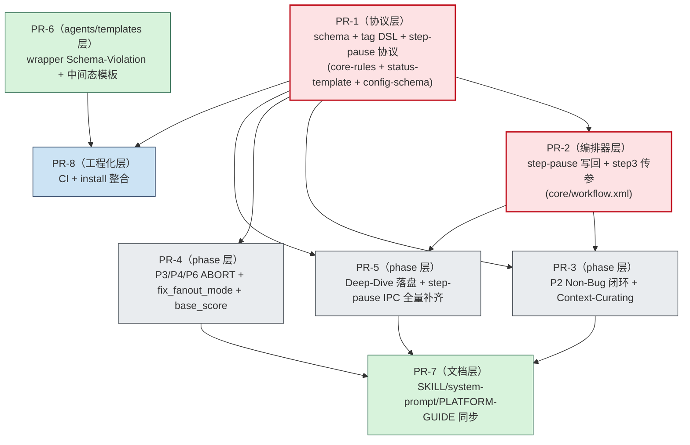

# Mobile B2C 质量工作流 — 施工文档（v4.1 修订版）

> **状态**：📐 **大纲 v1.0（已吸收 [QUALITY-AUDIT-CONSTRUCTION-PLAN-REVIEW-2026-04-20.md](./QUALITY-AUDIT-CONSTRUCTION-PLAN-REVIEW-2026-04-20.md) 全部 6 项 review）**
> **唯一上游输入**：[`QUALITY-AUDIT-REPORT-v1.2.1.md`](./QUALITY-AUDIT-REPORT-v1.2.1.md)
> **施工目标版本**：`v4.1`（小迭代，不破坏现有 schema_version=3 旧会话）
> **预算上限**：**≤ 5.2 人日**（方案 A 简化后实际约 4.8d，留 0.4d buffer）
> **撰写日期**：2026-04-20
> **本文性质**：施工蓝图 + 文件级 diff 对照 + DoD + 迁移脚本 + 回滚预案

## v1.0 修订摘要（v0.1 → v1.0，吸收第一轮 review）

> 本版本吸收 [QUALITY-AUDIT-CONSTRUCTION-PLAN-REVIEW-2026-04-20.md](./QUALITY-AUDIT-CONSTRUCTION-PLAN-REVIEW-2026-04-20.md) 的全部 6 项裁定（4 全采纳 + 2 部分采纳）：

| # | v0.1 中的问题 | v1.0 处理 |
|---|---|---|
| P0-1 | 范围与 Out-of-Scope 硬冲突（M16 自相矛盾、"9 条" vs PR-6/7/8） | **重写 §1 双口径**：明确"9 条主修复条目" + "5 项配套工程化包装"；M16 / m1 / C2 wrapper / C9 template / 文档对齐显式归到"配套包装"区，从 Out-of-Scope 中剔除 |
| P0-2 | `current_phase_result` 错误规划为 status schema 字段（与编排器运行时变量语义冲突） | **采纳方案 A**：保持 `current_phase_result` 为运行时变量；PR-1 不再写入 `workflow-status-template.yaml`；PR-2 删除"非 CONTINUE/ABORT 兜底"分支；迁移脚本 §6.1 删除该字段注入 |
| P0-3 | step-pause 写回缺可执行协议（仅有 `result_field` 命名，无解析规则） | **PR-1 增 `<input-protocol>` 子规则**：定义"`<key>=<value>` + 白名单 + parse-error 重提" 三要素，确保编排器无需 LLM 猜测即可结构化写回 |
| P1-4 | tag 白名单边界未澄清（仅修 `<task>` 是否覆盖完整？） | **不扩大 C1 改动面**：PR-1 显式写入边界声明—— `<supported-tags>` 仅约束 `<flow>`/`<task>` 内部 DSL；元数据结构标签（`<core-rules>`/`<llm>`/`<mandate>` 等）不受管控 |
| P1-5 | Deep-Dive 落盘键名体系未对齐（`emit_*` vs `deep_dive_optional_artifacts.*` 长期漂移） | **PR-5 仅修 B3 表层**（默认翻 true + 主子同步）；**主→子键名映射统一登记为 v4.2 遗留**（关联 M9），写入 §1.2 显式遗留清单 |
| P1-6 | DoD/迁移/回滚未按 PR 层级收敛 | **每个 PR 增"层级"标签**（协议层 / 编排器层 / phase 层 / agents-templates 层 / 文档层 / 工程化层），明确合入顺序优先级 |

> **未变更内容**：v0.1 的整体 7 章结构、8 PR 切分、依赖拓扑、§4 占位、§5 三层 DoD、§6 迁移脚本五段式、§7 八段回滚均保留。

---

## 0. 文档使用说明（Reading Guide）

- **本文档为"工程施工蓝图"**，不重复审计结论；任何缺陷描述均回链 v1.2.1 对应章节锚点。
- 每个 PR 段落遵循统一骨架：**层级 → 目标 → 修复条目 → 涉及文件 → 工作量 → 评审重点**；详细 diff 在 §4 展开。
- 大纲阶段（v1.0）冻结**结构、PR 切分、依赖拓扑、协议契约、覆盖矩阵**；PR 内容（diff/迁移脚本细节）在用户确认 v1.0 后逐 PR 填充。
- 编号约定：`B1*/B2/B3` = Blocker；`C1/C2/C5/C9/C10/C11` = Critical（v1.2.1 第七章"立刻修复"9 条）；`M16/m1` = 配套工程化包装。
- **协议层关键决定（v1.0 拍板）**：
  - `current_phase_result` = **运行时变量**（方案 A，不持久化到 status template）
  - step-pause 用户回复 = **`<key>=<value>` + 白名单结构化解析**（详见 §3 PR-1）
  - tag 白名单边界 = **仅 `<flow>`/`<task>` 内 DSL**（元数据标签不受管控）

---

## 1. 改造范围与 Out-of-Scope

### 1.1 In-Scope（v4.1 主修复 9 条 + 配套工程化包装 5 项）

#### 1.1.1 主修复条目（9 条 Blocker / Critical，共 3.4d）

| 缺陷 ID | 简述 | v1.2.1 锚点 | 工作量 | 归属 PR |
|---|---|---|---|---|
| B1* | Phase 早退 = ABORT 强协议（运行时变量赋值） | §三 B1\* / §七 #1 | 0.7d | PR-1 + PR-3 + PR-4 |
| B2 | P2 Non-Bug 闭环回填 | §三 B2 / §七 #2 | 0.3d | PR-3 |
| B3 | Deep-Dive F1/F2/F3 默认落盘 | §三 B3 / §七 #3 | 0.2d | PR-5 |
| C1 | `<task>` 标签纳入 supported-tags（含边界声明） | §三 C1 / §七 #4 | 0.1d | PR-1 |
| C2 | 共享基座 base_score / confidence_input 注入 | §三 C2 / §七 #5 | 0.5d | PR-4 |
| C5 | 状态枚举单一权威源扩展 | §三 C5 / §七 #6 | 0.4d | PR-1 |
| C9 | P6 失败分支必输出 verification-report | §三 C9 / §七 #7 | 0.2d | PR-4 |
| C10 | P4 字段隔离（`fix_fanout_mode` 新增 + `rca_fanout_mode_snapshot` 快照） | §三 C10 / §七 #8 | 0.4d | PR-1 + PR-4 |
| C11 | step-pause `result_field` + `<input-protocol>` 协议 + 全部点位补齐 | §三 C11 / §七 #9 | 0.6d | PR-1 + PR-3 + PR-5 |
| **小计** | | | **3.4d** | |

#### 1.1.2 配套工程化包装（5 项，共 1.4d，**为 §5.2 DoD 用例可执行所必需**）

> 这些条目在 v1.2.1 §七的不同位置（部分 Major、部分 Minor、部分 §十 #10），但**没有它们就无法构造 §5 验证用例**或会立即引入回归风险，因此一并纳入。

| 配套条目 | 简述 | v1.2.1 锚点 | 工作量 | 归属 PR |
|---|---|---|---|---|
| M16（最小子集） | `config_source` 键漂移检测：PR-1 引入 `config-schema.yaml` + PR-8 CI 校验 | §三 M16 | 0.3d | PR-1 + PR-8 |
| C2-wrapper | shared-arbiter-base / shared-challenger-base 缺参时输出 `[Schema-Violation]`（C2 修复的 wrapper 端实现） | §三 C2 Fix Sketch | 0.3d | PR-6 |
| C9-template | `templates/verification-report.md` 增"中间态报告"段（C9 模板侧） | §三 C9 Fix Sketch | 0.2d | PR-6 |
| m1 | install.sh 与 install_trae.sh 合并为 `install.sh --target=...` | §三 m1 / §十 #10 | 0.2d | PR-8 |
| 文档/入口同步 | SKILL.md / system-prompt.md / PLATFORM-GUIDE.md 字段表追平新 schema（**仅同步本次涉及字段，不解决 C8 全量**） | §三 C8 关联面 | 0.4d | PR-7 |
| **小计** | | | **1.4d** | |

#### 1.1.3 总预算核对

| 类别 | 工作量 |
|---|---|
| 主修复 9 条 | 3.4d |
| 配套工程化包装 5 项 | 1.4d |
| **合计** | **4.8d** |
| 5.2d 预算 buffer | **0.4d** |

> **方案 A 简化的红利**：v0.1 因把 `current_phase_result` 错误规划为持久化字段，PR-1/PR-2/迁移脚本均承担了不必要的工作；v1.0 采纳方案 A 后实际工作量降至 4.8d，**留 0.4d buffer 应对 §4 详细施工时的未知项**。

### 1.2 Out-of-Scope（明确不在本次施工内）

> 以下条目延后到 v4.2 或更远迭代，本 PR 链路**禁止顺手改动**，避免 5.2d 失控：

#### 1.2.1 v1.2.1 §七 中的延后项

- **本月内（Major 治理，v1.2.1 §七 第二段 #10–#19，已完整保留延后）**：M17 wrapper dimension 漂移（前瞻）、M3/M4/M6/M7/M8/M9/M10/M11/M12/M13/M14/M15 等 Major 修复
  - 注：M16 已部分纳入（最小子集），但 M16 的"全量 schema CI"仍延后（v1.2.1 §七 #20）
- **中期演进（Minor + 工程化，v1.2.1 §七 第三段 #20–#24）**：schema 一致性 CI 全量化、版本号统一为 SemVer、Skills 镜像源同步、deep-dive legacy 角色迁移
- **C3 → M17 已降级条目**：Deep-Dive 主路径未触发，本次不动
- **C4（coder-agent `Merged` 枚举漂移）/ C6（arbitrate_round_count 缺失）/ C7（non-code-fix 产物）/ C8（三处文档不一致全量）**：v1.2.1 §七 列入立刻修复但用户确认本次仅做 9 条，C4/C6/C7/C8 顺延到 v4.2
- **B1\* 的 Deep-Dive 子工作流 ABORT 协议**：v1.2.1 §三 B1\* 明确"另作独立审视（见 M9）"，本次不覆盖

#### 1.2.2 v1.0 新增遗留登记（吸收 review P1-5）

- **【v4.2 遗留 #1】主→子配置键名映射统一**：主 `default-config.yaml` 用 `deep_dive_optional_artifacts.*`，子 `functionality-deep-dive/core/default-config.yaml` 用 `emit_*`，两套开关命名长期漂移。本次 PR-5 仅做 B3 表层修复（默认值翻 true + 双向同步对齐当前键集），**键名体系统一映射机制延后**，关联 M9（主→子参数隔离）。
- **【v4.2 遗留 #2】tag 白名单全量校验**：v1.0 仅声明边界（`<flow>`/`<task>` 内），元数据标签是否需要独立白名单未做。

> 🚧 **凡不在 §1.1 表中的修改一律拒绝合并**，由 PR Reviewer 把关。

---

## 2. 依赖拓扑图（Mermaid）

> 表达 PR 之间的"必须先于"关系。同一并行带（rank）内的 PR 可并行开发与评审。



### 2.1 拓扑约束说明（v1.0 调整）

- **PR-1 是协议层基石**：所有引用 `<step-pause result_field=...>`、`<task>` 白名单、`fix_fanout_mode` / `phase_history` / `user_inputs` 等新协议元素的 PR 都必须等 PR-1 合入主干后再 rebase。
- **PR-2 不再是 PR-4 的强前置**（v0.1 → v1.0 调整）：方案 A 下 `current_phase_result` 为运行时变量，phase 内的 `<action>设置 current_phase_result = ABORT</action>` 与编排器现有 step 4 契约**已经天然兼容**，PR-4 可以在 PR-2 未合入时也安全合入。但 PR-2 必须先于 PR-3/PR-5（因为它实现了 step-pause 用户回复写回 `user_inputs` 的编排器侧逻辑）。
- **PR-3/4/5 可并行开发**（基于 PR-1+PR-2 base），合入顺序建议 **PR-4 → PR-3 → PR-5**（先 ABORT 协议主链路，再 Non-Bug 闭环，最后 Deep-Dive，与 review §1.2 推荐一致）。
- **PR-7 是聚合派生**：等 PR-3/4/5 全部合入后再 rebase 同步入口文档，避免重复 review。
- **PR-6 与 PR-1~5 无字段依赖**，可独立开发；与 PR-8 顺序耦合（PR-8 的 CI 检测需要 PR-6 完成的双源收敛后才不会大量误报）。
- **PR-8 是收尾**：所有上游 PR 落定后再开 CI gate，避免 CI 在过渡期持续红灯。

---

## 3. PR 切分方案（8 PR 总览）

> 每个 PR 一段：**层级 → 目标 → 修复条目 → 涉及文件 → 工作量 → 评审重点**。详细 diff 在 §4 展开。

### PR-1 · schema 协议层

- **层级**：🔴 协议层（最优先合入）
- **目标**：把所有"新字段、新枚举、新参数、step-pause 写回协议"的 schema 与 DSL 定义一次落地，作为后续所有 PR 的契约基石。
- **覆盖修复条目**：B1\*（协议层规则定义，**不修改 status template**）、C1（`<task>` + 边界声明）、C5、C10（字段定义部分）、C11（`<step-pause>` + `<input-protocol>`）、M16（config-schema 引入）
- **涉及文件**（4 个，其中 1 个新增）：
  - `core/core-rules.xml`（修改）：
    - `<supported-tags>` 增 `<task>`
    - `<supported-tags>` 增加边界声明注释（**v1.0 新增**）：`<!-- 本白名单仅约束 <flow>/<task> 内部的工作流执行 DSL；core-rules.xml 自身的元数据结构标签如 <llm>/<mandate>/<agent-taxonomy>/<human-review-protocol>/<trigger>/<output-format> 不在 LLM 解析校验范围内 -->`
    - `<step-pause>` 增 `result_field` 必填参数（C11 规范侧）
    - `<step-pause>` 新增 `<input-protocol>` 子规则（**v1.0 新增**）：定义用户回复必须以 `<key>=<value>` 开头、`<value>` 必须在 `[allowed_values=...]` 白名单内、解析失败时编排器重新触发同一 step-pause 并打印 `[parse-error]`
    - 新增 `<workflow-result-protocol>` 章节：明确 `current_phase_result` **是 phase 执行期的运行时变量**（不入 status schema），phase 早退必须通过 `<action>设置 current_phase_result = ABORT</action>` 在返回编排器前显式赋值
  - `core/workflow-status-template.yaml`（修改）：
    - 增 `fix_fanout_mode: null`（C10 字段隔离）
    - 增 `phase_history: []`（B1\* / C10 兼容性方案 A 依赖）
    - 增 `rca_fanout_mode_snapshot: null`（C10 兼容性方案 B 双保险）
    - 增 `user_inputs: {}` 命名空间（C11 step-pause 写回容器）
    - `current_state` 合法枚举集扩展注释：明确包含 `Context-Curating` / `Curation-Failed` / `Boundary-Refined` / `Fix-Implementing` / `Verifying`（C5）
    - **❌ 不增加 `current_phase_result` 字段**（v1.0 方案 A 决定）
  - `core/config-schema.yaml`（**新增**）：`config_source` 单一权威源 schema，声明所有合法 `output_*` 键名（M16 最小子集）
  - `core/default-config.yaml`（修改）：补齐 `output_curation_report` 等缺失键
- **工作量**：0.7d（v0.1 为 0.6d，因新增 `<input-protocol>` 子规则定义 +0.1d；但因不再写 `current_phase_result` 字段抵消，实际净持平）
- **评审重点**：
  - `<input-protocol>` 是否能让编排器无 LLM 推断地完成解析（白名单与 `<option>` 的 key 是否一一对应）
  - `current_state` 枚举是否覆盖 v1.2.1 §三 C5 列出的全部新值
  - `<task>` 边界声明是否清楚（避免后续 reviewer 追问"那 `<llm>` 怎么不入白名单"）

---

### PR-2 · 编排器适配（step-pause 写回 + 调用传参）

- **层级**：🔴 编排器层（紧随 PR-1）
- **目标**：让 `core/workflow.xml` 能"识别并消费" PR-1 引入的 step-pause 协议（解析用户回复 → 写回 `user_inputs.<key>`）；附带 step 3 调用 phases 时显式传参（与 v1.2.1 m9 关联，但**仅做 step 3 改动一处**）。
- **覆盖修复条目**：C11（编排器侧实现 step-pause 恢复后的写回）、附带 m9 part of step 3
- **涉及文件**（1 个）：
  - `core/workflow.xml`（修改）：
    - **❌ 不修改 step 4 的 ABORT 分支**（v1.0 方案 A 决定：现有 `if {current_phase_result} == ABORT` 逻辑天然兼容运行时变量赋值，无需新增"非 CONTINUE/ABORT 兜底"分支）
    - 在 step 4 的 step-pause 恢复路径新增 `<action>解析用户回复首行 <key>=<value>，校验 value ∈ allowed_values，写入 workflow_status.user_inputs.{key}；失败则重新触发同一 step-pause</action>`
    - step 3 调用 phases 的 `<load>` 显式传 `{issue_id}` / `{workflow_status}` 路径（顺手修 m9 中的 step 3 部分）
- **工作量**：0.2d（v0.1 为 0.3d，因方案 A 删除 step 4 兜底分支 -0.1d）
- **评审重点**：step-pause 恢复路径与 PR-1 的 `<input-protocol>` 是否完全对齐；`user_inputs` 写入是否带时间戳/序号防覆盖。

---

### PR-3 · P2 闭环（Non-Bug + Context-Curating）

- **层级**：🟠 phase 层
- **目标**：补齐 `phases/p2-spec-definition.md` 的 Non-Bug 反流闭环 + Context-Curating 状态机；补 P2 隐式 step-pause 处的 ABORT 标记（B1\* P2 部分 = 1 处）。
- **覆盖修复条目**：B2、C5（Context-Curating / Curation-Failed 在 phases 内的写入实现）、B1\*（P2 隐式 step-pause 注入 ABORT 1 处）、C11（P2 step-pause 显式声明 `result_field=non_bug_user_choice` + 白名单）
- **涉及文件**（1 个）：
  - `phases/p2-spec-definition.md`（修改）：
    - 从 `system-prompt.md` 反向同步 Non-Bug step-pause + Accept/Reflow + 计数器闭环
    - step 4 Non-Bug 触发 step-pause 前插入 `<action>设置 current_phase_result = ABORT</action>`
    - step 7 写 `current_state ∈ {Context-Curating, Curation-Failed}` 时同步写 ABORT
    - step-pause 标签按 PR-1 的 `<input-protocol>` 格式声明 `result_field=non_bug_user_choice` + `allowed_values=Accept|Reflow`
    - `non_bug_reflow_count > 2 → Human-Review` 兜底
- **工作量**：0.4d
- **评审重点**：与 `system-prompt.md` 的 Phase 2 字段集逐字段对齐；P2 step-pause 的 `<key>=<value>` 白名单是否枚举完整。

---

### PR-4 · P3/P4/P6 ABORT 与字段隔离

- **层级**：🟠 phase 层
- **目标**：完成 B1\* 主体（P3 ×4 + P6 ×1 共 5 处显式 ABORT 标记）+ C10 字段隔离 + C9 失败分支产物 + C2 base_score/confidence_input 注入。
- **覆盖修复条目**：B1\*（P3/P6 显式 ABORT 5 处）、C2（调用方注入侧）、C9（phase 侧补 template-output）、C10（fix_fanout_mode 重命名 + snapshot 写入）
- **涉及文件**（3 个）：
  - `phases/p3-root-cause.md`（修改）：
    - 4 处 `阶段结束，返回编排器`（L29 / L64 / L101 / L150）前各插入 `<action>设置 current_phase_result = ABORT</action>`
    - step 7 新增 `<action>更新 {workflow_status}：rca_fanout_mode_snapshot = {fanout_mode}</action>`（C10 兼容性方案 B 快照）
    - 同 step 7 增加 `<action>更新 {workflow_status}.phase_history：append {phase: P3, fanout_mode, timestamp}</action>`（C10 兼容性方案 A 主路径）
    - 调用 investigator/challenger/arbiter 的 subagent_prompt 拼接 `base_score = {上游 final_score 列表}`（C2 调用方注入侧）
  - `phases/p4-fix-design.md`（修改）：
    - 把 `fanout_mode = {fix_strategy_mode}` 与 `fanout_mode = contested-arbitrated` 全部改为 `fix_fanout_mode = ...`（**强制阶段间字段隔离**）
    - 调用 fix-proposer/challenger/arbiter 的 subagent_prompt 拼接 `confidence_input`
  - `phases/p6-verification.md`（修改）：
    - 1 处 `阶段结束，返回编排器`（L83）前插入 `<action>设置 current_phase_result = ABORT</action>`
    - 失败分支必先调用 `<template-output file="…/verification-report.md" template="templates/verification-report.md"/>` 生成"中间态"报告再回流（与 PR-6 模板侧配合）
- **工作量**：1.0d（B1\* 主体 0.6d + C2 0.2d + C9 0.1d + C10 0.1d）
- **评审重点**：5 处 ABORT 标记位置是否完整；`fanout_mode → fix_fanout_mode` 是否漏改；`phase_history` 与 `rca_fanout_mode_snapshot` 是否双写一致；C9 中间态报告字段是否充分。

---

### PR-5 · Deep-Dive 落盘 + 主链路其余 step-pause IPC

- **层级**：🟠 phase 层
- **目标**：B3 默认产物落盘（仅表层修复）+ C11 在 Deep-Dive 与主链路其他 step-pause 点位的全量补齐。
- **覆盖修复条目**：B3（**仅默认值翻 true + 主子双向同步**，键名体系统一遗留 v4.2）、C11（除 P2 之外的全部 step-pause 点位）
- **涉及文件**（预估 4-6 个，详细清单待 §4.5 grep 后填充）：
  - `functionality-deep-dive/core/default-config.yaml`（修改）：`emit_topology_report` / `emit_concurrency_report` / `emit_environment_factor_report` 默认值翻为 true
  - `core/default-config.yaml`（修改）：同步 `deep_dive_optional_artifacts` 块，确保主→子翻转后值一致；**附加注释**："本块与 deep-dive 子配置 emit_* 开关存在键名漂移，统一映射机制延后到 v4.2（关联 M9）"
  - `phases/p4-fix-design.md`（修改）：step 5 "是否进入修复实施" step-pause 增加 `result_field` + 白名单（按 PR-1 `<input-protocol>` 格式）
  - `functionality-deep-dive/phases/f4-isolation-debate.md`（修改）：F4 中断决策 step-pause 增加 `result_field` 声明
  - 其他 step-pause 点位（PR 开发时全量 grep `<step-pause` 后填充）
- **工作量**：0.7d（B3 0.2d + C11 剩余 0.5d）
- **评审重点**：B3 与 PR-1 的 config-schema.yaml 对应键是否一致；step-pause `result_field` 命名是否全部纳入 `workflow-status-template.yaml.user_inputs` 命名空间；**v4.2 遗留登记是否在 PR description 显式提及**。

---

### PR-6 · agents/templates 治理（仅 9 条修复必需子集）

- **层级**：🟡 agents/templates 层（与 PR-3/4/5 解耦，可独立开发）
- **目标**：聚合 9 条修复在 agents/templates 端的实现，**严格不超出 9 条修复链路**。
- **覆盖修复条目**：C2-wrapper（wrapper 校验 `[Schema-Violation]` 输出实现）、C9-template（templates/verification-report.md 增"中间态"段）
- **涉及文件**（3 个）：
  - `agents/shared-arbiter-base.md`（修改）：缺 `base_score` 时输出 `[Schema-Violation: missing base_score]` 并停止推理
  - `agents/shared-challenger-base.md`（修改）：缺 `confidence_input` 时输出 `[Schema-Violation: missing confidence_input]` 并停止推理
  - `templates/verification-report.md`（修改）：新增"中间态报告（失败回流时使用）"段，含 `failure_classification` / `evidence` / `repro_path` 三必填字段
- **工作量**：0.5d
- **评审重点**：M5/M11/M14/M15 等 Major 治理**仅做与 9 条修复直接联动的最小子集**，其余 Major 顺延 v4.2，PR description 必须显式列出"未做的 Major 项及理由"。

---

### PR-7 · 文档/入口对齐

- **层级**：🟢 文档层（最后合入）
- **目标**：把 PR-1~5 引入的新字段、新协议、新枚举同步到三处入口文档。**仅同步本次涉及字段，不解决 C8 全量**。
- **覆盖修复条目**：与 9 条修复联动的入口同步（C8 关联面）
- **涉及文件**（3 个）：
  - `SKILL.md`（修改）：字段说明同步新增 `fix_fanout_mode` / `phase_history` / `user_inputs`（**❌ 不含 `current_phase_result`，因为它不是持久化字段**）
  - `system-prompt.md`（修改）：状态机图补 `Context-Curating` / `Curation-Failed`；step-pause 描述同步 `<input-protocol>` 协议
  - `PLATFORM-GUIDE.md`（修改）：最少持久化字段列表从 7 个扩展到覆盖新字段集（不含 `current_phase_result`）
- **工作量**：0.4d
- **评审重点**：三处入口的字段表是否与 `core/workflow-status-template.yaml` 完全一致；**特别强调：`current_phase_result` 不应出现在任何持久化字段表中**（避免重蹈 v0.1 设计偏差）。

---

### PR-8 · CI + install 整合

- **层级**：🟢 工程化层（收尾）
- **目标**：建立"protect against regression"的最小 CI 守门 + install 脚本合并。
- **覆盖修复条目**：M16-CI（config_source 键漂移检测）、m1（install 脚本合并）—— **属于 v1.2.1 §七 #10 的最小子集，不做 §七 #20 的全量 schema CI**
- **涉及文件**（预估 4 个，其中 2-3 个新增）：
  - `install.sh`（修改）：合并 `install_trae.sh` 为 `install.sh --target=cursor|trae|both`
  - `install_trae.sh`（处理方式：**改为 shim** `exec install.sh --target=trae "$@"`，保留向后兼容；**待用户在附录 B #5 拍板**）
  - `.github/workflows/qa-workflow-schema-check.yml`（**新增**或对应仓库 CI 配置）
  - `scripts/check-config-schema.sh`（**新增**：扫描 phases 中"更新 config_source"动作，校验键名在 `core/config-schema.yaml` 中存在）
- **工作量**：0.4d
- **评审重点**：CI 必须 `fail-fast` 但不应阻塞 v4.1 之前的旧分支；install shim 是否保持向后兼容（旧 `bash install_trae.sh` 调用仍成功）。

---

## 4. 每个 PR 的详细施工单（文件级 "原文→新文" diff 对照）

> ⚠️ **本节为占位结构，待大纲 v1.0 确认后逐 PR 填充**。每个 PR 的施工单遵循统一骨架：

### 4.x 通用骨架

```
4.x.1 PR 元信息
  - 分支命名：feat/qa-workflow-v4.1-pr{N}-{slug}
  - Base：main（或上游 PR 合入后的 main）
  - 层级：协议层 / 编排器层 / phase 层 / agents-templates 层 / 文档层 / 工程化层
  - Reviewer：…
  - 关联 issue：…

4.x.2 文件级 diff 列表
  - 文件 A：
    - 修改类型：[新增 | 修改 | 删除 | 重命名]
    - 修复条目锚点：[B1*/C10/...]
    - 原文（含行号 LINE_NUMBER|CONTENT）：…
    - 新文：…
    - 修订理由：…
    - 兼容性影响：…
  - 文件 B：…

4.x.3 PR-level DoD 子集（链接到 §5）
4.x.4 PR-level 回滚动作（链接到 §7）
```

### 4.1 PR-1 详细施工单（待填充）
### 4.2 PR-2 详细施工单（待填充）
### 4.3 PR-3 详细施工单（待填充）
### 4.4 PR-4 详细施工单（待填充）
### 4.5 PR-5 详细施工单（待填充）
### 4.6 PR-6 详细施工单（待填充）
### 4.7 PR-7 详细施工单（待填充）
### 4.8 PR-8 详细施工单（待填充）

---

## 5. 验证标准（Definition of Done）

> 三层验证：**静态契约校验** → **动态用例（手工 + LLM 重放）** → **回归矩阵**。每个 PR 的 DoD 必须在 PR description 勾选完成。

### 5.1 静态契约校验（每个 PR 必跑）

> v1.0 调整：删除"`current_phase_result` 字段在 status template 中存在"误项；新增 step-pause 输入协议契约。

- [ ] **Schema 自洽**：`core/workflow-status-template.yaml` 中所有 `current_state` 取值必须在 `core-rules.xml` 或 schema 注释中定义；反之亦然
- [ ] **配置键名注册**：所有 phases 中"更新 config_source"动作的键，必须在 `core/config-schema.yaml` 中存在（PR-8 CI 强制）
- [ ] **标签白名单**：所有 `<flow>`/`<task>` 内部使用的 DSL 标签必须在 `core-rules.xml` `<supported-tags>` 中（含 `<task>` 自身）；元数据结构标签（`<llm>`/`<mandate>` 等）不在校验范围（v1.0 边界声明）
- [ ] **字段隔离**：grep `fanout_mode` 不应在 P4/P5/P6 出现（仅允许 `rca_fanout_mode` / `fix_fanout_mode` / `rca_fanout_mode_snapshot` / `phase_history` 内部字段）
- [ ] **ABORT 标记完整**：`phases/p{2,3,6}-*.md` 中每个早退点位前必须有 `<action>设置 current_phase_result = ABORT</action>` 显式语句（**注意**：`current_phase_result` 是运行时变量，不入 status template，CI 仅 grep phase 文件，不校验 status 文件）
- [ ] **step-pause 输入协议完整**（**v1.0 新增**）：所有 `<step-pause>` 标签必须显式声明 `result_field=<key>` 与 `allowed_values=<v1>|<v2>|...`；`<key>` 必须出现在 `workflow-status-template.yaml.user_inputs` 命名空间或被 PR-1 `<input-protocol>` 文档化为合法 user_input key
- [ ] **持久化字段表纯净性**（**v1.0 新增**）：`SKILL.md` / `system-prompt.md` / `PLATFORM-GUIDE.md` 的"最少持久化字段"列表中**不得包含** `current_phase_result`（防止文档误导工程师以为它是 schema 字段）

### 5.2 动态用例（关键回归路径）

> 用 LLM 重放器执行下列脚本，断言 `workflow-status.yaml` 终态字段集合 + 运行时变量行为：

#### 5.2.1 用例 A · B1\* P3 RCA 低置信回流
- **输入**：模拟 P3 RCA 置信度 < 0.6
- **期望**：phase 内显式 `current_phase_result = ABORT`（运行时变量，可在 LLM 输出中 grep 验证）→ 编排器 step 4 不追加 `qa-root-cause` 到 `stepsCompleted`；最终 `current_state = RCA-LowConfidence`、`stepsCompleted` 不包含 `qa-root-cause`
- **失败模式**：若 `stepsCompleted` 包含 `qa-root-cause`，B1\* 未修复

#### 5.2.2 用例 B · B2 P2 Non-Bug 反流
- **输入**：模拟 P2 判定 Working-As-Designed
- **期望**：触发 step-pause（输出含 `[result_field=non_bug_user_choice]` 与 `[allowed_values=Accept|Reflow]`）；用户回复 `non_bug_user_choice=Reflow` → 编排器写入 `workflow_status.user_inputs.non_bug_user_choice = Reflow`；`non_bug_reflow_count = 1`；连续 3 次后触发 Human-Review

#### 5.2.3 用例 C · C10 P3→P4→P6→P3 字段污染
- **输入**：完整 P3→P4→P6 失败回流到 P3 链路
- **期望**：P3 重入时读到的 `rca_fanout_mode` 与 P3 完成时一致（通过 `phase_history`/`rca_fanout_mode_snapshot` 还原）；`fix_fanout_mode` 字段独立可见
- **失败模式**：若 P3 重入时升级判断 switch 落入 default 分支，C10 未修复

#### 5.2.4 用例 D · C11 step-pause 写回（**v1.0 强化**）
- **输入**：P2 / P4 / F4 各一处 step-pause 触发
- **期望**：
  1. step-pause 输出包含 `[result_field=...]` 与 `[allowed_values=...]` 标签
  2. 用户合法回复（`<key>=<value>`，value 在白名单内）→ 编排器写入 `workflow_status.user_inputs.<key>`
  3. 用户非法回复（value 不在白名单 / 缺 key=value 格式）→ 编排器输出 `[parse-error]` 并重新触发同一 step-pause
- **失败模式**：用户非法回复时编排器静默丢弃或自行编造

#### 5.2.5 用例 E · B3 Deep-Dive 落盘
- **输入**：触发 Deep-Dive F1→F2→F3→F4 链路
- **期望**：`topology_report.md` / `concurrency_report.md` / `environment_factor_report.md` 三个文件物理存在，F4 入参可读取

#### 5.2.6 用例 F · C9 P6 失败分支产物
- **输入**：P6 验证失败
- **期望**：`verification-report.md` 物理存在，且包含 `failure_classification` / `evidence` / `repro_path` 三字段

### 5.3 回归矩阵（兼容性守门）

> v1.0 调整：删除"无 `current_phase_result` 字段"行（该字段不入 schema，无需迁移）。

| 场景 | 旧 schema_version=3 会话 | 新 schema_version=4 会话 |
|---|---|---|
| 启动新 issue | N/A | 必须使用新协议字段（`fix_fanout_mode` / `phase_history` / `user_inputs` / `rca_fanout_mode_snapshot`） |
| 恢复存量会话（无 `phase_history`） | 迁移脚本 §6 补齐为 `[]` | N/A |
| 恢复存量会话（无 `user_inputs`） | 迁移脚本 §6 补齐为 `{}` | N/A |
| 旧 `fanout_mode` 写法（值在 RCA 集 ∪ Fix 集中） | 迁移脚本 §6 拆分到 `rca_fanout_mode` / `fix_fanout_mode` | 拒绝（CI 报错） |
| 旧会话恢复时 phase 内 ABORT 行为 | 旧会话首次进入 phase 即被 v4.1 的早退逻辑接管，无需迁移（运行时变量天然按 phase 实例隔离） | N/A |

---

## 6. 会话迁移脚本（`migrate-workflow-status-v3-to-v4.py`）

### 6.1 脚本职责（v1.0 简化：删除 `current_phase_result` 注入）

把 `schema_version: 3` 的存量 `workflow-status.yaml` 升级到 `schema_version: 4`，覆盖：

1. 注入新字段：`phase_history: []` / `rca_fanout_mode_snapshot: null` / `user_inputs: {}` / `fix_fanout_mode: null`
   （**v1.0 删除 `current_phase_result: null` 注入**：方案 A 决定该字段为运行时变量，不入 schema）
2. 拆分 `fanout_mode`：根据 `current_state` 与 `fanout_mode` 取值映射到 `rca_fanout_mode` 或 `fix_fanout_mode`（详见 §6.3 决策表）
3. 修复 `stepsCompleted` 失锚：若 `current_state ∈ {Info-Insufficient, Spec-Uncertain, Non-Bug, RCA-LowConfidence, Curation-Failed, Boundary-Refined, Human-Review}` 则剥离 `stepsCompleted` 末尾一项（B1\* Compatibility 章节）
4. `config_source` 非法键转写到 `extras.*` 命名空间（M16 Compatibility）
5. 更新 `schema_version: 3 → 4`

### 6.2 接口契约

```bash
python3 scripts/migrate-workflow-status-v3-to-v4.py \
    --input <path>/workflow-status.yaml \
    [--output <path>/workflow-status.yaml] \
    [--dry-run] \
    [--verbose] \
    [--strict | --best-effort]

# 退出码：
#   0 = 迁移成功（或 dry-run 无需迁移）
#   1 = 迁移失败（IO/解析错误）
#   2 = 迁移完成但需人工核验（如 fanout_mode 无法可靠还原 rca_fanout_mode_snapshot）
#   3 = strict 模式下检测到不可迁移字段
```

### 6.3 关键决策表（fanout_mode 拆分，对应 v1.2.1 C10 方案 A/B/C）

| 当前状态 | `fanout_mode` 取值 | 决策 | 来源 |
|---|---|---|---|
| `current_state ∈ {RCA-*}` | `simple-single` / `medium-challenge` / `complex-arbitrated` | 直接迁移到 `rca_fanout_mode` | 方案 A 直接判定 |
| `current_state ∈ {Fix-Designing, Fix-Implementing, Verifying}` | `single-proposer` / `challenged-proposer` / `contested-arbitrated` | 迁移到 `fix_fanout_mode`；同时尝试从 `phase_history` 中检索最近一次 P3 完成时的 RCA 值 → `rca_fanout_mode` | 方案 A（推荐） |
| 同上 | 同上 | 若 `phase_history` 为空且无 `rca_fanout_mode_snapshot` | 方案 C：标记 `_migration_warning: rca_fanout_mode_unrecoverable`，退出码 2 |
| `fanout_mode = contested-arbitrated` 且 `current_state` 含糊 | 歧义共名 | 强制走 `phase_history` 反推；查不到则退出码 2 | v1.2.1 §九 第 2 条 |

### 6.4 dry-run 输出格式（人类可读，v1.0 简化）

```
[DRY RUN] migrate-workflow-status-v3-to-v4
────────────────────────────────────────
Input : .qa/issue-XXX/workflow-status.yaml
Schema: 3 → 4

Field changes (will apply):
  + phase_history               : []
  + rca_fanout_mode_snapshot    : null
  + user_inputs                 : {}
  + fix_fanout_mode             : null
  ~ fanout_mode (single-proposer) → fix_fanout_mode (single-proposer)
  ⚠ rca_fanout_mode             : UNRECOVERABLE (需人工核验)
  ~ stepsCompleted              : [..., qa-root-cause] → [...]  (B1* 失锚修复)
  ~ schema_version              : 3 → 4

Note: current_phase_result 是 v4.1 引入的运行时变量（非 schema 字段），无需迁移注入。

Exit code (would be): 2
```

### 6.5 单元测试矩阵

| 测试用例 | 输入 fixture | 期望输出 |
|---|---|---|
| 全新 v3 文件、状态健康 | `tests/fixtures/v3-clean.yaml` | 退出码 0，新增字段全部 null/空（**不含 current_phase_result**） |
| `current_state = RCA-LowConfidence` 且 `stepsCompleted` 含 P3 | `tests/fixtures/v3-aborted-p3.yaml` | 剥离末尾，退出码 0 |
| `fanout_mode = single-proposer` 且 `phase_history` 含 P3 | `tests/fixtures/v3-fix-with-history.yaml` | 双字段拆分，退出码 0 |
| `fanout_mode = single-proposer` 但无 `phase_history` | `tests/fixtures/v3-fix-no-history.yaml` | 标记警告，退出码 2 |
| 文件不可解析 | `tests/fixtures/v3-malformed.yaml` | 退出码 1 |

---

## 7. 回滚预案（每个 PR 的 git revert 后状态描述）

> 每个 PR 都设计为 **`git revert <merge-commit>` 后系统返回到合理可用状态**，不留半成品。v1.0 调整：方案 A 后 PR-2 不再是 PR-4 的强前置，回滚链路依赖更弱。

### 7.1 PR-1 回滚

- **revert 后状态**：`core-rules.xml` 失去 `<task>` 白名单 + `<input-protocol>` 子规则；`workflow-status-template.yaml` 缺新字段 → 已合入的 PR-2/3/4/5 无法消费协议字段
- **风险等级**：🔴 高 — PR-1 是协议基石，**禁止单独 revert**；如需回滚必须连同 PR-2/3/4/5 一起 revert
- **建议操作**：若 PR-1 出现严重缺陷，走 **新 commit 修补**而非 revert
- **回滚 SQL**（伪代码）：`git revert <PR-5> <PR-4> <PR-3> <PR-2> <PR-1>` 顺序 revert 5 个 merge commit

### 7.2 PR-2 回滚

- **revert 后状态**：step-pause 用户回复无人写回 `user_inputs` → C11 实际失效；step 3 调用传参回退（m9 部分恢复）
- **风险等级**：🟡 中 — 已合入的 PR-3/4/5 中的 ABORT 标记**仍然生效**（运行时变量行为不依赖 PR-2，方案 A 红利）；只有 step-pause 写回失效
- **建议操作**：单独 revert 可行，但需通知用户 step-pause 后的回复将被忽略
- **回滚 SQL**：`git revert <PR-2-merge-commit>`

### 7.3 PR-3 回滚

- **revert 后状态**：`phases/p2-spec-definition.md` 回到 v1.2.1 描述的 Non-Bug 闭环缺失态；P2 隐式 step-pause 无 ABORT 标记
- **风险等级**：🟢 低 — Skill 平台 Non-Bug 路径回到"静默漏处理"（v1.2.1 B2 Failure Mode），但不影响其他链路
- **回滚 SQL**：`git revert <PR-3-merge-commit>`

### 7.4 PR-4 回滚

- **revert 后状态**：P3/P6 的 ABORT 标记 5 处全部消失 → B1\* 主链路根因复发；`fix_fanout_mode` 字段消失 → C10 字段污染复发；P6 失败分支不再产出 verification-report.md；`phase_history` / `rca_fanout_mode_snapshot` 不再被 P3 写入
- **风险等级**：🟡 中 — 影响面广但所有现象都是 v1.2.1 已识别的旧故障，工程团队可识别并定位
- **回滚 SQL**：`git revert <PR-4-merge-commit>`，并通知存量会话使用迁移脚本回退（**注意：迁移脚本不支持 v4→v3 反向迁移**，需手工或恢复备份）

### 7.5 PR-5 回滚

- **revert 后状态**：Deep-Dive 默认产物落盘关闭 → F4 输入再次丢失（B3 复发）；其他 step-pause 点位 result_field 缺失
- **风险等级**：🟢 低 — Deep-Dive 调用频率较低，影响可控
- **回滚 SQL**：`git revert <PR-5-merge-commit>`

### 7.6 PR-6 回滚

- **revert 后状态**：wrapper 不再校验 `[Schema-Violation]`；templates/verification-report.md 失去"中间态"段
- **风险等级**：🟢 低 — 不破坏运行链路，只回到"双源维护"风险
- **回滚 SQL**：`git revert <PR-6-merge-commit>`

### 7.7 PR-7 回滚

- **revert 后状态**：SKILL.md / system-prompt.md / PLATFORM-GUIDE.md 字段表回到 v1.2.1 描述的不一致状态
- **风险等级**：🟢 低 — 仅文档漂移，不影响运行
- **回滚 SQL**：`git revert <PR-7-merge-commit>`

### 7.8 PR-8 回滚

- **revert 后状态**：CI schema 守门关闭，install 脚本回到双脚本维护
- **风险等级**：🟢 低 — 失去未来防漂移能力，但无运行时影响
- **回滚 SQL**：`git revert <PR-8-merge-commit>`

### 7.9 全链路灾难性回滚（极端情况）

> 若 v4.1 上线后出现不可控故障，按以下顺序快速回滚到 v4.0：

```bash
git revert <PR-8> <PR-7> <PR-6> <PR-5> <PR-4> <PR-3> <PR-2> <PR-1>
git push origin main
# 通知所有进行中会话停用 v4.1 schema_version=4 字段
# 备份 v4 schema 的 workflow-status.yaml 文件，等待修复后重新迁移
```

---

## 附录 A：v1.2.1 锚点对照表

| 本文档章节 | v1.2.1 来源章节 |
|---|---|
| §1.1.1 主修复条目 | v1.2.1 §七 立刻修复 #1–#9 |
| §1.1.2 配套工程化包装 | v1.2.1 §三 M16 / m1 + §七 #10 子集 + §三 C2/C9 Fix Sketch 的 wrapper/template 端 |
| §1.2 Out-of-Scope | v1.2.1 §七 本月内 #10–#19 + 中期演进 #20–#24 + v1.0 新增遗留登记 |
| §3 PR 切分（缺陷映射） | v1.2.1 §三 缺陷台账（B1\*/B2/B3/C1/C2/C5/C9/C10/C11） |
| §5.2 用例 A–F | v1.2.1 §三 各缺陷的 Repro 字段 |
| §6.3 fanout_mode 拆分决策表 | v1.2.1 §三 C10 Compatibility 方案 A/B/C |
| §7 回滚预案 | v1.2.1 §三 各缺陷的 Compatibility 字段 |

---

## 附录 B：未决问题清单（v1.0 更新）

> v1.0 已拍板的 3 项协议决定（方案 A / step-pause 输入协议 / tag 边界声明）从本清单移除，剩余 7 项待确认：

1. **PR-3/4/5 合入顺序**：建议 PR-4 → PR-3 → PR-5（先 ABORT 协议主链路，再 Non-Bug 闭环，最后 Deep-Dive）。是否采纳？
2. **C10 兼容性方案选择**：本大纲默认**方案 A 主路径（`phase_history`）+ 方案 B 兜底（`rca_fanout_mode_snapshot`）双保险**。是否需要再缩到只用方案 A？
3. **PR-6 Major 治理边界**：当前仅纳入 C2 wrapper 校验 + C9 中间态模板。是否需要把 M11/M14 也顺手做？（若做，工作量 +0.3d，吃光 0.4d buffer）
4. **CI 起点**：PR-8 是否在仓库根新建 `.github/workflows/`？（仓库当前是否已有 GitHub Actions？需要确认）
5. **install_trae.sh 处理方式**：删除 / 改为 shim（v1.0 暂定）/ 保留 + 弃用 warning。三选一。
6. **迁移脚本物理位置**：`mobile-qa-workflow/scripts/migrate-workflow-status-v3-to-v4.py` 还是 仓库根 `scripts/`？
7. **回滚链中 PR-1 的"禁止单独 revert"约束**：是否需要在 GitHub branch protection 里强制？

---

## 附录 C：v1.0 关键设计决定汇总（便于后续 PR 引用）

| 决定 | 内容 | 影响范围 |
|---|---|---|
| D1 · `current_phase_result` 语义 | **运行时变量**，不入 status template；phase 早退前显式 `<action>设置 current_phase_result = ABORT</action>`；编排器在同一执行轮次读取 | PR-1 不写字段 / PR-2 不写兜底 / 迁移脚本不注入 / PR-7 文档不列入持久化字段 |
| D2 · step-pause 输入协议 | 用户回复必须以 `<key>=<value>` 开头；`<value>` 在 `[allowed_values=...]` 白名单内；解析失败重新触发并打印 `[parse-error]` | PR-1 定义 `<input-protocol>` 子规则 / PR-2 实现解析与写回 / PR-3/5 phase 内的 step-pause 必须声明 `result_field` + `allowed_values` |
| D3 · tag 白名单边界 | `<supported-tags>` 仅约束 `<flow>`/`<task>` 内部 DSL；`core-rules.xml` 元数据标签不受管控 | PR-1 的 `<task>` 修复仅补一个标签 + 加边界注释 |
| D4 · Deep-Dive 键名映射 | 本次仅修 B3 表层（默认值翻 true + 主子双向同步）；键名体系统一（`emit_*` ↔ `deep_dive_optional_artifacts.*`）登记 v4.2 遗留 | PR-5 仅改默认值 / §1.2 显式登记 |
| D5 · 范围口径双层化 | "9 条主修复" + "5 项配套工程化包装"；M16/m1 显式归到配套 | §1.1 / §1.2 / 所有 PR Reviewer 评审一致基线 |
| D6 · PR 层级标签 | 协议层 / 编排器层 / phase 层 / agents-templates 层 / 文档层 / 工程化层 | §3 / 拓扑图 / 评审优先级排序 |

---

> **大纲版本**：v1.0（吸收 [QUALITY-AUDIT-CONSTRUCTION-PLAN-REVIEW-2026-04-20.md](./QUALITY-AUDIT-CONSTRUCTION-PLAN-REVIEW-2026-04-20.md) 全部 6 项裁定）
> **下一步**：等待用户对附录 B 7 项未决问题拍板（特别是 #1 PR 合入顺序、#5 install_trae.sh 处理方式、#6 迁移脚本位置），确认后逐 PR 展开 §4 详细施工单。
> **建议第一个展开的 PR**：**PR-1**（协议层），因为其余所有 PR 的字段名/标签/协议都依赖 PR-1 的定型。
