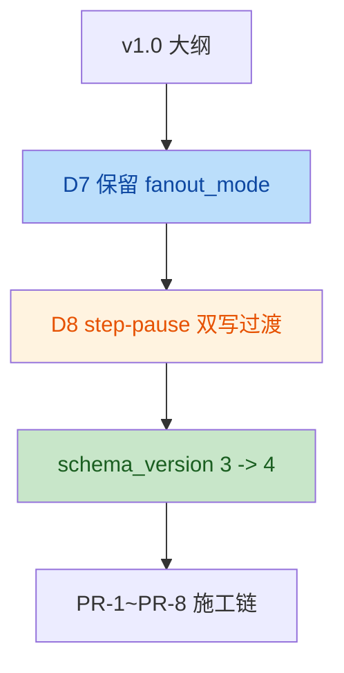
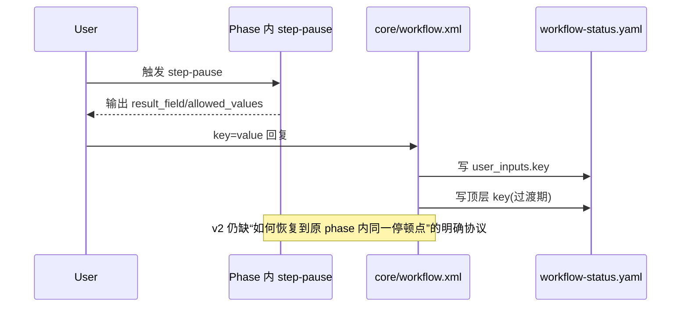

# Mobile B2C 质量工作流 — 施工文档 v2 质检报告

> 审阅对象：[`QUALITY-AUDIT-CONSTRUCTION-PLAN-v2.md`](./QUALITY-AUDIT-CONSTRUCTION-PLAN-v2.md)
>
> 审阅基线：
> - `mobile-qa-workflow/` 当前源码现状
> - [`QUALITY-AUDIT-CONSTRUCTION-PLAN-v1-REVIEW.md`](./QUALITY-AUDIT-CONSTRUCTION-PLAN-v1-REVIEW.md)
>
> 审阅日期：2026-04-20
> 
> 审阅结论：v2.0 已经显著优于 v1.0，P0-1 / P0-2 / P0-3 的主方向修正基本正确；但仍保留 **1 个高优先级协议缺口** 和 **2 个中高优先级 schema/落地一致性问题**，建议在展开 PR-1 前先修正文档。

---

## Intent

- 作者意图：在 v1.0 基础上，吸收第二轮 review，锁定 `fanout_mode` 命名口径、step-pause 双写过渡策略、`schema_version: 4` 升级动作，以及剩余未决事项，形成一份可直接按 PR 展开的施工蓝图。

---

## 变更总览

**协议流变化**

**运行链路影响点**

---

## Findings

| No. | Issue Title | Suggestion | Code Link |
|---|---|---|---|
| 1 | phase 内 step-pause 的跨回合恢复协议仍未建模，PR-2 只覆盖了 `core/workflow.xml` step 4 的恢复路径，无法保证 PR-3/PR-5 新增的 phase 内停顿点可以被同一套机制可靠恢复。 | 在 PR-1 或 PR-2 中补一个最小“pause context”协议：至少持久化 `paused_source_phase`、`paused_step_id`、`result_field`、`allowed_values`，并明确用户回复后由谁恢复到哪一个 phase/step。若不打算做通用恢复，则把 C11 作用域显式收窄到编排器 step 4 自身的 step-pause。 | [QUALITY-AUDIT-CONSTRUCTION-PLAN-v2.md:L232-257](file:///Users/bytedance/Code/loupe/mobile-qa-workflow/QUALITY-AUDIT-CONSTRUCTION-PLAN-v2.md#L232-L257) |
| 2 | PR-2 的双写策略按通用 `{key}` 无条件写 `workflow_status.{key}`，但 PR-1 只把 `non_bug_user_choice` 作为顶层镜像字段显式注册；后续若 P4/F4 等 step-pause 新增 key，会把未注册字段写进顶层 schema。 | 把 PR-2 的“同步镜像写入 workflow_status.{key}”改成“仅当 `<key>` 位于顶层镜像白名单时才写顶层”；白名单首版只含 `non_bug_user_choice`，其余一律只写 `user_inputs.*`。 | [QUALITY-AUDIT-CONSTRUCTION-PLAN-v2.md:L241-247](file:///Users/bytedance/Code/loupe/mobile-qa-workflow/QUALITY-AUDIT-CONSTRUCTION-PLAN-v2.md#L241-L247) |
| 3 | `allowed_values` 已被 PR-3 示例、DoD、CI 检查当成 `<step-pause>` 正式属性使用，但 PR-1 只明确给 `<step-pause>` 增加了 `result_field` 参数，没有把 `allowed_values` 明确加入 DSL 参数定义，规范和用法仍不完全闭合。 | 在 PR-1 的 `core/core-rules.xml` 修改清单中显式补一条：`<step-pause>` 参数增加 `allowed_values`；同时在 `<supported-tags>` 的参数表中把 `title/result_field/allowed_values/option` 一次定义完整。 | [QUALITY-AUDIT-CONSTRUCTION-PLAN-v2.md:L186-194](file:///Users/bytedance/Code/loupe/mobile-qa-workflow/QUALITY-AUDIT-CONSTRUCTION-PLAN-v2.md#L186-L194) |

---

## 详细说明

### 1. phase 内 step-pause 恢复协议缺口

- v2 把 step-pause 写回的主要实现放在 PR-2，且修改范围明确是 `core/workflow.xml`：
  - [QUALITY-AUDIT-CONSTRUCTION-PLAN-v2.md:L232-257](file:///Users/bytedance/Code/loupe/mobile-qa-workflow/QUALITY-AUDIT-CONSTRUCTION-PLAN-v2.md#L232-L257)
- 但 PR-3 和 PR-5 依赖的 step-pause 位于 phase 文件内部：
  - [QUALITY-AUDIT-CONSTRUCTION-PLAN-v2.md:L261-285](file:///Users/bytedance/Code/loupe/mobile-qa-workflow/QUALITY-AUDIT-CONSTRUCTION-PLAN-v2.md#L261-L285)
  - [QUALITY-AUDIT-CONSTRUCTION-PLAN-v2.md:L311-325](file:///Users/bytedance/Code/loupe/mobile-qa-workflow/QUALITY-AUDIT-CONSTRUCTION-PLAN-v2.md#L311-L325)
- 当前源码中，主编排器只在自己的 step 4 中拥有显式 step-pause 路由：
  - [workflow.xml](file:///Users/bytedance/Code/loupe/mobile-qa-workflow/core/workflow.xml#L89-L179)
- 结论：
  - v2 已定义“用户要怎么回复”，但还没定义“系统如何知道这次回复对应哪个 phase 内的哪个停顿点”。
  - 这不是表述问题，而是协议缺口。

### 2. 双写策略和顶层镜像字段集合不闭合

- PR-1 明确“v4.1 起步集合仅 `non_bug_user_choice`”：
  - [QUALITY-AUDIT-CONSTRUCTION-PLAN-v2.md:L210-217](file:///Users/bytedance/Code/loupe/mobile-qa-workflow/QUALITY-AUDIT-CONSTRUCTION-PLAN-v2.md#L210-L217)
- 但 PR-2 的实现描述是泛化的：
  - [QUALITY-AUDIT-CONSTRUCTION-PLAN-v2.md:L241-247](file:///Users/bytedance/Code/loupe/mobile-qa-workflow/QUALITY-AUDIT-CONSTRUCTION-PLAN-v2.md#L241-L247)
- PR-5 又明确保留未来新增 step-pause 点位：
  - [QUALITY-AUDIT-CONSTRUCTION-PLAN-v2.md:L316-324](file:///Users/bytedance/Code/loupe/mobile-qa-workflow/QUALITY-AUDIT-CONSTRUCTION-PLAN-v2.md#L316-L324)
- 当前主编排器中确实只发现一个现成的顶层 `*_user_choice` 读取点：
  - [workflow.xml](file:///Users/bytedance/Code/loupe/mobile-qa-workflow/core/workflow.xml#L118-L140)
- 结论：
  - v2 的思路是对的，但实现描述需要从“无条件双写”改成“白名单双写”，否则 schema 仍会被 phase 新 key 漏斗式污染。

### 3. `allowed_values` 尚未被正式纳入 step-pause 参数表

- PR-1 对 `<step-pause>` 的修改清单只显式提到 `result_field`，并在 `<input-protocol>` 中提到 `[allowed_values=...]`：
  - [QUALITY-AUDIT-CONSTRUCTION-PLAN-v2.md:L186-194](file:///Users/bytedance/Code/loupe/mobile-qa-workflow/QUALITY-AUDIT-CONSTRUCTION-PLAN-v2.md#L186-L194)
- 但 PR-3 示例已经把 `allowed_values` 写成 step-pause 属性：
  - [QUALITY-AUDIT-CONSTRUCTION-PLAN-v2.md:L271-280](file:///Users/bytedance/Code/loupe/mobile-qa-workflow/QUALITY-AUDIT-CONSTRUCTION-PLAN-v2.md#L271-L280)
- DoD 和 CI 也按“step-pause 必须声明 `allowed_values`”来检查：
  - [QUALITY-AUDIT-CONSTRUCTION-PLAN-v2.md:L434-435](file:///Users/bytedance/Code/loupe/mobile-qa-workflow/QUALITY-AUDIT-CONSTRUCTION-PLAN-v2.md#L434-L435)
  - [QUALITY-AUDIT-CONSTRUCTION-PLAN-v2.md:L376-376](file:///Users/bytedance/Code/loupe/mobile-qa-workflow/QUALITY-AUDIT-CONSTRUCTION-PLAN-v2.md#L376-L376)
- 当前真实 `core-rules.xml` 里，`<step-pause>` 参数仍只有 `title/option`：
  - [core-rules.xml](file:///Users/bytedance/Code/loupe/mobile-qa-workflow/core/core-rules.xml#L97-L100)
- 结论：
  - 这是“规范定义晚于使用约束”的问题；修复成本很低，但应在 PR-1 文档里补齐，否则 reviewer 会在 DSL 层面继续卡住。

---

## 已关闭项

- `rca_fanout_mode` 命名体系前后不一致：**已修正**
  - v2 已明确保留 `fanout_mode` 为 RCA 字段，只新增 `fix_fanout_mode`：
    - [QUALITY-AUDIT-CONSTRUCTION-PLAN-v2.md:L16-L18](file:///Users/bytedance/Code/loupe/mobile-qa-workflow/QUALITY-AUDIT-CONSTRUCTION-PLAN-v2.md#L16-L18)
- `schema_version: 4` 升级未显式写入 PR-1：**已修正**
  - v2 已把 `schema_version: 3 -> 4` 写进 PR-1 修改清单：
    - [QUALITY-AUDIT-CONSTRUCTION-PLAN-v2.md:L196-L199](file:///Users/bytedance/Code/loupe/mobile-qa-workflow/QUALITY-AUDIT-CONSTRUCTION-PLAN-v2.md#L196-L199)
- “迁移脚本未声明新增”：**不成立**
  - v2 已在 D13、§6、CI 检查项中明确脚本路径与职责：
    - [QUALITY-AUDIT-CONSTRUCTION-PLAN-v2.md:L32-L34](file:///Users/bytedance/Code/loupe/mobile-qa-workflow/QUALITY-AUDIT-CONSTRUCTION-PLAN-v2.md#L32-L34)
    - [QUALITY-AUDIT-CONSTRUCTION-PLAN-v2.md:L497-L577](file:///Users/bytedance/Code/loupe/mobile-qa-workflow/QUALITY-AUDIT-CONSTRUCTION-PLAN-v2.md#L497-L577)

---

## 建议结论

- v2.0 已从“接近可施工的大纲”提升到“**基本可施工，但还需补 3 个协议/DSL 收口点**”。
- 建议在正式展开 PR-1 之前，先做一次 v2.1 文字修订，优先关闭：
  1. phase 内 step-pause 的恢复协议
  2. 顶层镜像字段的白名单双写规则
  3. `allowed_values` 的 DSL 参数建模

如果这 3 点补齐，v2 方案就可以作为较稳的 PR 施工蓝图继续推进。

