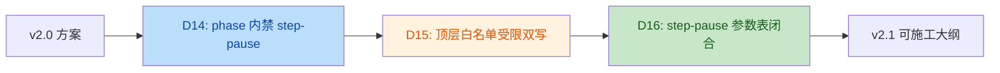
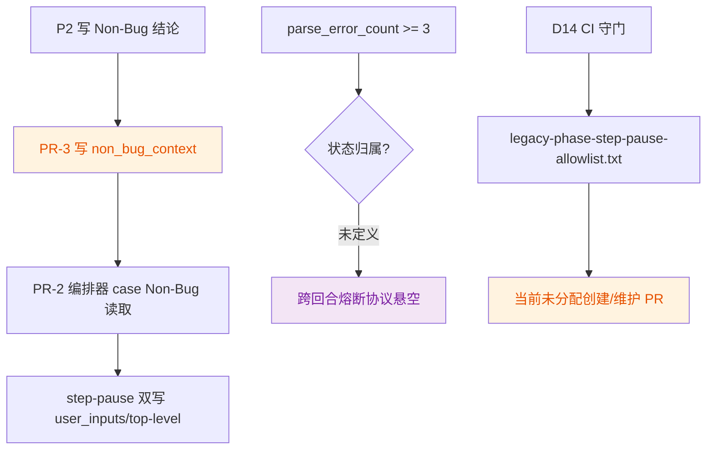

# Mobile B2C 质量工作流 — 施工文档 v2.1 Review

> 审阅对象：[`QUALITY-AUDIT-CONSTRUCTION-PLAN-v2.1.md`](./QUALITY-AUDIT-CONSTRUCTION-PLAN-v2.1.md)
>
> 审阅基线：
> - `mobile-qa-workflow/` 当前源码现状
> - [`QUALITY-AUDIT-CONSTRUCTION-PLAN-v2-REVIEW.md`](./QUALITY-AUDIT-CONSTRUCTION-PLAN-v2-REVIEW.md)
>
> 审阅日期：2026-04-20
>
> 审阅结论：`v2.1` 已正确吸收 `v2` 质检报告中的 3 个主问题，主方案已经接近可施工；但仍保留 **2 个高优先级状态契约缺口** 和 **1 个中优先级 CI 输入物遗漏**，建议在展开 PR-1 前先修正文档。

---

## Intent

- 作者意图：在 `v2.0` 基础上，吸收上一轮 review，完成 `step-pause` 调度归一（D14）、白名单受限双写（D15）、以及 `<step-pause>` 参数表闭合（D16），把施工大纲推进到可直接拆 PR 的状态。

---

## 变更总览

**业务流变化**

**当前剩余断点**

---

## Findings

| No. | Issue Title | Suggestion | Code Link |
|---|---|---|---|
| 1 | `non_bug_context` 已被 PR-2/PR-3 当作持久化状态字段使用，但 PR-1 的 schema 清单和 PR-7 的入口文档同步都没有注册它。这样落地后，`P2 -> 编排器 case Non-Bug` 会依赖一个“写了但不在状态契约里”的隐式字段。 | 在 PR-1 的 `core/workflow-status-template.yaml` 增加 `non_bug_context: null`，并把它加入 PR-7 的字段同步清单；如果不想持久化，就把 PR-3 的“更新 `{workflow_status}`：`non_bug_context = ...`”改成明确的运行时变量协议。 | [QUALITY-AUDIT-CONSTRUCTION-PLAN-v2.1.md:L226-249](file:///Users/bytedance/Code/loupe/mobile-qa-workflow/QUALITY-AUDIT-CONSTRUCTION-PLAN-v2.1.md#L226-L249) |
| 2 | `parse_error_count` 被 PR-2 设计成“连续 3 次解析失败后转 Human-Review”的跨回合计数器，但文档既没有把它加入状态 schema，也没有像 `current_phase_result` 那样把它定义为运行时变量并说明初始化/生命周期。当前这个 3 次熔断协议是悬空的。 | 二选一定稿并写入 PR-1 协议层：1) 把 `parse_error_count` 加入 `workflow-status-template.yaml` 并纳入迁移脚本；2) 明确它只在单轮内有效，同时把“3 次失败”改成单轮重试语义。按当前设计，更建议走持久化字段路线。 | [QUALITY-AUDIT-CONSTRUCTION-PLAN-v2.1.md:L288-307](file:///Users/bytedance/Code/loupe/mobile-qa-workflow/QUALITY-AUDIT-CONSTRUCTION-PLAN-v2.1.md#L288-L307) |
| 3 | D14 的 CI/DoD 已经依赖 `mobile-qa-workflow/scripts/legacy-phase-step-pause-allowlist.txt` 作为现存 phase 内 `<step-pause>` 的白名单输入，但 PR-5/PR-8 的交付清单里没有任何一处负责创建和维护这个文件。CI 守门会依赖一个未纳入施工清单的关键产物。 | 把 `legacy-phase-step-pause-allowlist.txt` 明确加入 PR-5 或 PR-8 的“涉及文件”清单，并规定由 PR-5 的现状盘点表生成首版内容；否则 D14 守门无法稳定落地。 | [QUALITY-AUDIT-CONSTRUCTION-PLAN-v2.1.md:L437-440](file:///Users/bytedance/Code/loupe/mobile-qa-workflow/QUALITY-AUDIT-CONSTRUCTION-PLAN-v2.1.md#L437-L440) |

---

## 详细说明

### 1. `non_bug_context` 是真实的 schema 缺口

- `v2.1` 计划让 PR-2 在编排器 case Non-Bug 的 step-pause 中使用 `{non_bug_context}`：
  - [QUALITY-AUDIT-CONSTRUCTION-PLAN-v2.1.md:L276-286](file:///Users/bytedance/Code/loupe/mobile-qa-workflow/QUALITY-AUDIT-CONSTRUCTION-PLAN-v2.1.md#L276-L286)
- 同时让 PR-3 在 P2 Non-Bug 早退时把 `non_bug_context` 写入 `{workflow_status}`：
  - [QUALITY-AUDIT-CONSTRUCTION-PLAN-v2.1.md:L326-342](file:///Users/bytedance/Code/loupe/mobile-qa-workflow/QUALITY-AUDIT-CONSTRUCTION-PLAN-v2.1.md#L326-L342)
- 但 PR-1 的 status schema 扩充清单没有登记这个字段：
  - [QUALITY-AUDIT-CONSTRUCTION-PLAN-v2.1.md:L226-249](file:///Users/bytedance/Code/loupe/mobile-qa-workflow/QUALITY-AUDIT-CONSTRUCTION-PLAN-v2.1.md#L226-L249)
- 当前真实模板也没有它：
  - [workflow-status-template.yaml](file:///Users/bytedance/Code/loupe/mobile-qa-workflow/core/workflow-status-template.yaml)
- 结论：
  - 这不是措辞问题，而是“读取方和写入方都存在，但 schema 未注册”的状态契约缺口。

### 2. `parse_error_count` 的跨回合语义未闭合

- PR-2 设计里引入了：
  - `parse_error_count += 1`
  - `parse_error_count >= 3 -> Human-Review`
  - [QUALITY-AUDIT-CONSTRUCTION-PLAN-v2.1.md:L288-307](file:///Users/bytedance/Code/loupe/mobile-qa-workflow/QUALITY-AUDIT-CONSTRUCTION-PLAN-v2.1.md#L288-L307)
- 但当前状态模板没有 `parse_error_count`：
  - [workflow-status-template.yaml](file:///Users/bytedance/Code/loupe/mobile-qa-workflow/core/workflow-status-template.yaml)
- 文档里也没有像 `current_phase_result` 一样，把它定义为“运行时变量”并说明初始化与生命周期：
  - [QUALITY-AUDIT-CONSTRUCTION-PLAN-v2.1.md:L225-225](file:///Users/bytedance/Code/loupe/mobile-qa-workflow/QUALITY-AUDIT-CONSTRUCTION-PLAN-v2.1.md#L225-L225)
- 当前模板里类似“跨轮兜底计数器”都是显式持久化的，例如 `non_bug_reflow_count` / `rca_retry_count` / `fix_retry_count` / `lint_retry_count`：
  - [workflow-status-template.yaml](file:///Users/bytedance/Code/loupe/mobile-qa-workflow/core/workflow-status-template.yaml#L14-L30)
- 结论：
  - 既然设计目标是“连续 3 次失败后熔断”，它天然是跨轮状态；当前协议没有给它一个合法归属。

### 3. D14 依赖的 allowlist 文件没有进入施工清单

- `v2.1` 在 PR-8 的 CI 守门里明确依赖：
  - `mobile-qa-workflow/scripts/legacy-phase-step-pause-allowlist.txt`
  - [QUALITY-AUDIT-CONSTRUCTION-PLAN-v2.1.md:L437-440](file:///Users/bytedance/Code/loupe/mobile-qa-workflow/QUALITY-AUDIT-CONSTRUCTION-PLAN-v2.1.md#L437-L440)
- DoD 也把它当成硬约束输入：
  - [QUALITY-AUDIT-CONSTRUCTION-PLAN-v2.1.md:L501-504](file:///Users/bytedance/Code/loupe/mobile-qa-workflow/QUALITY-AUDIT-CONSTRUCTION-PLAN-v2.1.md#L501-L504)
- 但 PR-8 的新增文件清单没有它：
  - [QUALITY-AUDIT-CONSTRUCTION-PLAN-v2.1.md:L431-435](file:///Users/bytedance/Code/loupe/mobile-qa-workflow/QUALITY-AUDIT-CONSTRUCTION-PLAN-v2.1.md#L431-L435)
- PR-5 也只要求“在 PR description 里盘点”，没有要求把盘点结果落成 allowlist 文件：
  - [QUALITY-AUDIT-CONSTRUCTION-PLAN-v2.1.md:L370-385](file:///Users/bytedance/Code/loupe/mobile-qa-workflow/QUALITY-AUDIT-CONSTRUCTION-PLAN-v2.1.md#L370-L385)
- 结论：
  - 这是一个真实的交付物遗漏，修复成本不高，但必须补到 PR 清单里。

---

## 已关闭项

- `v2` 中的 3 个主要问题已被 `v2.1` 正确吸收：
  - **D14**：phase 内 `step-pause` 调度归一，禁止新增 phase 内联 `step-pause`
  - **D15**：双写策略从“无条件双写”收紧为“白名单受限双写”
  - **D16**：`<step-pause>` 参数表完整定义为 `title/result_field/allowed_values/option`
- 因此，`v2.1` 相比 `v2.0` 已经明显更接近可施工版本。

---

## 建议结论

- `v2.1` 的主设计方向是对的，且已经把上一轮最关键的协议问题收口。
- 在正式展开 `PR-1` 前，建议再做一次小修订，优先补齐：
  1. `non_bug_context` 的状态字段注册
  2. `parse_error_count` 的持久化/运行时归属
  3. `legacy-phase-step-pause-allowlist.txt` 的交付归属
- 这 3 点补齐后，`v2.1` 基本就可以作为稳定的施工蓝图推进。

