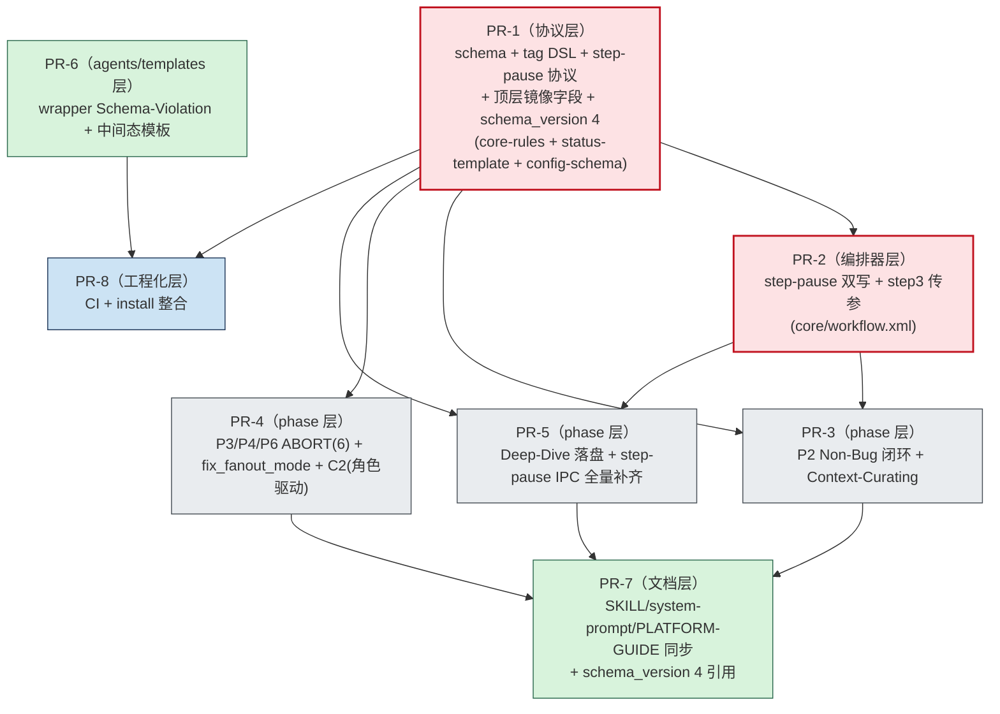

# Mobile B2C 质量工作流 — 施工文档（v4.1 修订版）

> **状态**：📐 **大纲 v2.2（已吸收 [QUALITY-AUDIT-CONSTRUCTION-PLAN-v2.1-REVIEW.md](./QUALITY-AUDIT-CONSTRUCTION-PLAN-v2.1-REVIEW.md) 全部 3 项裁定，含 v2.1 全量决定）**
> **唯一上游输入**：[`QUALITY-AUDIT-REPORT-v1.2.1.md`](./QUALITY-AUDIT-REPORT-v1.2.1.md)
> **施工目标版本**：`v4.1`（小迭代，schema_version 3 → 4，迁移脚本兜底兼容旧会话）
> **预算上限**：**≤ 5.2 人日**（v2.2 实际约 4.9d，留 0.3d buffer；D14 把 phase 内 step-pause 全面治理收窄到 v4.2 遗留 #6）
> **撰写日期**：2026-04-20
> **本文性质**：施工蓝图 + 文件级 diff 对照 + DoD + 迁移脚本 + 回滚预案

## v2.2 修订摘要（v2.1 → v2.2，吸收 v2.1-REVIEW 全部 3 项裁定）

> 本版本吸收 [QUALITY-AUDIT-CONSTRUCTION-PLAN-v2.1-REVIEW.md](./QUALITY-AUDIT-CONSTRUCTION-PLAN-v2.1-REVIEW.md) 的全部 3 项裁定（2 P0 + 1 P1，全部全采纳）：

| # | v2.1 中的问题 | v2.2 处理 |
|---|---|---|
| 1（P0） | `non_bug_context` 已被 PR-2/PR-3 当作持久化状态字段使用，但 PR-1 schema 清单与 PR-7 文档同步都未注册 | **决定 D17（Non-Bug 上下文字段入 schema）**：PR-1 在 `core/workflow-status-template.yaml` 显式新增 `non_bug_context: null`，注释"供编排器 case Non-Bug 的 step-pause 标题占位使用；仅承载最近一次 Non-Bug 判定说明"；迁移脚本补齐 `null`；PR-7 三处入口文档同步该字段，并标注"非长期业务字段，允许在后续会话中被覆盖" |
| 2（P0） | `parse_error_count` 被 PR-2 设计成跨回合 3 次解析失败熔断计数器，但既未入 schema，也未定义为运行时变量 | **决定 D18（parse-error 计数持久化）**：按当前设计走**持久化字段**路线。PR-1 在 `workflow-status-template.yaml` 显式新增 `parse_error_count: 0`，迁移脚本补齐默认值；PR-2 明确"每次进入一个新的 step-pause 前重置为 0，解析失败 +1，解析成功或切换到新 `current_state` 后清零"，保证"连续 3 次"具有跨回合可追踪语义 |
| 3（P1） | D14 的 CI/DoD 依赖 `legacy-phase-step-pause-allowlist.txt`，但 PR-5/PR-8 没有任何一处负责创建和维护它 | **决定 D19（allowlist 实体化交付）**：PR-5 负责根据现状盘点生成 `mobile-qa-workflow/scripts/legacy-phase-step-pause-allowlist.txt` 首版内容；PR-8 的 CI 以该文件为权威输入进行 D14 守门；PR-5/PR-8 文件清单显式加入该文件，避免 CI 依赖悬空 |

**预算变化**：
- PR-1 +0.08d（`non_bug_context` + `parse_error_count` 入 schema、注释与迁移契约）
- PR-2 +0.05d（`parse_error_count` 生命周期与 reset 规则）
- PR-5 +0.05d（生成并维护 allowlist 首版）
- PR-7 +0.02d（字段表同步 `non_bug_context` / `parse_error_count`）
- PR-8 +0.03d（CI 读取 allowlist 实体文件）

**净变化 +0.2d**：总 4.7d → **4.9d，buffer 0.5d → 0.3d**

**范围说明**：v2.2 不新增修复条目，只把 v2.1 中已被实际使用但未注册的状态字段、计数器和 CI 输入物补成显式契约，属于协议闭环与施工可执行性增强，不改变 v4.1 的既定范围。

**文档结构**：每个 PR 的详细施工单按 PR 拆分到 [`construction-plans/v2.2/`](./construction-plans/v2.2/) 子目录，主文档 §4 仅保留链接清单。0 影响 D1-D19 / PR 切分 / DoD / 迁移脚本 / 回滚预案。

## v2.1 修订摘要（v2.0 → v2.1，吸收 v2-REVIEW 全部 3 项裁定）

> 本版本吸收 [QUALITY-AUDIT-CONSTRUCTION-PLAN-v2-REVIEW.md](./QUALITY-AUDIT-CONSTRUCTION-PLAN-v2-REVIEW.md) 的全部 3 项裁定（1 P0 + 2 P1，全部全采纳）：

| # | v2.0 中的问题 | v2.1 处理 |
|---|---|---|
| 1（P0） | phase 内 step-pause 跨回合恢复协议缺口：编排器 `core/workflow.xml` step 4 通过 `current_state` 路由 + `{xxx_user_choice}` 顶层字段恢复（已是事实标准），但 PR-3/PR-5 计划在 phase 文件内新增内联 step-pause，缺乏恢复协议；P2 step 4 现存 Spec-Uncertain 内联 step-pause 还与编排器重复弹窗 | **决定 D14（方案 B 强化）**：step-pause 调度归一 — PR-1 在 `core-rules.xml` 增协议约束"`<step-pause>` 仅允许出现在 `core/workflow.xml` 编排器 step 4 内；phase 内禁止内联，应通过 `current_state + current_phase_result=ABORT` 让编排器接管"；PR-3 修订为"P2 判定 Non-Bug 时设 `current_state=Non-Bug + ABORT`，由编排器 step 4 case Non-Bug 现有 step-pause 按 PR-1 `<input-protocol>` 完整声明 result_field+allowed_values"。零新增 schema 字段，完全对齐现有架构。其余 phase 内 step-pause（P4 step5/F4 等）登记 v4.2 遗留 #6 |
| 2（P1） | PR-2 双写按通用 `{key}` 无条件写顶层 `workflow_status.{key}`，但 PR-1 仅注册 `non_bug_user_choice` 一个顶层镜像字段；后续若新增 step-pause key 会污染顶层 schema | **决定 D15（白名单受限双写）**：PR-2 双写实现改为"`user_inputs.<key>` 总写 + 顶层 `<key>` **仅当 key 在 `core/workflow-status-template.yaml` 显式注册的顶层镜像白名单内时才写**"；PR-8 CI 增校验"任何写入顶层镜像的 key 必须在白名单内"；v4.1 起步白名单 = `{non_bug_user_choice}` |
| 3（P1） | `allowed_values` 已被 PR-3 示例、DoD、CI 当 step-pause 属性使用，但 PR-1 仅显式新增 `result_field`，DSL 参数定义未闭合 | **决定 D16（参数表完整定义）**：PR-1 在 `core-rules.xml` 一次性把 `<step-pause>` 参数定义为 `title (必填) / result_field (必填) / allowed_values (必填) / option (可选, 0..*)`；DoD/CI 检查与之对齐 |

**预算变化**：
- PR-1 +0.05d（D14 调度作用域约束 +0.03d + D16 参数表完整定义 +0.02d）
- PR-2 +0.05d（D14 编排器 case Non-Bug step-pause 规范化）
- PR-3 -0.1d（D14 移除 phase 内新增 step-pause）
- PR-5 -0.3d（D14 phase 内 step-pause 规范化全部延后到 v4.2 遗留 #6，PR-5 仅做 B3 落盘 + 现状盘点登记）
- D15/D16 其余部分文档级 0d

**净变化 -0.3d**：总 5.0d → **4.7d，buffer 0.2d → 0.5d**

**范围收窄声明**：v2.1 通过 D14 把 C11 在 phase 内 step-pause 的全面规范化（P2 Spec-Uncertain / P4 step5 / F4 中断决策等）从 v4.1 收窄至 v4.2 遗留 #6。理由：（1）这些 step-pause 在生产中"工作但不规范"，未引入新 bug；（2）v4.1 是小迭代定位；（3）D14 的统一架构在 v4.2 整体迁出时机更佳；（4）v4.1 仍治理 C11 最关键路径（编排器 step 4 全部 6 个 step-pause + P2 Non-Bug 早退路径）。

> **未变更内容**：v2.0 的 7 章结构、8 PR 切分、依赖拓扑、§4 占位、§5 三层 DoD、§6 迁移脚本五段式、§7 八段回滚、D1-D13 全部决定均保留。

## v2.0 修订摘要（v1.0 → v2.0，吸收第二轮 review）（保留供追溯）

> 本版本吸收 [QUALITY-AUDIT-CONSTRUCTION-PLAN-v1-REVIEW.md](./QUALITY-AUDIT-CONSTRUCTION-PLAN-v1-REVIEW.md) 的全部 5 项裁定（3 P0 + 2 P1，全部全采纳）：

| # | v1.0 中的问题 | v2.0 处理 |
|---|---|---|
| P0-1 | `rca_fanout_mode` 命名体系前后不一致：PR-1 schema 未定义、DoD/迁移却引用 | **决定 D7**：保留现有 `fanout_mode` 作为 RCA 字段（**不重命名**），仅新增 `fix_fanout_mode`；snapshot 保留 `rca_fanout_mode_snapshot` 名（语义清晰）+ 注释"P3 完成时 fanout_mode 的快照"。**红利**：`core/workflow.xml` step 2 无需任何修改，PR-1/PR-2 减少改动面 |
| P0-2 | step-pause 写回 `user_inputs.*`，但编排器读取顶层字段（`{non_bug_user_choice}`），业务分支会断链 | **决定 D8（双写过渡）**：PR-1 在 status-template 显式声明已知 step-pause keys（v4.1 起步集合：`non_bug_user_choice`）作为**顶层字段**；PR-2 编排器写回时**同时写 `user_inputs.<key>` + 顶层 `<key>`**；编排器读取保持现状（`{non_bug_user_choice}` 顶层），无破坏性修改。v4.2 再收敛到 user_inputs-only（登记 §1.2.2 v4.2 遗留 #3） |
| P0-3 | `schema_version: 3 → 4` 升级在 PR-1 修改清单缺显式动作 | PR-1 `core/workflow-status-template.yaml` 修改清单显式增"`schema_version: 3 → 4`"；PR-7 文档/入口同步同步引用版本升级 |
| P1-1 | "无需 LLM 猜测"表述过强（解析仍由 LLM 执行 `<action>`） | 文档术语改为"**最小可判定、低歧义、可审计**"；PR-1 `<input-protocol>` 子规则强化：所有 step-pause 标题必须追加一行 `请用 <key>=<value> 回复`；parse-error 时回显允许值白名单 |
| P1-2 | `phase_history` 结构未定型，"写了但不可用"风险 | PR-1 在 status-template 注释里固定 `phase_history` 元素最小结构：`{phase: str, timestamp: ISO8601, fanout_mode: str, note?: str}` |

**预算变化**：PR-1 +0.1d（顶层镜像字段 + phase_history 结构注释 + schema_version 升）；PR-2 +0.1d（双写逻辑）；总 4.8d → **5.0d**，buffer 0.4d → **0.2d**。

> **未变更内容**：v1.0 的 7 章结构、8 PR 切分、依赖拓扑、§4 占位、§5 三层 DoD、§6 迁移脚本五段式、§7 八段回滚、方案 A（`current_phase_result` 为运行时变量）、tag 白名单边界声明均保留。

### v2.0 附加：附录 B 5 项未决问题已拍板（D9-D13，对预算 0 影响）

| 决定 ID | 拍板内容 | 依据 |
|---|---|---|
| **D9** | PR 合入顺序 = **PR-4 → PR-3 → PR-5** | 先 ABORT 主链路（最高优先级根因）→ Non-Bug 闭环（功能补齐）→ Deep-Dive（影响面最小） |
| **D10** | PR-6 边界 = **不做 M11/M14**，顺延 v4.2（登记遗留 #4） | v2.0 buffer 仅 0.2d，做 M11/M14 需 +0.3d 突破预算；守预算优先 |
| **D11** | CI 起点 = **`.github/workflows/qa-workflow-schema-check.yml`，与现有 `eval.yml` 同级** | 仓库现状核实：`.github/workflows/eval.yml` 已存在，无需新建目录 |
| **D12** | install_trae.sh 处理 = **改为 shim**（`exec install.sh --target=trae "$@"`） | 最大向后兼容（旧调用 `bash install_trae.sh` 仍工作）；v4.2 可直接删除 |
| **D13** | 迁移脚本路径 = **`mobile-qa-workflow/scripts/migrate-workflow-status-v3-to-v4.py`**（新建目录） | 随 SKILL 自包含分发；用户 `bash install.sh` 后即拥有迁移能力 |

## v1.0 修订摘要（保留供追溯）

> 见 v1.0 附录 C / [QUALITY-AUDIT-CONSTRUCTION-PLAN-REVIEW-2026-04-20.md](./QUALITY-AUDIT-CONSTRUCTION-PLAN-REVIEW-2026-04-20.md)。核心拍板：方案 A（`current_phase_result` 运行时变量）、step-pause `<input-protocol>`、tag 白名单边界、范围口径双层化、PR 层级标签、Deep-Dive 键名映射延后。

---

## 0. 文档使用说明（Reading Guide）

- **本文档为"工程施工蓝图"**，不重复审计结论；任何缺陷描述均回链 v1.2.1 对应章节锚点。
- 每个 PR 段落遵循统一骨架：**层级 → 目标 → 修复条目 → 涉及文件 → 工作量 → 评审重点**；详细 diff 在 §4 展开。
- 大纲阶段（v2.0）冻结**结构、PR 切分、依赖拓扑、协议契约、字段命名、覆盖矩阵**；PR 内容（diff/迁移脚本细节）在用户确认 v2.0 后逐 PR 填充。
- 编号约定：`B1*/B2/B3` = Blocker；`C1/C2/C5/C9/C10/C11` = Critical（v1.2.1 §七 立刻修复 9 条）；`M16/m1` = 配套工程化包装。
- **协议层关键决定（v2.0 已拍板，详见附录 C）**：
  - **D1** `current_phase_result` = **运行时变量**（不持久化到 status template）
  - **D2** step-pause 用户回复 = **`<key>=<value>` + 白名单 + parse-error 重提**（最小可判定、低歧义、可审计）
  - **D3** tag 白名单边界 = **仅 `<flow>`/`<task>` 内 DSL**（元数据标签不受管控）
  - **D4** Deep-Dive 键名映射 = 本次仅修 B3 表层，体系统一延后 v4.2
  - **D7** RCA fanout 字段命名 = **保留 `fanout_mode`，仅新增 `fix_fanout_mode`**（**v2.0 新增**）
  - **D8** step-pause 写回策略 = **v4.1 双写（顶层 + `user_inputs.<key>`）+ v4.2 收敛 user_inputs-only**（**v2.0 新增**）
  - **D9** PR 合入顺序 = PR-1 → PR-2 → **PR-4 → PR-3 → PR-5** → PR-6 → PR-7 → PR-8（**v2.0 拍板**）
  - **D10** PR-6 边界 = 不做 M11/M14（顺延 v4.2 遗留 #4）；**D11** CI 起点 = `.github/workflows/qa-workflow-schema-check.yml`；**D12** install_trae.sh = shim 兼容；**D13** 迁移脚本 = `mobile-qa-workflow/scripts/`（**v2.0 拍板**）
  - **D14** step-pause 调度归一 = phase 内禁止 `<step-pause>`，统一由编排器 step 4 通过 `current_state` 路由触发（**v2.1 新增**）
  - **D15** 双写白名单化 = `user_inputs.<key>` 总写 + 顶层 `<key>` 仅当 key 在 status-template 显式注册的顶层镜像白名单内才写（**v2.1 新增**）
  - **D16** `<step-pause>` 参数表完整定义 = `title / result_field / allowed_values`（必填）+ `option`（可选）（**v2.1 新增**）
  - **D17** `non_bug_context` = **持久化字段**，供编排器 case Non-Bug 的 step-pause 标题占位使用（**v2.2 新增**）
  - **D18** `parse_error_count` = **持久化计数器**，用于 step-pause 连续解析失败 3 次熔断（**v2.2 新增**）
  - **D19** `legacy-phase-step-pause-allowlist.txt` = **PR-5 生成首版、PR-8 CI 消费** 的显式交付物（**v2.2 新增**）

---

## 1. 改造范围与 Out-of-Scope

### 1.1 In-Scope（v4.1 主修复 9 条 + 配套工程化包装 5 项）

#### 1.1.1 主修复条目（9 条 Blocker / Critical，共 3.4d）

| 缺陷 ID | 简述 | v1.2.1 锚点 | 工作量 | 归属 PR |
|---|---|---|---|---|
| B1* | Phase 早退 = ABORT 强协议（运行时变量赋值；**PR-4 落地 6 处 = P3 ×5 + P6 ×1**，含 v2.2 实施期增补 P3-A5 step 10 RCA-LowConfidence stop） | §三 B1\* / §七 #1 | 0.7d | PR-1 + PR-3 + PR-4 |
| B2 | P2 Non-Bug 闭环回填 | §三 B2 / §七 #2 | 0.3d | PR-3 |
| B3 | Deep-Dive F1/F2/F3 默认落盘 | §三 B3 / §七 #3 | 0.2d | PR-5 |
| C1 | `<task>` 标签纳入 supported-tags（含边界声明） | §三 C1 / §七 #4 | 0.1d | PR-1 |
| C2 | 共享基座 base_score / confidence_input 注入 | §三 C2 / §七 #5 | 0.5d | PR-4 |
| C5 | 状态枚举单一权威源扩展 | §三 C5 / §七 #6 | 0.4d | PR-1 |
| C9 | P6 失败分支必输出 verification-report | §三 C9 / §七 #7 | 0.2d | PR-4 |
| C10 | P4 字段隔离（`fix_fanout_mode` 新增 + `rca_fanout_mode_snapshot` 快照；**保留 `fanout_mode` 为 RCA 字段**） | §三 C10 / §七 #8 | 0.4d | PR-1 + PR-4 |
| C11 | step-pause `result_field` + `<input-protocol>` 协议 + 白名单受限双写 + **编排器 step 4 全部 6 个 step-pause 规范化 + P2 Non-Bug 早退路径**（v2.1 收窄：phase 内现存 step-pause 全面治理延后到 v4.2 遗留 #6） | §三 C11 / §七 #9 | 0.3d | PR-1 + PR-2 |
| **小计** | | | **3.1d** | |

#### 1.1.2 配套工程化包装（5 项，共 1.6d，**为 §5.2 DoD 用例可执行所必需**）

> 这些条目在 v1.2.1 §七的不同位置（部分 Major、部分 Minor、部分 §十 #10），但**没有它们就无法构造 §5 验证用例**或会立即引入回归风险，因此一并纳入。

| 配套条目 | 简述 | v1.2.1 锚点 | 工作量 | 归属 PR |
|---|---|---|---|---|
| M16（最小子集） | `config_source` 键漂移检测：PR-1 引入 `config-schema.yaml` + PR-8 CI 校验 | §三 M16 | 0.3d | PR-1 + PR-8 |
| C2-wrapper | shared-arbiter-base / shared-challenger-base 缺参时输出 `[Schema-Violation]`（C2 修复的 wrapper 端实现） | §三 C2 Fix Sketch | 0.3d | PR-6 |
| C9-template | `templates/verification-report.md` 增"中间态报告"段（C9 模板侧） | §三 C9 Fix Sketch | 0.2d | PR-6 |
| m1 | install.sh 与 install_trae.sh 合并为 `install.sh --target=...` | §三 m1 / §十 #10 | 0.2d | PR-8 |
| 文档/入口同步 | SKILL.md / system-prompt.md / PLATFORM-GUIDE.md 字段表追平新 schema（**仅同步本次涉及字段，不解决 C8 全量**） | §三 C8 关联面 | 0.42d | PR-7 |
| 协议双写 / schema 升 / 协议补洞 | PR-1 顶层镜像字段 + phase_history 结构注释 + schema_version 升；PR-2 双写实现；v2.2 新增 `non_bug_context` / `parse_error_count` / `legacy-phase-step-pause-allowlist.txt` 契约闭环 | v2.0 P0-2/P0-3 裁定 + v2.2 D17-D19 | 0.38d | PR-1 + PR-2 + PR-5 + PR-8 |
| **小计** | | | **1.8d** | |

#### 1.1.3 总预算核对（v2.2 更新）

| 类别 | 工作量 |
|---|---|
| 主修复 9 条 | 3.1d（v2.1：C11 收窄，0.6d → 0.3d） |
| 配套工程化包装 6 项 | 1.8d（v2.2：补 `non_bug_context` / `parse_error_count` / allowlist 交付） |
| **合计** | **4.9d** |
| 5.2d 预算 buffer | **0.3d** |

> **v2.1 → v2.2 预算变化**：为补齐 `non_bug_context` schema、`parse_error_count` 生命周期以及 allowlist 实体交付，PR-1 +0.08d、PR-2 +0.05d、PR-5 +0.05d、PR-7 +0.02d、PR-8 +0.03d。净 +0.2d，总额从 4.7d → 4.9d，buffer 0.5d → 0.3d。

> **范围口径（v2.1 重要声明）**：v4.1 的 C11 修复**仍然完整覆盖**编排器 step 4 全部 6 个 step-pause + P2 Non-Bug 早退主路径。被收窄的"phase 内现存 step-pause 全面归并到编排器调度"是**架构演进**（v4.2 D14 + v4.2 遗留 #6），非缺陷修复；这些 step-pause 在生产中"工作但不规范"，未引入新 bug。

### 1.2 Out-of-Scope（明确不在本次施工内）

#### 1.2.1 v1.2.1 §七 中的延后项

- **本月内（Major 治理，v1.2.1 §七 第二段 #10–#19，已完整保留延后）**：M17 wrapper dimension 漂移、M3/M4/M6/M7/M8/M9/M10/M11/M12/M13/M14/M15 等 Major 修复
  - 注：M16 已部分纳入（最小子集），但 M16 全量 schema CI 仍延后（v1.2.1 §七 #20）
- **中期演进（Minor + 工程化，v1.2.1 §七 第三段 #20–#24）**：schema 一致性 CI 全量化、版本号统一为 SemVer、Skills 镜像源同步、deep-dive legacy 角色迁移
- **C3 → M17 已降级条目**：Deep-Dive 主路径未触发，本次不动
- **C4 / C6 / C7 / C8（全量）**：v1.2.1 §七 列入立刻修复但用户确认本次仅做 9 条
- **B1\* 的 Deep-Dive 子工作流 ABORT 协议**：v1.2.1 §三 B1\* 明确"另作独立审视（见 M9）"，本次不覆盖

#### 1.2.2 v2.0 维护中的 v4.2 遗留登记

- **【v4.2 遗留 #1】主→子配置键名映射统一**（v1.0 引入）：主 `default-config.yaml` 用 `deep_dive_optional_artifacts.*`，子 `functionality-deep-dive/core/default-config.yaml` 用 `emit_*`，本次仅做 B3 表层修复，体系统一延后
- **【v4.2 遗留 #2】tag 白名单全量校验**（v1.0 引入）：仅声明边界，元数据标签独立白名单未做
- **【v4.2 遗留 #3】step-pause 写回收敛 user_inputs-only**（**v2.0 新增**）：v4.1 因兼容编排器顶层读取（如 `{non_bug_user_choice}`）采用双写过渡；v4.2 需修改编排器读取为 `{user_inputs.non_bug_user_choice}` 等，并删除顶层镜像字段。**届时一并完成**：删除 status template 中的 `non_bug_user_choice` 顶层字段；编排器 step 4 case Non-Bug switch 改读 user_inputs
- **【v4.2 遗留 #4】M11 / M14 模板治理**（**v2.0 D10 决定**）：本次 PR-6 仅做 9 条修复直接联动的最小子集（C2 wrapper + C9 中间态模板）；M11（verification-report 三类回流分类）与 M14（knowledge-card L3-Dynamic 双写去重）顺延 v4.2，避免突破 5.2d 预算
- **【v4.2 遗留 #5】install_trae.sh shim 删除**（**v2.0 D12 决定**）：v4.1 保留 shim 以兼容旧调用 `bash install_trae.sh`；v4.2 在用户群完成迁移到 `install.sh --target=trae` 后直接删除 shim 文件
- **【v4.2 遗留 #6】phase 内 step-pause 全面归并到编排器调度**（**v2.1 D14 决定**）：v4.1 仅治理 P2 Non-Bug 这一处必需路径（PR-3 修订），并通过 PR-1 的协议约束禁止新增 phase 内 step-pause；v4.2 须把现存的 P2 step 4 Spec-Uncertain 内联 step-pause（与编排器 case 重复弹窗 bug）、P4 step 5 是否进入修复 step-pause、F4 中断决策 step-pause 等**全部**迁出 phase 文件，改为"phase 设 `current_state + ABORT` → 编排器 step 4 新 case 触发 step-pause"模式。届时编排器需新增对应 case（如 `Fix-Confirming` / `F4-DebateDecision`）

> 🚧 **凡不在 §1.1 表中的修改一律拒绝合并**，由 PR Reviewer 把关。

---

## 2. 依赖拓扑图（Mermaid）

> 表达 PR 之间的"必须先于"关系。同一并行带（rank）内的 PR 可并行开发与评审。



### 2.1 拓扑约束说明

- **PR-1 是协议层基石**：所有引用 `<step-pause result_field=...>`、`<task>` 白名单、`fix_fanout_mode` / `phase_history` / `user_inputs` / `rca_fanout_mode_snapshot` / 顶层镜像字段（如 `non_bug_user_choice`）等新协议元素的 PR 都必须等 PR-1 合入主干后再 rebase。
- **PR-2 不再是 PR-4 的强前置**（v1.0 → v2.0 保持）：方案 A 下 `current_phase_result` 为运行时变量，PR-4 可在 PR-2 未合入时也安全合入。但 PR-2 必须先于 PR-3/PR-5（因为它实现了 step-pause 用户回复的双写逻辑）。
- **PR-3/4/5 可并行开发**（基于 PR-1+PR-2 base），**合入顺序已拍板（D9）：PR-4 → PR-3 → PR-5**。
- **PR-7 是聚合派生**：等 PR-3/4/5 全部合入后再 rebase 同步入口文档。
- **PR-6 与 PR-1~5 无字段依赖**，可独立开发；与 PR-8 顺序耦合。
- **PR-8 是收尾**：所有上游 PR 落定后再开 CI gate。

---

## 3. PR 切分方案（8 PR 总览）

> 每个 PR 一段：**层级 → 目标 → 修复条目 → 涉及文件 → 工作量 → 评审重点**。详细 diff 在 §4 展开。

### PR-1 · schema 协议层

- **层级**：🔴 协议层（最优先合入）
- **目标**：把所有"新字段、新枚举、新参数、step-pause 写回协议、schema 版本升级"一次落地，作为后续所有 PR 的契约基石。
- **覆盖修复条目**：B1\*（协议层规则定义）、C1（`<task>` + 边界声明）、C5、C10（字段定义部分，**仅新增 `fix_fanout_mode` 与 snapshot，保留 `fanout_mode`**）、C11（`<step-pause>` + `<input-protocol>` + 顶层镜像字段集合）、M16（config-schema 引入）、**配套：schema_version 3 → 4**
- **涉及文件**（4 个，其中 1 个新增）：
  - `core/core-rules.xml`（修改）：
    - `<supported-tags>` 增 `<task>` + 边界声明注释（"本白名单仅约束 `<flow>`/`<task>` 内部 DSL；元数据标签 `<llm>`/`<mandate>`/`<agent-taxonomy>`/`<human-review-protocol>`/`<trigger>`/`<output-format>` 不在 LLM 解析校验范围内"）
    - **`<step-pause>` 参数表完整定义（v2.1 D16）**：一次性定义 `title (必填) / result_field (必填) / allowed_values (必填) / option (可选, 0..*)` 四个参数；并在参数表注释中说明各参数语义与示例
    - **`<step-pause>` 调度作用域约束（v2.1 D14）**：在 `<step-pause>` 标签定义中**显式声明**："`<step-pause>` **仅允许出现在 `core/workflow.xml` 编排器 step 4 内**（按 `current_state` 路由）；phase 文件（`phases/**`、`functionality-deep-dive/phases/**`）**禁止内联 `<step-pause>`**；phase 早退应通过 `<action>更新 {workflow_status}：current_state = <stop_state></action>` + `<action>设置 current_phase_result = ABORT</action>` 让编排器接管，由编排器 step 4 对应 case 统一触发 step-pause"
    - `<step-pause>` 新增 `<input-protocol>` 子规则（**v2.0 强化 + v2.1 收紧**）：
      1. step-pause 输出时必须打印 `[result_field=<key>]` + `[allowed_values=<v1>|<v2>|...]` 标签（**与 D16 参数表一致**）
      2. step-pause 标题最后一行**必须追加** `请用 <key>=<value> 回复`（v2.0 新增）
      3. 用户回复必须**第一行**包含 `<key>=<value>`，`<value>` 必须在白名单内
      4. 解析失败 → 编排器回显 `[parse-error: 期望 <key> ∈ <allowed_values>]` + 重新触发同一 step-pause；连续 3 次失败转 Human-Review（计数器语义见 D18）
      5. 编排器恢复后**白名单受限双写**（v2.1 D15）：`workflow_status.user_inputs.<key> = <value>`（**总写**）；当且仅当 `<key>` 位于 `core/workflow-status-template.yaml` 显式注册的**顶层镜像白名单**内，才同时写 `workflow_status.<key> = <value>`（v4.1 起步白名单 = `{non_bug_user_choice}`）
    - 新增 `<workflow-result-protocol>` 章节：明确 `current_phase_result` **是 phase 执行期的运行时变量**（不入 status schema），phase 早退必须通过 `<action>设置 current_phase_result = ABORT</action>` 在返回编排器前显式赋值
  - `core/workflow-status-template.yaml`（修改，**v2.0 新增 schema_version 升 + 顶层镜像字段 + phase_history 结构注释；v2.2 补齐 non_bug_context / parse_error_count**）：
    - **`schema_version: 3 → 4`**（v2.0 新增显式动作）
    - 增 `fix_fanout_mode: null`（C10 字段隔离；**保留现有 `fanout_mode`，不重命名**）
    - 增 `non_bug_context: null`（**v2.2 D17**；供编排器 case Non-Bug 的 step-pause 标题占位使用，仅承载最近一次 Non-Bug 判定说明）
    - 增 `parse_error_count: 0`（**v2.2 D18**；step-pause 连续解析失败计数器，成功解析或进入新 step-pause 时清零）
    - 增 `phase_history: []`，附结构注释（v2.0 新增）：
      ```yaml
      # phase_history: 阶段执行历史，元素结构：
      #   { phase: <str, e.g. "qa-root-cause">,
      #     timestamp: <ISO8601>,
      #     fanout_mode: <str|null, 阶段完成时的 fanout_mode>,
      #     note: <str, 可选备注> }
      phase_history: []
      ```
    - 增 `rca_fanout_mode_snapshot: null` + 注释（v2.0 强化）："P3 完成时 `fanout_mode` 的快照，用于 P3 重入时还原 RCA 上下文（C10 兼容性方案 B 兜底）"
    - 增 `user_inputs: {}` 命名空间（C11 step-pause 写回容器）
    - **增 step-pause 顶层镜像字段白名单（v2.0 双写过渡 + v2.1 D15 白名单化）**：
      ```yaml
      # ⚠️ 顶层镜像字段白名单（v4.1 过渡，v4.2 收敛）
      # 协议：编排器双写时仅当 step-pause 的 result_field 出现在以下字段集中，才会同步写入顶层；
      # 不在白名单内的 result_field 仅写 user_inputs.<key>，不污染顶层 schema。
      # 起步白名单 = {non_bug_user_choice}；新增需 PR Review 显式批准并同步更新本块注释。
      # v4.2 收敛后将删除以下字段，编排器改读 user_inputs.<key>
      non_bug_user_choice: null  # 镜像 user_inputs.non_bug_user_choice
      ```
      （注：白名单是**强契约**——PR-2 双写实现、PR-8 CI 校验、PR-7 文档说明均以此处声明为权威源）
    - `current_state` 合法枚举集扩展注释：明确包含 `Context-Curating` / `Curation-Failed` / `Boundary-Refined` / `Fix-Implementing` / `Verifying`（C5）
    - **❌ 不增加 `current_phase_result` 字段**（D1 决定）
    - **❌ 不重命名 `fanout_mode` → `rca_fanout_mode`**（D7 决定）
  - `core/config-schema.yaml`（**新增**）：`config_source` 单一权威源 schema，声明所有合法 `output_*` 键名（M16 最小子集）
  - `core/default-config.yaml`（修改）：补齐 `output_curation_report` 等缺失键
- **工作量**：0.93d（v2.0 0.8d + v2.1 D14 调度作用域约束 +0.03d + D16 参数表完整定义 +0.02d + v2.2 D17/D18 状态字段补齐 +0.08d）
- **评审重点**：
  - **D14 协议约束**是否在 `<step-pause>` 标签定义中**显式可见**（reviewer 可一行 grep 确认）；约束文字是否含"phase 文件禁止内联 `<step-pause>`"等关键词
  - **D16 参数表**是否一次性定义齐 `title/result_field/allowed_values/option`，且与 `<input-protocol>` 子规则中引用的字段名严格一致
  - `<input-protocol>` 是否能让 step-pause 在 LLM 执行下达到"最小可判定"（白名单与 option key 一一对应；标题强制后缀；parse-error 回显白名单）
  - 顶层镜像字段白名单（v4.1 起步只 `non_bug_user_choice`）是否完整（grep `core/workflow.xml` 中所有 `{xxx_user_choice}` 形式的顶层引用）；白名单注释是否含"强契约"声明
  - `phase_history` 元素结构注释是否清晰，PR-4 写入端能否按结构生成
  - `non_bug_context` / `parse_error_count` 是否已在 status-template 明确注册，并在注释中写清用途与生命周期
  - `schema_version: 3 → 4` 升级动作是否在 diff 中可见
  - **`fanout_mode` 字段保持不变**（任何 PR 试图重命名都应被打回，rename 已登记 v4.2 之外不做）

---

### PR-2 · 编排器适配（step-pause 白名单受限双写 + step 4 case 规范化 + step 3 传参）

- **层级**：🔴 编排器层（紧随 PR-1）
- **目标**：让 `core/workflow.xml` 在 step-pause 恢复时按 **D15 白名单受限双写**策略写入用户回复，确保现有编排器顶层读取（如 `{non_bug_user_choice}`）继续可用；同时把 step 4 既有的 step-pause（Info-Insufficient / Spec-Uncertain / Non-Bug / RCA-LowConfidence / Human-Review / Curation-Failed）按 PR-1 的 `<step-pause>` 完整参数表（D16）规范化补齐 `result_field` + `allowed_values`；建立 `user_inputs.*` 命名空间为 v4.2 收敛做准备。
- **覆盖修复条目**：C11（编排器侧 step-pause 白名单双写实现 + 现有 step-pause 参数表补齐）、附带 m9 part of step 3
- **涉及文件**（1 个）：
  - `core/workflow.xml`（修改）：
    - **❌ 不修改 step 4 ABORT 分支**（D1 方案 A 决定）
    - **❌ 不修改 step 4 case Non-Bug 的 `<switch condition="{non_bug_user_choice}">`**（D8 双写过渡决定：编排器读取保持现状，靠双写镜像兜底）
    - **case Non-Bug 当前不存在 step-pause（仅 switch）**，但被编排器调度的 Non-Bug step-pause 实际由 P2 触发（v2.1 D14 后改为编排器统一发起）→ 在 case Non-Bug 的 switch **之前**新增 step-pause 完整声明（按 D16 参数表）：
      ```xml
      <step-pause title="Non-Bug 判定结果，请确认处理方向：
{non_bug_context}
请用 non_bug_user_choice=<value> 回复"
                  result_field="non_bug_user_choice"
                  allowed_values="Accept|Reflow">
          <option title="[A] Accept：接受判定" action="non_bug_user_choice=Accept"/>
          <option title="[R] Reflow：补充证据后重审" action="non_bug_user_choice=Reflow"/>
      </step-pause>
      ```
    - **step 4 既有 6 个 step-pause（Info-Insufficient / Spec-Uncertain / RCA-LowConfidence / Human-Review / Curation-Failed / 上述新增的 Non-Bug）按 D16 一次性补齐 `result_field` + `allowed_values`**（v2.1 新增）；其中除 `non_bug_user_choice` 外的 result_field 命名建议（待 PR Review 确认）：`info_insufficient_action`（Submit）/ `spec_uncertain_choice`（1|2|S）/ `rca_lowconf_action`（Retry|Human）/ `human_review_continue`（Continue）/ `curation_failed_action`（Retry|Human）— **均默认仅写 `user_inputs.*`，不进白名单**
    - 在 step 4 的 step-pause 恢复路径**新增白名单受限双写动作**（v2.1 D15 调整）：
      ```xml
      <action>进入一个新的 step-pause 前，重置 workflow_status.parse_error_count = 0（v2.2 D18）</action>
      <action>解析 step-pause 用户回复首行 <key>=<value>，校验 value ∈ allowed_values</action>
      <check if="解析成功">
          <action>写入 workflow_status.user_inputs.{key} = {value}（总写）</action>
          <check if="{key} ∈ workflow-status-template 顶层镜像白名单">
              <action>同步镜像写入 workflow_status.{key} = {value}（v4.1 双写过渡）</action>
          </check>
          <action>重置 workflow_status.parse_error_count = 0</action>
      </check>
      <check if="解析失败">
          <action>workflow_status.parse_error_count += 1</action>
          <check if="workflow_status.parse_error_count >= 3">
              <action>更新 workflow_status：current_state = Human-Review</action>
              <action>输出 [parse-exceed: 连续 3 次解析失败，转人工]</action>
              <action>重置 workflow_status.parse_error_count = 0</action>
              <goto step="4"/>
          </check>
          <check if="workflow_status.parse_error_count < 3">
              <action>输出 [parse-error: 期望 {key} ∈ {allowed_values}] 并重新触发同一 step-pause</action>
          </check>
      </check>
      ```
    - step 3 调用 phases 的 `<load>` 显式传 `{issue_id}` / `{workflow_status}` 路径（顺手修 m9 中的 step 3 部分）
- **工作量**：0.40d（v2.0 0.3d + v2.1 case Non-Bug step-pause 规范化 +0.05d + v2.2 D18 生命周期补齐 +0.05d）
- **评审重点**：
  - **白名单守门**：双写代码是否严格走"白名单 in"才写顶层；任何泛化"无条件双写"实现都应被打回
  - 顶层白名单是否覆盖所有现有顶层读取点（v4.1 起步：`{non_bug_user_choice}`；CI 抽样确认无遗漏）
  - 双写动作是否原子（`user_inputs.<key>` 与顶层 `<key>` 必须同步成功，避免一边成功一边失败）
  - parse-error 重提**已加 3 次熔断转 Human-Review**（v2.1 显式实现）；`parse_error_count` 是否明确走持久化字段、并在成功解析/切换新停顿点时清零（v2.2 D18）
  - case Non-Bug 新增的 step-pause 是否使用 `{non_bug_context}` 占位（PR-3 在 P2 设 Non-Bug 早退时需把 context 写入 workflow_status；v2.2 D17 已入 schema）

---

### PR-3 · P2 闭环（Non-Bug 早退 + Context-Curating 状态机）

- **层级**：🟠 phase 层
- **目标**：补齐 `phases/p2-spec-definition.md` 的 Non-Bug **早退路径**（设 `current_state=Non-Bug + ABORT` 让编排器接管 step-pause，**不在 phase 内放 `<step-pause>`**，遵循 D14）+ Context-Curating 状态机；补 P2 早退处的 ABORT 标记（B1\* P2 部分 = 1 处）。
- **覆盖修复条目**：B2、C5（Context-Curating / Curation-Failed 在 phases 内的写入实现）、B1\*（P2 Non-Bug 早退注入 ABORT 1 处）、**C11 的 P2 部分由编排器侧（PR-2 case Non-Bug 新增 step-pause）承担**，PR-3 仅做状态写入和 context 注入
- **涉及文件**（1 个）：
  - `phases/p2-spec-definition.md`（修改，v2.1 D14 重大调整）：
    - 从 `system-prompt.md` 反向同步 Non-Bug 判定逻辑 + Accept/Reflow 闭环计数器（**但不复制 step-pause**）
    - **step 4 判定为 Non-Bug 时**：
      - 写入 `<action>更新 {workflow_status}：non_bug_context = {判定理由 + Working-As-Designed 等分类细节}</action>`（供编排器 case Non-Bug 的 step-pause 使用 `{non_bug_context}` 占位；字段由 v2.2 D17 纳入 schema）
      - 写入 `<action>更新 {workflow_status}：current_state = Non-Bug</action>`
      - 写入 `<action>设置 current_phase_result = ABORT</action>`
      - **退出 phase**（不再继续 step 5-8）
    - **❌ 不在 P2 内放 `<step-pause>`**（D14 协议约束）
    - step 7 写 `current_state ∈ {Context-Curating, Curation-Failed}` 时同步写 `current_phase_result = ABORT`
    - **现存 step 4 Spec-Uncertain 内联 `<step-pause>`（与编排器重复弹窗 bug）**：v4.1 暂不动（避免 scope creep），登记 v4.2 遗留 #6 一并清理；PR description 必须显式说明此遗留
    - `non_bug_reflow_count > 2 → Human-Review` 兜底逻辑由编排器 case Non-Bug 的 Reflow 分支承担（已存在）
  - `phases/p2-spec-definition.md` **不需要新增 user_inputs 写回**（D15 白名单：`non_bug_user_choice` 由编排器 step 4 写）
- **工作量**：0.3d（v2.0 0.4d - v2.1 D14 移除 phase 内 step-pause -0.1d）
- **评审重点**：
  - **D14 合规**：grep `phases/p2-spec-definition.md` 确认**没有新增 `<step-pause>`**；现存 Spec-Uncertain step-pause 是否在 PR description 标注为 v4.2 遗留
  - `non_bug_context` 字段名是否与编排器 case Non-Bug step-pause 占位一致（PR-2 联动）
  - Non-Bug 早退三步序列（写 context → 写 current_state → 设 ABORT）是否完整且原子
  - 与 `system-prompt.md` 的 Phase 2 字段集逐字段对齐（C5 Context-Curating / Curation-Failed）

---

### PR-4 · P3/P4/P6 ABORT 与字段隔离

> **v2.3 微调**（2026-04-20）：本节根据 PR-4 子文档 v2.0 修订（基于 `pr4-phase-abort-fanout-isolation-REVIEW-2026-04-20.md` 4 项裁定）同步更新 ABORT 计数 / 写入位置 / C2 角色驱动注入矩阵 / P6 状态枚举收口；详细 patch list 见子文档 §7。

- **层级**：🟠 phase 层
- **目标**：完成 B1\* 主体（**P3 ×5 + P6 ×1 共 6 处**显式 ABORT 标记，含 v2.2 实施期增补 P3-A5 step 10 RCA-LowConfidence stop）+ C10 字段隔离 + C9 失败分支产物 + C2 confidence_input/base_score 角色驱动注入 + P6-A6 内 `RCA-InProgress → RCA-Designing` C5 状态枚举权威源对齐。
- **覆盖修复条目**：B1\*（P3/P6 显式 ABORT **6 处**）、C2（调用方注入侧 — 角色驱动）、C5（P6-A6 状态枚举收口）、C9（phase 侧补 template-output）、C10（仅新增 `fix_fanout_mode` + 写 snapshot + 写 phase_history；**保留 `fanout_mode` 为 RCA 字段**）
- **涉及文件**（3 个）：
  - `phases/p3-root-cause.md`（修改）：
    - **5 处** ABORT 标记（4 处 `阶段结束，返回编排器`：L29 / L64 / L101 / L150 + step 10 case "最终置信度 < 0.5" 写入 RCA-LowConfidence 之后 1 处）前各插入 `<action>设置 current_phase_result = ABORT</action>`
    - **step 10 新增**（v2.3 修正：v2.2 原文写"step 7"，但 step 7 仅 deep-dive 路径执行、写入会丢失非 deep-dive 路径下的 phase_history）`<action>更新 {workflow_status}：rca_fanout_mode_snapshot = {fanout_mode}</action>`（C10 兼容性方案 B 快照，**snapshot 名称保留**）
    - 同 step 10 增加 `<action>更新 {workflow_status}.phase_history：append {phase: "qa-root-cause", timestamp: <now>, fanout_mode: {fanout_mode}, note: null}</action>`（C10 兼容性方案 A 主路径，**结构遵循 PR-1 注释**）
    - 调用 challenger 注入 `confidence_input`、调用 arbiter 注入 `base_score`（**C2 角色驱动**，与 `agents/shared-{challenger,arbiter}-base.md` 输入契约逐字段对齐；investigator/fix-proposer 不强制注入）
  - `phases/p4-fix-design.md`（修改）：
    - 把 `fanout_mode = {fix_strategy_mode}` 与 `fanout_mode = contested-arbitrated` 全部改为 `fix_fanout_mode = ...`（**强制阶段间字段隔离**；**注意：保留对 `fanout_mode` 字段本身的 RCA 用途，仅 P4 内部不再写入它**）
    - 调用 challenger 注入 `confidence_input`、调用 arbiter 注入 `base_score`（**C2 角色驱动**，与 P3 共享同一映射规则）
  - `phases/p6-verification.md`（修改）：
    - 1 处 `阶段结束，返回编排器`（L83）前插入 `<action>设置 current_phase_result = ABORT</action>`，并把 case `root_cause_not_closed` 写入的 `current_state = RCA-InProgress` **收口为 `RCA-Designing`**（C5 状态枚举权威源对齐 / `core/workflow-status-template.yaml` 头部注释枚举集）
    - 失败分支必先调用 `<template-output file="…/verification-report.md" template="templates/verification-report.md"/>` 生成"中间态"报告再回流（与 PR-6 模板侧配合）；**v2.3 修正**：本 PR 调用方仅用现有 `file` / `template` 属性；中间态/正态切换下沉到 PR-6 模板内由 `verification_failure_type` 判断（v1.0 子文档曾设计 `mode='intermediate'` 属性，已撤销，避免与 `core/core-rules.xml` `<template-output>` DSL 漂移）
    - **保留** P6 失败回流时强制 `fanout_mode = complex-arbitrated` 的 RCA 升级语义（这是 RCA 字段的合法用途，不属于 C10 污染范畴）
- **工作量**：1.0d（不变）
- **评审重点**：**6 处** ABORT 标记位置完整（P3 ×5 + P6 ×1）；P4 内 `fanout_mode → fix_fanout_mode` 是否漏改且**未误改 P3/P6 中合法的 `fanout_mode` 写入**；P6-A6 内 `RCA-InProgress → RCA-Designing` 收口正确性（C5）；C2 角色驱动注入矩阵（challenger → `confidence_input`；arbiter → `base_score`）；`phase_history` append 元素结构是否符合 PR-1 注释；C9 中间态报告字段是否充分。

---

### PR-5 · Deep-Dive 落盘 + 主链路 step-pause 现状盘点

- **层级**：🟠 phase 层
- **目标**：B3 默认产物落盘（仅表层修复）+ **盘点并登记**所有现存 phase 内 `<step-pause>`（v4.1 不在 phase 文件内修改它们，全部登记 v4.2 遗留 #6 由 D14 统一治理）。
- **覆盖修复条目**：B3、**C11 的 phase 内 step-pause 部分由 v4.2 遗留 #6 承担**，PR-5 只做盘点和文档登记
- **涉及文件**（预估 3-4 个）：
  - `functionality-deep-dive/core/default-config.yaml`（修改）：`emit_topology_report` / `emit_concurrency_report` / `emit_environment_factor_report` 默认值翻为 true
  - `core/default-config.yaml`（修改）：同步 `deep_dive_optional_artifacts` 块，附加注释"本块与 deep-dive 子配置 `emit_*` 开关存在键名漂移，统一映射机制延后到 v4.2（关联 M9）"
  - **PR description 必须包含"phase 内 step-pause 现状盘点表"**（v2.1 新增），列出所有 grep 到的位置（至少包含 `phases/p2-spec-definition.md` Spec-Uncertain / `phases/p4-fix-design.md` step 5 / `functionality-deep-dive/phases/f4-isolation-debate.md` 中断决策等），明确登记到 v4.2 遗留 #6
  - `mobile-qa-workflow/scripts/legacy-phase-step-pause-allowlist.txt`（**新增，v2.2 D19**）：由 PR-5 根据上述盘点表生成首版内容；一行一个遗留 `<step-pause>` 位置，建议格式为 `<path>:<semantic-id>` 或 `<path>#<section-title>`，作为 PR-8 CI 的权威输入
  - **❌ 不在 phase 文件内修改任何现存 `<step-pause>`**（v2.1 D14 协议约束）；如发现新增点位，必须按 D14 改为"phase 设 current_state + ABORT，编排器新 case 触发 step-pause"
- **工作量**：0.45d（v2.0 0.7d - v2.1 移除 phase 内 step-pause 改造 -0.3d + v2.2 D19 allowlist 实体化 +0.05d）
- **评审重点**：
  - **D14 合规**：grep PR diff 确认**没有修改 phase 内 `<step-pause>` 的属性**；新增点位必须走编排器路由
  - B3 与 PR-1 的 config-schema.yaml 对应键是否一致
  - 现状盘点表是否完整（列出全部现存 phase 内 step-pause），是否每条都登记 v4.2 遗留 #6
  - `legacy-phase-step-pause-allowlist.txt` 是否与盘点表逐项对应，且足以让 PR-8 CI 无歧义消费（v2.2 D19）
  - 预算口径是否与 §1.1.3 一致（v2.2 后总额 4.9d / buffer 0.3d）；PR-5 新增 allowlist 首版文件后不应再沿用 v2.1 的 0.5d buffer 说法

---

### PR-6 · agents/templates 治理（仅 9 条修复必需子集）

- **层级**：🟡 agents/templates 层（与 PR-3/4/5 解耦，可独立开发）
- **目标**：聚合 9 条修复在 agents/templates 端的实现，**严格不超出 9 条修复链路**。
- **覆盖修复条目**：C2-wrapper（wrapper 校验 `[Schema-Violation]` 输出实现）、C9-template（templates/verification-report.md 增"中间态"段）
- **涉及文件**（3 个）：
  - `agents/shared-arbiter-base.md`（修改）：缺 `base_score` 时输出 `[Schema-Violation: missing base_score]` 并停止推理
  - `agents/shared-challenger-base.md`（修改）：缺 `confidence_input` 时输出 `[Schema-Violation: missing confidence_input]` 并停止推理
  - `templates/verification-report.md`（修改）：新增"中间态报告（失败回流时使用）"段，含 `failure_classification` / `evidence` / `repro_path` 三必填字段
- **工作量**：0.5d（不变）
- **评审重点**：**M11/M14 已明确顺延 v4.2 遗留 #4（D10 决定）**；M5/M15 等其余 Major 治理同样仅做最小子集；PR description 必须显式列出"未做的 Major 项及理由（→ v4.2 遗留 #4）"。

---

### PR-7 · 文档/入口对齐

- **层级**：🟢 文档层（最后合入）
- **目标**：把 PR-1~5 引入的新字段、新协议、新枚举同步到三处入口文档。**仅同步本次涉及字段，不解决 C8 全量**。
- **覆盖修复条目**：与 9 条修复联动的入口同步（C8 关联面）+ **schema_version 4 引用**
- **涉及文件**（3 个）：
  - `SKILL.md`（修改）：
    - 字段说明同步新增 `fix_fanout_mode` / `phase_history` / `user_inputs` / `rca_fanout_mode_snapshot` / `non_bug_user_choice` / `non_bug_context` / `parse_error_count`
    - **❌ 不含 `current_phase_result`**（D1 决定，运行时变量不入持久化字段表）
    - **明确标注**：`non_bug_user_choice` 等顶层镜像字段为"v4.1 过渡，v4.2 将收敛到 user_inputs.*"
    - **明确标注**：`non_bug_context` 是最近一次 Non-Bug 判定说明；`parse_error_count` 是 step-pause 解析失败熔断计数器，成功解析或进入新停顿点后清零
    - 引用 `schema_version: 4`
  - `system-prompt.md`（修改）：
    - 状态机图补 `Context-Curating` / `Curation-Failed`
    - step-pause 描述同步 `<input-protocol>` 协议（含"标题强制 `请用 <key>=<value> 回复` 后缀"）
    - 同步说明 `non_bug_context` 占位与 `parse_error_count` 的 3 次失败熔断语义
    - 引用 `schema_version: 4`
  - `PLATFORM-GUIDE.md`（修改）：
    - 最少持久化字段列表从 7 个扩展到覆盖新字段集（**不含 `current_phase_result`**；含顶层镜像字段并标注过渡性质）
    - 增补 `non_bug_context` / `parse_error_count` 的字段用途说明
    - 引用 `schema_version: 4`
- **工作量**：0.42d（v2.2 新增字段同步 +0.02d）
- **评审重点**：三处入口的字段表是否与 `core/workflow-status-template.yaml` 完全一致；**`current_phase_result` 不应出现在任何持久化字段表中**；顶层镜像字段必须标注"v4.2 收敛"过渡性质；`non_bug_context` / `parse_error_count` 的用途与生命周期说明是否一致；schema_version 4 在三处文档可见。

---

### PR-8 · CI + install 整合

- **层级**：🟢 工程化层（收尾）
- **目标**：建立"protect against regression"的最小 CI 守门 + install 脚本合并。
- **覆盖修复条目**：M16-CI（config_source 键漂移检测）、m1（install 脚本合并）
- **涉及文件**（预估 5 个，其中 3 个新增）：
  - `install.sh`（**修改**）：新增 `--target=cursor|trae|both` 参数，吸收 `install_trae.sh` 的 Trae 分发逻辑（D12）
  - `install_trae.sh`（**改为 shim**，仅 2-3 行，D12）：`exec bash "$(dirname "$0")/install.sh" --target=trae "$@"`；v4.2 直接删除（登记 v4.2 遗留 #5）
  - `.github/workflows/qa-workflow-schema-check.yml`（**新增**，D11）：与现有 `eval.yml` 同级，仓库根的 GitHub Actions 已存在，无需新建目录
  - `mobile-qa-workflow/scripts/check-config-schema.sh`（**新增**，D13 同址原则）：被 GitHub Actions 调用，扫描 `core/config-schema.yaml` ↔ phases 中 `更新 config_source` 动作的键名一致性
  - `mobile-qa-workflow/scripts/legacy-phase-step-pause-allowlist.txt`（**新增，但由 PR-5 先生成、PR-8 只消费**）：CI 守门按此文件判断哪些 phase 内 `<step-pause>` 属于 v4.2 遗留白名单
- **工作量**：0.43d（v2.2 D19 CI 接线 +0.03d）
- **评审重点**：CI 必须 `fail-fast` 但不应阻塞 v4.1 之前的旧分支；install shim 必须确保 `bash install_trae.sh` 调用路径完全等价（D12）；**CI 校验项**（v2.0 + v2.1）：
  1. `<step-pause>` 完整参数检查（v2.1 D16）：所有 `<step-pause>` 必须同时声明 `title` + `result_field` + `allowed_values`（缺一项 fail）；可选 `option`
  2. **D14 调度作用域守门**（v2.1 新增，v2.2 D19 实体化）：grep `phases/**/*.md` 与 `functionality-deep-dive/phases/**/*.md`，**新增** `<step-pause>` 一律 fail（仅允许"v2.1 之前已存在的 step-pause"过 `mobile-qa-workflow/scripts/legacy-phase-step-pause-allowlist.txt` 白名单）
  3. **D15 顶层白名单守门**（v2.1 新增）：扫描 `core/workflow.xml` 中所有 `{xxx_user_choice}` / 其他可能的顶层字段读取，对比 `core/workflow-status-template.yaml` 顶层镜像白名单，不一致 fail；扫描所有 step-pause 的 `result_field`，不在白名单内的若有顶层镜像 fail
  4. 扫描状态模板的顶层镜像字段是否标注"v4.2 收敛"注释（v2.0）
  5. 扫描 `mobile-qa-workflow/scripts/migrate-workflow-status-v3-to-v4.py` 是否存在（D13 路径锁定）
  6. 扫描 `mobile-qa-workflow/scripts/legacy-phase-step-pause-allowlist.txt` 是否存在且非空（v2.2 D19）
  7. config-schema 键漂移检测（M16 原始诉求）

---

## 4. 每个 PR 的详细施工单

> 详细施工单按 PR 拆分到 [`construction-plans/v2.2/`](./construction-plans/v2.2/)；主文档 §4 仅保留链接清单。
> 横切契约：DoD 见 §5、迁移脚本见 §6、回滚预案见 §7、全部决定 D1-D19 见附录 C。
> 合入顺序（D9）：**PR-1 → PR-2 → PR-4 → PR-3 → PR-5 → PR-6 → PR-7 → PR-8**。

- PR-1 · schema 协议层 → [`construction-plans/v2.2/pr1-schema-protocol.md`](./construction-plans/v2.2/pr1-schema-protocol.md)
- PR-2 · 编排器 step-pause 双写 + step3 传参 → [`construction-plans/v2.2/pr2-orchestrator-step-pause.md`](./construction-plans/v2.2/pr2-orchestrator-step-pause.md)
- PR-3 · P2 Non-Bug 闭环 + Context-Curating → _待展开_
- PR-4 · P3/P4/P6 ABORT(6) + 字段隔离 + C2 角色驱动注入 → [`construction-plans/v2.2/pr4-phase-abort-fanout-isolation.md`](./construction-plans/v2.2/pr4-phase-abort-fanout-isolation.md)（v2.0 子文档 + v2.3 主文档微调，2026-04-20）
- PR-5 · Deep-Dive 落盘 + step-pause 现状盘点 + allowlist → _待展开_
- PR-6 · agents/templates 治理（最小子集） → _待展开_
- PR-7 · SKILL/system-prompt/PLATFORM-GUIDE 同步 → _待展开_
- PR-8 · CI + install 整合 → _待展开_

---

## 5. 验证标准（Definition of Done）

> 三层验证：**静态契约校验** → **动态用例（手工 + LLM 重放）** → **回归矩阵**。每个 PR 的 DoD 必须在 PR description 勾选完成。

### 5.1 静态契约校验（每个 PR 必跑）

> v2.2 调整：在 v2.1 的 D14/D15/D16 基础上，新增 D17 `non_bug_context`、D18 `parse_error_count`、D19 allowlist 交付检查。

- [ ] **Schema 自洽**：`core/workflow-status-template.yaml` 中所有 `current_state` 取值必须在 `core-rules.xml` 或 schema 注释中定义
- [ ] **Schema 版本升级显式**：`workflow-status-template.yaml` `schema_version` 字段值为 `4`（v2.0 新增）
- [ ] **Non-Bug 上下文字段已注册（v2.2 D17）**：`workflow-status-template.yaml` 中必须存在 `non_bug_context`，且 PR-7 三处入口文档字段表同步出现该字段
- [ ] **parse-error 计数器已注册（v2.2 D18）**：`workflow-status-template.yaml` 中必须存在 `parse_error_count`，默认值为 `0`；迁移脚本 §6 必须补齐该字段
- [ ] **配置键名注册**：所有 phases 中"更新 config_source"动作的键，必须在 `core/config-schema.yaml` 中存在（PR-8 CI 强制）
- [ ] **标签白名单**：所有 `<flow>`/`<task>` 内部使用的 DSL 标签必须在 `core-rules.xml` `<supported-tags>` 中（含 `<task>`）
- [ ] **字段隔离（v2.0 修订）**：grep `fanout_mode` 在 P4 不应出现裸写（仅允许 `fix_fanout_mode`）；P3/P6 写 `fanout_mode` 是合法的（RCA 字段未重命名）；snapshot 字段名保持 `rca_fanout_mode_snapshot`
- [ ] **❌ 不存在 `rca_fanout_mode` 字段**（v2.0 新增反向校验）：grep `rca_fanout_mode` 仅允许出现在 `rca_fanout_mode_snapshot`；裸 `rca_fanout_mode` 必须打回（D7 决定）
- [ ] **ABORT 标记完整**：`phases/p{2,3,6}-*.md` 中每个早退点位前必须有 `<action>设置 current_phase_result = ABORT</action>` 显式语句（注：`current_phase_result` 是运行时变量，不入 status template，CI 仅 grep phase 文件）
- [ ] **step-pause 参数表完整（v2.1 D16）**：所有 `<step-pause>` 标签必须同时声明 `title` + `result_field` + `allowed_values`（缺一项 fail）；可选 `option`
- [ ] **step-pause 调度作用域（v2.1 D14 硬守门）**：grep `phases/**/*.md` 与 `functionality-deep-dive/phases/**/*.md` 中的 `<step-pause`，**所有命中必须出现在 `mobile-qa-workflow/scripts/legacy-phase-step-pause-allowlist.txt` 中**（v4.2 遗留 #6 治理目标）；新增任何 phase 内 step-pause 一律 fail
- [ ] **step-pause 输入协议完整（v2.0 强化 + v2.1 收紧）**：所有 `<step-pause>` 输出格式含 `[result_field=<key>]` + `[allowed_values=<v1>|<v2>|...]`；标题最后一行必须含 `请用 <key>=<value> 回复`；`<key>` 必须出现在 `workflow-status-template.yaml.user_inputs` 命名空间或顶层镜像白名单
- [ ] **step-pause 顶层镜像白名单受限（v2.1 D15）**：扫描所有 `<step-pause>` 的 `result_field`，对照 `workflow-status-template.yaml` 顶层镜像白名单 — **不在白名单内的 result_field 不允许有顶层字段定义**；编排器 `core/workflow.xml` 双写代码必须包含"if key in 白名单"判断（grep `workflow-status-template 顶层镜像白名单` 文本）
- [ ] **parse-error 生命周期闭合（v2.2 D18）**：编排器 `core/workflow.xml` 必须同时包含 `workflow_status.parse_error_count += 1`、成功解析后清零、进入新 step-pause 前清零、熔断后清零 4 类动作
- [ ] **持久化字段表纯净性**：`SKILL.md` / `system-prompt.md` / `PLATFORM-GUIDE.md` 的"最少持久化字段"列表中**不得包含** `current_phase_result`
- [ ] **顶层镜像字段过渡标注（v2.0 新增）**：`workflow-status-template.yaml` 顶层镜像字段（v4.1 起步：`non_bug_user_choice`）必须有"v4.2 收敛"注释；三处入口文档同步标注
- [ ] **allowlist 交付完整（v2.2 D19）**：`mobile-qa-workflow/scripts/legacy-phase-step-pause-allowlist.txt` 必须存在且非空；其条目数应与 PR-5 现状盘点表一致

### 5.2 动态用例（关键回归路径）

> 用 LLM 重放器执行下列脚本，断言 `workflow-status.yaml` 终态字段集合 + 运行时变量行为：

#### 5.2.1 用例 A · B1\* P3 RCA 低置信回流
- **输入**：模拟 P3 RCA 置信度 < 0.6
- **期望**：phase 内显式 `current_phase_result = ABORT`（运行时变量，可在 LLM 输出中 grep 验证）→ 编排器 step 4 不追加 `qa-root-cause` 到 `stepsCompleted`；最终 `current_state = RCA-LowConfidence`、`stepsCompleted` 不包含 `qa-root-cause`
- **失败模式**：若 `stepsCompleted` 包含 `qa-root-cause`，B1\* 未修复

#### 5.2.2 用例 B · B2 P2 Non-Bug 反流（v2.1 D14 早退 + D15 白名单双写）
- **输入**：模拟 P2 判定 Working-As-Designed
- **期望**：
  1. **P2 phase 内**：写 `non_bug_context` → 写 `current_state = Non-Bug` → 设 `current_phase_result = ABORT` → 退出 phase（**P2 phase 内不弹 step-pause**，v2.1 D14；`non_bug_context` 已由 v2.2 D17 纳入 schema）
  2. **编排器 step 4**：检测 ABORT，不追加 stepsCompleted；进入 case Non-Bug，**触发 step-pause**（输出含 `[result_field=non_bug_user_choice]` + `[allowed_values=Accept|Reflow]` + 标题最后一行 `请用 non_bug_user_choice=<value> 回复`）
  3. 用户回复 `non_bug_user_choice=Reflow` → 编排器**白名单受限双写**（v2.1 D15）：`workflow_status.user_inputs.non_bug_user_choice = "Reflow"`（总写）**且** `workflow_status.non_bug_user_choice = "Reflow"`（key 在白名单内）
  4. 编排器 case Non-Bug 的 `<switch condition="{non_bug_user_choice}">` 读到 `"Reflow"` → 进入 Reflow 分支
  5. `non_bug_reflow_count = 1`；连续 3 次后触发 Human-Review
- **失败模式**：P2 phase 内出现新增 `<step-pause>`（违反 D14）/ 顶层 `non_bug_user_choice` 未写（违反 D15）/ 非白名单 key 写入了顶层（违反 D15 白名单守门）

#### 5.2.3 用例 C · C10 P3→P4→P6→P3 字段污染
- **输入**：完整 P3→P4→P6 失败回流到 P3 链路
- **期望**：
  1. P3 完成时 `phase_history` append `{phase: "qa-root-cause", timestamp, fanout_mode, note: null}`；同时 `rca_fanout_mode_snapshot = fanout_mode`
  2. P4 仅写 `fix_fanout_mode`，**不动 `fanout_mode`**
  3. P6 失败回流到 P3 时强制 `fanout_mode = complex-arbitrated`（合法 RCA 路由，非污染）
  4. P3 重入时读到的 `fanout_mode` 与 `rca_fanout_mode_snapshot` 一致 / 或被 P6 强制重写为合法 RCA 值
- **失败模式**：若 P3 重入时升级判断 switch 落入 default 分支，C10 未修复

#### 5.2.4 用例 D · C11 step-pause 编排器侧规范化（v2.1 D14/D15/D16）
- **输入**：编排器 step 4 全部 6 个 step-pause case 各触发一次（Info-Insufficient / Spec-Uncertain / Non-Bug / RCA-LowConfidence / Human-Review / Curation-Failed）
- **期望**：
  1. 6 个 step-pause 标签均按 D16 完整声明 `title` + `result_field` + `allowed_values`（grep 验证）
  2. 输出格式包含 `[result_field=<key>]` + `[allowed_values=...]` + 标题最后一行 `请用 <key>=<value> 回复`
  3. 用户合法回复（`<key>=<value>`，value 在白名单内）→ 编排器**白名单受限双写**（D15）：所有 6 个 key 写 `workflow_status.user_inputs.<key>`；**仅 `non_bug_user_choice` 同时写顶层 `workflow_status.non_bug_user_choice`**（其余 5 个 key 不在白名单，不写顶层）
  4. 用户非法回复 → 编排器输出 `[parse-error: 期望 <key> ∈ <allowed_values>]` 并重新触发同一 step-pause；`workflow_status.parse_error_count` 连续累加，3 次失败转 Human-Review（`current_state = Human-Review`），随后计数器清零
  5. **D14 反向断言**：grep `phases/p2-spec-definition.md` 在 PR-3 后**不应有任何新增 `<step-pause>`**；P2 内现存 Spec-Uncertain step-pause 在 allowlist 中
- **失败模式**：双写不一致（user_inputs 写但顶层未写或反之）/ 非白名单 key 污染顶层 / parse-error 时静默丢弃 / 3 次熔断未触发 / 熔断后未清零 / phase 内出现新增 step-pause

#### 5.2.5 用例 E · B3 Deep-Dive 落盘
- **输入**：触发 Deep-Dive F1→F2→F3→F4 链路
- **期望**：`topology_report.md` / `concurrency_report.md` / `environment_factor_report.md` 三个文件物理存在，F4 入参可读取

#### 5.2.6 用例 F · C9 P6 失败分支产物
- **输入**：P6 验证失败
- **期望**：`verification-report.md` 物理存在，且包含 `failure_classification` / `evidence` / `repro_path` 三字段

### 5.3 回归矩阵（兼容性守门）

> v2.0 调整：明确 `fanout_mode` 不重命名；强调双写过渡。

| 场景 | 旧 schema_version=3 会话 | 新 schema_version=4 会话 |
|---|---|---|
| 启动新 issue | N/A | 必须使用新协议字段（`fix_fanout_mode` / `phase_history` / `user_inputs` / `rca_fanout_mode_snapshot` / 顶层镜像字段） |
| 恢复存量会话（无 `phase_history`） | 迁移脚本 §6 补齐为 `[]` | N/A |
| 恢复存量会话（无 `user_inputs`） | 迁移脚本 §6 补齐为 `{}` | N/A |
| 恢复存量会话（无顶层 `non_bug_user_choice`） | 迁移脚本 §6 补齐为 `null` | N/A |
| 恢复存量会话（无 `non_bug_context` / `parse_error_count`） | 迁移脚本 §6 分别补齐为 `null` / `0` | N/A |
| 旧 `fanout_mode` 写法（值在 RCA 集中） | **保持不变**（`fanout_mode` 不重命名） | 同 |
| 旧 `fanout_mode` 写法（值在 Fix 集中：`single-proposer` 等） | 迁移脚本 §6 拷贝到 `fix_fanout_mode`，**清空原 `fanout_mode`** | 拒绝（CI 报错） |
| 旧会话 step-pause 数据丢失 | 迁移脚本无法还原（用户已不在会话），按当前 `current_state` 兜底处理 | N/A |

---

## 6. 会话迁移脚本（`migrate-workflow-status-v3-to-v4.py`）

### 6.1 脚本职责（v2.0 调整：不重命名 `fanout_mode`）

把 `schema_version: 3` 的存量 `workflow-status.yaml` 升级到 `schema_version: 4`，覆盖：

1. 注入新字段：
   - `phase_history: []`
   - `rca_fanout_mode_snapshot: null`
   - `user_inputs: {}`
   - `fix_fanout_mode: null`
   - `non_bug_context: null`
   - `parse_error_count: 0`
   - 顶层镜像字段（v4.1 起步集合）：`non_bug_user_choice: null`
   - （**v2.0 删除：不再注入 `current_phase_result`** — 方案 A 决定）
2. **拆分 `fanout_mode`**（v2.0 调整：保留 `fanout_mode`，仅外迁 Fix 语义）：
   - 若 `current_state ∈ {RCA-*}` 且 `fanout_mode` ∈ RCA 集 → **保持 `fanout_mode` 不变**
   - 若 `current_state ∈ {Fix-Designing, Fix-Implementing, Verifying}` 且 `fanout_mode` ∈ Fix 集 → 拷贝到 `fix_fanout_mode`，**清空 `fanout_mode = null`**；从 `phase_history` / `rca_fanout_mode_snapshot` 还原 P3 完成时的 RCA 值并写回 `fanout_mode`（详见 §6.3）
3. 修复 `stepsCompleted` 失锚：若 `current_state ∈ {Info-Insufficient, Spec-Uncertain, Non-Bug, RCA-LowConfidence, Curation-Failed, Boundary-Refined, Human-Review}` 则剥离 `stepsCompleted` 末尾一项（B1\* Compatibility）
4. `config_source` 非法键转写到 `extras.*` 命名空间（M16 Compatibility）
5. 更新 `schema_version: 3 → 4`

### 6.2 接口契约（v2.0 D13：脚本物理位置 = `mobile-qa-workflow/scripts/`）

```bash
python3 mobile-qa-workflow/scripts/migrate-workflow-status-v3-to-v4.py \
    --input <path>/workflow-status.yaml \
    [--output <path>/workflow-status.yaml] \
    [--dry-run] \
    [--verbose] \
    [--strict | --best-effort]

# 退出码：
#   0 = 迁移成功（或 dry-run 无需迁移）
#   1 = 迁移失败（IO/解析错误）
#   2 = 迁移完成但需人工核验（如 fanout_mode 在 Fix 状态下且无 phase_history 可还原）
#   3 = strict 模式下检测到不可迁移字段
```

### 6.3 关键决策表（fanout_mode 拆分，v2.0 调整：保留 `fanout_mode` 主语义）

| 当前状态 | 当前 `fanout_mode` 取值 | 决策 | 来源 |
|---|---|---|---|
| `current_state ∈ {RCA-*}` | `simple-single` / `medium-challenge` / `complex-arbitrated` | **保持 `fanout_mode` 不变**；`fix_fanout_mode = null` | D7 决定 |
| `current_state ∈ {Fix-Designing, Fix-Implementing, Verifying}` | `single-proposer` / `challenged-proposer` / `contested-arbitrated`（Fix 集） | 拷贝到 `fix_fanout_mode`；`fanout_mode` 从 `phase_history` 反查 P3 完成时的 RCA 值并还原；查不到则尝试 `rca_fanout_mode_snapshot` 兜底 | 方案 A + B 双保险 |
| 同上 | 同上，但 `phase_history` 与 `rca_fanout_mode_snapshot` 均为空 | 拷贝到 `fix_fanout_mode`；`fanout_mode` 标记 `_migration_warning: rca_unrecoverable`；退出码 2 | v1.2.1 C10 兜底 |
| `fanout_mode = contested-arbitrated` 且 `current_state` 含糊 | 歧义共名 | 强制走 `phase_history` 反推；查不到则保留为 `fanout_mode` 原值 + 标记 warning + 退出码 2 | v1.2.1 §九 第 2 条 |

### 6.4 dry-run 输出格式（v2.0 调整）

```
[DRY RUN] migrate-workflow-status-v3-to-v4
────────────────────────────────────────
Input : .qa/issue-XXX/workflow-status.yaml
Schema: 3 → 4

Field changes (will apply):
  + phase_history               : []
  + rca_fanout_mode_snapshot    : null
  + user_inputs                 : {}
  + fix_fanout_mode             : null
  + non_bug_context             : null
  + parse_error_count           : 0
  + non_bug_user_choice         : null   (v4.1 顶层镜像字段，v4.2 将收敛)
  ~ fanout_mode (single-proposer) → fix_fanout_mode (single-proposer)
  ~ fanout_mode (cleared)       → restored from phase_history: medium-challenge
  ~ stepsCompleted              : [..., qa-root-cause] → [...]  (B1* 失锚修复)
  ~ schema_version              : 3 → 4

Note 1: current_phase_result 是 v4.1 引入的运行时变量（非 schema 字段），无需迁移注入。
Note 2: fanout_mode 字段名保留（D7 决定），仅 Fix 语义外迁到 fix_fanout_mode。

Exit code (would be): 0
```

### 6.5 单元测试矩阵（v2.0 更新）

| 测试用例 | 输入 fixture | 期望输出 |
|---|---|---|
| 全新 v3 文件、状态健康 | `tests/fixtures/v3-clean.yaml` | 退出码 0，新增字段全部 null/空（不含 `current_phase_result` / `rca_fanout_mode`；含 `non_bug_context: null` / `parse_error_count: 0` / `non_bug_user_choice: null`） |
| `current_state = RCA-LowConfidence` 且 `stepsCompleted` 含 P3 | `tests/fixtures/v3-aborted-p3.yaml` | 剥离末尾，`fanout_mode` 保持不变，退出码 0 |
| `current_state = Fix-Designing` 且 `fanout_mode = single-proposer` 且 `phase_history` 含 P3 | `tests/fixtures/v3-fix-with-history.yaml` | `fix_fanout_mode = single-proposer`，`fanout_mode` 从 history 还原（如 `medium-challenge`），退出码 0 |
| `current_state = Fix-Designing` 且 `fanout_mode = single-proposer` 但无 `phase_history` 与 `snapshot` | `tests/fixtures/v3-fix-no-history.yaml` | `fix_fanout_mode = single-proposer`，`fanout_mode` 标记 `_migration_warning`，退出码 2 |
| 文件不可解析 | `tests/fixtures/v3-malformed.yaml` | 退出码 1 |

---

## 7. 回滚预案（每个 PR 的 git revert 后状态描述）

> 每个 PR 都设计为 **`git revert <merge-commit>` 后系统返回到合理可用状态**，不留半成品。

### 7.1 PR-1 回滚

- **revert 后状态**：`core-rules.xml` 失去 `<task>` 白名单 + `<input-protocol>` 子规则；`workflow-status-template.yaml` 缺新字段 + 缺顶层镜像字段 + schema_version 退回 3，`non_bug_context` / `parse_error_count` 也随之消失 → 已合入的 PR-2/3/4/5 无法消费协议字段
- **风险等级**：🔴 高 — PR-1 是协议基石，**禁止单独 revert**；如需回滚必须连同 PR-2/3/4/5 一起 revert
- **建议操作**：若 PR-1 出现严重缺陷，走 **新 commit 修补**而非 revert
- **回滚 SQL**（伪代码）：`git revert <PR-5> <PR-4> <PR-3> <PR-2> <PR-1>` 顺序 revert 5 个 merge commit

### 7.2 PR-2 回滚（v2.0 调整：双写丢失影响显著）

- **revert 后状态**：step-pause 双写失效 → 用户回复**仅写 user_inputs**（实际不会写，因为 PR-2 是写回实现方）；编排器顶层 `{non_bug_user_choice}` 读到 null → C11 实际失效，B2 闭环断链；`parse_error_count` 的 3 次熔断保护同时失效
- **风险等级**：🟡 中（v1.0 同等级）— PR-3/4/5 中的 ABORT 标记**仍然生效**（运行时变量行为不依赖 PR-2，方案 A 红利）；但 step-pause 用户回复链路完全断
- **建议操作**：单独 revert **会立即破坏 B2 闭环**，需谨慎；若必须 revert 则同步通知用户 step-pause 后回复将被忽略（需要人工介入恢复）
- **回滚 SQL**：`git revert <PR-2-merge-commit>`

### 7.3 PR-3 回滚

- **revert 后状态**：`phases/p2-spec-definition.md` 回到 v1.2.1 描述的 Non-Bug 闭环缺失态；P2 隐式 step-pause 无 ABORT 标记
- **风险等级**：🟢 低
- **回滚 SQL**：`git revert <PR-3-merge-commit>`

### 7.4 PR-4 回滚

- **revert 后状态**：P3/P6 的 ABORT 标记 **6 处**（P3 ×5 + P6 ×1，含 v2.2 实施期增补 P3-A5）全部消失 → B1\* 主链路根因复发；`fix_fanout_mode` 字段消失 → C10 字段污染复发；P6-A6 的 `current_state = RCA-Designing` 同时回滚为 v3 字面残留 `RCA-InProgress` → C5 权威源漂移复发（PR-8 CI §5.1 第 1 项立即 fail）；P6 失败分支不再产出 verification-report.md；`phase_history` / `rca_fanout_mode_snapshot` 不再被 P3 写入；challenger / arbiter 角色驱动注入消失（如 PR-6 已合入则 wrapper `[Schema-Violation]` 立即触发，必须**同步评估**是否回滚 PR-6）
- **风险等级**：🟡 中
- **回滚 SQL**：`git revert <PR-4-merge-commit>`，并通知存量会话使用迁移脚本回退（**注意：迁移脚本不支持 v4→v3 反向迁移**，需手工或恢复备份）

### 7.5 PR-5 回滚

- **revert 后状态**：Deep-Dive 默认产物落盘关闭 → F4 输入再次丢失（B3 复发）；现状盘点表（v4.2 遗留 #6）与 `legacy-phase-step-pause-allowlist.txt` 首版内容同时消失（不影响 v4.1 核心功能，但 PR-8 CI 将无法启用 D14 守门）
- **风险等级**：🟢 低
- **回滚 SQL**：`git revert <PR-5-merge-commit>`
- **v2.1 注**：v2.0 时 PR-5 还包括 phase 内 step-pause 改造，回滚影响面大；v2.1 D14 后 PR-5 仅 B3 落盘 + 盘点登记，回滚影响面显著缩小

### 7.6 PR-6 回滚

- **revert 后状态**：wrapper 不再校验 `[Schema-Violation]`；templates/verification-report.md 失去"中间态"段
- **风险等级**：🟢 低
- **回滚 SQL**：`git revert <PR-6-merge-commit>`

### 7.7 PR-7 回滚

- **revert 后状态**：SKILL.md / system-prompt.md / PLATFORM-GUIDE.md 字段表回到 v1.2.1 描述的不一致状态
- **风险等级**：🟢 低
- **回滚 SQL**：`git revert <PR-7-merge-commit>`

### 7.8 PR-8 回滚

- **revert 后状态**：
  - `.github/workflows/qa-workflow-schema-check.yml` 被移除，CI schema 守门关闭（`eval.yml` 不受影响）
  - `mobile-qa-workflow/scripts/check-config-schema.sh` 被移除
  - `mobile-qa-workflow/scripts/legacy-phase-step-pause-allowlist.txt` 不再被 CI 消费（若文件仍存在，仅失去守门作用）
  - `install.sh` 回到旧版本（无 `--target` 参数）
  - `install_trae.sh` 从 shim 还原为完整脚本（D12 回滚）
  - **迁移脚本本身（`mobile-qa-workflow/scripts/migrate-workflow-status-v3-to-v4.py`）随 PR-1 引入**，不在 PR-8 回滚范围
- **风险等级**：🟢 低
- **回滚 SQL**：`git revert <PR-8-merge-commit>`
- **额外注意（D12）**：若用户已在 v4.1 期间将自定义脚本依赖改为调用 `install.sh --target=trae`，PR-8 回滚后旧用法仍可用（shim 行为等价），无破坏性

### 7.9 全链路灾难性回滚（极端情况）

```bash
git revert <PR-8> <PR-7> <PR-6> <PR-5> <PR-4> <PR-3> <PR-2> <PR-1>
git push origin main
# 通知所有进行中会话停用 v4.1 schema_version=4 字段
# 备份 v4 schema 的 workflow-status.yaml 文件，等待修复后重新迁移
```

---

## 附录 A：v1.2.1 锚点对照表

| 本文档章节 | v1.2.1 来源章节 |
|---|---|
| §1.1.1 主修复条目 | v1.2.1 §七 立刻修复 #1–#9 |
| §1.1.2 配套工程化包装 | v1.2.1 §三 M16 / m1 + §七 #10 子集 + §三 C2/C9 Fix Sketch 的 wrapper/template 端 + v2.0 P0-2/P0-3 配套 |
| §1.2 Out-of-Scope | v1.2.1 §七 本月内 #10–#19 + 中期演进 #20–#24 + v1.0/v2.0 新增遗留登记 |
| §3 PR 切分（缺陷映射） | v1.2.1 §三 缺陷台账（B1\*/B2/B3/C1/C2/C5/C9/C10/C11） |
| §5.2 用例 A–F | v1.2.1 §三 各缺陷的 Repro 字段 |
| §6.3 fanout_mode 拆分决策表 | v1.2.1 §三 C10 Compatibility 方案 A/B/C + v2.0 D7 命名决定 |
| §7 回滚预案 | v1.2.1 §三 各缺陷的 Compatibility 字段 |

---

## 附录 B：未决问题清单 — **已全部清空**（v2.0 final）

> v2.0 已将原 5 项未决问题以"推荐方案"形式全部拍板，详见附录 C 的 D9-D13。本附录保留为历史追溯。

| # | 原问题 | 拍板结论 | 决定 ID |
|---|---|---|---|
| 1 | PR-3/4/5 合入顺序 | PR-4 → PR-3 → PR-5（先 ABORT 主链路 → Non-Bug 闭环 → Deep-Dive） | **D9** |
| 2 | PR-6 Major 治理边界 | **不做 M11/M14**，顺延 v4.2 遗留 #4，守 5.2d 预算 | **D10** |
| 3 | CI 起点位置 | `.github/workflows/qa-workflow-schema-check.yml`，与现有 `eval.yml` 同级（仓库根 `.github/workflows/eval.yml` 已存在） | **D11** |
| 4 | install_trae.sh 处理 | **改为 shim**（`exec install.sh --target=trae "$@"`），v4.2 直接删除（v4.2 遗留 #5） | **D12** |
| 5 | 迁移脚本物理位置 | `mobile-qa-workflow/scripts/migrate-workflow-status-v3-to-v4.py`（新建子目录，随 SKILL 自包含分发） | **D13** |

**预算影响**：D9-D13 全部为定性决定，**对工作量 0 影响**，总预算保持 5.0d / buffer 0.2d。

---

## 附录 C：v2.2 关键设计决定汇总（便于后续 PR 引用，含 v1.0/v2.0/v2.1/v2.2 全量决定 D1-D19）

| 决定 ID | 引入版本 | 内容 | 影响范围 |
|---|---|---|---|
| **D1** | v1.0 | `current_phase_result` 语义 = **运行时变量**，不入 status template；phase 早退前显式 `<action>设置 current_phase_result = ABORT</action>`；编排器在同一执行轮次读取 | PR-1 不写字段 / PR-2 不写兜底 / 迁移脚本不注入 / PR-7 文档不列入持久化字段 |
| **D2** | v1.0 | step-pause 输入协议 = `<key>=<value>` + `[allowed_values=...]` 白名单 + parse-error 重提（**v2.0 强化：标题强制追加 `请用 <key>=<value> 回复` + 最多 3 次后转 Human-Review**） | PR-1 定义 `<input-protocol>` 子规则 / PR-2 实现解析与双写 / PR-3/5 phase 内的 step-pause 必须声明 `result_field` + `allowed_values` + 标题后缀 |
| **D3** | v1.0 | tag 白名单边界 = `<supported-tags>` 仅约束 `<flow>`/`<task>` 内部 DSL；元数据标签不受管控 | PR-1 的 `<task>` 修复仅补一个标签 + 加边界注释 |
| **D4** | v1.0 | Deep-Dive 键名映射 = 本次仅修 B3 表层（默认值翻 true + 主子双向同步）；键名体系统一登记 v4.2 遗留 | PR-5 仅改默认值 / §1.2 显式登记 |
| **D5** | v1.0 | 范围口径双层化 = "9 条主修复" + "配套工程化包装"；M16/m1 显式归到配套 | §1.1 / §1.2 / 所有 PR Reviewer 评审一致基线 |
| **D6** | v1.0 | PR 层级标签 = 协议层 / 编排器层 / phase 层 / agents-templates 层 / 文档层 / 工程化层 | §3 / 拓扑图 / 评审优先级排序 |
| **D7** | **v2.0** | RCA fanout 字段命名 = **保留现有 `fanout_mode`，仅新增 `fix_fanout_mode`**（不重命名）；snapshot 保留 `rca_fanout_mode_snapshot` 名 | PR-1 不重命名 / PR-4 P3/P6 仍写 `fanout_mode` / 迁移脚本不重命名 / DoD 反向校验"裸 `rca_fanout_mode` 必须打回" / `core/workflow.xml` step 2 无需修改 |
| **D8** | **v2.0** | step-pause 写回策略 = **v4.1 双写过渡**（`user_inputs.<key>` + 顶层 `<key>` 镜像）+ **v4.2 收敛 user_inputs-only**（届时改编排器读 + 删顶层字段） | PR-1 status-template 增顶层镜像字段集合（v4.1 起步：`non_bug_user_choice`） / PR-2 双写实现 / PR-7 文档同步标注过渡性质 / §1.2.2 v4.2 遗留 #3 |
| **D9** | **v2.0 final** | PR 合入顺序 = PR-1 → PR-2 → **PR-4 → PR-3 → PR-5** → PR-6 → PR-7 → PR-8 | §2.1 拓扑约束 / Reviewer 顺序排程 |
| **D10** | **v2.0 final** | PR-6 边界 = 仅做 9 条修复联动的最小子集（C2 wrapper + C9 模板）；**M11/M14 顺延 v4.2 遗留 #4**，守 5.2d 预算 | PR-6 §3 评审重点 / §1.2.2 v4.2 遗留 #4 |
| **D11** | **v2.0 final** | CI 物理位置 = **`.github/workflows/qa-workflow-schema-check.yml`**，与现有 `eval.yml` 同级（仓库已有 GitHub Actions，无需新建目录） | PR-8 涉及文件清单 / §5.3 静态 CI gate |
| **D12** | **v2.0 final** | `install_trae.sh` = **改为 shim**（`exec install.sh --target=trae "$@"`），最大向后兼容；v4.2 直接删除（v4.2 遗留 #5） | PR-8 涉及文件 / §7.8 回滚 / §1.2.2 v4.2 遗留 #5 |
| **D13** | **v2.0 final** | 迁移脚本路径 = **`mobile-qa-workflow/scripts/migrate-workflow-status-v3-to-v4.py`**（新建子目录），随 SKILL 自包含分发；同址 `mobile-qa-workflow/scripts/check-config-schema.sh` | §6.2 接口契约 / PR-8 涉及文件 / DoD 静态扫描 |
| **D14** | **v2.1** | step-pause 调度归一 = **phase 文件内禁止 `<step-pause>`**；统一由 `core/workflow.xml` 编排器 step 4 通过 `current_state` 路由触发；phase 早退仅写 `current_state + current_phase_result=ABORT` 让编排器接管。v4.1 仅治理 P2 Non-Bug 早退主路径；现存 P2 Spec-Uncertain / P4 step5 / F4 等内联 step-pause 通过 `legacy-phase-step-pause-allowlist.txt` 白名单方式延后到 v4.2 遗留 #6 全面整改 | PR-1 增协议约束 + 参数表 / PR-2 编排器 case Non-Bug 新增 step-pause / PR-3 移除"P2 内 Non-Bug step-pause" / PR-5 仅做盘点登记 / PR-8 CI 增 D14 守门 / §1.2.2 v4.2 遗留 #6 |
| **D15** | **v2.1** | step-pause 双写策略**白名单受限** = `user_inputs.<key>` 总写 + 顶层 `<key>` 仅当 key 在 `core/workflow-status-template.yaml` 显式注册的**顶层镜像白名单**内才写；起步白名单 = `{non_bug_user_choice}`，新增需 PR Review 显式批准 | PR-1 status-template 顶层镜像白名单加"强契约"声明 / PR-2 双写代码增"if key in 白名单"判断 / PR-8 CI 增 D15 守门 / §5.1 / §5.2.4 用例 D |
| **D16** | **v2.1** | `<step-pause>` 参数表完整定义 = `title (必填) / result_field (必填) / allowed_values (必填) / option (可选, 0..*)`；DoD 与 CI 的步骤 1 完整 grep 检查 | PR-1 `core-rules.xml` 一次性补齐参数定义 / 全部 step-pause 标签必须满足 / §5.1 / §5.2.4 用例 D |
| **D17** | **v2.2** | `non_bug_context` 纳入持久化 schema（默认 `null`），用于编排器 case Non-Bug 的 step-pause 标题占位；语义为最近一次 Non-Bug 判定说明，可覆盖更新 | PR-1 status-template 增字段与注释 / PR-3 写入该字段 / PR-2 读取占位 / PR-7 三处入口文档同步 / §5.1 静态校验 |
| **D18** | **v2.2** | `parse_error_count` 纳入持久化 schema（默认 `0`），用于 step-pause 解析失败 3 次熔断；生命周期：进入新 step-pause 前清零、解析成功清零、熔断转 Human-Review 后清零 | PR-1 status-template 增字段 / PR-2 实现 +1 与清零动作 / 迁移脚本补齐默认值 / §5.1/§5.2.4 断言 |
| **D19** | **v2.2** | `legacy-phase-step-pause-allowlist.txt` 实体化交付：由 PR-5 根据盘点生成首版，PR-8 CI 按该文件执行 D14 守门 | PR-5 新增 allowlist 文件并维护 / PR-8 CI 增存在性与非空检查 + D14 对照 / §5.1 静态校验 |

---

> **大纲版本**：v2.2（吸收 [QUALITY-AUDIT-CONSTRUCTION-PLAN-v2.1-REVIEW.md](./QUALITY-AUDIT-CONSTRUCTION-PLAN-v2.1-REVIEW.md) 全部 3 项裁定；含 v1.0/v2.0/v2.1/v2.2 全量决定 D1-D19）
> **下一步**：所有协议/工程/路径/DSL 决定已锁定（D1-D19），可直接逐 PR 展开 §4 详细施工单。
> **建议第一个展开的 PR**：**PR-1**（协议层），其余所有 PR 的字段名/标签/协议/路径/DSL 参数表都依赖 PR-1 定型。
