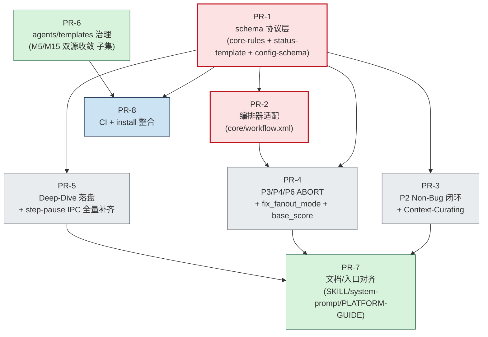

# Mobile B2C 质量工作流 — 施工文档（v4.1 修订版）

> **状态**：📋 **大纲草案 v0.1（待用户确认后逐 PR 展开）**
> **唯一上游输入**：[`QUALITY-AUDIT-REPORT-v1.2.1.md`](./QUALITY-AUDIT-REPORT-v1.2.1.md)
> **施工目标版本**：`v4.1`（小迭代，不破坏现有 schema_version=3 旧会话）
> **预算上限**：**5.2 人日**（与 v1.2.1 第十章落地动作清单一致）
> **撰写日期**：2026-04-20
> **本文性质**：施工蓝图 + 文件级 diff 对照 + DoD + 迁移脚本 + 回滚预案

---

## 0. 文档使用说明（Reading Guide）

- **本文档为"工程施工蓝图"**，不重复审计结论；任何缺陷描述均回链 v1.2.1 对应章节锚点。
- 每个 PR 段落遵循统一骨架：**修复条目 → 涉及文件 → 原文→新文 diff → DoD → 回滚**。
- 大纲阶段先冻结**结构、PR 切分、依赖拓扑、覆盖矩阵**；PR 内容（diff/迁移脚本细节）在用户确认大纲后逐 PR 填充。
- 编号约定：`B1*/B2/B3` = Blocker；`C1/C2/C5/C9/C10/C11` = Critical（v1.2.1 第七章"立刻修复"9 条）。

---

## 1. 改造范围与 Out-of-Scope

### 1.1 In-Scope（v4.1 必须落地的 9 条 Blocker/Critical）

| 缺陷 ID | 简述 | v1.2.1 锚点 | 工作量 | 归属 PR |
|---|---|---|---|---|
| B1* | Phase 早退 = ABORT 强协议 | §三 B1\* / §七 #1 | 0.7d | PR-1 + PR-2 + PR-3 + PR-4 |
| B2 | P2 Non-Bug 闭环回填 | §三 B2 / §七 #2 | 0.3d | PR-3 |
| B3 | Deep-Dive F1/F2/F3 默认落盘 | §三 B3 / §七 #3 | 0.2d | PR-5 |
| C1 | `<task>` 标签纳入 supported-tags | §三 C1 / §七 #4 | 0.1d | PR-1 |
| C2 | 共享基座 base_score / confidence_input 注入 | §三 C2 / §七 #5 | 0.5d | PR-4 |
| C5 | 状态枚举单一权威源扩展 | §三 C5 / §七 #6 | 0.4d | PR-1 |
| C9 | P6 失败分支必输出 verification-report | §三 C9 / §七 #7 | 0.2d | PR-4 |
| C10 | P4 字段隔离（fix_fanout_mode 新增） | §三 C10 / §七 #8 | 0.4d | PR-1 + PR-4 |
| C11 | step-pause result_field 协议 + 全部点位补齐 | §三 C11 / §七 #9 | 0.6d | PR-1 + PR-5 |
| — | 模板/agents 治理（M5/M11/M14/M15 部分前置） | §七 #9（部分） | 1.0d | PR-6 |
| — | 文档/入口对齐（system-prompt / SKILL / PLATFORM-GUIDE） | §三 C8 关联面 | 0.4d | PR-7 |
| — | install 脚本合并 + Schema CI | §七 #10 | 0.4d | PR-8 |
| **合计** | | | **5.2d** | |

### 1.2 Out-of-Scope（明确不在本次施工内）

> 以下条目延后到 v4.2 或更远迭代，本 PR 链路**禁止顺手改动**，避免 5.2d 失控：

- **本月内（Major 治理，v1.2.1 §七 第二段 #10–#19）**：M17 wrapper dimension 漂移（前瞻）、M3/M4/M6/M7/M8/M9/M12/M13/M16 等共 10 项 Major 修复
- **中期演进（Minor + 工程化，v1.2.1 §七 第三段 #20–#24）**：schema 一致性 CI 全量化、版本号统一为 SemVer、Skills 镜像源同步、deep-dive legacy 角色迁移
- **C3 → M17 已降级条目**：Deep-Dive 主路径未触发，本次不动
- **C4（coder-agent `Merged` 枚举漂移）/ C6（arbitrate_round_count 缺失）/ C7（non-code-fix 产物）/ C8（三处文档不一致）**：v1.2.1 §七 列入立刻修复但**用户确认本次仅做 9 条**，C4/C6/C7/C8 顺延到 v4.2
- **B1\* 的 Deep-Dive 子工作流 ABORT 协议**：v1.2.1 §三 B1\* 明确"另作独立审视（见 M9）"，本次不覆盖

> 🚧 **凡不在 §1.1 表中的修改一律拒绝合并**，由 PR Reviewer 把关。

---

## 2. 依赖拓扑图（Mermaid）

> 表达 PR 之间的"必须先于"关系。同一并行带（rank）内的 PR 可并行开发与评审。



### 2.1 拓扑约束说明

- **PR-1 是协议层基石**：所有引用 `current_phase_result` / `fix_fanout_mode` / `result_field` 等新字段的 PR 都必须等 PR-1 合入主干后再 rebase。
- **PR-2 必须先于 PR-4**：`core/workflow.xml` step 4 的 ABORT 分支契约定型后，PR-4 才能在 phases 里安全注入 `set current_phase_result = ABORT`。
- **PR-3/4/5 可并行开发**（需基于同一 PR-1+PR-2 base），评审顺序无强约束，合入顺序遵循"先 ABORT 再 IPC"以减少 review 噪音：建议 **PR-4 → PR-3 → PR-5**。
- **PR-7 是聚合派生**：等 PR-3/4/5 全部合入后再 rebase 同步入口文档，避免重复 review。
- **PR-6 与 PR-1~5 无字段依赖**，可独立开发；与 PR-8 顺序耦合（PR-8 的 CI 检测需要 PR-6 完成的双源收敛后才不会大量误报）。
- **PR-8 是收尾**：所有上游 PR 落定后再开 CI gate，避免 CI 在过渡期持续红灯。

---

## 3. PR 切分方案（8 PR 总览）

> 每个 PR 一段：**目标 / 修复条目 / 涉及文件清单（含计数） / 预估工作量 / 评审检查重点**。详细 diff 在 §4 展开。

### PR-1 · schema 协议层

- **目标**：把所有"新字段、新枚举、新参数"的 schema 定义一次落地，作为后续所有 PR 的契约基石。
- **覆盖修复条目**：B1\*（协议层规则）、C1、C5、C10（字段定义部分）、C11（result_field 参数定义部分）
- **涉及文件**（4 个，其中 1 个新增）：
  - `core/core-rules.xml`（修改：supported-tags 增 `<task>`；`<step-pause>` 增 `result_field` 参数；新增 `<workflow-result-protocol>` 章节定义 ABORT/CONTINUE 契约）
  - `core/workflow-status-template.yaml`（修改：增 `current_phase_result` / `fix_fanout_mode` / `phase_history` / `rca_fanout_mode_snapshot` / `user_inputs` 命名空间 / `current_state` 合法枚举集扩展）
  - `core/config-schema.yaml`（**新增**：`config_source` 单一权威源 schema，声明所有合法 `output_*` 键名）
  - `core/default-config.yaml`（修改：补齐 `output_curation_report` 等缺失键）
- **工作量**：0.6d
- **评审重点**：字段命名空间是否遵循"阶段名前缀隔离"；`current_state` 枚举是否覆盖 v1.2.1 §三 C5 列出的全部新值。

---

### PR-2 · 编排器适配新 schema

- **目标**：让 `core/workflow.xml` 能"识别并消费" PR-1 引入的新协议字段。
- **覆盖修复条目**：B1\*（编排器层 step 4 ABORT 兜底逻辑加固）、C11（step-pause 恢复后由编排器统一回写 `result_field` 的实现）
- **涉及文件**（1 个）：
  - `core/workflow.xml`（修改：step 4 ABORT 分支保持不变，新增"非 CONTINUE/ABORT 兜底"分支；新增 step-pause 恢复后 `<action>将用户回复写入 workflow_status.{result_field}</action>`；step 3 调用 phases 时显式传 `{issue_id}` / `{workflow_status}`，与 m9 修复对齐）
- **工作量**：0.3d
- **评审重点**：旧会话（`current_phase_result` 缺省 = null）能否被新分支安全降级为 CONTINUE；step-pause 恢复路径是否与 PR-1 的 `result_field` 完全对应。

---

### PR-3 · P2 闭环（Non-Bug + Context-Curating）

- **目标**：补齐 `phases/p2-spec-definition.md` 的 Non-Bug 反流闭环 + Context-Curating 状态机。
- **覆盖修复条目**：B2、C5（Context-Curating / Curation-Failed 在 phases 内的写入实现）、B1\*（P2 隐式 step-pause 注入 ABORT 标记 1 处）、C11（P2 step-pause 显式声明 `result_field=non_bug_user_choice`）
- **涉及文件**（1 个）：
  - `phases/p2-spec-definition.md`（修改：从 `system-prompt.md` 反向同步 Non-Bug step-pause + Accept/Reflow + 计数器闭环；step 4 增加 ABORT 标记；step 7 写 `current_state ∈ {Context-Curating, Curation-Failed}` 的同步 ABORT；step-pause 标签增加 `result_field` 显式声明）
- **工作量**：0.4d（含 B2 0.3d + B1\* P2 部分 0.05d + C11 P2 部分 0.05d）
- **评审重点**：与 `system-prompt.md` 的 Phase 2 字段集逐字段对齐；`non_bug_reflow_count > 2 → Human-Review` 兜底是否存在。

---

### PR-4 · P3/P4/P6 ABORT 与字段隔离

- **目标**：完成 B1\* 主体（P3 ×4 + P6 ×1 共 5 处显式 ABORT 标记）+ C10 字段隔离 + C9 失败分支产物 + C2 base_score/confidence_input 注入。
- **覆盖修复条目**：B1\*（P3/P6 显式 ABORT 5 处）、C2、C9、C10
- **涉及文件**（3 个）：
  - `phases/p3-root-cause.md`（修改：4 处 `阶段结束，返回编排器` 前插入 `<action>设置 current_phase_result = ABORT</action>`；step 7 新增 `<action>更新 {workflow_status}：rca_fanout_mode_snapshot = {fanout_mode}</action>` 作为 C10 兼容性方案 B 的快照；调用 investigator/challenger/arbiter 的 subagent_prompt 拼接 `base_score = {上游 final_score 列表}`）
  - `phases/p4-fix-design.md`（修改：把 `fanout_mode = {fix_strategy_mode}` 与 `fanout_mode = contested-arbitrated` 全部改为 `fix_fanout_mode = ...`，**强制阶段间字段隔离**；调用 fix-proposer/challenger/arbiter 的 subagent_prompt 拼接 `confidence_input`）
  - `phases/p6-verification.md`（修改：1 处 `阶段结束，返回编排器` 前插入 ABORT 标记；失败分支必先调用 `<template-output>` 生成"中间态" verification-report.md 再回流）
- **工作量**：1.0d（B1\* 主体 0.6d + C2 0.2d + C9 0.1d + C10 0.1d）
- **评审重点**：5 处 ABORT 标记的"行号→修订前位置"是否完整；`fanout_mode → fix_fanout_mode` 是否漏改；C9 中间态报告字段是否充分（含失败分类/证据/复现路径）。

---

### PR-5 · Deep-Dive 落盘 + IPC

- **目标**：B3 默认产物落盘 + C11 在 Deep-Dive 与主链路其他 step-pause 点位的全量补齐。
- **覆盖修复条目**：B3、C11（除 P2 之外的全部 step-pause 点位）
- **涉及文件**（待精确统计，预估 4-6 个）：
  - `functionality-deep-dive/core/default-config.yaml`（修改：`emit_topology_report` / `emit_concurrency_report` / `emit_environment_factor_report` 默认值翻为 true）
  - `core/default-config.yaml`（修改：同步 `deep_dive_optional_artifacts` 块对齐，避免主→子翻转后再次冲突）
  - `phases/p4-fix-design.md`（修改：step 5 "是否进入修复实施" step-pause 增加 `result_field` 声明）
  - `functionality-deep-dive/phases/f4-isolation-debate.md`（修改：F4 的中断决策 step-pause 增加 `result_field` 声明）
  - 其他 step-pause 点位（PR 开发时 grep `<step-pause` 全量罗列后填充）
- **工作量**：0.7d（B3 0.2d + C11 剩余 0.5d）
- **评审重点**：B3 与 PR-1 的 config-schema.yaml 对应键是否一致；step-pause `result_field` 命名是否全部纳入 `workflow-status-template.yaml.user_inputs` 命名空间。

---

### PR-6 · agents/templates 治理

- **目标**：把"立刻修复 9 条"中带出的 agents/templates 调整聚合到本 PR，避免散落到 PR-3/4/5。**严格不超出 9 条修复链路**。
- **覆盖修复条目**：C2（wrapper 校验 `[Schema-Violation]` 输出实现）、C9（templates/verification-report.md 增"中间态"字段段）
- **涉及文件**（预估 3-4 个）：
  - `agents/shared-arbiter-base.md`（修改：缺 `base_score` 时输出 `[Schema-Violation]`；与 C2 配套）
  - `agents/shared-challenger-base.md`（修改：缺 `confidence_input` 时输出 `[Schema-Violation]`）
  - `templates/verification-report.md`（修改：新增"中间态报告（失败回流时使用）"段，含 `failure_classification` / `evidence` / `repro_path`）
  - 其他必要的 wrapper 字段对齐（PR 开发时按 §4.6 逐文件确认）
- **工作量**：0.5d
- **评审重点**：M5/M11/M14/M15 等 Major 治理**仅做与 9 条修复直接联动的最小子集**，其余 Major 顺延 v4.2。

---

### PR-7 · 文档/入口对齐

- **目标**：把 PR-1~5 引入的新字段、新协议、新枚举同步到三处入口文档。
- **覆盖修复条目**：与 9 条修复联动的入口同步（**不解决 C8 全量**，仅同步本次涉及字段）
- **涉及文件**（3 个）：
  - `SKILL.md`（修改：字段说明同步新增 `current_phase_result` / `fix_fanout_mode` / `phase_history` / `user_inputs`）
  - `system-prompt.md`（修改：Phase 2 与 phases/p2 已对齐，反向 sync 时本文件可能仅微调；状态机图补 Context-Curating / Curation-Failed）
  - `PLATFORM-GUIDE.md`（修改：最少持久化字段列表从 7 个扩展到覆盖新字段集）
- **工作量**：0.4d
- **评审重点**：三处入口的字段表是否与 `core/workflow-status-template.yaml` 完全一致（diff 对照表必须贴在 PR description）。

---

### PR-8 · CI + install 整合

- **目标**：建立"protect against regression"的最小 CI 守门 + install 脚本合并。
- **覆盖修复条目**：M16（config_source 键漂移检测）、m1（install 脚本合并）—— **属于 v1.2.1 §七 #10 的最小子集，不做 §七 #20 的全量 schema CI**
- **涉及文件**（预估 4 个，其中 2-3 个新增）：
  - `install.sh`（修改：合并 `install_trae.sh` 为 `install.sh --target=cursor|trae|both`）
  - `install_trae.sh`（**删除**或保留为 `exec install.sh --target=trae` 的 shim）
  - `.github/workflows/qa-workflow-schema-check.yml`（**新增**或对应仓库 CI 配置）
  - `scripts/check-config-schema.sh`（**新增**：扫描 phases 中"更新 config_source"动作，校验键名在 `core/config-schema.yaml` 中存在）
- **工作量**：0.4d
- **评审重点**：CI 必须 `fail-fast` 但不应阻塞 v4.1 之前的旧分支；install shim 是否保持向后兼容（旧 `bash install_trae.sh` 调用仍成功）。

---

## 4. 每个 PR 的详细施工单（文件级 "原文→新文" diff 对照）

> ⚠️ **本节为占位结构，待大纲确认后逐 PR 填充**。每个 PR 的施工单遵循统一骨架：

### 4.x 通用骨架

```
4.x.1 PR 元信息
  - 分支命名：feat/qa-workflow-v4.1-pr{N}-{slug}
  - Base：main（或上游 PR 合入后的 main）
  - Reviewer：…
  - 关联 issue：…

4.x.2 文件级 diff 列表
  - 文件 A：
    - 修改类型：[新增 | 修改 | 删除 | 重命名]
    - 修复条目锚点：[B1*/C10/...]
    - 原文（含行号 LINE_NUMBER|CONTENT）：…
    - 新文：…
    - 修订理由：…
    - 兼容性影响：…
  - 文件 B：…

4.x.3 PR-level DoD 子集（链接到 §5）
4.x.4 PR-level 回滚动作（链接到 §7）
```

### 4.1 PR-1 详细施工单（待填充）
### 4.2 PR-2 详细施工单（待填充）
### 4.3 PR-3 详细施工单（待填充）
### 4.4 PR-4 详细施工单（待填充）
### 4.5 PR-5 详细施工单（待填充）
### 4.6 PR-6 详细施工单（待填充）
### 4.7 PR-7 详细施工单（待填充）
### 4.8 PR-8 详细施工单（待填充）

---

## 5. 验证标准（Definition of Done）

> 三层验证：**静态契约校验** → **动态用例（手工 + LLM 重放）** → **回归矩阵**。每个 PR 的 DoD 必须在 PR description 勾选完成。

### 5.1 静态契约校验（每个 PR 必跑）

- [ ] **Schema 自洽**：`core/workflow-status-template.yaml` 中所有 `current_state` 取值必须在 `core-rules.xml` 或 schema 注释中定义；反之亦然
- [ ] **配置键名注册**：所有 phases 中"更新 config_source"动作的键，必须在 `core/config-schema.yaml` 中存在（PR-8 CI 强制）
- [ ] **标签白名单**：所有 `*.xml` / `*.md` 中使用的标签必须在 `core-rules.xml` `<supported-tags>` 中（含 `<task>`）
- [ ] **字段隔离**：grep `fanout_mode` 不应在 P4/P5/P6 出现（仅允许 `rca_fanout_mode` / `fix_fanout_mode` / 历史快照字段）
- [ ] **ABORT 标记完整**：`phases/p{2,3,6}-*.md` 中每个早退点位前必须有 `<action>设置 current_phase_result = ABORT</action>` 或等价显式语句

### 5.2 动态用例（关键回归路径）

> 用 LLM 重放器执行下列脚本，断言 `workflow-status.yaml` 终态字段集合：

#### 5.2.1 用例 A · B1\* P3 RCA 低置信回流
- **输入**：模拟 P3 RCA 置信度 < 0.6
- **期望**：`current_state = RCA-LowConfidence`、`current_phase_result = ABORT`、`stepsCompleted` **不包含** `qa-root-cause`
- **失败模式**：若 `stepsCompleted` 包含 `qa-root-cause`，B1\* 未修复

#### 5.2.2 用例 B · B2 P2 Non-Bug 反流
- **输入**：模拟 P2 判定 Working-As-Designed
- **期望**：触发 step-pause、`current_state = Non-Bug`、`non_bug_user_choice` 字段被写入；用户选 Reflow 后 `non_bug_reflow_count = 1`；连续 3 次后触发 Human-Review

#### 5.2.3 用例 C · C10 P3→P4→P6→P3 字段污染
- **输入**：完整 P3→P4→P6 失败回流到 P3 链路
- **期望**：P3 重入时读到的 `fanout_mode` 与 P3 完成时一致（通过 `rca_fanout_mode_snapshot` 还原）；`fix_fanout_mode` 字段独立可见
- **失败模式**：若 P3 重入时升级判断 switch 落入 default 分支，C10 未修复

#### 5.2.4 用例 D · C11 step-pause 写回
- **输入**：P2 / P4 / F4 各一处 step-pause 触发
- **期望**：用户回复后 `workflow_status.{result_field}` 被正确写入

#### 5.2.5 用例 E · B3 Deep-Dive 落盘
- **输入**：触发 Deep-Dive F1→F2→F3→F4 链路
- **期望**：`topology_report.md` / `concurrency_report.md` / `environment_factor_report.md` 三个文件物理存在，F4 入参可读取

#### 5.2.6 用例 F · C9 P6 失败分支产物
- **输入**：P6 验证失败
- **期望**：`verification-report.md` 物理存在，且包含 `failure_classification` 字段

### 5.3 回归矩阵（兼容性守门）

| 场景 | 旧 schema_version=3 会话 | 新 schema_version=4 会话 |
|---|---|---|
| 启动新 issue | N/A | 必须使用新协议字段 |
| 恢复存量会话（无 `current_phase_result` 字段） | 默认按 CONTINUE 处理（PR-2 兜底） | N/A |
| 恢复存量会话（无 `phase_history`） | 迁移脚本 §6 补齐 | N/A |
| 旧 `fanout_mode` 写法 | 迁移脚本 §6 拆分到 `rca_fanout_mode` / `fix_fanout_mode` | 拒绝（CI 报错） |

---

## 6. 会话迁移脚本（`migrate-workflow-status-v3-to-v4.py`）

### 6.1 脚本职责

把 `schema_version: 3` 的存量 `workflow-status.yaml` 升级到 `schema_version: 4`，覆盖：

1. 注入新字段：`current_phase_result: null` / `phase_history: []` / `rca_fanout_mode_snapshot: null` / `user_inputs: {}` / `fix_fanout_mode: null`
2. 拆分 `fanout_mode`：根据 `current_state` 与 `fanout_mode` 取值映射到 `rca_fanout_mode` 或 `fix_fanout_mode`（详见 §6.3 决策表）
3. 修复 `stepsCompleted` 失锚：若 `current_state ∈ {Info-Insufficient, Spec-Uncertain, Non-Bug, RCA-LowConfidence, Curation-Failed, Boundary-Refined, Human-Review}` 则剥离 `stepsCompleted` 末尾一项（B1\* Compatibility 章节）
4. `config_source` 非法键转写到 `extras.*` 命名空间（M16 Compatibility）

### 6.2 接口契约

```bash
python3 scripts/migrate-workflow-status-v3-to-v4.py \
    --input <path>/workflow-status.yaml \
    [--output <path>/workflow-status.yaml] \
    [--dry-run] \
    [--verbose] \
    [--strict | --best-effort]

# 退出码：
#   0 = 迁移成功（或 dry-run 无需迁移）
#   1 = 迁移失败（IO/解析错误）
#   2 = 迁移完成但需人工核验（如 fanout_mode 无法可靠还原 rca_fanout_mode_snapshot）
#   3 = strict 模式下检测到不可迁移字段
```

### 6.3 关键决策表（fanout_mode 拆分，对应 v1.2.1 C10 方案 A/B/C）

| 当前状态 | `fanout_mode` 取值 | 决策 | 来源 |
|---|---|---|---|
| `current_state ∈ {RCA-*}` | `simple-single` / `medium-challenge` / `complex-arbitrated` | 直接迁移到 `rca_fanout_mode` | 方案 A 直接判定 |
| `current_state ∈ {Fix-Designing, Fix-Implementing, Verifying}` | `single-proposer` / `challenged-proposer` / `contested-arbitrated` | 迁移到 `fix_fanout_mode`；同时尝试从 `phase_history` 中检索最近一次 P3 完成时的 RCA 值 → `rca_fanout_mode` | 方案 A（推荐） |
| 同上 | 同上 | 若 `phase_history` 为空且无 `rca_fanout_mode_snapshot` | 方案 C：标记 `_migration_warning: rca_fanout_mode_unrecoverable`，退出码 2 | v1.2.1 C10 兜底 |
| `fanout_mode = contested-arbitrated` 且 `current_state` 含糊 | 歧义共名 | 强制走 `phase_history` 反推；查不到则退出码 2 | v1.2.1 §九 第 2 条 |

### 6.4 dry-run 输出格式（人类可读）

```
[DRY RUN] migrate-workflow-status-v3-to-v4
────────────────────────────────────────
Input : .qa/issue-XXX/workflow-status.yaml
Schema: 3 → 4

Field changes (will apply):
  + current_phase_result        : null
  + phase_history               : []
  + rca_fanout_mode_snapshot    : null
  + user_inputs                 : {}
  + fix_fanout_mode             : null
  ~ fanout_mode (single-proposer) → fix_fanout_mode (single-proposer)
  ⚠ rca_fanout_mode             : UNRECOVERABLE (需人工核验)
  ~ stepsCompleted              : [..., qa-root-cause] → [...]  (B1* 失锚修复)

Exit code (would be): 2
```

### 6.5 单元测试矩阵

| 测试用例 | 输入 fixture | 期望输出 |
|---|---|---|
| 全新 v3 文件、状态健康 | `tests/fixtures/v3-clean.yaml` | 退出码 0，新增字段全部 null/空 |
| `current_state = RCA-LowConfidence` 且 `stepsCompleted` 含 P3 | `tests/fixtures/v3-aborted-p3.yaml` | 剥离末尾，退出码 0 |
| `fanout_mode = single-proposer` 且 `phase_history` 含 P3 | `tests/fixtures/v3-fix-with-history.yaml` | 双字段拆分，退出码 0 |
| `fanout_mode = single-proposer` 但无 `phase_history` | `tests/fixtures/v3-fix-no-history.yaml` | 标记警告，退出码 2 |
| 文件不可解析 | `tests/fixtures/v3-malformed.yaml` | 退出码 1 |

---

## 7. 回滚预案（每个 PR 的 git revert 后状态描述）

> 每个 PR 都设计为 **`git revert <merge-commit>` 后系统返回到合理可用状态**，不留半成品。

### 7.1 PR-1 回滚

- **revert 后状态**：`core-rules.xml` 失去 `<task>` 白名单 → 严格平台再次报 schema-violation；`workflow-status-template.yaml` 缺新字段 → 已合入的 PR-2~5 无法消费协议字段
- **风险等级**：🔴 高 — PR-1 是协议基石，**禁止单独 revert**；如需回滚必须连同 PR-2/3/4/5 一起 revert
- **建议操作**：若 PR-1 出现严重缺陷，走 **新 commit 修补**而非 revert
- **回滚 SQL**（伪代码）：`git revert <PR-5> <PR-4> <PR-3> <PR-2> <PR-1>` 顺序 revert 5 个 merge commit

### 7.2 PR-2 回滚

- **revert 后状态**：`core/workflow.xml` 回到旧 step 4 逻辑 → 新协议字段被忽略，但旧分支 ABORT 行为保留
- **风险等级**：🟡 中 — 已合入的 PR-3/4/5 中的 `current_phase_result = ABORT` 标记会"无人消费"但不会破坏旧路径；step-pause `result_field` 写回失效
- **建议操作**：单独 revert 可行，但需在监控中关注 step-pause 的用户回复丢失情况
- **回滚 SQL**：`git revert <PR-2-merge-commit>`

### 7.3 PR-3 回滚

- **revert 后状态**：`phases/p2-spec-definition.md` 回到 v1.2.1 描述的 Non-Bug 闭环缺失态；P2 Context-Curating 无 ABORT 标记
- **风险等级**：🟢 低 — Skill 平台 Non-Bug 路径回到"静默漏处理"（v1.2.1 B2 Failure Mode），但不影响其他链路
- **回滚 SQL**：`git revert <PR-3-merge-commit>`

### 7.4 PR-4 回滚

- **revert 后状态**：P3/P6 的 ABORT 标记 5 处全部消失 → B1\* 主链路根因复发；`fix_fanout_mode` 字段消失 → C10 字段污染复发；P6 失败分支不再产出 verification-report.md
- **风险等级**：🟡 中 — 影响面广但所有现象都是 v1.2.1 已识别的旧故障，工程团队可识别并定位
- **回滚 SQL**：`git revert <PR-4-merge-commit>`，并通知存量会话使用迁移脚本回退（**注意：迁移脚本不支持 v4→v3 反向迁移**，需手工或恢复备份）

### 7.5 PR-5 回滚

- **revert 后状态**：Deep-Dive 默认产物落盘关闭 → F4 输入再次丢失（B3 复发）；其他 step-pause 点位 result_field 缺失
- **风险等级**：🟢 低 — Deep-Dive 调用频率较低，影响可控
- **回滚 SQL**：`git revert <PR-5-merge-commit>`

### 7.6 PR-6 回滚

- **revert 后状态**：wrapper 不再校验 `[Schema-Violation]`；templates/verification-report.md 失去"中间态"段
- **风险等级**：🟢 低 — 不破坏运行链路，只回到"双源维护"风险
- **回滚 SQL**：`git revert <PR-6-merge-commit>`

### 7.7 PR-7 回滚

- **revert 后状态**：SKILL.md / system-prompt.md / PLATFORM-GUIDE.md 字段表回到 v1.2.1 描述的不一致状态
- **风险等级**：🟢 低 — 仅文档漂移，不影响运行
- **回滚 SQL**：`git revert <PR-7-merge-commit>`

### 7.8 PR-8 回滚

- **revert 后状态**：CI schema 守门关闭，install 脚本回到双脚本维护
- **风险等级**：🟢 低 — 失去未来防漂移能力，但无运行时影响
- **回滚 SQL**：`git revert <PR-8-merge-commit>`

### 7.9 全链路灾难性回滚（极端情况）

> 若 v4.1 上线后出现不可控故障，按以下顺序快速回滚到 v4.0：

```bash
git revert <PR-8> <PR-7> <PR-6> <PR-5> <PR-4> <PR-3> <PR-2> <PR-1>
git push origin main
# 通知所有进行中会话停用 v4.1 schema_version=4 字段
# 备份 v4 schema 的 workflow-status.yaml 文件，等待修复后重新迁移
```

---

## 附录 A：v1.2.1 锚点对照表

| 本文档章节 | v1.2.1 来源章节 |
|---|---|
| §1.1 修复条目 | v1.2.1 §七 立刻修复 #1–#9 |
| §1.2 Out-of-Scope | v1.2.1 §七 本月内 #10–#19 + 中期演进 #20–#24 |
| §3 PR 切分（缺陷映射） | v1.2.1 §三 缺陷台账（B1\*/B2/B3/C1/C2/C5/C9/C10/C11） |
| §5.2 用例 A–F | v1.2.1 §三 各缺陷的 Repro 字段 |
| §6.3 fanout_mode 拆分决策表 | v1.2.1 §三 C10 Compatibility 方案 A/B/C |
| §7 回滚预案 | v1.2.1 §三 各缺陷的 Compatibility 字段 |

## 附录 B：未决问题清单（待用户确认大纲时拍板）

1. **PR-3/4/5 合入顺序**：建议 PR-4 → PR-3 → PR-5（理由：先 ABORT 协议主链路，再 Non-Bug 闭环，最后 Deep-Dive）。是否采纳？
2. **C10 兼容性方案选择**：本大纲默认方案 A（依赖 B1\* 引入 `phase_history`）+ 方案 B（P3 step 7 写 `rca_fanout_mode_snapshot` 双保险）。是否需要再缩到只用方案 A？
3. **PR-6 Major 治理边界**：当前仅纳入 C2 wrapper 校验 + C9 中间态模板。是否需要把 M11/M14 也顺手做？（若做，工作量 +0.3d，超 5.2d 预算）
4. **CI 起点**：PR-8 是否在仓库根新建 `.github/workflows/`？（仓库当前是否已有 GitHub Actions？需要确认）
5. **install_trae.sh 处理方式**：删除 / 改为 shim / 保留 + 弃用 warning。三选一。
6. **迁移脚本物理位置**：`mobile-qa-workflow/scripts/migrate-workflow-status-v3-to-v4.py` 还是 `scripts/`？
7. **回滚链中 PR-1 的"禁止单独 revert"约束**：是否需要在 GitHub branch protection 里强制？

---

> **大纲版本**：v0.1
> **下一步**：等待用户确认 §1（范围）、§2（拓扑）、§3（PR 切分）、§5（DoD）、§6（迁移脚本接口）、§7（回滚）六项关键骨架，确认后逐 PR 展开 §4 详细施工单。
