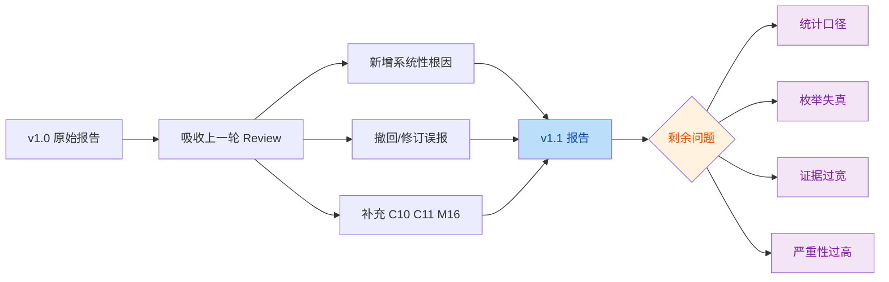

# `QUALITY-AUDIT-REPORT-v1.1.md` Review Report

> 审阅对象：[QUALITY-AUDIT-REPORT-v1.1.md](file:///Users/bytedance/Code/loupe/mobile-qa-workflow/QUALITY-AUDIT-REPORT-v1.1.md)
>
> 审阅目标：确认 v1.1 是否正确吸收上一轮 review 结论，并检查是否仍存在事实性错误、统计口径问题、严重性定级过高或证据链过宽的问题。

## 结论

- v1.1 相比 v1.0 有明显进步：已经撤回 `m7`、修正 `M5`、补入 `C10/C11/M16`，也把“单一权威源治理”和 “ABORT vs CONTINUE”上升成了系统性章节。
- 但当前版本仍有 **4 个需要修订的 review 级问题**：
  - 1 个统计口径冲突
  - 1 个源码枚举名写错
  - 1 个证据链范围过宽
  - 1 个严重性定级过高

## 意图判断

- 作者意图：将 v1.0 从“点状缺陷罗列”升级为“经过复核后的工程化审计报告”，重点补强系统性根因、治理策略和兼容性说明。

## 变更流

## Findings

| No. | Issue Title | Suggestion | Code Link |
|-----|-------------|------------|-----------|
| 1 | `92` 项总数与实际台账条目数口径冲突 | 将 `L45-L57` 的统计明确改成“按模块影响计数，允许重复”，并额外给出“唯一问题数” | [QUALITY-AUDIT-REPORT-v1.1.md:L45-L57](file:///Users/bytedance/Code/loupe/mobile-qa-workflow/QUALITY-AUDIT-REPORT-v1.1.md#L45-L57) |
| 2 | `C10` 使用了源码中不存在的 Fix 枚举名 | 将 `single-design / parallel-3` 更正为真实枚举 `single-proposer / challenged-proposer`，避免削弱可复现性 | [QUALITY-AUDIT-REPORT-v1.1.md:L175-L194](file:///Users/bytedance/Code/loupe/mobile-qa-workflow/QUALITY-AUDIT-REPORT-v1.1.md#L175-L194) |
| 3 | `B1*` 的证据链把 `F5` 也并入 `ABORT` 问题，范围过宽 | 收窄证据集，主打主编排器 `workflow.xml` + `P3/P6` + Deep-Dive 编排器的 `stepsCompleted` 机制；不要把 `F5` 的正常短路完成混入同一故障模式 | [QUALITY-AUDIT-REPORT-v1.1.md:L72-L94](file:///Users/bytedance/Code/loupe/mobile-qa-workflow/QUALITY-AUDIT-REPORT-v1.1.md#L72-L94) |
| 4 | `C3` 把潜在契约漂移写成了当前运行时故障，严重性偏高 | 将 `C3` 从 `Critical` 下调为 `Major`，或明确标注“当前主路径未触发，仅为潜在/遗留契约风险” | [QUALITY-AUDIT-REPORT-v1.1.md:L133-L138](file:///Users/bytedance/Code/loupe/mobile-qa-workflow/QUALITY-AUDIT-REPORT-v1.1.md#L133-L138) |

## Evidence

### 1. 统计口径冲突

- 报告在模块级雷达图中给出合计 `5 Blocker + 21 Critical + 39 Major + 27 Minor = 92`，见 [QUALITY-AUDIT-REPORT-v1.1.md:L45-L57](file:///Users/bytedance/Code/loupe/mobile-qa-workflow/QUALITY-AUDIT-REPORT-v1.1.md#L45-L57)。
- 但缺陷台账实际列出的活跃条目数只有：
  - `Blocker` 3 个，见 [QUALITY-AUDIT-REPORT-v1.1.md:L70-L112](file:///Users/bytedance/Code/loupe/mobile-qa-workflow/QUALITY-AUDIT-REPORT-v1.1.md#L70-L112)
  - `Critical` 11 个，见 [QUALITY-AUDIT-REPORT-v1.1.md:L115-L219](file:///Users/bytedance/Code/loupe/mobile-qa-workflow/QUALITY-AUDIT-REPORT-v1.1.md#L115-L219)
  - `Major` 16 个，见 [QUALITY-AUDIT-REPORT-v1.1.md:L223-L289](file:///Users/bytedance/Code/loupe/mobile-qa-workflow/QUALITY-AUDIT-REPORT-v1.1.md#L223-L289)
  - `Minor` 13 个（已撤回 `m7`），见 [QUALITY-AUDIT-REPORT-v1.1.md:L293-L310](file:///Users/bytedance/Code/loupe/mobile-qa-workflow/QUALITY-AUDIT-REPORT-v1.1.md#L293-L310)
- 问题不在“算错”，而在“**没有说明 92 是按模块重复计数**”，读者会自然把它理解成唯一问题数。

### 2. `C10` 枚举名写错，但主结论仍成立

- 报告 `C10` 的失败模式/复现场景中写了不存在的 Fix 枚举：`single-design / parallel-3 / contested-arbitrated`，见 [QUALITY-AUDIT-REPORT-v1.1.md:L190-L193](file:///Users/bytedance/Code/loupe/mobile-qa-workflow/QUALITY-AUDIT-REPORT-v1.1.md#L190-L193)。
- 源码里真实枚举是：
  - `single-proposer / challenged-proposer / contested-arbitrated`，见 [p4-fix-design.md:L29-L36](file:///Users/bytedance/Code/loupe/mobile-qa-workflow/phases/p4-fix-design.md#L29-L36)
  - 同样可由策略知识库确认，见 [fix-strategies.md:L5-L9](file:///Users/bytedance/Code/loupe/mobile-qa-workflow/reference/fix-strategies.md#L5-L9)
- 不过 `C10` 的核心判断仍然是对的：P4 确实把 `fix_strategy_mode` 写进了 `fanout_mode`，见 [p4-fix-design.md:L33-L38](file:///Users/bytedance/Code/loupe/mobile-qa-workflow/phases/p4-fix-design.md#L33-L38)。

### 3. `B1*` 证据链过宽

- `B1*` 把 `functionality-deep-dive/phases/f5-defensive-fix-design.md` 也列入“早退必须 ABORT”的问题集合，见 [QUALITY-AUDIT-REPORT-v1.1.md:L72-L74](file:///Users/bytedance/Code/loupe/mobile-qa-workflow/QUALITY-AUDIT-REPORT-v1.1.md#L72-L74)。
- 但 `F5` 的这条路径实际上是：
  - `Need Defensive Fix != Yes` 时，直接“跳过附录生成，保留当前 RCA 结论即可”，并写 `current_state = DD-Completed`，见 [f5-defensive-fix-design.md:L24-L29](file:///Users/bytedance/Code/loupe/mobile-qa-workflow/functionality-deep-dive/phases/f5-defensive-fix-design.md#L24-L29)
- 这更像“**正常短路完成**”，不是主工作流 P3/P6 那种“失败/回流/低置信后返回编排器却没设 `ABORT`”的同一故障模式。
- 建议保留 `B1*` 主结论，但把证据集中在更强的三处：
  - 主编排器只在 `current_phase_result == ABORT` 时保留 `stepsCompleted`，见 [workflow.xml:L89-L95](file:///Users/bytedance/Code/loupe/mobile-qa-workflow/core/workflow.xml#L89-L95)
  - `P3` 多处“阶段结束，返回编排器”但未设 `ABORT`，见 [p3-root-cause.md:L24-L30](file:///Users/bytedance/Code/loupe/mobile-qa-workflow/phases/p3-root-cause.md#L24-L30) 与 [p3-root-cause.md:L56-L65](file:///Users/bytedance/Code/loupe/mobile-qa-workflow/phases/p3-root-cause.md#L56-L65)
  - `P6` 同类问题，见 [p6-verification.md:L68-L84](file:///Users/bytedance/Code/loupe/mobile-qa-workflow/phases/p6-verification.md#L68-L84)

### 4. `C3` 严重性定级过高

- 报告 `C3` 的写法会让读者以为 Deep-Dive 当前运行链路会直接撞上主流程 `challenger` wrapper 的校验失败，见 [QUALITY-AUDIT-REPORT-v1.1.md:L133-L138](file:///Users/bytedance/Code/loupe/mobile-qa-workflow/QUALITY-AUDIT-REPORT-v1.1.md#L133-L138)。
- 但 Deep-Dive 当前真正调用的是：
  - 共享基座 `shared-challenger-base.md`
  - 共享基座 `shared-arbiter-base.md`
  - 专项角色 `deep-dive-arbiter.md`
  - 见 [f4-isolation-debate.md:L43-L54](file:///Users/bytedance/Code/loupe/mobile-qa-workflow/functionality-deep-dive/phases/f4-isolation-debate.md#L43-L54)
- 主流程 `challenger.md` wrapper 只覆盖 `RCA / FIX`，见 [challenger.md:L12-L18](file:///Users/bytedance/Code/loupe/mobile-qa-workflow/agents/challenger.md#L12-L18)，但当前 Deep-Dive 主路径并没有去加载它。
- 因此这个问题更准确的定性应是：
  - “共享基座与主 wrapper 的枚举契约存在潜在漂移”
  - 而不是“当前 Deep-Dive 主路径会因此直接故障”

## Open Questions

- `92` 是否作者有意表达“按模块累计影响次数”，而不是“唯一问题数”？如果是，建议在标题中显式写出“模块命中次数”。
- `C3` 是否想表达“若未来复用主 wrapper 到 DEEP_DIVE，会触发非法枚举”？如果是，应改成前瞻性风险，而不是当前故障。

## Summary

- v1.1 已经明显优于 v1.0，尤其是在误报回撤、系统性根因抽象、治理章节补齐方面。
- 当前剩余问题主要不是“方向错了”，而是“**报告工程学**还差最后一层收口”：
  - 指标口径要自洽
  - 枚举值要完全贴源码
  - 证据链要避免过度外扩
  - 严重性要区分“当前故障”与“潜在风险”
- 建议把本报告修成 `v1.1.1`，工作量很小，但能显著提升专业可信度。

