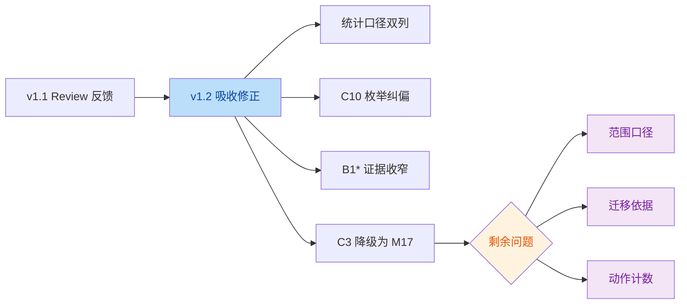

# `QUALITY-AUDIT-REPORT-v1.2.md` Review Report

> 审阅对象：[QUALITY-AUDIT-REPORT-v1.2.md](file:///Users/bytedance/Code/loupe/mobile-qa-workflow/QUALITY-AUDIT-REPORT-v1.2.md)
>
> 审阅目标：确认 `v1.2` 是否已正确吸收 `v1.1 review` 的 4 项反馈，并检查当前版本是否仍存在事实性错误、统计口径问题或修复建议超出源码证据支撑的问题。

## 结论

- `v1.2` 相比 `v1.1` 继续进步，已经正确修复了上一轮 review 的 4 个核心问题：
  - 明确了 `92` 与 `43` 的双口径统计
  - 修正了 `C10` 的 Fix 枚举名
  - 收窄了 `B1*` 的证据链
  - 将 `C3` 正确降级为前瞻性风险 `M17`
- 当前剩余问题已经不再是“高严重事实错误”，而是 **3 个报告工程学层面的收口问题**：
  - 1 个审计范围口径不够严谨
  - 1 个兼容性迁移方案超出当前仓库可验证证据
  - 1 个动作清单内部计数自相矛盾

## 意图判断

- 作者意图：把 `v1.2` 打磨成一份“结论更准、口径更稳、可直接指导治理”的正式审计报告，因此本轮主要修正的是报告方法学，而不是继续扩张缺陷数量。

## 审阅流

## Findings

| No. | Issue Title | Suggestion | Code Link |
|-----|-------------|------------|-----------|
| 1 | “全部 74 个文件”仍缺少排除口径说明 | 将标题改成“审计对象为 74 个工作流源码文件，不含后续生成的审计/评审文档”，避免与目录当前文件总数混淆 | [QUALITY-AUDIT-REPORT-v1.2.md:L3-L7](file:///Users/bytedance/Code/loupe/mobile-qa-workflow/QUALITY-AUDIT-REPORT-v1.2.md#L3-L7) |
| 2 | `C10` 的兼容性方案引用了仓库中不存在的 `phase_history` | 改成“当前无法可靠自动还原旧 `rca_fanout_mode`，除非先引入历史字段”；不要把 `phase_history` 写成现有迁移依据 | [QUALITY-AUDIT-REPORT-v1.2.md:L221-L224](file:///Users/bytedance/Code/loupe/mobile-qa-workflow/QUALITY-AUDIT-REPORT-v1.2.md#L221-L224) |
| 3 | 落地动作清单第 1 项把“5 处”与“共 6 处”写在同一行，计数自相矛盾 | 明确区分“显式返回编排器点位 = 5 处”和“需补 `ABORT` 的潜在点位 = 6 处”，或统一只保留一种统计方式 | [QUALITY-AUDIT-REPORT-v1.2.md:L507-L508](file:///Users/bytedance/Code/loupe/mobile-qa-workflow/QUALITY-AUDIT-REPORT-v1.2.md#L507-L508) |

## Evidence

### 1. 审计范围口径仍偏硬

- `v1.2` 顶部写的是“`mobile-qa-workflow/` 全部 74 个文件”，见 [QUALITY-AUDIT-REPORT-v1.2.md:L3-L7](file:///Users/bytedance/Code/loupe/mobile-qa-workflow/QUALITY-AUDIT-REPORT-v1.2.md#L3-L7)。
- 但附录覆盖清单实际列举的是“工作流源码资产”，并未包含同目录下后续生成的审计文档，见 [QUALITY-AUDIT-REPORT-v1.2.md:L533-L540](file:///Users/bytedance/Code/loupe/mobile-qa-workflow/QUALITY-AUDIT-REPORT-v1.2.md#L533-L540)。
- 当前目录实际文件数已高于 `74`；因此这里的问题不是“报告一定算错”，而是“**没有把 74 的统计口径写清楚**”。
- 建议改成：
  - “审计对象为 74 个工作流源码文件”
  - 或 “不含 `QUALITY-AUDIT-*.md` 审计衍生文档”

### 2. `C10` 兼容性方案超出了当前仓库可验证证据

- `v1.2` 在 `C10` 的兼容性中写道，可从 `phase_history / lastStep` 反推旧 `rca_fanout_mode`，见 [QUALITY-AUDIT-REPORT-v1.2.md:L224-L224](file:///Users/bytedance/Code/loupe/mobile-qa-workflow/QUALITY-AUDIT-REPORT-v1.2.md#L224-L224)。
- 但当前仓库里：
  - `workflow-status-template.yaml` 只有 `stepsCompleted` 与 `lastStep`，没有 `phase_history`，见 [workflow-status-template.yaml:L14-L18](file:///Users/bytedance/Code/loupe/mobile-qa-workflow/core/workflow-status-template.yaml#L14-L18)
  - 主编排器也只在阶段结束后写入 `lastStep`，见 [workflow.xml:L89-L97](file:///Users/bytedance/Code/loupe/mobile-qa-workflow/core/workflow.xml#L89-L97)
- 这意味着：
  - `phase_history` 作为迁移依据在当前仓库下并不存在
  - `lastStep` 只能告诉你“最近完成的是哪个阶段”，不能可靠还原“P3 完成时的 RCA fan-out 值”
- 因此此处更准确的写法应是：
  - “如果后续引入 `phase_history` 或显式 fan-out 快照，才可自动迁移”
  - 当前版本最多只能“部分推断”，不能承诺“可还原”

### 3. 动作清单第 1 项的数量口径自相矛盾

- `v1.2` 在推荐落地动作清单中写：
  - “主链路 5 处 phase 早退点改写：P2 ×1 / P3 ×4 / P6 ×1 = 共 6 处”
  - 见 [QUALITY-AUDIT-REPORT-v1.2.md:L507-L508](file:///Users/bytedance/Code/loupe/mobile-qa-workflow/QUALITY-AUDIT-REPORT-v1.2.md#L507-L508)
- 这行同时混用了两种口径：
  - 若按“显式写了 `阶段结束，返回编排器` 的点位”统计，源码里是 `P3 ×4 + P6 ×1 = 5`
    - [p3-root-cause.md:L24-L30](file:///Users/bytedance/Code/loupe/mobile-qa-workflow/phases/p3-root-cause.md#L24-L30)
    - [p3-root-cause.md:L56-L65](file:///Users/bytedance/Code/loupe/mobile-qa-workflow/phases/p3-root-cause.md#L56-L65)
    - [p3-root-cause.md:L93-L102](file:///Users/bytedance/Code/loupe/mobile-qa-workflow/phases/p3-root-cause.md#L93-L102)
    - [p3-root-cause.md:L141-L150](file:///Users/bytedance/Code/loupe/mobile-qa-workflow/phases/p3-root-cause.md#L141-L150)
    - [p6-verification.md:L68-L84](file:///Users/bytedance/Code/loupe/mobile-qa-workflow/phases/p6-verification.md#L68-L84)
  - 若把 `P2` 的 `step-pause` 也算作“需要补 `ABORT` 的潜在点位”，则是 `1 + 4 + 1 = 6`
    - [p2-spec-definition.md:L46-L62](file:///Users/bytedance/Code/loupe/mobile-qa-workflow/phases/p2-spec-definition.md#L46-L62)
- 所以这里不是简单笔误，而是 **两种统计口径被写进了同一行**。

## Open Questions

- `74` 的统计是否作者本意就是“源码文件数，不含审计文档”？如果是，建议显式写清排除规则。
- `C10` 的迁移兼容性是否只是“未来若引入历史字段的方案草图”？如果是，不应写成当前仓库可执行的迁移路径。

## Summary

- `v1.2` 已经达到“结论基本可靠”的水平，明显优于 `v1.1`。
- 当前剩余问题都属于报告交付质量的最后收口，而不是核心分析方向错误。
- 建议将本版本再做一轮极小修订，形成 `v1.2.1`：
  - 明确审计范围统计口径
  - 收紧 `C10` 的兼容性承诺
  - 修正第 1 项动作清单的数量表达

