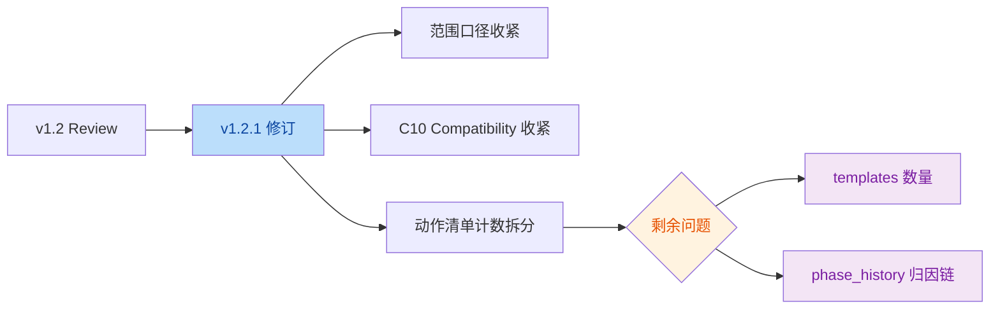

# `QUALITY-AUDIT-REPORT-v1.2.1.md` Review Report

> 审阅对象：[QUALITY-AUDIT-REPORT-v1.2.1.md](file:///Users/bytedance/Code/loupe/mobile-qa-workflow/QUALITY-AUDIT-REPORT-v1.2.1.md)
>
> 审阅目标：确认 `v1.2.1` 是否已修复 `v1.2 review` 指出的 3 个问题，并检查当前版本是否仍有事实性错误或文内证据链不完整的问题。

## 结论

- `v1.2.1` 已经正确修复了上一轮 review 的主问题：
  - `73` 个源码文件的新口径基本成立，且已明确排除 `QUALITY-AUDIT-*.md`
  - `C10` 的兼容性承诺已明显收紧，不再把当前仓库不存在的字段写成既有事实
  - 动作清单第 1 项的 `5`/`6` 混写问题已修正
- 当前仍有 **2 个轻量问题** 需要收口：
  - 1 个事实计数问题
  - 1 个文内证据链不完整问题

## 意图判断

- 作者意图：把 `v1.2.1` 作为对前三轮 review 的最终收口版本，因此本轮重点不是新增缺陷，而是把统计口径、兼容性表述和附录细节修到足够严谨。

## 修订流

## Findings

| No. | Issue Title | Suggestion | Code Link |
|-----|-------------|------------|-----------|
| 1 | 主 `templates/` 数量仍写成 `14`，与仓库现状 `13` 份不符 | 将第二章与附录 A 的 `templates/` 数量统一更正为 `13` | [QUALITY-AUDIT-REPORT-v1.2.1.md:L91-L93](file:///Users/bytedance/Code/loupe/mobile-qa-workflow/QUALITY-AUDIT-REPORT-v1.2.1.md#L91-L93) |
| 2 | `phase_history` 被写成 “B1* 提议引入的新字段”，但当前文内未建立完整归因链 | 若保留该说法，建议在 `B1*` 条目里显式补一条“可引入 `phase_history` 作为历史阶段快照”；或在 `C10 Compatibility` 处直接引用历史版本来源 | [QUALITY-AUDIT-REPORT-v1.2.1.md:L240-L244](file:///Users/bytedance/Code/loupe/mobile-qa-workflow/QUALITY-AUDIT-REPORT-v1.2.1.md#L240-L244) |

## Evidence

### 1. 主 `templates/` 数量写成了 14，但当前目录实际为 13

- `v1.2.1` 在第二章与附录 A 中都写了主 `templates/` 为 `14` 份：
  - [QUALITY-AUDIT-REPORT-v1.2.1.md:L91-L93](file:///Users/bytedance/Code/loupe/mobile-qa-workflow/QUALITY-AUDIT-REPORT-v1.2.1.md#L91-L93)
  - [QUALITY-AUDIT-REPORT-v1.2.1.md:L553-L559](file:///Users/bytedance/Code/loupe/mobile-qa-workflow/QUALITY-AUDIT-REPORT-v1.2.1.md#L553-L559)
- 但当前主模板目录实际只有 `13` 个文件，见 [templates](file:///Users/bytedance/Code/loupe/mobile-qa-workflow/templates)：
  - `context-bundle.md`
  - `context-curation-report.md`
  - `contract-checklist.md`
  - `error-dump.md`
  - `fix-design.md`
  - `impl-report.md`
  - `intake-form-blank.md`
  - `intake-form.md`
  - `issue-card.md`
  - `knowledge-card.md`
  - `rca-report.md`
  - `spec.md`
  - `verification-report.md`
- 这是一个纯文档计数错误，不影响主结论，但会影响覆盖清单的可信度。

### 2. `phase_history` 与 `B1*` 的归因链在当前文内仍不完整

- `v1.2.1` 在 `C10 Compatibility` 中写：
  - “方案 A（推荐）：迁移 C10 之前先落地 B1* 引入的 `phase_history`...”
  - 见 [QUALITY-AUDIT-REPORT-v1.2.1.md:L240-L244](file:///Users/bytedance/Code/loupe/mobile-qa-workflow/QUALITY-AUDIT-REPORT-v1.2.1.md#L240-L244)
- 但 `B1*` 条目当前给出的修复草案只有：
  - 强化 `current_phase_result = ABORT`
  - 在 `P2/P3/P6` 补 `ABORT`
  - 编排器可选白名单兜底
  - 见 [QUALITY-AUDIT-REPORT-v1.2.1.md:L138-L143](file:///Users/bytedance/Code/loupe/mobile-qa-workflow/QUALITY-AUDIT-REPORT-v1.2.1.md#L138-L143)
- 也就是说：
  - “当前仓库不存在 `phase_history`”这个事实是对的
  - “历史上它曾被更早版本审计建议过”也可能成立
  - 但 **在 `v1.2.1` 这份文档内部，B1* 条目本身并没有正式提出它**
- 这会让只阅读 `v1.2.1` 的读者误以为：B1* 章节已经定义了该字段，但实际上没有。
- 更稳妥的写法有两种：
  - 在 `B1*` 的 `Fix Sketch` 中补一条：可将 `stepsCompleted` 升级为允许重复的 `phase_history`
  - 或在 `C10 Compatibility` 里明确写“`phase_history` 为历史版本审计提案，此处仅复用该思路”

## Open Questions

- `templates` 数量是否只是漏同步了一个旧统计值？如果是，改动成本很低，建议直接修。
- `phase_history` 是否希望在 `v1.2.1` 中正式进入整改方案？如果是，应在 `B1*` 条目中显式出现，而不是只在 `C10` 兼容性里被引用。

## Summary

- `v1.2.1` 已经接近稳定版，较 `v1.2` 又前进了一步。
- 当前剩余问题都属于“文档收尾级”问题，不影响这份报告的大方向和主要判断。
- 建议再做一轮极小修订形成 `v1.2.2`：
  - 把主 `templates/` 数量从 `14` 改成 `13`
  - 把 `phase_history` 的来源链补完整

