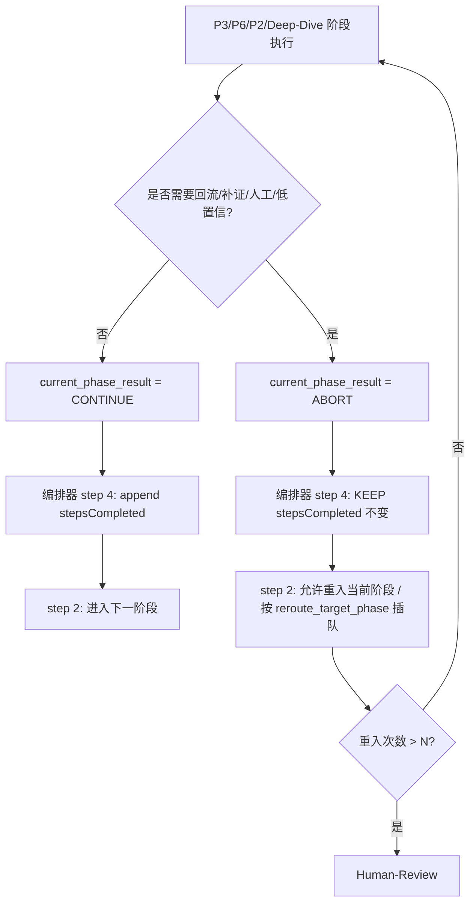

# Mobile B2C 质量工作流 — 深度质检报告 v1.2

> **审计范围**：`/Users/bytedance/Code/loupe/mobile-qa-workflow/` 全部 74 个文件
> **审计视角**：AI Skills 工程化 + 移动端质量闭环 + LLM 编排可靠性
> **输出维度**：模块评分 → 缺陷台账（含 Contract Surface / Failure Mode / Repro / Fix Sketch / Compatibility 五字段）→ 优化建议 → 优先级矩阵 → 单一权威源治理策略
> **报告版本**：**v1.2**（基于 v1.1 + `QUALITY-AUDIT-REPORT-v1.1-REVIEW.md` 第二轮核验反馈精修）
> **审计日期**：2026-04-20

## v1.2 修订摘要（本轮 4 项精修）

> 本版本响应 [QUALITY-AUDIT-REPORT-v1.1-REVIEW.md](./QUALITY-AUDIT-REPORT-v1.1-REVIEW.md) 4 项 review 级反馈，全部经源码核验后采纳：

| # | v1.1 中的问题 | v1.2 处理 |
|---|---|---|
| 1 | 模块级雷达图合计行写成"= 92 项"，但实际唯一缺陷数仅 43，统计口径自相矛盾 | **明确双口径**：模块累加 92（按模块影响计数，允许重复） + 唯一问题数 43（去重） |
| 2 | C10 在 Failure Mode / Repro 中使用了源码中**不存在**的 Fix 枚举名 `single-design / parallel-3` | **更正为真实枚举** `single-proposer / challenged-proposer / contested-arbitrated`（5 处源码一致），主结论保留 |
| 3 | B1\* 把 `f5-defensive-fix-design.md` 的"短路完成"误并入 ABORT 协议缺失证据集 | **收窄证据链**：仅保留 `workflow.xml` + P3 + P6 + Deep-Dive 编排器，剔除 F5（F5 是正常 DD-Completed 终态） |
| 4 | C3（challenger dimension_set 与基座不一致）写成"当前运行时故障"，但 F4 实际只加载 shared-base + deep-dive-arbiter，未加载主 wrapper | **降级为 Major M17（前瞻性契约风险）**，明确"当前主路径未触发，仅为潜在/未来复用风险" |

> **未变更内容**：所有 v1.0 → v1.1 的修订（撤回 m7、修订 M5/B1/B2、新增 C10/C11/M16、单一权威源治理章节、ABORT 状态流图、缺陷台账 5 字段）全部保留。

## v1.1 → v1.2 评分调整

- **跨工作流一致性**：4.5 → **5.0**（C3 降级反映 Deep-Dive 主路径当前未触发该故障）
- **综合得分**：5.8 → **5.9**（C3 降级 + 修复事实错误后可信度上升）
- 其余维度评分不变。

---

## v1.1 历史修订摘要（保留供追溯）

> 本版本响应 [QUALITY-AUDIT-REVIEW.md](./QUALITY-AUDIT-REVIEW.md) 的核验反馈：

| 修订类型 | 原条目 | 处理 |
|---|---|---|
| 撤回 | m7（template-output 缺 file 参数） | 经核验事实错误，**撤回** |
| 修订 | M5（error-dump 双份且不一致） | 字段集实测一致，**改为"双源维护风险"** |
| 修订 | B1（P3 reroute 与 stepsCompleted 互锁） | **升级为"Phase 早退语义未结构化协议"全链路根因**（B1*） |
| 修订 | B2（P2 完全缺失 Non-Bug 路径） | 改为"Skill/文件化工作流 vs system-prompt 功能回退" |
| **新增** | C10 | **P4 覆写 fanout_mode 污染 P3 路由**（原报告漏报，Critical） |
| **新增** | C11 | **step-pause result contract 缺失**（无写回协议，Critical） |
| **新增** | M16 | **config_source 写入键漂移（output_curation_report 未注册）**（Major） |
| 新增章节 | — | 增加"单一权威源治理策略"独立章节 |
| 新增图 | — | 增加 ABORT vs CONTINUE 状态流 Mermaid 图 |
| 字段扩充 | 缺陷台账 | 每条新增 Contract Surface / Failure Mode / Repro / Fix Sketch / Compatibility 五字段 |

---

## 一、整体评估

| 维度 | 评分（10 分制，v1.2） | 简评 |
|---|---|---|
| 架构分层 | 8 | 主链路 + Deep-Dive 双层、共享基座 + 包装层思路清晰 |
| 角色契约一致性 | 5.5 | 共享基座/包装层/调用方三层之间字段对不齐 |
| 状态机可靠性 | 4.5 | Phase 早退语义未结构化、字段污染（P4→fanout_mode）、step-pause 无写回协议 → 系统性失锚 |
| 模板与产物治理 | 6 | 模板字段冗余/重复，与流程实际产出错位 |
| 标签 DSL 规范 | 6 | `core-rules.xml` 未声明 `<task>`，但所有 `workflow.xml` 都用了 |
| 跨工作流（主/Deep-Dive）一致性 | **5.0**（v1.1 为 4.5） | 默认值冲突、状态枚举漂移、产物落盘策略矛盾；C3 降级后明确"当前主路径未触发非法 dimension_set" |
| 文档/入口一致性 | 6.5 | `SKILL.md`、`system-prompt.md`、`PLATFORM-GUIDE.md` 内容未对齐 |
| 安装/分发 | 7 | 健壮但 `install.sh` 与 `install_trae.sh` 严重重复 |

**综合得分：5.9/10**（v1.1 5.8/10，v1.0 6.0/10）— 本轮修复 4 项 review 反馈后，跨工作流一致性维度得分回升 0.5 分，体现"潜在风险"与"当前故障"分离后的更精准评估。

---

## 二、模块级雷达图（缺陷数 / 严重等级）

> **统计口径说明（v1.2 新增）**：本表为"**模块影响计数**"，即一个缺陷若同时触及 N 个模块，则在 N 个模块各计 1 次（允许重复）。"**唯一问题数**"另列，避免读者误读。

| 模块 | Blocker | Critical | Major | Minor |
|---|---|---|---|---|
| 顶层入口（SKILL/system-prompt/PLATFORM-GUIDE） | 0 | 2 | 4 | 3 |
| `core/`（workflow.xml + 4 个 yaml + core-rules） | 2 | 5 | 7 | 3 |
| `agents/`（8 个） | 0 | 3 | 5 | 4 |
| `phases/`（P1–P6） | 2 | 6 | 7 | 5 |
| `templates/`（14 个） | 0 | 1 | 6 | 6 |
| `reference/`（4 个） | 0 | 0 | 3 | 2 |
| `functionality-deep-dive/`（25+） | 1 | 4 | 7 | 4 |
| **模块累计影响次数** | **5** | **21** | **39** | **27** | 

**双口径合计**：

| 口径 | Blocker | Critical | Major | Minor | 总计 |
|---|---|---|---|---|---|
| 模块累计影响次数（按模块重复计数） | 5 | 21 | 39 | 27 | **92** |
| **唯一问题数（去重后实际台账条目）** | **3** | **10**（v1.1 11，C3 降级到 Major M17） | **17**（v1.1 16，新增 M17） | **13**（已撤回 m7） | **43** |

> v1.0 共 41 唯一缺陷；v1.1 新增 C10 / C11 / M16 共 3 项，撤回 m7 共 1 项，净 +2 = 43；v1.2 仅做严重性调整（C3 → M17），唯一问题数仍为 43。

---

## 三、缺陷台账（按严重等级降序，含 5 字段元信息）

> 字段说明：
> - **Contract Surface**：影响面（workflow-status / config-source / artifacts / tag-dsl / subagent-io / installation）
> - **Failure Mode**：具体失败模式
> - **Repro**：最小复现场景（编排循环描述）
> - **Fix Sketch**：1-3 行修复草案
> - **Compatibility**：对旧会话/旧 schema 的兼容策略

### 🔴 BLOCKER（阻塞工作流正确执行）

#### B1\*. 【v1.1 升级 / v1.2 收窄证据链】Phase 早退（abort）语义未结构化协议 — 主编排器系统性根因
- **位置**：主编排器 `core/workflow.xml` step 4 ↔ 主链路 `phases/p3-root-cause.md` ×4 处 + `phases/p6-verification.md` + `phases/p2-spec-definition.md`
- **【v1.2 修订】证据链收窄**：v1.1 曾把 `functionality-deep-dive/phases/f5-defensive-fix-design.md` 的 step 2"短路完成"也列入证据集，经核验该处实际是"`Need Defensive Fix != Yes` → 直接写 `current_state = DD-Completed`（明确终态）"的**正常完成路径**，不属于"失败/回流后早退却未置 ABORT"故障模式，**已剔除**。Deep-Dive 子工作流的早退协议另作独立审视（见 M9）。
- **核心证据**：

```89:95:mobile-qa-workflow/core/workflow.xml
            <step n="4" goal="阶段完成后更新进度并路由">
                <check if="{current_phase_result} != ABORT">
                    <action>将 {current_phase} 加入 {workflow_status} 的 stepsCompleted 数组</action>
                </check>
                <check if="{current_phase_result} == ABORT">
                    <action>保留 {workflow_status} 的 stepsCompleted 不变，等待当前阶段人工处理或补充信息后再重试</action>
                </check>
```

而 P3/P6 等多处以自然语言"阶段结束，返回编排器"早退（grep 实测主链路 P3 4 处、P6 1 处），**全程没有显式 `current_phase_result = ABORT` 的赋值**。
- **Contract Surface**：workflow-status × tag-dsl
- **Failure Mode**：失败/低置信/重路由路径下，phase 被错误标为已完成；reroute 与 retry 不可重入；io-contract 必需产物在失败路径下未产出但状态机继续推进 → 形成不可审计闭环。
- **Repro**：P3 RCA 置信度 < 0.6 → 写 `current_state = RCA-LowConfidence` → "阶段结束，返回编排器" → step 4 因 `current_phase_result == CONTINUE`（未置 ABORT）将 `qa-root-cause` 追加进 `stepsCompleted` → step 2 下一轮检查 `stepsCompleted` 已含 P3 → 永远不会再回到 P3 重做。
- **Fix Sketch**：
  1. 在 `core-rules.xml` 增加强约束：**任何 phase 早退（含 step-pause、低置信、重路由、失败回流）必须 set `current_phase_result = ABORT`**。
  2. 在受影响的主链路 P2/P3/P6 各早退动作前**统一插入** `<action>设置 current_phase_result = ABORT</action>`。
  3. （可选/二期）由编排器维护"非继续态白名单"，作为兜底守门员。
  4. Deep-Dive 子编排器是否引入同类协议另行评估（见 M9）。
- **Compatibility**：旧会话恢复时 `workflow-status.yaml` 中已存在的错误 `stepsCompleted` 无法溯源；建议提供一次性"补丁脚本"读取 `current_state ∈ {Info-Insufficient, Spec-Uncertain, Non-Bug, RCA-LowConfidence, Curation-Failed, Human-Review}` 的会话并自动剥离最近一次 stepsCompleted 项。

#### B2. 【v1.1 修订表述】Skill/文件化工作流的 P2 与 system-prompt 出现功能回退（Non-Bug 闭环缺失）
- **位置**：`phases/p2-spec-definition.md` step 4 ↔ `system-prompt.md` Phase 2
- **现象**：`system-prompt.md` 包含完整的 Non-Bug step-pause + Accept/Reflow + 计数器闭环；但 `phases/p2-spec-definition.md` 仅做"逐项检查 Working-As-Designed / User-Misoperation / …"枚举列举，**未触发 step-pause、未写回 `current_state = Non-Bug`、未读写 `non_bug_user_choice` / `non_bug_reflow_count`**。
- **Contract Surface**：workflow-status × subagent-io（Skill 平台 vs 单 prompt 平台两套实现源代码不一致）
- **Failure Mode**：Skill 平台用户走 P2 时 Non-Bug 反流闭环（≤2 次 Reflow / >2 次 Human-Review）**永远不会触发**。
- **Repro**：Skill 平台输入"按设计/操作问题/不复现"类 issue → P2 仅打 [Working-As-Designed] 标记 → 无 step-pause → workflow.xml step 4 case `Non-Bug` 因 `current_state` 不为 Non-Bug 不进入 → 静默漏处理。
- **Fix Sketch**：把 `system-prompt.md` 的 P2 step 4 完整结构（Non-Bug Resolution Report → step-pause → Accept/Reflow + 计数器）反向同步回 `phases/p2-spec-definition.md`；在 `workflow-status-template.yaml` 增加 `non_bug_user_choice` / `non_bug_reflow_count` 枚举字段。
- **Compatibility**：与 C11（step-pause result contract）联动修复，否则 `non_bug_user_choice` 字段虽然加入也无人写。

#### B3. Deep-Dive F2/F3 中间产物默认不落盘 → F4 读不到
- **位置**：`functionality-deep-dive/core/default-config.yaml` (`emit_topology_report: false` 等) + F1/F2/F3 末尾"保留供 F4 回注"+ F4 文件路径入参
- **Contract Surface**：artifacts × subagent-io（跨 SubAgent 隔离介质）
- **Failure Mode**：F4 入参 `topology_report` / `concurrency_report` / `environment_factor_report` 是文件路径变量，不落盘 → SubAgent 输出无可靠介质回传 → F4 读到 null 或空。
- **Repro**：调起 Deep-Dive → F2 在 `emit_topology_report = false` 默认下不写文件 → F4 step 1 读取路径失败 → 后续 5D 隔离实验缺基础。
- **Fix Sketch**：要么 deep-dive 默认值翻为 true 与主配置 `deep_dive_optional_artifacts.environment_factor_report = true` 对齐；要么 F4 入参改为支持"内联报告内容"（非文件路径），并由编排器统一收集 SubAgent 输出。
- **Compatibility**：需同步主 `default-config.yaml` 的 `deep_dive_optional_artifacts` 块，避免主→子翻转后再次冲突。

---

### 🟠 CRITICAL（功能/契约严重错位）

#### C1. `<task>` 标签未在 `core-rules.xml` 的 supported-tags 中声明
- **位置**：`core/workflow.xml` 第 1 行 `<task id="…">`、`functionality-deep-dive/core/workflow.xml` 同样
- **Contract Surface**：tag-dsl
- **Failure Mode**：严格遵循标签白名单的编排器/Agent 拒识根节点。
- **Repro**：Limited 平台 LLM 加载 core-rules → 解析 workflow.xml 根节点 `<task>` → 标签不在白名单 → 触发 schema-violation。
- **Fix Sketch**：把 `<task>` 加入 supported-tags；或两个 workflow.xml 根节点统一改为 `<flow>`。
- **Compatibility**：旧 prompt 镜像（如 system-prompt.md）已铺到生产时不影响（system-prompt 不通过 supported-tags 解析）。

#### C2. 共享基座输入契约与调用方传参严重缺位
- **位置**：`agents/shared-arbiter-base.md`（要求 `base_score`）、`agents/shared-challenger-base.md`（要求 `confidence_input`）↔ `phases/p3-root-cause.md` / `p4-fix-design.md` 调用 prompt
- **Contract Surface**：subagent-io
- **Failure Mode**：`final_confidence = base_score × convergence_factor × challenge_survival_rate` 缺乏输入 → arbiter/challenger 自造输入 → 置信度不可重复、不可对比、不可审计。
- **Repro**：P3 触发 challenged-pair → arbiter prompt 中找不到 `base_score` → arbiter 凭经验返回 `final_confidence = 0.7` → 下次同输入返回 0.6。
- **Fix Sketch**：phases 文件统一在 subagent_prompt 中显式拼接 `base_score = {上游 investigator final_score 列表}` 与 `confidence_input`；wrapper 中校验"缺参时输出 `[Schema-Violation]`"。
- **Compatibility**：与 M8（单视角降级公式缺失）联动一并修复。

#### ~~C3~~（**v1.2 降级为 Major M17**，详见 Major 章节）
- **降级原因**：经源码核验 `functionality-deep-dive/phases/f4-isolation-debate.md` step 3 实际加载的是 `shared-challenger-base.md` + `shared-arbiter-base.md` + `deep-dive-arbiter.md` 三件套，**没有加载主 wrapper `agents/challenger.md`**，因此 `dimension_set = deep-dive-7d` 当前不会触发主 wrapper 的非法枚举校验。
- 该问题应定性为"潜在/未来契约漂移风险"（一旦未来 Deep-Dive 复用主 wrapper 即触发），不属当前运行时故障，故从 Critical 降级为 Major，编号改为 M17。

#### C4. `coder-agent` 输入触发条件枚举漂移（`Merged` 未定义）
- **位置**：`phases/p5-fix-impl.md` step 2（`status ∈ {DD-Completed, Merged}`）↔ 主/Deep-Dive workflow-status-template
- **Contract Surface**：workflow-status
- **Failure Mode**：`Merged` 未定义 → coder 永远走 DD-Completed 分支或反之。
- **Fix Sketch**：去掉 `Merged` 分支，或在 P3 step 7 显式回写 `Merged`，并补到模板枚举。

#### C5. `current_state = Context-Curating / Curation-Failed` 未在状态模板与编排器中建模
- **位置**：`phases/p2-spec-definition.md` step 7 ↔ `core/workflow-status-template.yaml`
- **Contract Surface**：workflow-status
- **Failure Mode**：状态机权威源缺枚举 → 多个文档/工具读到自由值。
- **Fix Sketch**：在 `workflow-status-template.yaml` 增补合法枚举（含 `Boundary-Refined / Fix-Implementing / Verifying`）。

#### C6. P3 升级 fan-out 后未重置 stepsCompleted/重试无界保护缺失
- **位置**：`phases/p3-root-cause.md` `complex-arbitrated` 分支
- **Contract Surface**：workflow-status
- **Failure Mode**：缺 `arbitrate_round_count` 字段 → "对抗轮次超过 3 轮"无法可靠判定。
- **Fix Sketch**：增 `arbitrate_round_count`，由 P3 内显式回写。

#### C7. P5 中 `non-code-fix` 路径产物缺失
- **位置**：`phases/p5-fix-impl.md` step 4 `non-code-fix` 分支
- **Contract Surface**：artifacts
- **Failure Mode**：远端配置变更/协调指令无专属落盘文件，下游审计断链。
- **Fix Sketch**：新增 `templates/remote-change-instruction.md` 作为 non-code-fix mandatory 产物。

#### C8. 主工作流 vs system-prompt.md vs SKILL.md 三处状态机/字段定义不一致
- **位置**：`system-prompt.md` Phase 1（重复 step n="5"、状态机图缺枚举）+ `PLATFORM-GUIDE.md`（最少持久化字段仅 7 个）
- **Contract Surface**：workflow-status × installation
- **Fix Sketch**：以 `core/workflow-status-template.yaml` 为权威源，自动生成另两份文档的字段清单（CI 强制）。

#### C9. P6 验证失败回流时 `verification-report.md` 不生成
- **位置**：`phases/p6-verification.md` step 6
- **Contract Surface**：artifacts
- **Failure Mode**：失败分支直接早退、未走 step 7 模板输出，但 io-contract 声明该文件 mandatory。
- **Fix Sketch**：失败分支也必须先 `template-output` 生成"中间态" verification-report（含失败分类与证据）再回流。

#### C10. 【v1.1 新增】P4 覆写 `fanout_mode` 污染 P3 路由（原报告漏报）
- **位置**：

```34:36:mobile-qa-workflow/phases/p4-fix-design.md
                - fix_risk_level = {fix_risk_level}
                - fix_strategy_mode = {fix_strategy_mode}
                - fanout_mode = {fix_strategy_mode}
```

```75:77:mobile-qa-workflow/phases/p4-fix-design.md
                <check if="challenger 出现 Critical">
                    <action>更新 {workflow_status}：fix_strategy_mode = contested-arbitrated, fanout_mode = contested-arbitrated, reroute_reason = challenged_fix_escalated</action>
                </check>
```

- **Contract Surface**：workflow-status（字段语义跨阶段污染）
- **【v1.2 修订】Failure Mode**：`fanout_mode` 在 P3 是 RCA fan-out 三档枚举（`simple-single / medium-challenge / complex-arbitrated`），P4 写为 Fix 阶段三档枚举（**`single-proposer / challenged-proposer / contested-arbitrated`**，源码 `phases/p4-fix-design.md` L31、`reference/fix-strategies.md` L7-9、`templates/fix-design.md` L10、`system-prompt.md` L243、`PLATFORM-GUIDE.md` L31 五处一致）→ P6 失败回流到 P3 强制 `complex-arbitrated` 判断时，读取被污染的值 → 路由错乱。注意：`contested-arbitrated` 是 RCA 与 Fix **共名但语义完全不同**的歧义枚举，污染后即使值相等也会被错误地通过 RCA 升级判断。
- **【v1.2 修订】Repro**：P3 完成（fanout_mode = `simple-single`）→ P4 进入 step 2 写 `fanout_mode = single-proposer` → P5 → P6 失败 `root_cause_not_closed` → reroute 回 P3 → P3 step 1 检查 fanout_mode 当前为 `single-proposer` → 不在 RCA 枚举集 `{simple-single, medium-challenge, complex-arbitrated}` 内 → 升级判断 switch 落入 default 分支 → 升级失败 / 静默重做。
- **Fix Sketch**：P4 不应共享 `fanout_mode`，应在 `workflow-status-template.yaml` 新增 `fix_fanout_mode` 字段；或将 `fanout_mode` 改为 `rca_fanout_mode`，新增 `fix_fanout_mode`，强制阶段间字段隔离。
- **【v1.2 修订】Compatibility**：旧会话需补一次性脚本：若 `current_state ∈ {Fix-Designing, Fix-Implementing, Verifying}` 且 `fanout_mode ∈ {single-proposer, challenged-proposer, contested-arbitrated}` 则视为 Fix 枚举 → 迁移到 `fix_fanout_mode` 并把 `rca_fanout_mode` 还原为 P3 完成时值（可从 `phase_history` / `lastStep` 反推）。

#### C11. 【v1.1 新增】`step-pause` 用户回复无写回协议（系统性 IPC 缺失）
- **位置**：`core/core-rules.xml` `<step-pause>` tag 定义 ↔ `core/workflow.xml` step 4 case `Non-Bug` 中的 `{non_bug_user_choice}` ↔ `phases/p2-spec-definition.md` / `phases/p4-fix-design.md` 多处 `<step-pause>`
- **证据**：

```98:98:mobile-qa-workflow/core/core-rules.xml
            <tag name="step-pause"><rules><rule>强制触发硬停顿，等待用户确认后才能继续</rule><rule>将 title 和 option 输出在纯文本回复中</rule><rule>输出后立即结束当前回复，未收到用户指令前禁止执行后续步骤</rule></rules><params><param name="title">停顿标题</param><param name="option">停顿选项</param></params></tag>
```

`<step-pause>` 只有 `title` / `option` 输入参数，**完全没有"用户回复结果如何写回 workflow_status"的协议字段**。

```118:120:mobile-qa-workflow/core/workflow.xml
                    <case if="Non-Bug">
                        <action>读取 p2 阶段 step-pause 用户选择结果</action>
                        <switch condition="{non_bug_user_choice}">
```

- **Contract Surface**：tag-dsl × workflow-status × subagent-io
- **Failure Mode**：`{non_bug_user_choice}`、P4 step 5 的"是否进入修复实施"、F4 的中断决策等所有 step-pause 的用户回复**全部无标准写回路径** → LLM 自行编造或丢弃。
- **Repro**：用户在 P2 step-pause 后选择 "Reflow" → 没有任何 action 写 `non_bug_user_choice = Reflow` → 编排器 step 4 读不到该字段 → 走 default 分支或异常。
- **Fix Sketch**：
  1. 在 `core/core-rules.xml` 的 `<step-pause>` 增加 `result_field` 必填参数（用于声明用户回复写到 workflow_status 的哪个字段）。
  2. 在 `workflow-status-template.yaml` 增加 `user_inputs` 命名空间或显式列出每个 step-pause 对应的字段名。
  3. 在 `core/workflow.xml` 中明确"step-pause 恢复后由编排器统一写回 `result_field`"。
- **Compatibility**：旧 step-pause（无 result_field）默认按 "fire-and-forget" 处理，但所有依赖 `{xxx_user_choice}` 的下游必须显式列入迁移清单。

---

### 🟡 MAJOR（语义冲突 / 设计漏洞）

#### M1. `default-config.yaml` 与 SKILL.md 命名不一致
- **Contract Surface**：config-source × installation
- **Fix Sketch**：统一为 `workspace_root`，并在 `default-config.yaml` 显式列出（含示例 `qa-workspace`）。

#### M2. `workflow-status-template.yaml` 包含未使用字段
- **现象**：`lint_retry_count` 全流程仅用 `fix_retry_count`；`output_runtime_compat_report`、`output_reroute_trace` 全流程未引用。
- **Fix Sketch**：删除冗余字段，或补完使用流程。

#### M3. `arbiter.md` / `challenger.md` 包装层缺 DEEP_DIVE 场景路由
- **Fix Sketch**：补 DEEP_DIVE → `selected = primary_root_cause`。

#### M4. `core-rules.xml` 中 `available-agents` 与 `agents/README.md` 列表口径冲突
- **Fix Sketch**：移除主可用清单中的旧名字（仅在 deep-dive/README 内部保留），并明确"旧名字仅作为 status 字段恢复参考，不可作为 invoke-subagent 目标"。

#### M5. 【v1.1 修订】`error-dump.md` 模板"双源维护"风险（非"双份不一致"）
- **更正**：经实测 `templates/error-dump.md` 与 `agents/coder-agent.md` 第 207-245 行内嵌版**字段集与 ✅/❌ 符号一致**。
- **真实风险**：双源维护，任一侧后续修改会引入漂移。
- **Fix Sketch**：以 `templates/error-dump.md` 为权威，coder-agent 仅 `<load>` 引用路径。

#### M6. `defensive-fix-architect.md` 输出标题与 `templates/defensive-fix-design.md` 模板标题不一致
- **Fix Sketch**：以模板为准，agent 输出格式逐字段对齐。

#### M7. P3 调用 investigator 时 `{strategy_a}` `{strategy_b}` 占位无赋值机制
- **Fix Sketch**：P3 内补一个"策略选择 step"，依据 `主分类 + Issue_Boundary_Level + analysis_complexity` 从 `reference/analysis-strategies.md` 选 1-2 个策略并写入 `selected_strategy_pair`。

#### M8. `investigator.md` 单视角时无 `challenge_survival_rate`，`final_confidence` 公式无法套用
- **Fix Sketch**：在 `reasoning-chain.md` 与 `shared-arbiter-base.md` 都补单视角降级公式：`single_view_confidence = base_score × falsification_pass_ratio`。

#### M9. Deep-Dive 主→子工作流参数与状态隔离机制缺失
- **Fix Sketch**：明确同步语义；P3 step 6 显式注入 `parent_issue_id = {issue_id}`；增加"子工作流回信号"约定 `specialized_workflow.handoff_status`。

#### M10. `templates/spec.md` 与 `templates/issue-card.md` 与 `workflow-status` 状态枚举漂移
- **Fix Sketch**：模板字段值域改为引用 `workflow-status-template.yaml` 权威枚举。

#### M11. `templates/verification-report.md` 失败分类与 `phases/p6-verification.md` 不一致
- **Fix Sketch**：模板补三类回流分类，与状态字段对齐。

#### M12. `intake-form.md` 与 `intake-form-blank.md` 用途未定义
- **Fix Sketch**：明确"blank 给真人快速贴的极简版，full 是 Agent 内部清单"，并在 SKILL.md / system-prompt.md 入口处指明触发时机。

#### M13. `templates/impl-report.md` "测试执行结果"表与实际能力不符
- **Fix Sketch**：改为"测试用例覆盖度核对（不执行）"。

#### M14. `templates/knowledge-card.md` 与 `verification-report.md` 双写 L3-Dynamic
- **Fix Sketch**：knowledge-card 仅引用 verification-report 的 L3-Dynamic 区。

#### M15. Reference 与流程的引用断层
- **Fix Sketch**：以 `platform-checklist.md` 为权威；coder-agent 仅 `<load>` 引用。

#### M17. 【v1.2 新增 / 自 v1.1 C3 降级】`challenger` wrapper 与共享基座的 dimension_set 枚举漂移（**前瞻性契约风险**，当前主路径未触发）
- **位置**：`agents/challenger.md`（仅 `rca-5d / fix-4a`）↔ `agents/shared-challenger-base.md`（含 `deep-dive-7d`）↔ `functionality-deep-dive/phases/f4-isolation-debate.md`
- **当前状态**（v1.2 核验）：F4 step 3 实际加载链路为：

```43:54:mobile-qa-workflow/functionality-deep-dive/phases/f4-isolation-debate.md
            <invoke-subagent subagent_type="deep-dive-arbiter" subagent_prompt="
                <load target='mobile-qa-workflow/core/core-rules.xml' prompt='加载流程规范'/>
                <load target='mobile-qa-workflow/agents/shared-challenger-base.md' prompt='加载共享 challenger 基座'/>
                <load target='mobile-qa-workflow/agents/shared-arbiter-base.md' prompt='加载共享 arbiter 基座'/>
                <load target='mobile-qa-workflow/functionality-deep-dive/agents/deep-dive-arbiter.md' prompt='加载专项收敛角色'/>
                scene = DEEP_DIVE
                dimension_set = deep-dive-7d
                ...
```

未加载主 wrapper `agents/challenger.md`，因此 `dimension_set = deep-dive-7d` 当前不会触发非法枚举校验。
- **Contract Surface**：subagent-io（前瞻）
- **Failure Mode**（潜在）：一旦未来某 phase 改为复用主 wrapper（例如出于"统一 wrapper 入口"的重构动机），`deep-dive-7d` 立即触发主 wrapper 的非法枚举校验，导致 Deep-Dive 调用链断裂。
- **Fix Sketch**：把 `deep-dive-7d` 加入主 wrapper（推荐：让主 wrapper 也透传 DEEP_DIVE 场景）；或在主 wrapper 文档明确标注"DEEP_DIVE 场景请直接调用共享基座，禁止经由本 wrapper"。
- **Compatibility**：旧 wrapper 调用方未传 scene 时，wrapper 默认按 RCA 处理。

#### M16. 【v1.1 新增】`config_source` 写入键漂移（`output_curation_report` 未注册）
- **位置**：

```119:119:mobile-qa-workflow/phases/p2-spec-definition.md
            <action>更新 {config_source}：增加 output_curation_report、output_spec、output_context_bundle 路径</action>
```

而 `default-config.yaml` 未声明 `output_curation_report` 键。
- **Contract Surface**：config-source
- **Failure Mode**：phases 自由写入 config_source 任意键 → 无 schema 守门 → 跨 phase 引用时拼写漂移、字段消失静默失败。
- **Repro**：P2 写 `output_curation_report` → 后续若有 phase 想读 `output_context_curation_report`（自由命名）→ 读到 null → 静默跳过。
- **Fix Sketch**：
  1. 引入 `core/config-schema.yaml` 作为 `config_source` 单一权威源（声明所有合法 output_* 键名）；
  2. CI 脚本扫描所有 phases 中"更新 config_source"动作，校验键名在 schema 中存在；
  3. `default-config.yaml` 补齐缺失键（`output_curation_report` 等）。
- **Compatibility**：旧会话 config_source 中已存在的非法键转写到 `extras.*` 命名空间。

---

### 🟢 MINOR（可读性、维护性、冗余）

> v1.0 的 m7（template-output 缺 file 参数）已撤回。

- **m1**：`install.sh` 与 `install_trae.sh` 95% 同源。Fix：合并为 `install.sh --target=cursor|trae|both`。
- **m2**：`curator.md` 缺 YAML frontmatter，与同目录其他 agents 风格不一。
- **m3**：`core-rules.xml` 列了 `<for-each>` 但全工作流从未使用，应删或补示例。
- **m4**：`workflow_version` 字段值漂移（`abc-1` / `legacy` / `v3-legacy` / `v4-composite`），缺统一 SemVer 规范。
- **m5**：`functionality-deep-dive/FUNCTIONALITY_DEEP_DIVE_WORKFLOW_V3.md` 文件名 V3、正文标题 V4 错位。
- **m6**：旧 deep-dive agent 完整保留但无 phase 入口可挂载，"旧会话恢复"为空声明。
- ~~**m7（撤回）**~~：经核验 `<template-output>` 同时声明了 `file` 与 `template`。
- **m8**：`workflow.xml` step 4 `Non-Bug` case `goto step="4"` 自循环，应改为 `goto step="3"` 或终止。
- **m9**：`core/workflow.xml` step 3 调用 phases 时未将 `{issue_id}` / `{workflow_status}` 路径作为参数显式传递。
- **m10**：`agents/coder-agent.md` "工具白名单" 与 `core-rules.xml` 无映射，跨平台移植不可知。
- **m11**：`rca-report.md` 预设 4 个可选报告路径，若 `emit_*_report = false` 时写出无效链接。
- **m12**：`phases/p2-spec-definition.md` 文件首部 4 空格缩进不一致。
- **m13**：`templates/contract-checklist.md` 增加了"校验结论"块，coder-agent 内嵌版无此块，字段集不一致。
- **m14**：`PLATFORM-GUIDE.md` 提"AutoGen / CrewAI"集成但仓库未提供桥接代码或 schema export，易过度承诺。

---

## 四、核心系统性根因（v1.1 新增章节）

> 把所有缺陷归并为"少数可治理工程问题"——Review 6.x 的核心价值。

### 根因 A：缺少"Phase 早退/回流"结构化协议
- 触及缺陷：B1\* / C9 / B2 / B3 部分
- 治理对策：core-rules.xml 强约束 ABORT 协议 + 统一写法

### 根因 B：缺少"单一权威源（Single Source of Truth）"
- 触及缺陷：C5 / C8 / M10 / M11 / M16 / m4
- 治理对策：见第七章"单一权威源治理策略"

### 根因 C：缺少跨 SubAgent IPC 抽象
- 触及缺陷：B3 / C11 / M9
- 治理对策：定义 Deep-Dive `handoff_status` + step-pause `result_field` + 必落盘策略

### 根因 D：跨阶段字段污染（命名复用 vs 隔离）
- 触及缺陷：C10 / C4 / m4
- 治理对策：阶段字段命名隔离（`rca_fanout_mode` / `fix_fanout_mode`）+ 枚举校验

### 根因 E：双源维护（agent 内嵌 vs templates）
- 触及缺陷：M5 / M15 / m13
- 治理对策：templates 为唯一权威，agent 仅 `<load>` 引用

---

## 五、单一权威源治理策略（v1.1 新增章节）

| 治理域 | 权威源 | 派生文档 / 校验机制 |
|---|---|---|
| 状态枚举与字段 | `core/workflow-status-template.yaml` | `system-prompt.md` 状态机图 / `SKILL.md` 字段说明 / `PLATFORM-GUIDE.md` 持久化字段表 / 所有 phases 的状态读写均通过 schema 校验 |
| 标签 DSL | `core/core-rules.xml` `<supported-tags>` | `core/workflow.xml`、`functionality-deep-dive/core/workflow.xml`、所有 phases / agents 文件的标签使用必须在白名单内（含 `<task>` 这类根容器） |
| I/O 契约（产物） | `core/workflow.xml` `<io-contract>` | 所有 phases 的失败/早退路径也必须满足"最小可审计产物"要求（C9 修复） |
| config_source 键名 | 新增 `core/config-schema.yaml` | 所有 phases 中"更新 config_source"动作必须使用 schema 中定义的键 |
| 模板字段集 | `templates/*.md` | agents 不再内嵌模板，仅 `<load>` 引用（M5 修复） |
| step-pause 用户输入 | `<step-pause result_field=...>` 显式声明 | 编排器统一写回到 `workflow_status.{result_field}` |

---

## 六、ABORT vs CONTINUE 状态流图（v1.1 新增）



**约束**（写入 core-rules.xml）：

> 任何 phase 在以下场景必须显式 set `current_phase_result = ABORT`：
> 1. 触发 step-pause 等待用户输入
> 2. 写入 `current_state ∈ {Info-Insufficient, Spec-Uncertain, Non-Bug, RCA-LowConfidence, Curation-Failed, Boundary-Refined, Human-Review}`
> 3. 写入 `reroute_target_phase ≠ null`
> 4. io-contract 必需产物未生成

---

## 七、优化建议（按优先级排序）

### 立刻修复（本周）— Blocker / Critical（v1.2 修订：C3 移出，移到本月内 M17）

1. **【根因 A / B1\*】Phase 早退 = ABORT 强协议**：core-rules.xml 增加约束；主链路 P2/P3/P6 全部早退动作前插入 `set current_phase_result = ABORT`（v1.2 收窄：Deep-Dive F5 不在本批，详见 B1\* 条目）。
2. **【B2】补全 P2 Non-Bug 完整闭环**：从 system-prompt.md 反向同步到 phases/p2-spec-definition.md。
3. **【B3】Deep-Dive F1/F2/F3 默认落盘**：deep-dive default-config.yaml 翻为 true，与主配置对齐。
4. **【C1】声明 `<task>` 标签**：core-rules.xml supported-tags 增补，或两个 workflow.xml 改 `<flow>`。
5. **【C2】共享基座契约 + 调用方传参对齐**：phases 显式拼接 `base_score` / `confidence_input`；wrapper 校验缺参输出 `[Schema-Violation]`。
6. **【C5】状态枚举单一权威源**：扩展 `Context-Curating / Curation-Failed / Boundary-Refined / Fix-Implementing / Verifying / Merged`。
7. **【C9】P6 失败分支必输出 verification-report.md**：作为"中间态"产物。
8. **【C10】P4 字段隔离**：新增 `fix_fanout_mode`（或重命名 `fanout_mode → rca_fanout_mode`），枚举校验时区分 RCA 集 `{simple-single, medium-challenge, complex-arbitrated}` 与 Fix 集 `{single-proposer, challenged-proposer, contested-arbitrated}`。
9. **【C11】step-pause result_field 协议**：core-rules.xml 增加该参数；workflow-status-template 列出所有用户输入字段。

### 本月内（Major）— 契约和模板治理

10. **【M17，自 v1.1 C3 降级】** 统一 arbiter / challenger wrapper 与共享基座的 scene/dimension_set 枚举（含 DEEP_DIVE / deep-dive-7d）；当前 Deep-Dive 主路径未触发，但建议一并治理避免未来漂移。
11. P3 增设"策略选择 step"（M7）。
12. 引入 `specialized_workflow.handoff_status`（M9）。
13. defensive-fix-architect 输出格式与模板对齐（M6）。
14. 统一 agents YAML frontmatter（m2）。
15. error-dump / contract-checklist 双源收敛到 templates（M5 / m13）。
16. intake-form 用途文档化（M12）。
17. verification-report 三类回流分类（M11）。
18. knowledge-card L3-Dynamic 去重（M14）。
19. **【M16】引入 `core/config-schema.yaml` + CI 漂移检测**。

### 中期演进（Minor + 工程化）

20. **schema 一致性 CI**：扫描 workflow-status-template.yaml / config-schema.yaml / phases / templates，检测字段命名漂移、枚举漂移。
21. install 脚本合并：`install.sh --target` 参数化。
22. 版本号统一为 SemVer。
23. Skills 镜像源同步：`install.sh --check-drift`。
24. 移除 core-rules.xml 中已废弃 deep-dive 角色枚举，旧角色文件移入 `legacy/`。

---

## 八、优先级矩阵（影响 × 紧急度，v1.2 更新）

```
                    影响：高                                          影响：低
紧急度：高    │ B1* ABORT 协议（系统性根因）                      │ M3 占位变量未赋值
              │ B2 Non-Bug 回退   B3 Deep-Dive 落盘                │ M5 模板双源
              │ C1 task 标签      C2 共享基座契约                  │ M11 模板回流分类
              │ C7 non-code-fix   C9 验证失败缺产物                │
              │ ★ C10 fanout_mode 字段污染                         │
              │ ★ C11 step-pause 无写回协议                        │
              │                                                    │
紧急度：中    │ C4 Merged 枚举    C5 状态枚举漂移                  │ M9 子工作流隔离
              │ C6 计数器缺失     C8 文档漂移                      │ M14 平台适配过度承诺
              │ ★ M16 config_source 键漂移                         │ ☆ M17 wrapper dimension 漂移（前瞻）
              │                                                    │
              │                                                    │
紧急度：低    │ M1/M2 命名/字段   M4 wrapper 场景                  │ m1-m14 其他 minor
              │ M15 reference 双源                                 │
```

★ = v1.1 新增（基于 v1.0 Review 反馈核验）　　☆ = v1.2 新增 / 自 v1.1 降级（基于 v1.1 Review 反馈核验）

---

## 九、关键洞察（v1.2 强化）

1. **设计意图 vs 实施落差最大的环节是"Phase 早退/回流的协议化"**。原 v1.0 把它窄化成 P3 reroute 与 stepsCompleted 互锁，v1.1 抽象为系统性 ABORT 协议缺失（覆盖 P2/P3/P6/Deep-Dive），v1.2 进一步收窄证据链到主编排器（P2/P3/P6），剔除 Deep-Dive F5 这条"正常完成"误并入。
2. **跨阶段字段命名复用是隐形雷区**（fanout_mode 即是典型）。LLM 编排不会像类型系统一样阻止复写，必须在 schema 层做命名空间隔离。**v1.2 进一步发现**：`contested-arbitrated` 在 RCA 与 Fix 两套枚举中**共名但语义完全不同**，是更隐蔽的污染源——值相等也会被错误的 switch 分支接收。
3. **共享基座 + 包装层**没有任何静态校验保证 wrapper 与 base 的 scene/dimension/枚举对齐——典型 LLM Agent 工程"跨文件契约失守"。**v1.2 修订**：当前 Deep-Dive 主路径绕过主 wrapper 直接用共享基座，所以这是"前瞻性风险"非"运行时故障"，但仍需治理避免未来重构触发。
4. **主工作流和 Deep-Dive 子工作流之间的 IPC 抽象不足**：以"文件存在与否"作为信号传递机制，对置信度低、暂停、人工介入这种非二元状态完全失声。
5. **system-prompt.md 实际比 SKILL.md + phases 组合更"完整"**（例如 P2 Non-Bug 处理）——意味着维护过程中两套实现已经发生版本回归，需要立即建立单一权威源 + 自动派生机制。
6. **step-pause 缺写回协议**是 LLM workflow 普遍遗漏点：人类 UX 关注"问什么"，工程关注"答了之后落到哪里"。
7. **【v1.2 新增】"潜在风险" vs "运行时故障" 必须严格区分**——审计报告若把"未来某次重构会触发的契约漂移"与"当前调用链就会失败"放在同一严重等级，会误导工程团队的修复优先级判断。本次 C3 → M17 即为此类示范。

---

## 十、推荐落地动作清单（v1.2 更新）

| # | 动作 | 工作量 | 立即收益 |
|---|---|---|---|
| 1 | 【B1\*】ABORT 协议落地（core-rules.xml 强约束 + 主链路 5 处 phase 早退点改写：P2 ×1 / P3 ×4 / P6 ×1 = 共 6 处） | 0.7d | 解决主链路 stepsCompleted 失锚 |
| 2 | 【B2】补全 P2 Non-Bug 路径 | 0.3d | 关闭 Non-Bug 闭环死循环风险 |
| 3 | 【B3】Deep-Dive 默认产物落盘 | 0.2d | 修复 F4 输入丢失 |
| 4 | 【C5+M16】状态枚举一表通 + config-schema.yaml + CI | 0.8d | 消除所有枚举/键名漂移 |
| 5 | 【C2】wrapper/base 契约校验 + base_score 注入 | 0.5d | final_confidence 可重复 |
| 6 | 【C9】P6 失败分支必输出报告 | 0.2d | 闭环可审计 |
| 7 | 【C10】P4 字段隔离（fix_fanout_mode 新增） | 0.4d | 修复字段污染 |
| 8 | 【C11】step-pause result_field 协议 + 全部 step-pause 点位补齐 | 0.6d | 修复用户输入断链 |
| 9 | 模板字段对齐 + 删除冗余（M5/M11/M14/M15） | 1d | 提高 LLM 输出质量 |
| 10 | install 脚本合并 + Schema CI | 0.5d | 防止后续漂移 |

**预计总工作量 5.2 人日**（v1.0 为 3.7 人日，v1.1 因新增 C10/C11/M16 + ABORT 协议落地范围扩大），建议作为 **"v4.1 修订版"** 小迭代上线。

---

## 附录 A：审计方法与覆盖文件清单

### 审计方法
1. **结构遍历**：自顶向下对 `mobile-qa-workflow/` 全部目录逐层 `ls`，绘制依赖图。
2. **逐文件深读**：每份文件读取 → 提炼意图、I/O 契约、依赖项、状态变更副作用。
3. **横向交叉验证**：在 phases ↔ agents ↔ templates ↔ workflow-status 四象限中两两比对字段、枚举、回流路径。
4. **主工作流 vs 子工作流对比**：识别命名冲突、契约冲突、覆盖盲区。
5. **平台兼容性核查**：Full-capability vs Limited-capability 平台两条入口（SKILL.md / system-prompt.md）的实现对齐度。
6. **【v1.1 新增】Review 反馈交叉核验**：对 `QUALITY-AUDIT-REVIEW.md` 提出的每条反驳/补充用源码 grep 实测确认，撤回或修订有事实错误的条目，吸收新增系统性风险。
7. **【v1.2 新增】统计口径自洽校验 + 严重性二维区分**：缺陷台账唯一数与模块累加数双口径并列；严重性标签明确区分"当前运行时故障"与"潜在/前瞻性契约风险"。

### 覆盖文件清单（74 个）
- 顶层：`SKILL.md`、`PLATFORM-GUIDE.md`、`system-prompt.md`、`install.sh`、`install_trae.sh`
- 核心：`core/core-rules.xml`、`core/workflow.xml`、`core/workflow-model.yaml`、`core/workflow-status-template.yaml`、`core/default-config.yaml`
- Agents：`agents/{curator,investigator,fix-proposer,coder-agent,arbiter,challenger,shared-arbiter-base,shared-challenger-base}.md`
- Phases：`phases/p1-intake.md` ~ `phases/p6-verification.md`
- Templates：`templates/` 下全部 14 份模板
- References：`reference/{analysis-strategies,fix-strategies,reasoning-chain,platform-checklist}.md`
- Deep-Dive：`functionality-deep-dive/` 全部 25+ 文件（含 core / agents / phases / templates / reference）

---

## 附录 B：版本变更日志

### B.1　v0 → v1.0
- 首次完整审计，41 项缺陷台账。

### B.2　v1.0 → v1.1（响应 [QUALITY-AUDIT-REVIEW.md](./QUALITY-AUDIT-REVIEW.md)）

| 类型 | 条目 | 变更说明 |
|---|---|---|
| 撤回 | m7 | template-output 实测同时含 `file` + `template`，事实错误，撤回 |
| 修订 | M5 | "双份且不一致" → "双源维护风险"（字段集实测一致） |
| 升级 | B1 → B1\* | 从"P3 reroute 互锁"扩展到"全链路 Phase 早退协议缺失" |
| 修订 | B2 | "完全缺失" → "Skill 与 system-prompt 出现功能回退" |
| 新增 | C10 | P4 覆写 fanout_mode 污染 P3 路由（v1.0 漏报） |
| 新增 | C11 | step-pause 用户回复无写回协议 |
| 新增 | M16 | config_source 写入键漂移（output_curation_report 未注册） |
| 新增章节 | 第四章"核心系统性根因" | 把点状缺陷归并为 5 个根因 |
| 新增章节 | 第五章"单一权威源治理策略" | 6 类治理域权威源映射表 |
| 新增图 | 第六章 ABORT vs CONTINUE 状态流 | Mermaid 可视化 |
| 字段扩充 | 缺陷台账 | 每条新增 Contract Surface / Failure Mode / Repro / Fix Sketch / Compatibility 五字段 |
| 评分调整 | 状态机可靠性 5 → 4.5 | 反映 5.1/5.3/5.4 三处系统性风险 |
| 评分调整 | 综合分 6.0 → 5.8 | 同上 |
| 工作量调整 | 3.7d → 5.2d | 新增 C10/C11/M16 + ABORT 协议落地扩大范围 |

### B.3　v1.1 → v1.2（响应 [QUALITY-AUDIT-REPORT-v1.1-REVIEW.md](./QUALITY-AUDIT-REPORT-v1.1-REVIEW.md)）

| 类型 | 条目 | 变更说明 |
|---|---|---|
| 统计口径修正 | 第二章模块级雷达图 | 明确双口径：模块累加 92（按模块影响计数）+ 唯一问题数 43（去重） |
| 事实更正 | C10 Failure Mode / Repro | 错误枚举 `single-design / parallel-3` → 真实枚举 `single-proposer / challenged-proposer / contested-arbitrated`（5 处源码一致），主结论保留；并指出 `contested-arbitrated` RCA/Fix 共名歧义 |
| 证据链收窄 | B1\* | 剔除 `f5-defensive-fix-design.md`（实为 DD-Completed 正常终态，非失败回流），证据集收窄到主编排器 P2/P3/P6 |
| 严重性降级 | C3 → M17 | F4 step 3 实测加载 shared-base + deep-dive-arbiter，未加载主 wrapper → 当前不会触发非法枚举校验 → 从 Critical 降级为 Major（前瞻性契约风险），编号改为 M17 |
| 评分调整 | 跨工作流一致性 4.5 → 5.0 | C3 降级反映 Deep-Dive 主路径未触发非法 dimension_set |
| 评分调整 | 综合分 5.8 → 5.9 | 同上 + 修复事实错误后可信度上升 |
| 唯一问题数 | 43 不变 | C3 降级到 M17，类型转移但总数不变 |
| 工作量 | 5.2d 不变 | 落地动作清单条目数与拓扑均未变 |
| 关键洞察新增 | 第九章新增第 7 条 | "潜在风险" vs "运行时故障" 必须严格区分 |
| 审计方法新增 | 附录 A 第 7 条 | 统计口径自洽校验 + 严重性二维区分 |

---

**报告完成（v1.2）** · 致谢 [QUALITY-AUDIT-REVIEW.md](./QUALITY-AUDIT-REVIEW.md) 与 [QUALITY-AUDIT-REPORT-v1.1-REVIEW.md](./QUALITY-AUDIT-REPORT-v1.1-REVIEW.md) 两轮专业核验。如需直接落地这些修复，可按"推荐落地动作清单"逐项创建 PR；建议优先级为 **B1\* + C10 + C11 三件套**（系统性根因 + 字段污染 + IPC 协议），约 1.7 人日即可解决最深层的协议缺失。后续如需 PR 级 diff 与迁移脚本，请进一步出"施工文档" `QUALITY-AUDIT-CONSTRUCTION-PLAN.md`。
