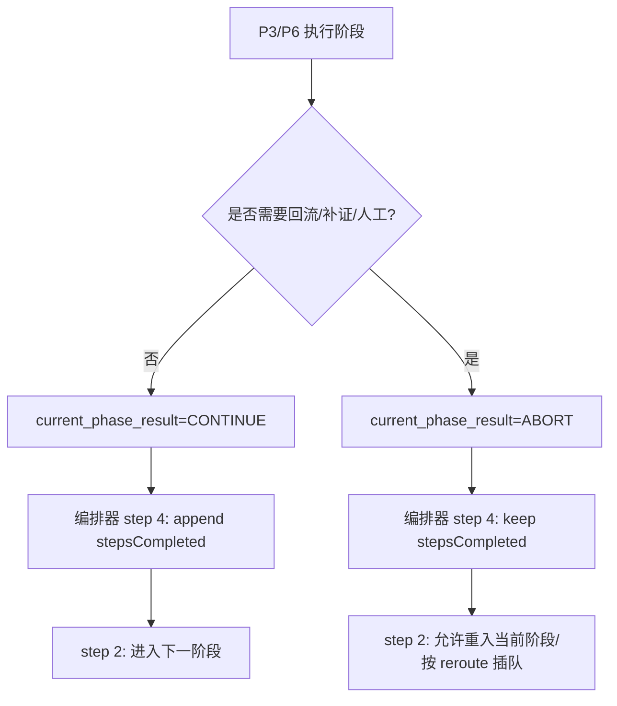

# Mobile B2C 质量工作流 — 对《QUALITY-AUDIT-REPORT.md》的专业 Review（不改代码）

> 目标：审阅并核验 [QUALITY-AUDIT-REPORT.md](file:///Users/bytedance/Code/loupe/mobile-qa-workflow/QUALITY-AUDIT-REPORT.md) 的专业性与事实准确性；补充其遗漏的“系统性风险”；给出可落地的改进建议与修订稿结构。
>
> 约束：本 Review **不修改任何代码/原报告**，仅输出建议文档。

---

## 1. Review Scope & Method

- 审计范围（本次实际核验）：`mobile-qa-workflow/` 全部文件（`find` 统计为 **74** 个文件），含：
  - 顶层入口：`SKILL.md`、`system-prompt.md`、`PLATFORM-GUIDE.md`
  - 核心编排：`core/core-rules.xml`、`core/workflow.xml`、`core/workflow-status-template.yaml`、`core/default-config.yaml`、`core/workflow-model.yaml`
  - 主工作流：`phases/p1~p6-*.md`、`agents/*.md`、`templates/*.md`、`reference/*.md`
  - 子工作流：`functionality-deep-dive/**`
  - 安装脚本：`install.sh`、`install_trae.sh`
- 方法：逐文件阅读 + 交叉核验（入口/状态机/阶段脚本/模板/共享基座契约/子工作流一致性），对报告的 Blocker/Critical/Major 断言逐条做“证据归档”。

---

## 2. 结论摘要（对原报告的评价）

原报告的强项：
- **问题抓得准**：它聚焦在“契约层漂移（字段/枚举/I/O 协议）”这一真实的主风险源，而不是停留在文档措辞层面。
- **多数高严重结论可被源码直接证实**：尤其是 `<task>` 标签规范缺口、`stepsCompleted` 与 reroute 的可重入性冲突、shared base 的输入缺参、主/Deep-Dive 枚举漂移、Deep-Dive 产物落盘策略导致跨 SubAgent 断链。

原报告的短板（需要修订）：
- **存在少量“事实性错误/不严谨表述”**：一些 Minor 结论与仓库现状不符（见第 4 节）。
- **缺少“系统性根因”提炼**：报告列了很多点状缺陷，但没有把它们归并为少数几个可治理的工程问题（例如“phase 早退语义未建模”“状态机单一权威源缺失”“SubAgent 输出介质缺失”）。
- **缺乏可执行的修订策略**：虽然有优先级矩阵，但缺少“最小修订集（MVP）”与“迁移兼容策略”（尤其是对 `schema_version`、旧会话恢复、deep-dive v3/v4 并存）。

---

## 3. 原报告中“证据充分”的关键问题（推荐保留并强化证据链）

以下条目均能在源码中找到直接证据，建议原报告在每条结论旁补充“证据链接（file://）+ 关键片段引用”，以提升可审计性。

### 3.1 `<task>` 标签未纳入 core-rules supported-tags（Critical）

- 证据：`core/workflow.xml` 以 `<task>` 作为根容器，而 `core/core-rules.xml` 的 `<supported-tags>` 并未声明 `task`。
- 链接：
  - [workflow.xml](file:///Users/bytedance/Code/loupe/mobile-qa-workflow/core/workflow.xml)
  - [core-rules.xml](file:///Users/bytedance/Code/loupe/mobile-qa-workflow/core/core-rules.xml)
- 风险：严格遵循标签白名单的编排器/Agent 可能直接拒绝解析根节点。

### 3.2 `stepsCompleted` + `reroute_target_phase` 的可重入性冲突（Blocker，且比原报告描述更系统）

- 证据：主编排在 step 2 优先消费 `reroute_target_phase`，但在 step 4 中 **只要 `current_phase_result != ABORT` 就会把 `{current_phase}` 追加到 `stepsCompleted`**。
  - [workflow.xml](file:///Users/bytedance/Code/loupe/mobile-qa-workflow/core/workflow.xml)
- 结论：一旦阶段“早退”（返回编排器）但未显式置 `current_phase_result = ABORT`，就会把该 phase 记为“已完成”，导致 reroute/retry 逻辑无法可靠重入。
- 原报告写的是 “P3 reroute 与 stepsCompleted 互锁”。但实际这是 **全链路系统性语义缺失**：任何 phase 的早退都可能触发同类错误（见第 5.1）。

### 3.3 P2 `Context-Curating` / `Curation-Failed` 进入状态机，但主状态模板/路由不全（Critical）

- 证据：`phases/p2-spec-definition.md` step 7 直接写 `current_state = Context-Curating`，并声明 `<0.4` 设置 `Curation-Failed`。
  - [p2-spec-definition.md](file:///Users/bytedance/Code/loupe/mobile-qa-workflow/phases/p2-spec-definition.md)
- 与之冲突：
  - 主状态模板未包含 `Context-Curating` / `Curation-Failed`（仅在编排器路由 switch 里出现 `Curation-Failed` case，状态模板缺枚举会导致“权威源”缺口）。
  - [workflow-status-template.yaml](file:///Users/bytedance/Code/loupe/mobile-qa-workflow/core/workflow-status-template.yaml)
  - [workflow.xml](file:///Users/bytedance/Code/loupe/mobile-qa-workflow/core/workflow.xml)

### 3.4 shared base 契约缺参（Critical）

#### (1) challenger base 要求 `confidence_input`，但调用处未注入
- 证据：`agents/shared-challenger-base.md` 输入契约包含 `confidence_input`。
  - [shared-challenger-base.md](file:///Users/bytedance/Code/loupe/mobile-qa-workflow/agents/shared-challenger-base.md)
- 调用处：`phases/p3-root-cause.md`、`phases/p4-fix-design.md` 的 `invoke-subagent` prompt 没有注入 `confidence_input`。
  - [p3-root-cause.md](file:///Users/bytedance/Code/loupe/mobile-qa-workflow/phases/p3-root-cause.md)
  - [p4-fix-design.md](file:///Users/bytedance/Code/loupe/mobile-qa-workflow/phases/p4-fix-design.md)

#### (2) arbiter base 要求 `base_score`，但调用处未注入
- 证据：`agents/shared-arbiter-base.md` 输入契约包含 `base_score`。
  - [shared-arbiter-base.md](file:///Users/bytedance/Code/loupe/mobile-qa-workflow/agents/shared-arbiter-base.md)
- 调用处：`p3-root-cause.md` complex-arbitrated 的 arbiter prompt 未传 `base_score`。

风险：`final_confidence = base_score × convergence_factor × challenge_survival_rate` 将变成“模型自造输入”，不可复现/不可对比。

### 3.5 Deep-Dive 默认不落盘导致跨 SubAgent 断链（Blocker/Critical）

- 证据：Deep-Dive 默认 `emit_environment_factor_report/topology_report/concurrency_report = false`。
  - [deep-dive default-config.yaml](file:///Users/bytedance/Code/loupe/mobile-qa-workflow/functionality-deep-dive/core/default-config.yaml)
- 而 F4 的输入显式是“可选文件路径变量”，并通过 `{environment_factor_report}/{topology_report}/{concurrency_report}` 读取。
  - [f4-isolation-debate.md](file:///Users/bytedance/Code/loupe/mobile-qa-workflow/functionality-deep-dive/phases/f4-isolation-debate.md)
- 结合 Deep-Dive phase 的实现：F1/F2/F3 触发 SubAgent 后，如果不落盘，就没有可靠介质给后续阶段读取（SubAgent 结果不会自动写入可共享位置）。
  - [f1-context-reconstruction.md](file:///Users/bytedance/Code/loupe/mobile-qa-workflow/functionality-deep-dive/phases/f1-context-reconstruction.md)
  - [f2-state-topology.md](file:///Users/bytedance/Code/loupe/mobile-qa-workflow/functionality-deep-dive/phases/f2-state-topology.md)
  - [f3-temporal-correlation.md](file:///Users/bytedance/Code/loupe/mobile-qa-workflow/functionality-deep-dive/phases/f3-temporal-correlation.md)

---

## 4. 原报告中需要修订/撤回的点（事实性或证据不足）

### 4.1 “`core-rules.xml` 的 `<template-output>` 未列 `file` 参数”（原报告 Minor m7）不成立

- 证据：`core/core-rules.xml` 的 `template-output` params 同时包含 `file` 与 `template`。
  - [core-rules.xml](file:///Users/bytedance/Code/loupe/mobile-qa-workflow/core/core-rules.xml)
- 建议：原报告应撤回该条，避免伤害报告可信度。

### 4.2 “`templates/error-dump.md` 与 `coder-agent.md` 内嵌模板不一致且缺字段”（原报告 Major M5）证据不足

- 现状：`templates/error-dump.md` 已包含“已应用变更/未回滚状态”等字段，与 `coder-agent.md` 内嵌模板文本高度一致。
  - [error-dump.md](file:///Users/bytedance/Code/loupe/mobile-qa-workflow/templates/error-dump.md)
  - [coder-agent.md](file:///Users/bytedance/Code/loupe/mobile-qa-workflow/agents/coder-agent.md)
- 建议：改为更准确的表述：
  - “同一模板内容在 agent 文档内嵌了一份，存在双源维护风险，应收敛为 templates 为权威、agent 引用路径。”

### 4.3 “P2 完全缺失 Non-Bug 处理路径”（原报告 B2）需要更精确表述

- 事实：`system-prompt.md` 的 Phase 2 包含完整 Non-Bug step-pause 逻辑；但 **主工作流的 `phases/p2-spec-definition.md` 不包含对应闭环**，只做了枚举列举。
  - [system-prompt.md](file:///Users/bytedance/Code/loupe/mobile-qa-workflow/system-prompt.md)
  - [p2-spec-definition.md](file:///Users/bytedance/Code/loupe/mobile-qa-workflow/phases/p2-spec-definition.md)
- 建议：报告应写为“**Skill/文件化工作流与 system-prompt 出现功能回退**”，而不是笼统说“P2 完全缺失”。

---

## 5. 原报告未充分强调的“系统性风险”（建议补充为最高优先级章节）

### 5.1 Phase “早退/回流”语义没有结构化建模，导致 stepsCompleted/IO-contract 失真（Blocker）

这是本次核验中最关键的“系统性根因”，原报告虽然碰到 B1/C9，但没有把它抽象成统一问题。

- 现状：多个 phase 以自然语言“阶段结束，返回编排器”结束，但没有统一写 `current_phase_result = ABORT`（编排器 step 4 仅在 ABORT 时不追加 `stepsCompleted`）。
  - [workflow.xml](file:///Users/bytedance/Code/loupe/mobile-qa-workflow/core/workflow.xml)
  - [p3-root-cause.md](file:///Users/bytedance/Code/loupe/mobile-qa-workflow/phases/p3-root-cause.md)
  - [p6-verification.md](file:///Users/bytedance/Code/loupe/mobile-qa-workflow/phases/p6-verification.md)
- 直接后果：
  - `stepsCompleted` 会把“失败/早退/需要重做”的阶段错误标成“已完成”。
  - `io-contract` 声明的必需产物可能在失败路径下根本没生成，但编排器仍推进/回流，形成不可审计闭环。
- 建议（写进报告“立刻修复”）：
  - 明确并强制“phase 早退 = ABORT”的结构化协议：任何阶段在需要回流/暂停/补证时，必须设置 `current_phase_result = ABORT`。
  - 或者：编排器不要依赖 phase 内部写变量，而是通过检测 `current_state` 是否落在“非继续态”（Info-Insufficient/Spec-Uncertain/Non-Bug/RCA-LowConfidence/Human-Review/Curation-Failed/Boundary-Refined 等）来决定是否追加 `stepsCompleted`。

### 5.2 `config_source` 键名缺少权威 schema，导致落盘字段漂移不可控（Major）

- 现状：
  - `core/default-config.yaml` 列出了大量 `output_*` 键，但不同 phase 更新 config 时使用的键名并不总一致（例如 P2 写 `output_curation_report`，但 default-config 并未定义该键）。
    - [default-config.yaml](file:///Users/bytedance/Code/loupe/mobile-qa-workflow/core/default-config.yaml)
    - [p2-spec-definition.md](file:///Users/bytedance/Code/loupe/mobile-qa-workflow/phases/p2-spec-definition.md)
- 建议：
  - 增加 `config-schema.yaml`（或在 default-config 明确所有键名含义与稳定性）作为单一权威源，并用 CI 做漂移检测（报告里可以给出脚本方案，但不要只停留在“建议加 CI”）。

### 5.3 P4 把 `fanout_mode` 复用为 Fix 阶段路由字段（Major）

- 证据：`phases/p4-fix-design.md` step 2 写回 `fanout_mode = {fix_strategy_mode}`。
  - [p4-fix-design.md](file:///Users/bytedance/Code/loupe/mobile-qa-workflow/phases/p4-fix-design.md)
- 风险：`fanout_mode` 在 P3 明确定义为 RCA fan-out（三档），被 P4 覆写后会污染 P3 的路由和升级逻辑（尤其是 P6 回流到 P3 的“强制 complex-arbitrated”判断）。
- 建议：报告应新增此条并标为 Major/Critical（取决于编排器是否依赖 `fanout_mode` 做后续判断）。

### 5.4 `step-pause` 的“用户选择写回机制”未被结构化定义（Major）

原报告提到 Non-Bug 闭环依赖 `non_bug_user_choice`，但没有指出更根本的问题：**系统没有定义 step-pause 的“结果如何落到 workflow-status”这一 I/O 协议**。

- 证据：编排器在 Non-Bug case 里“读取 p2 阶段 step-pause 用户选择结果”，但并未定义“谁来写 `non_bug_user_choice`、写到哪、字段值域是什么”。
  - [workflow.xml](file:///Users/bytedance/Code/loupe/mobile-qa-workflow/core/workflow.xml)
- 建议：
  - 在 `core-rules.xml` 增加“step-pause result contract”：任何 step-pause 必须写回 `{workflow_status}` 的指定字段（例如 `user_choice.<phase>.<step>`），或由编排器统一捕获。

---

## 6. 对原报告的结构化改进建议（让它更“工程可执行”）

### 6.1 把“缺陷台账”升级为“可执行修订 backlog”

推荐每条缺陷新增字段：
- `Contract Surface`: 影响面（workflow-status / config-source / artifacts / tag-dsl / subagent-io）
- `Failure Mode`: 具体失败模式（例如 reroute 重入失效 / 产物缺失 / 状态枚举不可解析）
- `Repro Scenario`: 最小复现场景（用 1-2 行描述一次编排循环如何触发）
- `Fix Sketch`: 1-3 行修复草案（不写代码，但写清改哪个文件/哪个协议）
- `Compatibility`: 对旧会话/旧 schema 的兼容策略

### 6.2 将“多处不一致”收敛为“单一权威源策略”

建议报告明确三类权威源：
- 状态枚举与字段：以 `core/workflow-status-template.yaml` 为权威源，其他文档派生（`system-prompt.md`/`SKILL.md`/`PLATFORM-GUIDE.md`）。
- 标签 DSL：以 `core/core-rules.xml` 为权威源，workflow.xml 与 phases 必须符合其 supported-tags（包含 `<task>` 这类根容器选择）。
- I/O 契约：以 `core/workflow.xml` 的 `<io-contract>` 为权威源，任何失败/早退路径也必须满足“最小可审计产物”的要求。

### 6.3 增加“风险收敛路径”图（建议原报告补 1 张即可）

建议原报告增加一张“phase 早退与 reroute 的状态流”图，用于解释为何 `stepsCompleted` 语义必须改造：

---

## 7. 建议：原报告的“修订版 v1.1”最小改动清单（不涉及实现，仅给出方向）

高优先级（建议作为 v1.1 的“必须修订点”写进报告）：
- 明确并统一 “phase 早退 = ABORT” 的结构化语义；并指出受影响的具体阶段（至少 P3/P6/Deep-Dive F1~F4）。
- 新增并强调 “P4 不应覆写 fanout_mode”。
- 把 “Non-Bug 闭环缺失” 改为 “Skill/文件化 phases 与 system-prompt 出现回退” 并给出对齐策略。
- 撤回/修订事实性错误（如 template-output 参数、error-dump 模板字段差异）。

中优先级（建议作为 v1.2 的“工程化治理点”）：
- config_source schema 单源 + 漂移检测
- step-pause result contract（用户选择写回机制）
- Deep-Dive 产物落盘策略：强制落盘 or 设计可跨 SubAgent 的 handoff 介质（文件/状态字段）

---

## 8. 附录：本 Review 覆盖清单

- 主入口与核心：`SKILL.md`、`system-prompt.md`、`PLATFORM-GUIDE.md`、`core/*`
- 主链路：`phases/*`、`agents/*`、`templates/*`、`reference/*`
- Deep-Dive：`functionality-deep-dive/core/*`、`functionality-deep-dive/phases/*`、`functionality-deep-dive/agents/*`、`functionality-deep-dive/templates/*`、`functionality-deep-dive/reference/*`
- 安装脚本：`install.sh`、`install_trae.sh`

