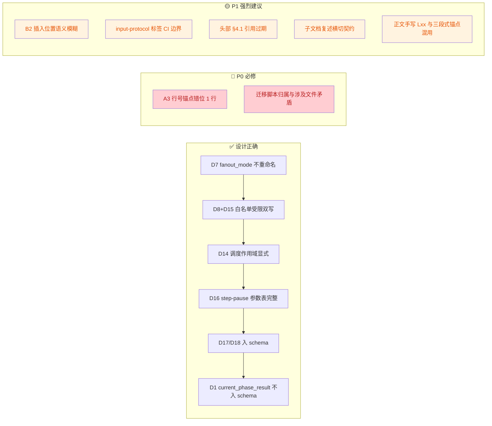
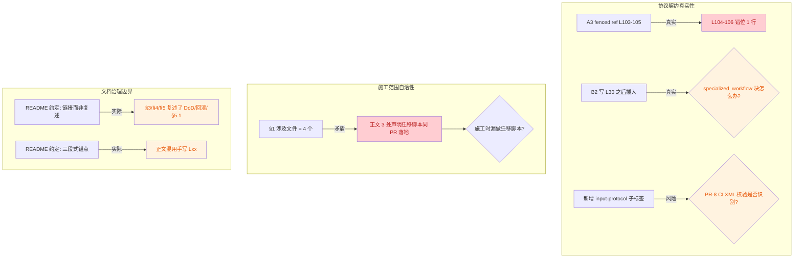

# PR-1 · schema 协议层 — 子文档 v1.1 Review

> **审阅对象**：[`pr1-schema-protocol.md`](./pr1-schema-protocol.md)（v1.0，2026-04-20 自主文档 v2.2 §4.1 完整迁出）
>
> **审阅基线**：
> - `mobile-qa-workflow/core/core-rules.xml`（123 行，当前 main）
> - `mobile-qa-workflow/core/workflow-status-template.yaml`（39 行，当前 main）
> - `mobile-qa-workflow/core/default-config.yaml`（49 行，当前 main）
> - `mobile-qa-workflow/core/config-schema.yaml`（不存在，待 PR-1 新增）
> - 主文档 [`QUALITY-AUDIT-CONSTRUCTION-PLAN-v2.2.md`](../../QUALITY-AUDIT-CONSTRUCTION-PLAN-v2.2.md) §3 PR-1 / §5.1 / §6 迁移脚本 / §7 回滚 / 附录 C D1-D19
> - [`README.md`](./README.md) 子文档骨架与编辑约定（"链接而非复述" / 三段式锚点 / 行号重对齐）
>
> **审阅日期**：2026-04-20（v1.0）→ 2026-04-20（v1.1，合入历史质检报告 3 项 finding）
>
> **审阅结论**：PR-1 子文档主体设计正确，14/17 项 §5.1 静态契约校验在协议层闭合，D1/D7/D8/D14/D15/D16/D17/D18 全部落地。但仍存在 **2 个 P0**（行号锚点错位 + 迁移脚本归属矛盾）、**5 个 P1**（落地语义模糊 / CI 边界 / 文档治理边界 / 锚点规范）、**3 个 P2**（设计风格优化）、**1 个 P3**（必要性证据）共 11 项 finding。建议在实施 PR-1 之前先做一次小修订。

---

## Intent

- 作者意图：把 v4.1 所有"新字段、新枚举、新参数、`<step-pause>` 写回协议、调度作用域约束、schema 版本升级、配置键名权威源"一次落地，作为 PR-2~PR-8 的协议契约基石；4 个文件、0.93d、零上游依赖。
- 审阅意图（v1.1 在 v1.0 基础上扩展）：
  - 协议契约真实性：核对 5 个变更点的行号锚点 + diff 与真实文件的一致性（v1.0 已覆盖）
  - 文档治理边界：核对子文档是否遵守 `README.md` 的"链接而非复述"约定（v1.1 合入）
  - 施工范围自洽性：核对 PR-1 自身声明的"涉及文件 / 同 PR 落地"是否前后一致（v1.1 合入）
  - 锚点规范统一性：核对正文与 fenced code reference 是否互相打架（v1.1 合入）

---

## 变更总览



**当前剩余断点（v1.1 视图）**



---

## Findings

| No. | Pri | 维度 | Issue Title | Suggestion | Code Link |
|---|---|---|---|---|---|
| 1 | 🔴 P0 | 协议契约真实性 | 变更点 A3 的"原文行号锚点 L103-105"错位 1 行：真实 `core-rules.xml` 中 L103 是 `</execution>`，L104 才是 `</supported-tags>`，L106 才是 `<human-review-protocol critical="true">`。按 PR-1 写的 L103-105 落地，编辑器跳转会指向错误行；reviewer grep `</execution>` 会误判 PR-1 删除了该标签。 | 把 PR-1 §2.1.3 三处 "L103-105" 全部修正为 "L104-106"，含 fenced code reference 中的 `103:105:...` → `104:106:...` 与正文叙述的"原 L103 与 L105 之间"→"原 L104 与 L106 之间"（与 #11 合并修订时，正文叙述部分可直接删除，仅保留 fenced reference）。 | [pr1-schema-protocol.md:L184-L192](./pr1-schema-protocol.md#L184-L192) / [core-rules.xml:L103-L106](../../core/core-rules.xml#L103-L106) |
| 2 | 🟡 P1 | 协议契约真实性 | 变更点 B2 的"diff 落地说明"写"原 L30 之后顺序插入新字段块"，但真实 `workflow-status-template.yaml` 在 L30 (`verification_failure_type`) 之后还有 L31 空行 + L32-37 `specialized_workflow:` 嵌套块 + L38 `# [END_PRESERVE_FORMAT]`。当前措辞会让实施者误以为新字段直接接到文件末尾；如果错误地插入到 `[END_PRESERVE_FORMAT]` 之外，则违反"严格 YAML 格式 + LLM 禁止修改结构"的顶层契约。 | PR-1 §2.2.2 "diff 落地说明" 补一句精确插入点：**"插入位置 = 原 L30 行尾、L31 空行前；L31-L38（`specialized_workflow:` 块 + `# [END_PRESERVE_FORMAT]` 标记）保留不动"**；同时在新文示例尾部用注释 `# ... specialized_workflow 块保留不动 ...` 提示。 | [pr1-schema-protocol.md:L356](./pr1-schema-protocol.md#L356) / [workflow-status-template.yaml:L30-L38](../../core/workflow-status-template.yaml#L30-L38) |
| 3 | 🟡 P1 | 协议契约真实性 | 变更点 A2 引入了新协议子标签 `<input-protocol critical="true">` 嵌套在 `<tag name="step-pause">` 内，但 `<input-protocol>` 既不在现有 `<supported-tags>` 白名单里，也未在 `core-rules.xml` 任何一处声明其语义边界。如果 PR-8 CI 启用 XML 元素白名单校验（D11），`<input-protocol>` 会被判为非法元素；如果不启用，LLM 解析器是否能稳定识别也无文档背书。 | 二选一：① 在 PR-1 §2.1.1 元数据标签边界注释中追加 `<input-protocol>`、`<workflow-result-protocol>` 等"协议级元标签"明确不在白名单管控范围；② 在 `<supported-tags>` 平级新增 `<protocol-tags>` 子节点登记 2 个新协议标签的边界与读取方约定。推荐方案 ①。 | [pr1-schema-protocol.md:L139-L166](./pr1-schema-protocol.md#L139-L166) / [pr1-schema-protocol.md:L57-L61](./pr1-schema-protocol.md#L57-L61) |
| 4 | 🟡 P1 | 文档治理边界 | PR-1 子文档头部第 3 行 `主文档：QUALITY-AUDIT-CONSTRUCTION-PLAN-v2.2.md §4.1（索引行）` 是迁出时遗留的过期引用 — 主文档 §4 在最新极简化后已无 §4.1 子节，全部 PR 收敛为一个简单清单（主文档 L486-L499）。此引用现为死链，且会让读者去主文档找一个不存在的"§4.1 索引行"。 | 改为 `主文档：QUALITY-AUDIT-CONSTRUCTION-PLAN-v2.2.md §4 PR 详细施工单清单`，去掉"§4.1 索引行"后缀。 | [pr1-schema-protocol.md:L3](./pr1-schema-protocol.md#L3) / [QUALITY-AUDIT-CONSTRUCTION-PLAN-v2.2.md:L486-L499](../../QUALITY-AUDIT-CONSTRUCTION-PLAN-v2.2.md#L486-L499) |
| 5 | 🟢 P2 | 协议契约真实性 | 真实 `workflow-status-template.yaml` 已有 L16 `non_bug_reflow_count: 0`，与 PR-1 新增的 `non_bug_user_choice`（L353） / `non_bug_context`（L338）同属 Non-Bug 流程相关字段，但 PR-1 修订理由没有说明三者的职责正交关系；reviewer / 后续 PR 实施者可能误用或误删。 | PR-1 §2.2.2 修订理由段追加一行三字段对照：**"职责正交：`non_bug_reflow_count` = 跨轮回流次数（已有）；`non_bug_user_choice` = 当前轮 step-pause 用户选择（v4.1 新增，白名单镜像）；`non_bug_context` = 当前轮 Non-Bug 判定上下文文本（v4.1 新增，仅 user_inputs 镜像）。"** | [pr1-schema-protocol.md:L358-L363](./pr1-schema-protocol.md#L358-L363) / [workflow-status-template.yaml:L16](../../core/workflow-status-template.yaml#L16) |
| 6 | 🟢 P2 | 协议契约真实性 | PR-1 §3 DoD 子集第 5 项写"`allowed_keys` 与 `core/default-config.yaml` 中已声明键名**互为子集**"，字面等价于"两个集合相等"，过严。实际 `config-schema.yaml` 应是 superset（允许定义"将来要支持但尚未默认配置"的键，如 deep-dive `output_*`）；`default-config.yaml` 应是 subset（实际有默认值的键）。当前措辞会导致：未来在 `config-schema.yaml` 增加键名（无 default）时，DoD 校验 fail。 | 把"互为子集"改为"`default-config.yaml` 中所有键名 ⊆ `config-schema.yaml.allowed_keys`（schema 是 superset，default 是 subset）"。这是同主文档 §5.1 第 5 项也共有的措辞 bug，建议同步修订主文档。 | [pr1-schema-protocol.md:L531](./pr1-schema-protocol.md#L531) / [QUALITY-AUDIT-CONSTRUCTION-PLAN-v2.2.md:L515](../../QUALITY-AUDIT-CONSTRUCTION-PLAN-v2.2.md#L515) |
| 7 | 🟢 P2 | 协议契约真实性 | 变更点 A2 把"phase 文件禁止内联 `<step-pause>`"作为 `<rule critical="true" id="step-pause-scope">` 嵌入到 `<tag name="step-pause">.<rules>` 内。语义上这是"step-pause 在哪些文件中可以出现"的元规则，不是"step-pause 标签的执行语义"，嵌套在 `<rules>` 内有混淆。LLM 解析器读 `<rules>` 时通常将其当作"标签自身行为约束"（如"立即结束当前回复"），元规则被弱化。 | 设计风格建议（不阻塞落地）：把 `id="step-pause-scope"` 这条规则独立出来，与 `<workflow-result-protocol>` 平级新增 `<step-pause-scope-protocol critical="true">`，集中管理"step-pause 调度作用域 / allowlist 引用 / phase 早退替代方案"三件事。这样 `<step-pause>` 标签内的 `<rules>` 只描述执行语义，元规则统一在协议章节。 | [pr1-schema-protocol.md:L106-L117](./pr1-schema-protocol.md#L106-L117) |
| 8 | 🟢 P3 | 协议契约真实性 | 变更点 A1 的修订理由声称"phase 文件实际使用 `<task>` 但白名单未注册"，但 PR-1 子文档没有附 grep 证据（命中文件数 / 命中样例），reviewer 无法快速判断 `<task>` 是否真的被广泛使用，还是仅个别 phase 误用。 | PR-1 §2.1.1 修订理由段补一行 grep 命中证据：**"现状：`grep -rn '<task' mobile-qa-workflow/phases/ mobile-qa-workflow/functionality-deep-dive/phases/ mobile-qa-workflow/agents/` 命中 N 个文件 / M 处使用"**（N/M 在实施 PR-1 时填入实测值）。 | [pr1-schema-protocol.md:L82-L84](./pr1-schema-protocol.md#L82-L84) |
| 9 | 🟡 P1 | 文档治理边界 | 子文档复述横切契约，破坏主文档单一权威源。`README.md` L34-L35 明确规定："跨 PR 横切契约（D1-D19 / §5 DoD / §6 迁移脚本 / §7 回滚）只在主文档维护，子文档**链接而非复述**。" 但 PR-1 §3（DoD 子集）展开了 14 行清单复述、§4（回滚动作）摘录了完整命令 / 状态 / 影响 / 风险等级、§5（§5.1 自检）按 PR-1 视角又复写了 17 项。后续主文档 §5/§6/§7 一旦修订，子文档极易漂移，reviewer 面对两套近似但不完全一致的口径。 | 二选一：① **严格遵循 README** — 把 §3/§4/§5 收敛为 1-2 行链接 + "PR-1 局部差异说明"，删除复述清单；② **修订 README 约定** — 承认子文档的自包含性需求，把"链接而非复述"放宽为"链接 + PR-1 视角投影"，并在 README 中显式登记允许投影的范围。当前 PR-1 子文档实际是方案 ②，但 README 未同步；任选一案落地，避免治理边界悬空。推荐方案 ②（自包含性对 reviewer 体验友好），同步修订 README。 | [README.md:L34-L35](./README.md#L34-L35) / [pr1-schema-protocol.md:L521-L578](./pr1-schema-protocol.md#L521-L578) |
| 10 | 🔴 P0 | 施工范围自洽性 | 迁移脚本归属与"涉及文件"清单自相矛盾，施工方案不可直接执行。PR-1 §1 元信息表 L20 明确把"涉及文件"写死为 4 个（不含迁移脚本），§2 文件级 diff 列表也只展开了这 4 个；但正文 3 处把迁移脚本视为 PR-1 同 PR 交付物：① §2.2.2 `schema_version: 4` 注释引用 `mobile-qa-workflow/scripts/migrate-workflow-status-v3-to-v4.py`（L299）；② §2.2.2 兼容性影响引用"迁移脚本 §6.1 注入新字段"（L366）；③ §4 回滚动作明确写"迁移脚本与 PR-1 同 PR 落地，回滚时一并被还原"（L552）。开发者按 §1/§2 清单施工会**漏做迁移脚本**；reviewer 按文件列表验收也无法判断脚本缺失是否属于漏项。 | 二选一并落定：① **迁移脚本属于 PR-1**：把 `mobile-qa-workflow/scripts/migrate-workflow-status-v3-to-v4.py` 加入 §1 涉及文件（5 个）+ §2 新增文件级 diff（含完整脚本内容或骨架引用）+ 工作量从 0.93d 上调（脚本+测试约 0.3-0.5d）+ §3 DoD 增加"迁移脚本可执行 + 反幂等校验通过"项；② **迁移脚本不属于 PR-1**：删除上述 3 处"同 PR 落地"措辞，改为"详见主文档 §6"，并在元信息表"不在本 PR 范围"行追加 `④ 迁移脚本（属于主文档 §6 横切交付物）`。**推荐方案 ①**，因为协议层 schema_version 升级与迁移脚本是强耦合的（schema 不升、脚本无意义；脚本不到位、schema 升级不可逆）。 | [pr1-schema-protocol.md:L20-L21](./pr1-schema-protocol.md#L20-L21) / [pr1-schema-protocol.md:L299](./pr1-schema-protocol.md#L299) / [pr1-schema-protocol.md:L366](./pr1-schema-protocol.md#L366) / [pr1-schema-protocol.md:L552](./pr1-schema-protocol.md#L552) |
| 11 | 🟡 P1 | 文档治理边界 | 锚点规范混用三段式 fenced reference 与正文手写 `Lxx` 行号，后续重对齐 main 时正文与 fenced reference 容易互相打架。`README.md` L35-L36 已规定"行号锚点使用 `startLine:endLine:filepath` 三段式 fenced code reference / 子文档展开前**重新对齐 main 行号**"。当前 PR-1 子文档虽然 fenced reference 已正确使用，但正文还有 5+ 处手写：L31 `原文（行号锚点 L24-40）`、L92 `原文（行号锚点 L98，单行高密度定义）`、L184-L186 `原 L103 与 L105 之间`、L356 `verification_failure_type 已存在于原 L30`、L486 `原文（行号锚点 L9-18）`。这些手写 `Lxx` 不会随源码漂移自动更新（也是 #1 出现的根因 — 手写行号与 fenced reference 不同步漂移）。 | 统一规范化：保留三段式 fenced code reference，**删除正文中所有 `Lxx` 手写叙述**，改为"见上方 fenced reference"或直接依赖 fenced 块自身行号。这样 #1 行号修订动作（L103-105 → L104-106）只需修订 fenced reference 一处，正文不再需要联动改写。 | [README.md:L35-L36](./README.md#L35-L36) / [pr1-schema-protocol.md:L31](./pr1-schema-protocol.md#L31) / [pr1-schema-protocol.md:L92](./pr1-schema-protocol.md#L92) / [pr1-schema-protocol.md:L184-L186](./pr1-schema-protocol.md#L184-L186) / [pr1-schema-protocol.md:L356](./pr1-schema-protocol.md#L356) / [pr1-schema-protocol.md:L486](./pr1-schema-protocol.md#L486) |

---

## 详细说明

### 1. 🔴 P0 — 变更点 A3 行号锚点错位 1 行（必须修订）

PR-1 §2.1.3 声明：

```184:192:mobile-qa-workflow/construction-plans/v2.2/pr1-schema-protocol.md
**插入位置**：在 `<supported-tags>` 闭合后、`<human-review-protocol>` 之前（即原 L103 与 L105 之间）。

**原文（行号锚点 L103-105）**：

```103:105:mobile-qa-workflow/core/core-rules.xml
    </supported-tags>

    <human-review-protocol critical="true">
```

而 `core/core-rules.xml` 真实 L103-L106：

```103:106:mobile-qa-workflow/core/core-rules.xml
        </execution>
    </supported-tags>

    <human-review-protocol critical="true">
```

- L103 实际是 `</execution>`（不是 `</supported-tags>`）
- L104 才是 `</supported-tags>`
- L105 是空行
- L106 才是 `<human-review-protocol critical="true">`

**影响**：编辑器按 fenced reference 跳转指向错误行；reviewer grep `</execution>` 会怀疑 PR-1 误删该标签；§5.1 第 14 项"持久化字段表纯净性"如果按行号锚点抽样验证会 fail。

**修订建议**：PR-1 §2.1.3 全部 `L103-105` / `L103 与 L105 之间` 改为 `L104-106` / `L104 与 L106 之间`；fenced reference `103:105:...` 改为 `104:106:...`。

> 注：PR-1 其余 4 处 fenced reference（A1 L24-40 / A2 L98 / B1 L1-7 / B2 L19-30 / D1 L9-18）核对真实文件后**全部正确**，仅 A3 一处错位。
> 注：与 #11 合并修订时，"原 L103 与 L105 之间" 这类正文叙述可直接删除，仅修订 fenced reference 中的 `103:105` 即可（避免一处行号需要两处同步）。

---

### 2. 🟡 P1 — 变更点 B2 新字段插入位置语义模糊

PR-1 §2.2.2 "diff 落地说明" 第 356 行写：

> 实际 PR 中**不重复声明**，仅在原 L30 之后顺序插入新字段块（…）

但真实 `workflow-status-template.yaml` L30 之后并不是文件末尾，而是：

```30:38:mobile-qa-workflow/core/workflow-status-template.yaml
verification_failure_type: null

specialized_workflow:
  mode: null
  status: null
  sub_workspace: null
  trigger_reason: null
  merge_strategy: null
# [END_PRESERVE_FORMAT]
```

**3 种可能落地姿势**：
- A. 插到 L30 之后、L31 空行之前 — 新字段紧随 `verification_failure_type`，`specialized_workflow:` 仍在末尾 ✅ 推荐
- B. 插到 L37 之后、L38 之前 — 新字段在 `specialized_workflow:` 之后、`[END_PRESERVE_FORMAT]` 之内 ✅ 也合理
- C. 插到 L38 之后 — 新字段在 `[END_PRESERVE_FORMAT]` 之外 ❌ 违反顶层契约

**修订建议**：PR-1 §2.2.2 "diff 落地说明" 补精确插入点：

> 实际 PR 中**不重复声明**，仅在原 **L30 行尾、L31 空行之前** 顺序插入新字段块。**L31-L38（`specialized_workflow:` 块 + `# [END_PRESERVE_FORMAT]` 标记）保留不动；新字段全部落入 `[PRESERVE_FORMAT]` ↔ `[END_PRESERVE_FORMAT]` 区间内。**

并在新文示例代码块尾部追加注释 `# ── 以下保留不动：specialized_workflow + [END_PRESERVE_FORMAT] ──`。

---

### 3. 🟡 P1 — `<input-protocol>` / `<workflow-result-protocol>` 协议子标签的 CI 校验风险

PR-1 一次性引入 2 个新的协议级 XML 元素：
- `<input-protocol critical="true">` — 嵌套在 `<tag name="step-pause">` 内，5 条 `<rule>` 定义 step-pause 输入解析协议；
- `<workflow-result-protocol critical="true">` — 与 `<supported-tags>` 平级，3 条 `<rule>` 定义 `current_phase_result` 运行时变量协议。

**问题**：`core-rules.xml` 当前的 `<supported-tags>`（L24-103）只声明了 `<flow>` / `<task>` 内部允许的 DSL 标签，**没有任何地方声明"协议级 XML 元素"的边界**。这导致两个风险：
1. **PR-8 CI 风险**（D11 / D13）：如果引入 XML 元素白名单校验，`<input-protocol>` / `<workflow-result-protocol>` 会被判为未声明元素，CI fail；
2. **LLM 解析风险**：LLM 是否稳定识别这 2 个新元素为"应当遵循的协议规则"无文档背书。

**对比**：PR-1 §2.1.1 已经为元数据标签（`<llm>` / `<mandate>` / `<agent-taxonomy>` / `<human-review-protocol>` / `<trigger>` / `<output-format>`）写了边界声明注释（L57-L61），但**漏掉了本 PR 新增的 2 个协议子标签**。

**修订建议（推荐方案 ①）**：在 PR-1 §2.1.1 边界声明注释中追加：

```xml
<!--
  标签白名单边界声明（v4.1 / D3）：
  本白名单仅约束 <flow>/<task> 内部 DSL 标签；元数据标签（<llm>/<mandate>/
  <agent-taxonomy>/<human-review-protocol>/<trigger>/<output-format> 等）不在
  LLM 解析校验范围内，PR-8 CI 也不对元数据标签做白名单守门。
  协议级元标签（<input-protocol>/<workflow-result-protocol>）同样不在 DSL 白名单
  管控范围内，由编排器与文档约定其语义；PR-8 CI 不做元素白名单校验。
-->
```

---

### 4. 🟡 P1 — 头部引用 §4.1 已过期

PR-1 子文档第 3 行：

```3:3:mobile-qa-workflow/construction-plans/v2.2/pr1-schema-protocol.md
> **主文档**：[`../../QUALITY-AUDIT-CONSTRUCTION-PLAN-v2.2.md`](../../QUALITY-AUDIT-CONSTRUCTION-PLAN-v2.2.md) §4.1（索引行）
```

但主文档 §4 已极简化为单一 8 行清单（主文档 L486-L499），无 §4.1 子节。此引用现为死链。

**修订建议**：改为 `主文档：QUALITY-AUDIT-CONSTRUCTION-PLAN-v2.2.md §4 PR 详细施工单清单`。

---

### 5. 🟢 P2 — Non-Bug 三字段职责正交关系未文档化

真实 `workflow-status-template.yaml` 已有 L16 `non_bug_reflow_count: 0`，PR-1 §2.2.2 又新增 `non_bug_user_choice` 与 `non_bug_context`。三字段语义易混。

**修订建议**：在 PR-1 §2.2.2 修订理由段追加一行：

> **职责正交**（与 v3 已有字段共存）：
> - `non_bug_reflow_count`（v3 已有）= Non-Bug → P1 回流的累计次数（trigger #6 触发熔断的输入）
> - `non_bug_user_choice`（v4.1 新增）= 当前轮编排器 case Non-Bug step-pause 的用户选择（白名单镜像，v4.2 收敛）
> - `non_bug_context`（v4.1 新增）= 当前轮 P2 Non-Bug 判定上下文文本（仅 user_inputs.<key>，不入顶层）

---

### 6. 🟢 P2 — DoD 第 5 项措辞"互为子集"过严

PR-1 §3 DoD 子集第 5 项（L531）写"`allowed_keys` 与 `core/default-config.yaml` 中已声明键名**互为子集**"，等价于"两集合相等"，过严。

**修订建议**：改为"`default-config.yaml` 中所有键名 ⊆ `config-schema.yaml.allowed_keys`（schema 是 superset，default 是 subset）"。建议同步修订主文档 §5.1 第 5 项（L515）。

---

### 7. 🟢 P2 — `<rule id="step-pause-scope">` 嵌套位置的设计风格问题

PR-1 §2.1.2 把"phase 文件禁止内联 step-pause"作为 `<rule critical="true" id="step-pause-scope">` 嵌入 `<tag name="step-pause">.<rules>` 内（L106-L117），这是元规则混入标签语义。

**修订建议**（设计风格，不阻塞落地）：把 `id="step-pause-scope"` 提升为协议级章节，与 `<workflow-result-protocol>` 平级新增 `<step-pause-scope-protocol critical="true">`，集中管理"调度作用域 / allowlist 引用 / phase 早退替代方案"。

---

### 8. 🟢 P3 — 变更点 A1 `<task>` 必要性需要 grep 证据

PR-1 §2.1.1 修订理由（L82-L84）声称"phase 文件实际使用 `<task>` 但白名单未注册"，缺命中文件数 / 命中样例的 grep 证据。

**修订建议**：PR-1 实施时（实际 grep 后）补一行实测数据：

> 现状：`grep -rn '<task' mobile-qa-workflow/{phases,functionality-deep-dive/phases,agents}/` 命中 **N 个文件 / M 处使用**（实测于 PR-1 提交时主干 commit `<sha>`）。

如果 grep 命中 0 处，需重新评估变更点 A1 的必要性。

---

### 9. 🟡 P1 — 子文档复述横切契约，破坏主文档单一权威源（v1.1 合入）

`README.md` L34-L35 明确约定：

> 跨 PR 横切契约（D1-D19 / §5 DoD / §6 迁移脚本 / §7 回滚）只在主文档维护，子文档**链接而非复述**。

但 PR-1 子文档实际偏离该约定：
- §3 PR-level DoD 子集（L521-L542）：不只是"链接到主文档 §5.1"，而是展开了完整 14 项 DoD 清单复述；
- §4 PR-level 回滚动作（L544-L552）：摘录了完整回滚命令 / 回滚后状态 / 下游影响 / 风险等级 4 段；
- §5 §5.1 静态契约校验自检（L554-L578）：按 PR-1 视角又复写了 §5.1 全部 17 项清单。

**影响**：
- 主文档 §5/§6/§7 一旦修订，子文档极易漂移；
- reviewer 面对两套近似但不完全一致的口径，验收口径不明；
- 这是治理边界问题，不直接阻塞实施，但拉高长期维护成本。

**修订建议（二选一并明确登记）**：
- 方案 ①（严格遵循 README）：把 §3/§4/§5 收敛为 1-2 行链接 + "PR-1 局部差异说明"，删除复述清单；
- 方案 ②（修订 README 约定）：承认子文档的自包含性需求，把"链接而非复述"放宽为"链接 + PR-1 视角投影"，并在 README 中显式登记允许投影的范围（"§5.1 自检表可按 PR-1 视角投影"）。

**推荐方案 ②**：自包含性对 reviewer 体验友好（不必跳到主文档对照 §5.1 17 项验收），但必须**同步修订 README** 把这条约定放宽，否则治理边界悬空。

---

### 10. 🔴 P0 — 迁移脚本归属与"涉及文件"清单自相矛盾（v1.1 合入）

PR-1 §1 元信息表 L20 明确把"涉及文件"写死：

```20:21:mobile-qa-workflow/construction-plans/v2.2/pr1-schema-protocol.md
| 涉及文件 | 4 个：`core/core-rules.xml`（修改）/ `core/workflow-status-template.yaml`（修改）/ `core/config-schema.yaml`（**新增**）/ `core/default-config.yaml`（修改） |
| 不在本 PR 范围 | ① v4.2 遗留 #6（phase 内现存 step-pause 全面治理）② PR-2 编排器双写实现 ③ PR-5 `legacy-phase-step-pause-allowlist.txt` 实体生成 ④ 任何 phase 文件改动 |
```

但正文 3 处又把迁移脚本视为 PR-1 同 PR 交付物：

| 位置 | 措辞 |
|---|---|
| §2.2.2 schema_version 注释 (L299) | `迁移脚本路径见 mobile-qa-workflow/scripts/migrate-workflow-status-v3-to-v4.py` |
| §2.2.2 兼容性影响 (L366) | `存量 v3 会话：迁移脚本 §6.1 注入新字段全为默认值（null / [] / {} / 0），不破坏已有读路径` |
| §4 回滚动作 (L552) | `迁移脚本 mobile-qa-workflow/scripts/migrate-workflow-status-v3-to-v4.py（与 PR-1 同 PR 落地，详见主文档 §6）回滚时一并被还原` |

**影响**（直接阻塞实施 / 验收）：
- 开发者按 §1 / §2 清单施工，**会漏做迁移脚本**；
- reviewer 按文件列表验收，无法判断脚本缺失是否属于漏项；
- §3 DoD 子集没有"迁移脚本可执行"项 → 即便施工时记得做，DoD 也无法守门；
- §4 回滚预案的"一并被还原"承诺无法兑现（git revert 只会还原 §1 列出的 4 个文件）。

这是**施工范围悬空**问题，比 #1 行号错位更严重 — 行号错位是细节差错，本项是整个 PR 边界不清。

**修订建议（二选一并落定）**：

**方案 ①：迁移脚本属于 PR-1（推荐）**
- §1 涉及文件改为 5 个，追加 `mobile-qa-workflow/scripts/migrate-workflow-status-v3-to-v4.py`（**新增**）
- §2 增加文件级 diff 块 §2.5 完整给出脚本骨架（schema_version: 3 → 4 + 注入 6 个新字段默认值 + idempotent 校验 + dry-run 模式）
- 工作量从 0.93d 上调到约 1.3d（脚本+测试约 0.3-0.5d）
- §3 DoD 子集追加：`[ ] 迁移脚本对 v3 测试夹具可执行 + 反幂等 + dry-run 输出与实际写入一致`
- 主文档 §6 同步 cross-link 到本子文档 §2.5

**方案 ②：迁移脚本不属于 PR-1**
- 删除 §2.2.2 / §2.2.2 / §4 三处"同 PR 落地"措辞，改为"详见主文档 §6"
- §1 元信息表"不在本 PR 范围"行追加 `④ 迁移脚本（属于主文档 §6 横切交付物）`
- §4 回滚动作明确"迁移脚本不在本 PR，回滚仅 revert 4 个 schema 文件；存量 v4 会话需主文档 §6 反向迁移脚本兜底"

**强烈推荐方案 ①**：协议层 schema_version 升级与迁移脚本是**强耦合的**（schema 不升、脚本无意义；脚本不到位、schema 升级不可逆 — 存量 v3 会话立刻读不出新字段），把它们拆成两个 PR 会让 PR-1 单独合入时主干处于"schema 升级了但迁移脚本还没合入"的中间不可用态，违反 PR-1"作为协议契约基石"的定位。

---

### 11. 🟡 P1 — 锚点规范混用三段式 + 正文手写 Lxx（v1.1 合入）

`README.md` L35-L36 明确约定：

> 行号锚点使用 `startLine:endLine:filepath` 三段式 fenced code reference。
> 子文档展开前**重新对齐 main 行号**（避免基于过期锚点）。

PR-1 子文档虽然 fenced reference 已正确使用，但**正文还有 5+ 处手写 `Lxx` 叙述**：

| 位置 | 手写文字 |
|---|---|
| L31 | `**原文（行号锚点 L24-40）**` |
| L92 | `**原文（行号锚点 L98，单行高密度定义）**` |
| L184-L186 | `**插入位置**：... 即原 L103 与 L105 之间` + `**原文（行号锚点 L103-105）**` |
| L356 | `verification_failure_type 已存在于原 L30，**不重复声明**；实际 PR 中仅在原 L30 之后顺序插入新字段块` |
| L486 | `**原文（行号锚点 L9-18）**` |

**问题**：手写 `Lxx` 不是机器可消费锚点，不会随源码漂移自动更新。这也是 #1 出现的**根因** — fenced reference 与正文叙述同时携带行号，二者漂移不同步时一致性随之破裂（A3 fenced reference 写 `103:105`，正文叙述也写"L103 与 L105 之间"，两处独立，但都错位 1 行）。

**修订建议**：保留三段式 fenced code reference，**删除正文中所有 `Lxx` 手写叙述**，改为：
- "原文（见下方 fenced reference）" 替代 "原文（行号锚点 L24-40）"
- "插入位置：在 `<supported-tags>` 闭合后、`<human-review-protocol>` 之前（fenced reference 见下方）" 替代 "原 L103 与 L105 之间"
- "`verification_failure_type` 已存在于上方 fenced reference 末行" 替代 "已存在于原 L30"

收益：#1 行号修订动作（L103-105 → L104-106）只需修订 fenced reference 一处，不再需要正文联动改写；未来主干漂移时维护成本显著下降。

---

## 已关闭项（PR-1 子文档做对的地方）

PR-1 子文档已**正确落地**以下关键设计：

| 决定 | 落地证据 |
|---|---|
| **D1**（current_phase_result 不入 schema） | 变更点 A3 `<workflow-result-protocol>` 第 3 条 rule 显式禁止入 status template / 文档持久化字段表 |
| **D7**（fanout_mode 不重命名） | 变更点 B2 注释明确"保留为 RCA 字段，不重命名"；新增 `fix_fanout_mode` 仅承接 Fix 语义 |
| **D8 + D15**（白名单受限双写） | 变更点 B2 顶层镜像白名单注释段含"强契约 + 起步白名单 = `{non_bug_user_choice}` + v4.2 收敛"三件套；变更点 A2 `<input-protocol>` 第 5 条 rule 与之闭合 |
| **D14**（调度作用域） | 变更点 A2 `<rule id="step-pause-scope">` 显式约束 phase 内禁内联，并引用 allowlist 路径 |
| **D16**（step-pause 参数表完整） | 变更点 A2 `<params>` 块完整声明 `title (required) / result_field (required) / allowed_values (required) / option (0..*)` |
| **D17**（non_bug_context 入 schema） | 变更点 B2 显式 `non_bug_context: null` + 注释含写入端 |
| **D18**（parse_error_count 入 schema） | 变更点 B2 显式 `parse_error_count: 0` + 完整生命周期注释（4 类动作） |
| **C5**（current_state 单一权威源） | 变更点 B1 头部注释列出 v4.1 完整 15 个枚举集 |
| **C10**（fix_fanout_mode + snapshot 字段隔离） | 变更点 B2 同时声明 `fix_fanout_mode: null` 与 `rca_fanout_mode_snapshot: null` |
| **M16**（config-schema 引入） | 变更点 C 新增 `core/config-schema.yaml` 含 `allowed_keys` + `nested_allowed_keys` + `known_legacy_aliases`（v4.2 遗留 #1 登记） |

**14/17 项 §5.1 静态契约校验在协议层闭合**；剩余 3 项（第 9 / 14 / 17 项）已正确承接到 PR-2/PR-3/PR-4/PR-5/PR-8。

---

## 行号锚点核查矩阵（5 个变更点全量验证）

| 变更点 | 文件 | PR-1 fenced ref | 真实行号 | 结论 |
|---|---|---|---|---|
| A1 | `core/core-rules.xml` | L24-40 | L24-40 ✅ | 一致 |
| A2 | `core/core-rules.xml` | L98（单行） | L98 ✅ | 一致 |
| A3 | `core/core-rules.xml` | **L103-105** | **L104-106** | 🔴 错位 1 行 → Finding #1 |
| B1 | `core/workflow-status-template.yaml` | L1-7 | L1-7 ✅ | 一致 |
| B2 | `core/workflow-status-template.yaml` | L19-30 | L19-30 ✅ | 一致（落地说明缺 L31-L38 处理 → Finding #2） |
| D1 | `core/default-config.yaml` | L9-18 | L9-18 ✅ | 一致 |

---

## 维度交叉矩阵（v1.1 新增）

| 维度 | P0 | P1 | P2 | P3 | 总计 |
|---|---|---|---|---|---|
| 协议契约真实性 | #1 | #2, #3 | #5, #6, #7 | #8 | 7 |
| 文档治理边界 | — | #4, #9, #11 | — | — | 3 |
| 施工范围自洽性 | #10 | — | — | — | 1 |
| **合计** | **2** | **5** | **3** | **1** | **11** |

---

## 建议结论

- PR-1 子文档主体设计正确：14/17 项 §5.1 在协议层闭合，D1/D7/D8/D14/D15/D16/D17/D18 全部落地。
- **但在 PR-1 实施前必须先做一次小修订**，修订优先级（按"先解阻塞、再解风险、最后解优化"）：
  1. 🔴 **P0 必修（2 项）**：
     - Finding #10（迁移脚本归属）— 推荐方案 ①（脚本属于 PR-1，工作量上调到 1.3d）
     - Finding #1（A3 行号错位）— 与 #11 合并修订，仅改 fenced reference
  2. 🟡 **P1 强烈建议（5 项）**：
     - Finding #11（删除正文手写 Lxx，统一三段式锚点）— 修订成本最低，收益最高
     - Finding #2（B2 插入位置精确化）
     - Finding #3（协议子标签 CI 边界）
     - Finding #9（治理边界二选一并同步 README）
     - Finding #4（头部 §4.1 引用过期）
  3. 🟢 **P2 有时间再修（3 项）**：Finding #5/#6/#7
  4. 🟢 **P3 实施时补（1 项）**：Finding #8（A1 grep 证据）
- 修订完成后，PR-1 即可作为稳定的协议层施工蓝图启动实施。

---

## Review Changelog

| 版本 | 日期 | 变更 |
|---|---|---|
| v1.0 | 2026-04-20 | 首版 review，对应 `pr1-schema-protocol.md` v1.0；产出 1 P0 + 3 P1 + 3 P2 + 1 P3 共 8 项 finding（聚焦协议契约真实性维度） |
| v1.1 | 2026-04-20 | 合入历史质检报告 `pr1-schema-protocol-review-2026-04-20.md` 的 3 项 finding（其文件已合入后删除）；新增"文档治理边界"与"施工范围自洽性"2 个维度；新增 Finding #9（横切契约复述，🟡 P1）/ #10（迁移脚本归属，🔴 P0 升级）/ #11（锚点规范混用，🟡 P1）；总数 8 → 11，P0 1 → 2；新增"维度交叉矩阵"小节；建议结论按"先解阻塞、再解风险、最后解优化"重排序 |
