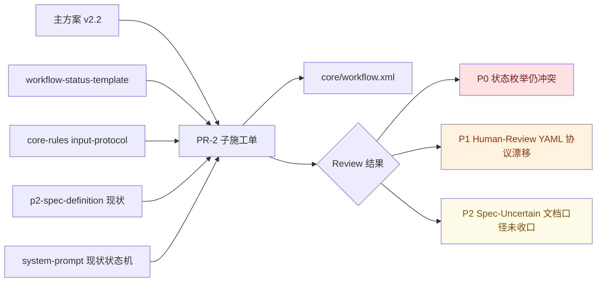

# PR-2 · 编排器 step-pause 施工单 Review（2026-04-20）

> **Review 对象**：[`pr2-orchestrator-step-pause.md`](file:///Users/bytedance/Code/loupe/mobile-qa-workflow/construction-plans/v2.2/pr2-orchestrator-step-pause.md)
> **上游基线**：[`QUALITY-AUDIT-CONSTRUCTION-PLAN-v2.2.md`](file:///Users/bytedance/Code/loupe/mobile-qa-workflow/QUALITY-AUDIT-CONSTRUCTION-PLAN-v2.2.md)
> **代码对照**：[`core/workflow.xml`](file:///Users/bytedance/Code/loupe/mobile-qa-workflow/core/workflow.xml), [`core/core-rules.xml`](file:///Users/bytedance/Code/loupe/mobile-qa-workflow/core/core-rules.xml), [`core/workflow-status-template.yaml`](file:///Users/bytedance/Code/loupe/mobile-qa-workflow/core/workflow-status-template.yaml), [`phases/p2-spec-definition.md`](file:///Users/bytedance/Code/loupe/mobile-qa-workflow/phases/p2-spec-definition.md), [`system-prompt.md`](file:///Users/bytedance/Code/loupe/mobile-qa-workflow/system-prompt.md)
> **审查口径**：仅 review 方案，不修改代码
> **交叉验证**：已用 2 次独立复核确认结论

## 结论

- 当前 PR-2 子施工单**不建议按现状直接通过**。
- 确认存在 **2 个有效问题**：1 个 `P0`、1 个 `P1`。
- 另有 **1 个 `P2` 级文档一致性风险**，不阻塞独立落地，但建议在主文档同步收口。

## 变更意图

- 意图：把编排器 `step 4` 的 `step-pause` 从“自然语言停顿”升级为“带 `result_field` / `allowed_values` / 白名单受限双写 / parse-error 熔断”的结构化协议，并补 `step 3` 显式传参。

## 关系图

## Findings

| No. | 优先级 | Issue Title | Suggestion | Code Link |
|---|---|---|---|---|
| 1 | P0 | PR-2 继续沿用 `Closed`，但当前 schema 权威枚举仍是 `Done`，方案会把已知状态机冲突继续固化 | 在 PR-2 开工前先统一 `current_state` 权威集合，至少把 `Closed/Done` 与 `RCA-InProgress/RCA-Designing` 收口成单一口径；否则 PR-2 不能声称与 PR-1/C5 自洽 | [pr2-orchestrator-step-pause.md:L396-L399](file:///Users/bytedance/Code/loupe/mobile-qa-workflow/construction-plans/v2.2/pr2-orchestrator-step-pause.md#L396-L399) / [workflow-status-template.yaml:L4-L10](file:///Users/bytedance/Code/loupe/mobile-qa-workflow/core/workflow-status-template.yaml#L4-L10) |
| 2 | P1 | Human-Review case 新增“正文 YAML 片段合并”规则，但主协议和现状实现都没有这个输入契约 | 删除该 YAML 片段设定，回到“人工指令 + goto step 2”的现状口径；或把 YAML 回复格式正式提升到 `human-review-protocol` / `input-protocol`，补充字段白名单、校验和失败处理 | [pr2-orchestrator-step-pause.md:L513-L542](file:///Users/bytedance/Code/loupe/mobile-qa-workflow/construction-plans/v2.2/pr2-orchestrator-step-pause.md#L513-L542) / [core-rules.xml:L204-L220](file:///Users/bytedance/Code/loupe/mobile-qa-workflow/core/core-rules.xml#L204-L220) |
| 3 | P2 | `Spec-Uncertain` 在子施工单里收敛为 `Confirm` 单值，但主文档 PR-2 总览仍保留 `1|2|S` 建议口径 | 子施工单本身可以保留 `Confirm`，但主文档应同步显式改成“v4.1 保守口径 = Confirm；`1|2|S` 为 v4.2 目标态或 reviewer 议题”，避免评审误判 | [pr2-orchestrator-step-pause.md:L303-L334](file:///Users/bytedance/Code/loupe/mobile-qa-workflow/construction-plans/v2.2/pr2-orchestrator-step-pause.md#L303-L334) / [QUALITY-AUDIT-CONSTRUCTION-PLAN-v2.2.md:L316-L316](file:///Users/bytedance/Code/loupe/mobile-qa-workflow/QUALITY-AUDIT-CONSTRUCTION-PLAN-v2.2.md#L316-L316) |

## Evidence

### 1. `Closed/Done` 冲突仍未被 PR-2 收口

- PR-2 子施工单在 Non-Bug `Accept` 分支继续写 `current_state = Closed`，见 [pr2-orchestrator-step-pause.md:L396-L399](file:///Users/bytedance/Code/loupe/mobile-qa-workflow/construction-plans/v2.2/pr2-orchestrator-step-pause.md#L396-L399)。
- 当前状态模板头部把 `current_state` 权威枚举写成 `... / Human-Review / Done`，并没有 `Closed`，见 [workflow-status-template.yaml:L4-L10](file:///Users/bytedance/Code/loupe/mobile-qa-workflow/core/workflow-status-template.yaml#L4-L10)。
- 现网代码和系统说明依旧大量使用 `Closed` 与 `RCA-InProgress`，说明这不是 PR-2 独有问题，而是一个**已存在但尚未收口的上游冲突**：
  - [workflow.xml:L118-L123](file:///Users/bytedance/Code/loupe/mobile-qa-workflow/core/workflow.xml#L118-L123)
  - [workflow.xml:L172-L176](file:///Users/bytedance/Code/loupe/mobile-qa-workflow/core/workflow.xml#L172-L176)
  - [p2-spec-definition.md:L115-L120](file:///Users/bytedance/Code/loupe/mobile-qa-workflow/phases/p2-spec-definition.md#L115-L120)
  - [p6-verification.md:L101-L102](file:///Users/bytedance/Code/loupe/mobile-qa-workflow/phases/p6-verification.md#L101-L102)
  - [system-prompt.md:L63-L75](file:///Users/bytedance/Code/loupe/mobile-qa-workflow/system-prompt.md#L63-L75)
- 因此，PR-2 文档如果继续直接使用 `Closed`，会把“PR-1 已知 P0 冲突”继续传播到后续施工与 DoD。

### 2. Human-Review 正文 YAML 规则缺少协议依据

- PR-2 子施工单在 Human-Review case 中新增了这条实现假设：
  - “由人工在回复正文中以 YAML 片段形式追加；编排器读取并合并到 workflow_status”，见 [pr2-orchestrator-step-pause.md:L529-L533](file:///Users/bytedance/Code/loupe/mobile-qa-workflow/construction-plans/v2.2/pr2-orchestrator-step-pause.md#L529-L533)。
- 但当前正式协议只定义了：
  - Human-Review 通知格式与触发器，见 [core-rules.xml:L204-L220](file:///Users/bytedance/Code/loupe/mobile-qa-workflow/core/core-rules.xml#L204-L220)
  - `step-pause` 首行 `<key>=<value>` 的输入协议，见 [core-rules.xml:L146-L173](file:///Users/bytedance/Code/loupe/mobile-qa-workflow/core/core-rules.xml#L146-L173)
- 当前运行实现也只是自然语言“根据人工指令更新状态，goto step 2”，并没有 YAML body 的解析约束，见 [workflow.xml:L150-L156](file:///Users/bytedance/Code/loupe/mobile-qa-workflow/core/workflow.xml#L150-L156) 与 [system-prompt.md:L104-L109](file:///Users/bytedance/Code/loupe/mobile-qa-workflow/system-prompt.md#L104-L109)。
- 这意味着子施工单引入了一个**未在主协议登记的新输入格式**。如果实施者按文档开发，就必须补充：
  - YAML body 的允许字段范围
  - 合并策略
  - 非法 YAML / 未知字段 / 部分字段缺失时的失败处理
- 在这些约束缺失的前提下，把它写成“事实标准”并不成立。

### 3. `Spec-Uncertain` 的 `Confirm` 不是实现错误，但与主文档总览口径未收口

- PR-2 子施工单明确说明：当前编排器侧先保守收敛到 `allowed_values="Confirm"`，见 [pr2-orchestrator-step-pause.md:L303-L334](file:///Users/bytedance/Code/loupe/mobile-qa-workflow/construction-plans/v2.2/pr2-orchestrator-step-pause.md#L303-L334)。
- 从当前代码现状看，这个收敛是合理的，因为编排器现有 `Spec-Uncertain` case 本来就只有单选 `Confirm`，见 [workflow.xml:L110-L116](file:///Users/bytedance/Code/loupe/mobile-qa-workflow/core/workflow.xml#L110-L116)。
- 但主文档 PR-2 总览里仍写着 `spec_uncertain_choice` 建议值 `1|2|S`，见 [QUALITY-AUDIT-CONSTRUCTION-PLAN-v2.2.md:L316-L316](file:///Users/bytedance/Code/loupe/mobile-qa-workflow/QUALITY-AUDIT-CONSTRUCTION-PLAN-v2.2.md#L316-L316)。
- 同时，P2 phase 的老旧内联 `step-pause` 也确实还是 `[1]/[2]/[S]`，见 [p2-spec-definition.md:L48-L59](file:///Users/bytedance/Code/loupe/mobile-qa-workflow/phases/p2-spec-definition.md#L48-L59)。
- 所以这里更像是**主文档与子文档的口径未收口**，而不是 PR-2 子单本身写错。

## Open Questions

- 是否要在 PR-2 之前先单独修正 `current_state` 权威枚举，使 PR-2 不再继续传播 `Closed/Done` 与 `RCA-InProgress/RCA-Designing` 冲突？
- Human-Review 恢复阶段是否真的需要结构化正文协议？如果需要，是否应升级为 PR-1/主文档层面的正式协议，而不是只在 PR-2 子单里局部约定？
- `Spec-Uncertain` 的 v4.1 口径是否正式定为 `Confirm`，并把 `1|2|S` 明确降级为 v4.2 遗留？

## Final Ruling

- **不建议按现状直接执行 PR-2 子施工单。**
- **阻塞项**：先收口 `current_state` 枚举冲突。
- **高风险非阻塞项**：删除或正式化 Human-Review YAML 回复契约。
- **文档优化项**：同步主文档与子文档对 `Spec-Uncertain` 的口径。

## Review Changelog

| 版本 | 日期 | 变更 |
|---|---|---|
| v1.0 | 2026-04-20 | 首版 review；结合主文档、当前工程代码与 2 次独立复核，确认 1 个 P0、1 个 P1、1 个 P2 |
