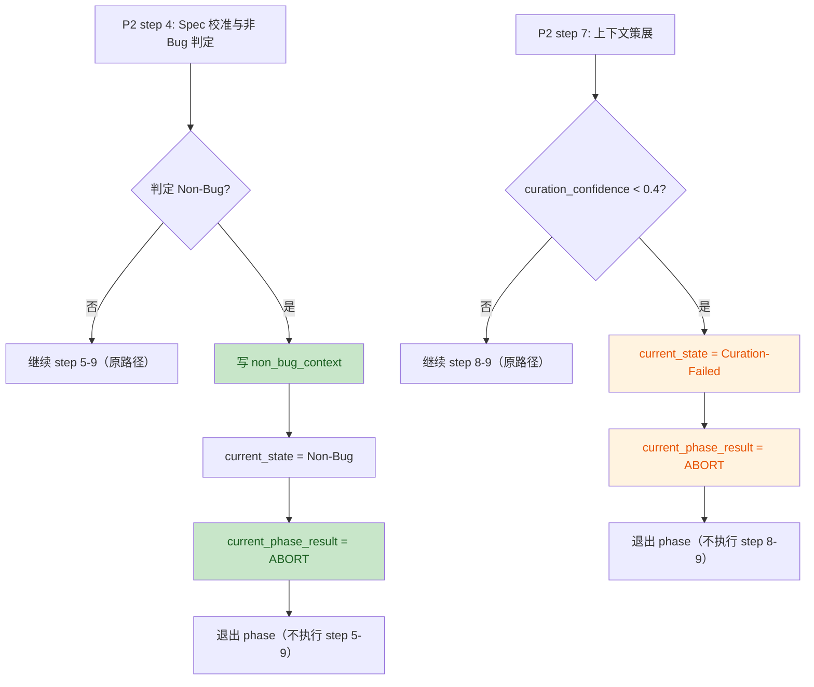
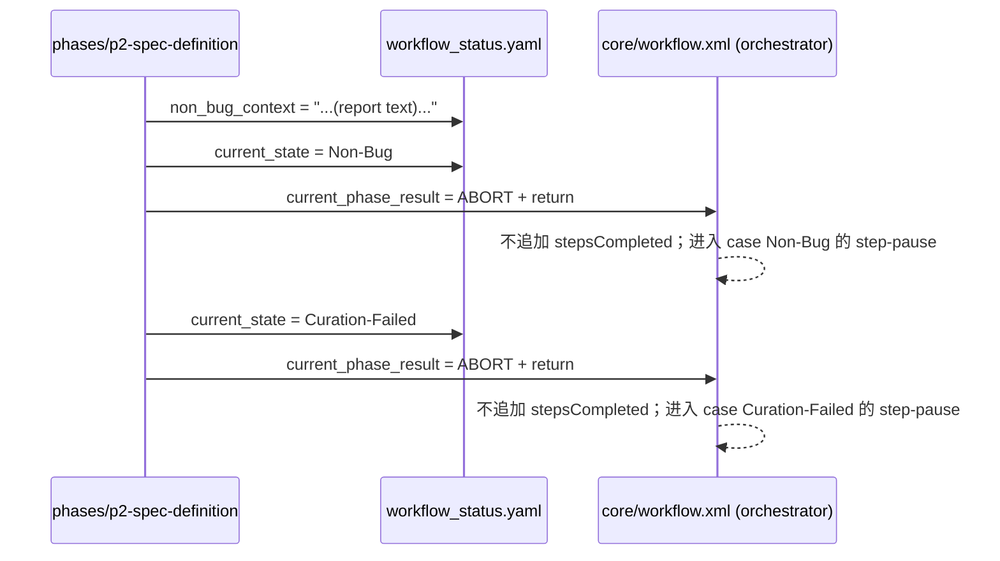

# PR-3 · P2 Non-Bug + Context-Curating（本地变更 CR 结论）

覆盖范围：本地工作区未提交变更中，与施工单约束一致的“代码”变更仅包含 `mobile-qa-workflow/phases/p2-spec-definition.md`。

参考施工单：[pr3-p2-non-bug-context-curating.md](file:///Users/bytedance/Code/loupe/mobile-qa-workflow/construction-plans/v2.2/pr3-p2-non-bug-context-curating.md)

---

## Intent（从 diff 推断）

- 在 P2 phase 补齐两处早退路径：
  - step 4 命中 Non-Bug：写 `non_bug_context` → 写 `current_state = Non-Bug` → 设 `current_phase_result = ABORT` → 退出 phase
  - step 7 `curation_confidence < 0.4`：写 `current_state = Curation-Failed` → 设 `current_phase_result = ABORT` → 退出 phase
- 明确记录 `Spec-Uncertain` 内联 `<step-pause>` 属 v4.2 遗留（本 PR 不处理），以满足 D14 的“本 PR 不新增 `<step-pause>`”边界陈述。

与施工单“唯一职责”一致：[pr3-p2-non-bug-context-curating.md:L9-L12](file:///Users/bytedance/Code/loupe/mobile-qa-workflow/construction-plans/v2.2/pr3-p2-non-bug-context-curating.md#L9-L12)

---

## Change Overview（关键改动）

### Business Flow（早退行为）

### Technical Flow（与编排器的对偶关系）

---

## Findings（代码审查结论）

结论：未发现违反施工单范围/协议约束的实现问题；关键路径与施工单描述一致。

对照要点（有证据的“必须项”）：

- step 4 Non-Bug 早退三步序列已落地，且顺序满足施工单要求：`non_bug_context` → `current_state = Non-Bug` → `current_phase_result = ABORT` → 退出 phase  
  证据：[p2-spec-definition.md:L80-L99](file:///Users/bytedance/Code/loupe/mobile-qa-workflow/phases/p2-spec-definition.md#L80-L99)
- step 7 `curation_confidence < 0.4` 的 Curation-Failed 早退已补齐：`current_state = Curation-Failed` → `current_phase_result = ABORT` → 退出 phase  
  证据：[p2-spec-definition.md:L157-L176](file:///Users/bytedance/Code/loupe/mobile-qa-workflow/phases/p2-spec-definition.md#L157-L176)
- D14“本 PR 不新增 `<step-pause>`”保持成立：本文件仅新增注释，未新增 `<step-pause>` 结构（仍然只有 Spec-Uncertain 那一处）  
  证据：新增内容紧邻现存 `<step-pause>` 的说明注释，[p2-spec-definition.md:L48-L63](file:///Users/bytedance/Code/loupe/mobile-qa-workflow/phases/p2-spec-definition.md#L48-L63)

### Issue Table

| No. | Issue Title | Suggestion | Code Link |
|---:|---|---|---|
| - | - | - | - |

---

## Notes（非阻塞建议）

- 当前本地工作区还修改了两处索引文档，把 PR-3 从“待展开”改为可点击链接；属于文档一致性修复，不纳入代码 CR finding：  
  - [QUALITY-AUDIT-CONSTRUCTION-PLAN-v2.2.md](file:///Users/bytedance/Code/loupe/mobile-qa-workflow/QUALITY-AUDIT-CONSTRUCTION-PLAN-v2.2.md)  
  - [README.md](file:///Users/bytedance/Code/loupe/mobile-qa-workflow/construction-plans/v2.2/README.md)

---

## Follow-ups（建议自检项）

不改代码前提下，建议在提交前做一次与施工单 §5 自检脚本等价的快速核验（施工单已给出命令集合）：  
[pr3-p2-non-bug-context-curating.md:L292-L320](file:///Users/bytedance/Code/loupe/mobile-qa-workflow/construction-plans/v2.2/pr3-p2-non-bug-context-curating.md#L292-L320)

