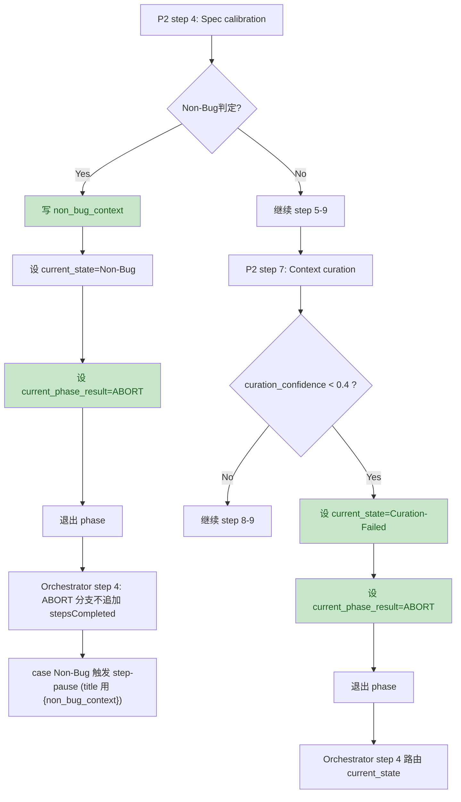

# PR-3 · P2 Non-Bug / Context-Curating（v2.2）Review Report (2026-04-20)

## Scope

- Reviewed doc: `construction-plans/v2.2/pr3-p2-non-bug-context-curating.md`
- Baseline source of truth: `QUALITY-AUDIT-CONSTRUCTION-PLAN-v2.2.md`
- Review goal: check whether PR-3 sub-plan matches v2.2 main plan on:
  - scope boundaries (what PR-3 / PR-4 / PR-7 own)
  - protocol contracts (D1/D14/D17)
  - behavior claims (orchestrator cases, thresholds)

## Intent (Inferred)

The PR-3 sub-plan aims to implement the v4.1 P2 early-exit behaviors:
- Step 4 Non-Bug early exit: write `non_bug_context` -> set `current_state=Non-Bug` -> set runtime `current_phase_result=ABORT` -> exit phase (no phase-local step-pause)
- Step 7 Curation-Failed early exit: when `curation_confidence < 0.4`, set `current_state=Curation-Failed` -> set `current_phase_result=ABORT` -> exit phase

## Behavior Flow (v4.1)

## Findings (Ordered by Severity)

| No. | Issue Title | Suggestion | Code Link |
|---:|---|---|---|
| 1 | Fact Conflict: Claims “No orchestrator case Curation-Failed step-pause” | Update the “兼容性影响” statement for Curation-Failed early exit: main plan v2.2 and PR-2 both define `Curation-Failed` as a step 4 case with a step-pause (Retry/Human). Remove the claim that it falls into default. Evidence: main plan lists Curation-Failed among the 6 step-pause cases, and PR-2 sub-plan provides the explicit `case if="Curation-Failed"` block. | [pr3-p2-non-bug-context-curating.md:L224-L226](file:///Users/bytedance/Code/loupe/mobile-qa-workflow/construction-plans/v2.2/pr3-p2-non-bug-context-curating.md#L224-L226) |
| 2 | Scope Conflict: Assigns P2 step 9 `RCA-InProgress` residual cleanup to PR-4 / PR-7 | Remove or reword the attribution “由 PR-7 联动或 PR-4 收口…一并扫除”. In v2.2 main plan, PR-4 scope is strictly `P3/P4/P6` (and only P6 is mentioned for `RCA-InProgress -> RCA-Designing`), while PR-7 is doc-sync and should not be used to promise a phase-file cleanup. Treat this as a known residual (stay unchanged in PR-3) and, if needed, assign it explicitly to a future PR/v4.2 legacy item. | [pr3-p2-non-bug-context-curating.md:L134-L145](file:///Users/bytedance/Code/loupe/mobile-qa-workflow/construction-plans/v2.2/pr3-p2-non-bug-context-curating.md#L134-L145) |
| 3 | Cross-Doc Inconsistency: `non_bug_reflow_count` threshold wording | Inside PR-3 sub-plan, the “>= 2” wording is consistent with PR-2’s documented logic and with “连续 3 次后触发 Human-Review” semantics (counter starting from 0). However, v2.2 main plan has one spot that says `> 2` which conflicts. Suggest clarifying in PR-3 text as: “计数从 0 开始，`>= 2` 表示第 3 次 Reflow 熔断”，and open a follow-up doc-fix for the main plan line using `> 2`. | [pr3-p2-non-bug-context-curating.md:L11-L11](file:///Users/bytedance/Code/loupe/mobile-qa-workflow/construction-plans/v2.2/pr3-p2-non-bug-context-curating.md#L11-L11) |
| 4 | Minor Clarity: “phase 内不放任何 <step-pause>” vs existing legacy step-pause | The document states “phase 内不放任何 `<step-pause>`”, but the same doc also acknowledges the existing Spec-Uncertain legacy step-pause (kept as v4.2 legacy #6). Recommend tightening the wording to “不新增 `<step-pause>`（现存 1 处作为 v4.2 遗留 #6）” to avoid misread by reviewers or CI gate owners. | [pr3-p2-non-bug-context-curating.md:L7-L11](file:///Users/bytedance/Code/loupe/mobile-qa-workflow/construction-plans/v2.2/pr3-p2-non-bug-context-curating.md#L7-L11) |

## Evidence Links (Baseline)

- Main plan PR-3 section (scope + reviewer focus): [QUALITY-AUDIT-CONSTRUCTION-PLAN-v2.2.md:L352-L376](file:///Users/bytedance/Code/loupe/mobile-qa-workflow/QUALITY-AUDIT-CONSTRUCTION-PLAN-v2.2.md#L352-L376)
- Main plan PR-4 section (PR-4 file boundaries): [QUALITY-AUDIT-CONSTRUCTION-PLAN-v2.2.md:L386-L397](file:///Users/bytedance/Code/loupe/mobile-qa-workflow/QUALITY-AUDIT-CONSTRUCTION-PLAN-v2.2.md#L386-L397)
- Main plan says orchestrator step 4 has 6 step-pause cases including Curation-Failed: [QUALITY-AUDIT-CONSTRUCTION-PLAN-v2.2.md:L316-L316](file:///Users/bytedance/Code/loupe/mobile-qa-workflow/QUALITY-AUDIT-CONSTRUCTION-PLAN-v2.2.md#L316-L316)
- Main plan use case (Non-Bug Reflow semantics): [QUALITY-AUDIT-CONSTRUCTION-PLAN-v2.2.md:L540-L548](file:///Users/bytedance/Code/loupe/mobile-qa-workflow/QUALITY-AUDIT-CONSTRUCTION-PLAN-v2.2.md#L540-L548)
- PR-2 sub-plan includes `case if="Curation-Failed"` and Non-Bug reflow threshold check: [pr2-orchestrator-step-pause.md](file:///Users/bytedance/Code/loupe/mobile-qa-workflow/construction-plans/v2.2/pr2-orchestrator-step-pause.md)

