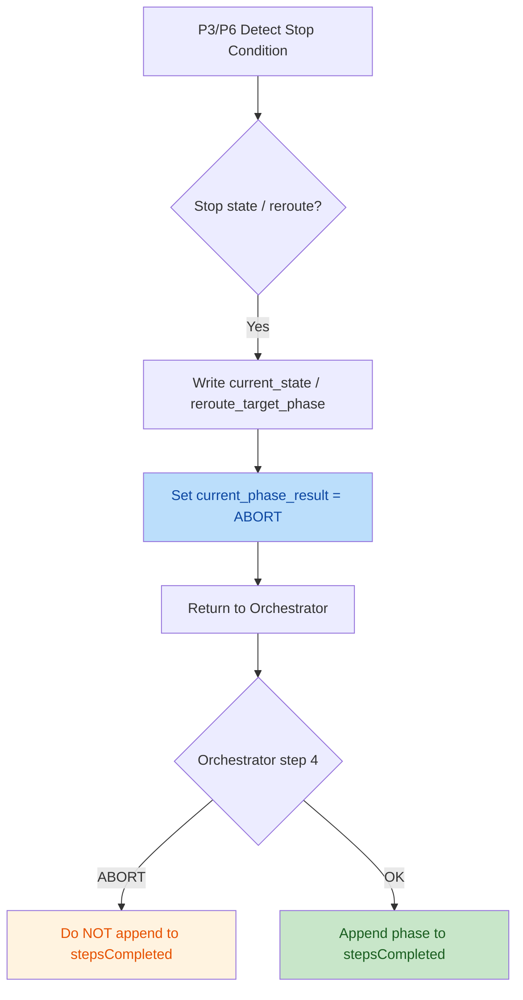

# PR-4 Phase ABORT + Fanout Isolation Quality Audit Report (2026-04-20)

## Scope
- Construction plan: `mobile-qa-workflow/construction-plans/v2.2/pr4-phase-abort-fanout-isolation.md`
- Reviewed change files (phase-layer “DSL code”):
  - `mobile-qa-workflow/phases/p3-root-cause.md`
  - `mobile-qa-workflow/phases/p4-fix-design.md`
  - `mobile-qa-workflow/phases/p6-verification.md`
- Protocol / contract evidence files (read-only for verification):
  - `mobile-qa-workflow/core/core-rules.xml` (D1/D14 DSL & runtime rules)
  - `mobile-qa-workflow/core/workflow-status-template.yaml` (C5/D7 single source of truth)
  - `mobile-qa-workflow/core/workflow.xml` (orchestrator behavior for ABORT + Done)
  - `mobile-qa-workflow/agents/shared-challenger-base.md` (C2 challenger input contract)
  - `mobile-qa-workflow/agents/shared-arbiter-base.md` (C2 arbiter input contract)

## Intent (Inferred)
- Intent: implement PR-4 per v2.2 plan:
  - B1*: add explicit `current_phase_result = ABORT` to all early-exit paths (P3×5, P6×1) so orchestrator does not append phases into `stepsCompleted`.
  - C10/D7: isolate Fix fanout from RCA fanout via `fix_fanout_mode`, and persist RCA context via `phase_history` + `rca_fanout_mode_snapshot`.
  - C2: role-driven injection: all challenger prompts inject `confidence_input`, all arbiter prompts inject `base_score`.
  - C9: ensure P6 failure branch produces a verification-report artifact before reroute.
  - C5: align invalid `current_state` literal (`RCA-InProgress`) to schema enum (`RCA-Designing`).

## Change Overview (Mermaid)

### Business Flow (Early Exit Correctness / B1*)


### Technical Flow (Fanout Isolation / C10+D7)
```mermaid
flowchart LR
  P3[P3 RCA] -->|writes| FM[workflow_status.fanout_mode]
  P3 -->|snapshot| SNAP[rca_fanout_mode_snapshot]
  P3 -->|append| HIST[phase_history += {phase,timestamp,fanout_mode,note}]
  P4[P4 Fix] -->|writes| FIXFM[workflow_status.fix_fanout_mode]
  P4 -. no write .-> FM

  style SNAP fill:#f3e5f5,color:#7b1fa2
  style HIST fill:#f3e5f5,color:#7b1fa2
  style FIXFM fill:#bbdefb,color:#0d47a1
  style FM fill:#c8e6c9,color:#1a5e20
```

## Construction Plan Compliance Checklist
- B1* ABORT marking:
  - P3 has 5 occurrences of `设置 current_phase_result = ABORT` ✅
  - P6 has 1 occurrence of `设置 current_phase_result = ABORT` ✅
  - Orchestrator consumes `current_phase_result` and skips `stepsCompleted` append when ABORT ✅
    - Evidence: [workflow.xml](file:///Users/bytedance/Code/loupe/mobile-qa-workflow/core/workflow.xml#L146-L151)
- C10/D7 fanout isolation:
  - P4 writes `fix_fanout_mode` (and no longer writes `fanout_mode`) ✅
    - Evidence: [p4-fix-design.md](file:///Users/bytedance/Code/loupe/mobile-qa-workflow/phases/p4-fix-design.md#L33-L79)
  - P3 writes `rca_fanout_mode_snapshot` + `phase_history.append` ✅
    - Evidence: [p3-root-cause.md](file:///Users/bytedance/Code/loupe/mobile-qa-workflow/phases/p3-root-cause.md#L205-L227)
- C2 role-driven injection:
  - Challenger prompts inject `confidence_input` ✅
    - Evidence: [p3-root-cause.md](file:///Users/bytedance/Code/loupe/mobile-qa-workflow/phases/p3-root-cause.md#L70-L92), [p4-fix-design.md](file:///Users/bytedance/Code/loupe/mobile-qa-workflow/phases/p4-fix-design.md#L55-L113)
  - Arbiter prompts inject `base_score` ✅
    - Evidence: [p3-root-cause.md](file:///Users/bytedance/Code/loupe/mobile-qa-workflow/phases/p3-root-cause.md#L109-L143), [p4-fix-design.md](file:///Users/bytedance/Code/loupe/mobile-qa-workflow/phases/p4-fix-design.md#L82-L114)
  - Base contracts confirm field names:
    - Challenger requires `confidence_input`: [shared-challenger-base.md](file:///Users/bytedance/Code/loupe/mobile-qa-workflow/agents/shared-challenger-base.md#L5-L11)
    - Arbiter requires `base_score`: [shared-arbiter-base.md](file:///Users/bytedance/Code/loupe/mobile-qa-workflow/agents/shared-arbiter-base.md#L5-L11)
- C9 P6 failure artifact:
  - P6 failure branch now calls `template-output verification-report.md` before ABORT ✅
    - Evidence: [p6-verification.md](file:///Users/bytedance/Code/loupe/mobile-qa-workflow/phases/p6-verification.md#L63-L102)
- C5 enum alignment:
  - P6 `RCA-InProgress` -> `RCA-Designing` ✅
    - Evidence: [p6-verification.md](file:///Users/bytedance/Code/loupe/mobile-qa-workflow/phases/p6-verification.md#L73-L79)
  - Schema single source of truth does not include `RCA-InProgress` ✅
    - Evidence: [workflow-status-template.yaml](file:///Users/bytedance/Code/loupe/mobile-qa-workflow/core/workflow-status-template.yaml#L4-L9)

## Findings (Ordered By Severity)

| No. | Issue Title | Suggestion | Code Link |
|---:|---|---|---|
| 1 | `current_state = Closed` is not a valid enum and breaks orchestrator routing | Replace `Closed` with `Done` (aligned with `workflow-status-template.yaml` enum and `core/workflow.xml` case), or define/route `Closed` consistently (not recommended). | [p6-verification.md](file:///Users/bytedance/Code/loupe/mobile-qa-workflow/phases/p6-verification.md#L112-L120), [workflow-status-template.yaml](file:///Users/bytedance/Code/loupe/mobile-qa-workflow/core/workflow-status-template.yaml#L4-L9), [workflow.xml](file:///Users/bytedance/Code/loupe/mobile-qa-workflow/core/workflow.xml#L347-L353) |
| 2 | D14 step-pause scope rule conflicts with existing phase inline `<step-pause>` (and allowlist file is missing) | Either: (a) add the referenced allowlist file and include this legacy `<step-pause>` until PR-5/PR-8 completes governance, or (b) migrate this pause to orchestrator step 4 and remove it from phase (preferred long-term, but likely out-of-scope for PR-4). | [core-rules.xml](file:///Users/bytedance/Code/loupe/mobile-qa-workflow/core/core-rules.xml#L108-L124), [p4-fix-design.md](file:///Users/bytedance/Code/loupe/mobile-qa-workflow/phases/p4-fix-design.md#L132-L143) |
| 3 | `core-rules.xml` workflow-result-protocol still says “P3 4 early exits” but code now has 5 ABORT points | Update protocol text to match reality (P3 ×5 + P6 ×1), or remove hard-coded counts from protocol to avoid drift. | [core-rules.xml](file:///Users/bytedance/Code/loupe/mobile-qa-workflow/core/core-rules.xml#L191-L196), [p3-root-cause.md](file:///Users/bytedance/Code/loupe/mobile-qa-workflow/phases/p3-root-cause.md#L24-L31) |

## Risk Assessment
- High risk: Finding #1 can cause state-machine divergence (orchestrator has `case Done`, not `Closed`), leading to non-terminating loops or incorrect reroute behavior.
- Medium risk: Finding #2 indicates governance/CI readiness gap (D14 expects an allowlist path that currently does not exist).
- Low risk: Finding #3 is a protocol-text drift risk (review/CI checks based on text may become misleading).

## Recommended Verification (Targeted)
- Static grep checks (DoD-style):
  - P3 ABORT count = 5; P6 ABORT count = 1
  - P4 contains no `fanout_mode =` writes; has `fix_fanout_mode =` writes
  - No raw `rca_fanout_mode` field usage (only `rca_fanout_mode_snapshot`)
- Behavior sanity:
  - Simulate a P3 early-exit (evidence insufficient) and confirm orchestrator does not append `qa-root-cause` to `stepsCompleted` when ABORT is set.
  - Simulate P6 failure branch and confirm `verification-report.md` is produced before reroute.

## Resolution (2026-04-20)

| No. | Status | Action / Rationale |
|---:|---|---|
| 1 | ✅ **FIXED in PR-4** | `phases/p6-verification.md` step 8 行内 `current_state = Closed` → `Done`，与 `core/workflow-status-template.yaml` 权威枚举集 + `core/workflow.xml` step 4 `case Done` 完全自洽。属 PR-4 review v2.0 Finding 1（C5 收口）的同类延伸；修复点位在本 PR 已修改的文件内，最小一行替换。补充 grep 断言：`phases/` 下 `\bClosed\b` 命中 = 0 ✅；`current_state = Done` 命中 1 处 ✅。 |
| 2 | ⏸ **DEFERRED to PR-5** | 子文档 §1 元信息明确"P4 step 6 末尾的现存 `<step-pause>` 由 PR-5 盘点登记 `legacy-phase-step-pause-allowlist.txt` 后由 v4.2 遗留 #6 整改"；本 PR 显式不动 phase 内 step-pause（§3.1 第 11 项守门）。Reviewer 建议 (a) 加 allowlist 文件属 PR-5 治理范围；建议 (b) 迁移 pause 到编排器 step 4 属 v4.2 遗留 #6。在 PR description 显式标注延迟即可，无 PR-4 内修复动作。 |
| 3 | ⏸ **DEFERRED to PR-1 hotfix** | `core/core-rules.xml` L191-196 内"P3 4 处早退点"是协议层文本与 PR-4 落地（P3×5）的漂移；该文件由 D9 划归 PR-1 范围，本 PR 约束"不动 core/workflow.xml / core-rules.xml / workflow-status-template.yaml"（§3.1 第 12 项 D14 反向断言）。同类协议层文本登记建议见子文档 §6 议题 #5；推荐与 v2.3 主文档微调（M1-M11）同周期 hotfix 提交，不在本 PR 内强行修订以避免越界。 |

### Post-Resolution Static Grep Recheck (PR-4 全量)
- ABORT 标记完整：P3 = 5、P6 = 1、合计 6 处 ✅
- 字段隔离：P4 内 `\bfanout_mode\s*=` = 0、`\bfix_fanout_mode\b` = 2 ✅
- `\brca_fanout_mode\b` 裸字段：phases/ = 0 ✅
- `rca_fanout_mode_snapshot` 写入端：P3 = 1 ✅
- `phase_history` append：P3 = 1 ✅
- C2 角色驱动：challenger × `confidence_input` = 4（P3=2 + P4=2）、arbiter × `base_score` = 2（P3=1 + P4=1）；反向断言 0 错配 ✅
- C5 终态枚举：phases/ 下 `\bClosed\b` = 0、`current_state = Done` = 1（p6 step 8）✅
- D14 守门：本 PR diff 中 `<step-pause` = 0；`core/`、`templates/` diff 为空 ✅

