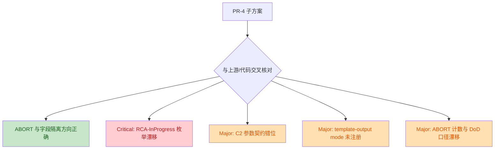

# PR-4 施工方案 Review

> 审查对象：`construction-plans/v2.2/pr4-phase-abort-fanout-isolation.md`
>
> 对照基线：
> - `QUALITY-AUDIT-CONSTRUCTION-PLAN-v2.2.md`
> - 当前工程实现：`phases/p3-root-cause.md` / `phases/p4-fix-design.md` / `phases/p6-verification.md`
> - 相关协议与契约：`core/core-rules.xml` / `core/workflow.xml` / `core/workflow-status-template.yaml` / `agents/shared-*.md`
>
> 审查口径：仅评估施工方案的正确性、协议闭环、与当前代码/上游蓝图的一致性；**不修改代码**

## 结论

- 结论：**方向基本正确，但当前版本不宜直接作为最终施工依据。**
- 判定：存在 **1 个 Critical**、**3 个 Major** 问题，需要先收口，否则 PR-4 在实施或联动 PR-6/PR-8 时会出现协议断裂、状态漂移或 DoD 口径不一致。
- 正向确认：
  - PR-4 对 `P4` 中两处 `fanout_mode` 污染点的识别是准确的，见 [p4-fix-design.md](file:///Users/bytedance/Code/loupe/mobile-qa-workflow/phases/p4-fix-design.md#L33-L38) 与 [p4-fix-design.md](file:///Users/bytedance/Code/loupe/mobile-qa-workflow/phases/p4-fix-design.md#L75-L77)。
  - PR-4 将 `P3 step 10` 的 `RCA-LowConfidence` 路径补入 ABORT 的方向是合理的，这个点当前代码确实缺失，见 [p3-root-cause.md](file:///Users/bytedance/Code/loupe/mobile-qa-workflow/phases/p3-root-cause.md#L198-L206)。
  - PR-4 识别到 `P6` 失败分支缺少中间态 `verification-report` 产物，这与当前实现一致，见 [p6-verification.md](file:///Users/bytedance/Code/loupe/mobile-qa-workflow/phases/p6-verification.md#L63-L91)。

## 变更关系图



## Findings

| No. | 严重度 | 问题 | 结论 | 关键证据 |
|---|---|---|---|---|
| 1 | Critical | `RCA-InProgress` 状态枚举漂移仍被保留 | PR-4 明知状态值与权威 schema 不一致，却选择“本 PR 不动”，会把状态机分裂继续固化到施工方案里 | [workflow-status-template.yaml:L4-L10](file:///Users/bytedance/Code/loupe/mobile-qa-workflow/core/workflow-status-template.yaml#L4-L10), [p6-verification.md:L68-L75](file:///Users/bytedance/Code/loupe/mobile-qa-workflow/phases/p6-verification.md#L68-L75), [pr4-phase-abort-fanout-isolation.md:L829-L830](file:///Users/bytedance/Code/loupe/mobile-qa-workflow/construction-plans/v2.2/pr4-phase-abort-fanout-isolation.md#L829-L830) |
| 2 | Major | C2 参数契约在 challenger/arbiter 两侧命名不闭合 | PR-4 子方案对 `base_score` / `confidence_input` 的注入设计，与 shared base 当前输入契约对不上，后续一旦 PR-6 加缺参校验，极易直接打爆调用链 | [shared-challenger-base.md:L5-L10](file:///Users/bytedance/Code/loupe/mobile-qa-workflow/agents/shared-challenger-base.md#L5-L10), [shared-arbiter-base.md:L5-L10](file:///Users/bytedance/Code/loupe/mobile-qa-workflow/agents/shared-arbiter-base.md#L5-L10), [pr4-phase-abort-fanout-isolation.md:L325-L360](file:///Users/bytedance/Code/loupe/mobile-qa-workflow/construction-plans/v2.2/pr4-phase-abort-fanout-isolation.md#L325-L360), [pr4-phase-abort-fanout-isolation.md:L588-L619](file:///Users/bytedance/Code/loupe/mobile-qa-workflow/construction-plans/v2.2/pr4-phase-abort-fanout-isolation.md#L588-L619) |
| 3 | Major | `template-output mode="intermediate"` 先使用后注册 | PR-4 在 P6 方案里引入了当前 DSL 未声明的新参数，协议层没有闭环，PR-8 的静态守门也缺少合法性基础 | [core-rules.xml:L177-L178](file:///Users/bytedance/Code/loupe/mobile-qa-workflow/core/core-rules.xml#L177-L178), [pr4-phase-abort-fanout-isolation.md:L683-L706](file:///Users/bytedance/Code/loupe/mobile-qa-workflow/construction-plans/v2.2/pr4-phase-abort-fanout-isolation.md#L683-L706) |
| 4 | Major | ABORT 数量与 DoD 口径在主文档和 PR-4 子文档之间不一致 | 主文档仍按“P3×4 + P6×1 = 5 处”描述，PR-4 子文档已扩成“P3×5 + P6×1 = 6 处”；如果不统一，评审、DoD、回滚口径会出现两套标准 | [QUALITY-AUDIT-CONSTRUCTION-PLAN-v2.2.md:L382-L395](file:///Users/bytedance/Code/loupe/mobile-qa-workflow/QUALITY-AUDIT-CONSTRUCTION-PLAN-v2.2.md#L382-L395), [pr4-phase-abort-fanout-isolation.md:L211-L255](file:///Users/bytedance/Code/loupe/mobile-qa-workflow/construction-plans/v2.2/pr4-phase-abort-fanout-isolation.md#L211-L255), [pr4-phase-abort-fanout-isolation.md:L797-L808](file:///Users/bytedance/Code/loupe/mobile-qa-workflow/construction-plans/v2.2/pr4-phase-abort-fanout-isolation.md#L797-L808) |

## 详细说明

### 1. `RCA-InProgress` 枚举漂移是当前最高风险点

- 权威状态模板已经把 `RCA-Designing` 列为合法枚举，**没有** `RCA-InProgress`，见 [workflow-status-template.yaml](file:///Users/bytedance/Code/loupe/mobile-qa-workflow/core/workflow-status-template.yaml#L4-L10)。
- 当前 `P6` 失败分支仍写 `current_state = RCA-InProgress`，见 [p6-verification.md](file:///Users/bytedance/Code/loupe/mobile-qa-workflow/phases/p6-verification.md#L68-L75)。
- PR-4 子方案没有把这个问题纳入修复，反而在 Reviewer 议题里明确写了“PR-4 不动”，见 [pr4-phase-abort-fanout-isolation.md](file:///Users/bytedance/Code/loupe/mobile-qa-workflow/construction-plans/v2.2/pr4-phase-abort-fanout-isolation.md#L829-L830)。
- 这不是单纯文档偏差，而是“权威 schema / phase 写入值 / 后续路由理解”三者已经分裂。施工方案继续保留该漂移，会让 PR-4 把一个已知不一致正式固化。

建议：
- 在 PR-4 范围内直接收口到单一权威值。
- 如果确实不想在 PR-4 改代码，至少必须把该点升级为“阻塞项”，而不是“Reviewer 议题”。

### 2. C2 的参数命名在方案层仍然错位

- 当前 `shared-challenger-base.md` 的输入契约写的是 `confidence_input`，见 [shared-challenger-base.md](file:///Users/bytedance/Code/loupe/mobile-qa-workflow/agents/shared-challenger-base.md#L5-L10)。
- 当前 `shared-arbiter-base.md` 的输入契约写的是 `base_score`，见 [shared-arbiter-base.md](file:///Users/bytedance/Code/loupe/mobile-qa-workflow/agents/shared-arbiter-base.md#L5-L10)。
- 但 PR-4 子方案要求：
  - `P3 challenger` 注入 `base_score`，见 [pr4-phase-abort-fanout-isolation.md](file:///Users/bytedance/Code/loupe/mobile-qa-workflow/construction-plans/v2.2/pr4-phase-abort-fanout-isolation.md#L325-L360)
  - `P4 arbiter` 注入 `confidence_input`，见 [pr4-phase-abort-fanout-isolation.md](file:///Users/bytedance/Code/loupe/mobile-qa-workflow/construction-plans/v2.2/pr4-phase-abort-fanout-isolation.md#L588-L619)
- 这说明 PR-4 的“调用方注入设计”和 shared base 的“被调用方契约”还没有闭合。

风险：
- PR-6 一旦按主文档计划补上缺参校验，这里会从“文档不一致”直接升级成“运行时硬失败”。

建议：
- 先统一 RCA/FIX 两个场景下 challenger 与 arbiter 的参数名矩阵，再写进 PR-4/PR-6。
- 不建议把“字段命名是否要在 PR-1 协议层登记”放成非阻塞议题，因为现在连调用方和接收方都没有统一。

### 3. `template-output` 的 `mode` 属性没有协议注册

- 目前 `core/core-rules.xml` 只给 `<template-output>` 定义了 `file`、`template` 两个参数，见 [core-rules.xml](file:///Users/bytedance/Code/loupe/mobile-qa-workflow/core/core-rules.xml#L177-L178)。
- PR-4 子方案在 `P6` 失败分支中新增：

```xml
<template-output file="{output_verification}"
                 template="mobile-qa-workflow/templates/verification-report.md"
                 mode="intermediate"/>
```

- 对应证据见 [pr4-phase-abort-fanout-isolation.md](file:///Users/bytedance/Code/loupe/mobile-qa-workflow/construction-plans/v2.2/pr4-phase-abort-fanout-isolation.md#L683-L706)。
- 子方案自己也意识到这个缺口，把它列为了 Reviewer 议题，但仍把这条设计写进了正式施工文本。

风险：
- 这会让 PR-4 依赖一个“当前 DSL 不认识、CI 也无从校验”的参数。

建议：
- 二选一，并在主文档和子文档中统一：
  - 先在 PR-1 协议层补注册 `mode`
  - 或者移除 `mode` 设计，把“中间态/最终态”切换放到模板正文逻辑里

### 4. ABORT 数量、DoD、自检结论存在口径漂移

- 主文档 PR-4 总览仍写“P3 ×4 + P6 ×1 共 5 处显式 ABORT 标记”，见 [QUALITY-AUDIT-CONSTRUCTION-PLAN-v2.2.md](file:///Users/bytedance/Code/loupe/mobile-qa-workflow/QUALITY-AUDIT-CONSTRUCTION-PLAN-v2.2.md#L382-L395)。
- PR-4 子文档新增了 `P3-A5`，明确把 `step 10 / RCA-LowConfidence` 也纳入 ABORT，见 [pr4-phase-abort-fanout-isolation.md](file:///Users/bytedance/Code/loupe/mobile-qa-workflow/construction-plans/v2.2/pr4-phase-abort-fanout-isolation.md#L211-L255)。
- 同一份子文档的自检又写“合计 6 处”，见 [pr4-phase-abort-fanout-isolation.md](file:///Users/bytedance/Code/loupe/mobile-qa-workflow/construction-plans/v2.2/pr4-phase-abort-fanout-isolation.md#L797-L808)。

风险：
- Reviewer、DoD grep、回滚影响面统计会拿到不同的基线。
- 这种问题虽然不像状态枚举那样直接打断运行，但会让施工和验收过程出现“文档说法不同、谁也说不准”的情况。

建议：
- 主文档、PR-4 子文档、DoD 子集、回滚章节统一成同一套数字和点位清单。

## 建议裁定

- 裁定：**暂不建议直接批准当前版本 PR-4 子方案。**
- 通过条件：
  - 先收口 `RCA-InProgress` 与权威枚举的冲突
  - 先收口 C2 的参数命名矩阵
  - 先补 `template-output.mode` 的协议闭环，或移除该属性
  - 统一 ABORT 点位计数和 DoD 口径

## 附注

- 当前工程代码与 PR-4 子方案之间，还存在明显“尚未实施”的差距，例如：
  - `P3/P6` 当前没有任何 `current_phase_result = ABORT`，见 [p3-root-cause.md](file:///Users/bytedance/Code/loupe/mobile-qa-workflow/phases/p3-root-cause.md#L24-L30) 与 [p6-verification.md](file:///Users/bytedance/Code/loupe/mobile-qa-workflow/phases/p6-verification.md#L63-L84)
  - `P4` 当前仍有两处 `fanout_mode = ...`，见 [p4-fix-design.md](file:///Users/bytedance/Code/loupe/mobile-qa-workflow/phases/p4-fix-design.md#L33-L38) 与 [p4-fix-design.md](file:///Users/bytedance/Code/loupe/mobile-qa-workflow/phases/p4-fix-design.md#L75-L77)
- 这些差距本身不是本次 review 的负面结论；它们说明 PR-4 方案确实覆盖到了真实问题，只是方案文本本身还有 4 个必须先收口的硬点。
