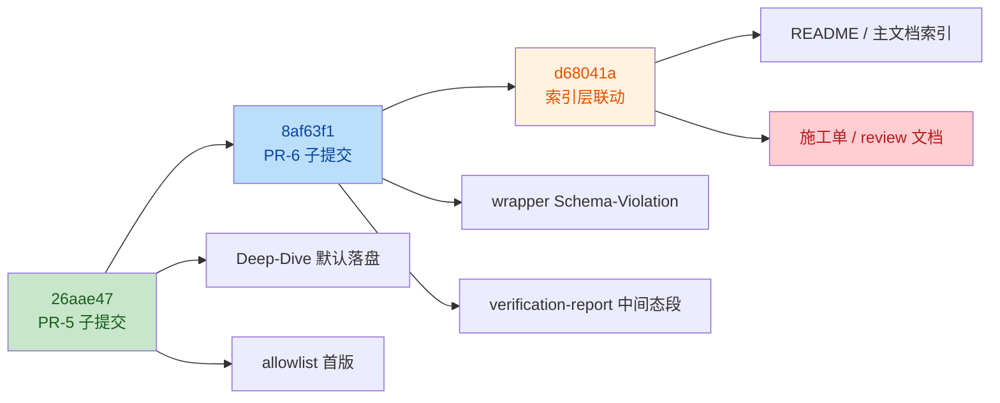

# PR-5+6 Code Review Report

> Review scope: `26aae47` / `8af63f1` / `d68041a`
> Baseline doc: [`pr5-6-deep-dive-and-agents-templates.md`](file:///Users/bytedance/Code/loupe/mobile-qa-workflow/construction-plans/v2.2/pr5-6-deep-dive-and-agents-templates.md)
> Review date: `2026-04-20`

## Intent

- `26aae47`: 落地 PR-5 的 B3 默认落盘、D19 allowlist 与 v4.2 遗留 #1 注释。
- `8af63f1`: 落地 PR-6 的 C2 wrapper 缺参兜底与 C9 verification-report 模板补段。
- `d68041a`: 在旧基线上补 README / 主文档 §4 的索引联动，并将本次施工单与历史 review 文档一并落盘。

## Change Overview



## Review Result

结论：`26aae47` 与 `8af63f1` 基本符合施工单预期；`d68041a` 存在 1 个 `Major` 级偏差，当前分支不建议按现状直接合入。

| No. | Issue Title | Suggestion | Code Link |
|-----|-------------|------------|-----------|
| 1 | `d68041a` 将施工单与 review 文档混入“索引层联动”子提交，违反 §4.D 的 commit 纯度约束 | 保留旧基线下补 `commit 3` 的例外，但将 `[PR-5+6/索引层联动]` 收敛为仅修改 `README` 与主文档 §4 索引；把施工单落盘、review 留档拆到独立 docs 提交，避免破坏单边回滚粒度 | [pr5-6-deep-dive-and-agents-templates.md:L605-L617](file:///Users/bytedance/Code/loupe/mobile-qa-workflow/construction-plans/v2.2/pr5-6-deep-dive-and-agents-templates.md#L605-L617) |

## Finding Detail

### 1. `d68041a` 超出允许的 commit 3 范围

- 施工单对 `commit 3` 的约束非常明确：只有在“基于 PE 联动前旧基线”时才允许补该提交，且内容应`仅含 README + 主文档 §4 索引行变更`，见 [pr5-6-deep-dive-and-agents-templates.md:L611-L613](file:///Users/bytedance/Code/loupe/mobile-qa-workflow/construction-plans/v2.2/pr5-6-deep-dive-and-agents-templates.md#L611-L613)。
- 当前 `d68041a` 的实际提交说明与 `git show --stat` 都表明，它除了索引联动，还纳入了 `pr5-6-deep-dive-and-agents-templates.md` 与 `pr5-6-deep-dive-and-agents-templates-REVIEW-2026-04-20.md` 两个文档文件。
- 这会让“回滚索引层联动”和“保留施工单/评审留档”无法独立执行，削弱 §4.D 设计的单边 `git revert` 能力。
- 该问题不影响 `26aae47` / `8af63f1` 的功能正确性，但会直接影响提交边界、回滚路径和 review 责任划分，因此定为 `Major`。

```bash
$ git show --stat --summary d68041a
 mobile-qa-workflow/QUALITY-AUDIT-CONSTRUCTION-PLAN-v2.2.md        |   4 +-
 mobile-qa-workflow/construction-plans/v2.2/README.md              |   3 +-
 mobile-qa-workflow/construction-plans/v2.2/pr5-6-deep-dive-and-agents-templates-REVIEW-2026-04-20.md | 118 ++++
 mobile-qa-workflow/construction-plans/v2.2/pr5-6-deep-dive-and-agents-templates.md                    | 757 +++++++++++++++++++++
```

## What Looks Good

- `26aae47` 的 B3 默认值翻转与 allowlist 首版内容，和仓库现状完全一致：`<step-pause` 过滤后命中仍为 `p2:L53` 与 `p4:L136` 两处。
- `8af63f1` 的 C2 wrapper 只校验 `base_score` / `confidence_input`，没有越界到其他入参，符合施工单的 D5 范围约束。
- `8af63f1` 的 C9 模板采用了 V1 收敛后的方案 A：成功路径固定填 `N/A (verification passed)`，没有再引入 `mode="intermediate"` 一类 DSL 漂移。
- 旧基线缺少 README / 主文档索引联动这一前提本身属实，因此“是否允许存在 commit 3”不是本次问题；问题只在于 `commit 3` 的内容超界。

## Validation Notes

- 已核对 [`core-rules.xml`](file:///Users/bytedance/Code/loupe/mobile-qa-workflow/core/core-rules.xml#L175-L177) 中 `<template-output>` 仅声明 `file` / `template` 两个参数。
- 已核对 [`p6-verification.md`](file:///Users/bytedance/Code/loupe/mobile-qa-workflow/phases/p6-verification.md#L88-L108) 成功/失败路径都调用同一 `verification-report` 模板。
- 已核对 [`p2-spec-definition.md`](file:///Users/bytedance/Code/loupe/mobile-qa-workflow/phases/p2-spec-definition.md#L48-L78) 与 [`p4-fix-design.md`](file:///Users/bytedance/Code/loupe/mobile-qa-workflow/phases/p4-fix-design.md#L132-L142) 的 `<step-pause>` 行号与 allowlist 一致。
- 已使用 2 个独立校验过程复核唯一 finding，结论一致：`exists = true`，`severity = major`。
