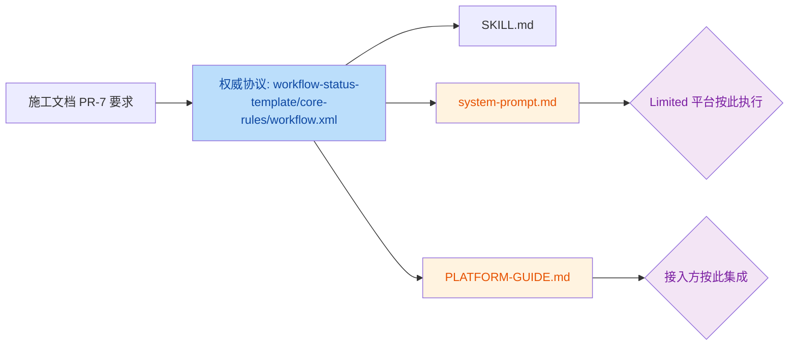
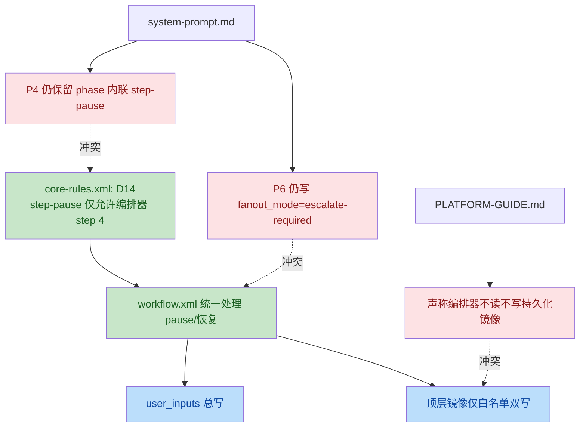

# PR-7 文档/入口对齐 CR 报告

- 审查对象：`mobile-qa-workflow/SKILL.md`、`mobile-qa-workflow/system-prompt.md`、`mobile-qa-workflow/PLATFORM-GUIDE.md`
- 审查基线：`mobile-qa-workflow/QUALITY-AUDIT-CONSTRUCTION-PLAN-v2.2.md` 中 PR-7 要求，以及 `mobile-qa-workflow/core/workflow-status-template.yaml`、`mobile-qa-workflow/core/core-rules.xml`、`mobile-qa-workflow/core/workflow.xml` 当前实现
- 审查意图：确认 PR-7 是否把 schema v4、step-pause 协议、Non-Bug 上下文与 parse-error 熔断语义正确同步到三处入口文档
- 结论：存在 3 个需要修正的问题，其中 2 个为高置信问题、1 个为中置信问题；暂不建议直接合入为最终版入口文档

## 变更概览

**文档使用流**

**协议偏差流**

## Findings

| No. | Issue Title | Suggestion | Code Link |
|---|---|---|---|
| 1 | `system-prompt.md` 仍保留 P4 phase 内联 `step-pause`，与 D14 冲突 | 删除 Phase 4 中的内联 `step-pause` 叙述，改为和权威协议一致：phase 只负责写状态并 `ABORT`，所有停顿统一由编排器 step 4 触发；否则 Limited 平台会按过期协议执行。 | [system-prompt.md:L328-L333](file:///Users/bytedance/Code/loupe/mobile-qa-workflow/system-prompt.md#L328-L333) |
| 2 | `system-prompt.md` 将 P6 `root_cause_not_closed` 写成 `fanout_mode=escalate-required`，与当前实现不一致 | 按当前权威实现改为 `current_state = RCA-Designing` 且 `fanout_mode = complex-arbitrated`，避免独立使用 `system-prompt.md` 的平台走入不存在的 fan-out 值。 | [system-prompt.md:L427-L435](file:///Users/bytedance/Code/loupe/mobile-qa-workflow/system-prompt.md#L427-L435) |
| 3 | `PLATFORM-GUIDE.md` 声称“编排器侧不读不写持久化镜像”，与 D8/D15 双写过渡相矛盾 | 将描述改为“`current_phase_result` 不持久化，但编排器对顶层镜像白名单字段执行受限双写，并继续读取 `non_bug_user_choice` 顶层镜像以兼容现有 switch`”，避免接入方误删镜像逻辑。 | [PLATFORM-GUIDE.md:L27-L27](file:///Users/bytedance/Code/loupe/mobile-qa-workflow/PLATFORM-GUIDE.md#L27-L27) |

## 证据摘录

### 1. D14 的权威约束已明确禁止 phase 内联 `step-pause`

- 规则定义：[`core-rules.xml:L108-L123`](file:///Users/bytedance/Code/loupe/mobile-qa-workflow/core/core-rules.xml#L108-L123)
- 现有冲突文档：[`system-prompt.md:L328-L333`](file:///Users/bytedance/Code/loupe/mobile-qa-workflow/system-prompt.md#L328-L333)

### 2. P6 当前权威实现已使用 `complex-arbitrated`

- phase 实现：[`p6-verification.md:L73-L79`](file:///Users/bytedance/Code/loupe/mobile-qa-workflow/phases/p6-verification.md#L73-L79)
- 现有冲突文档：[`system-prompt.md:L431-L434`](file:///Users/bytedance/Code/loupe/mobile-qa-workflow/system-prompt.md#L431-L434)

### 3. 编排器当前确实存在顶层镜像双写与读取

- 双写逻辑：[`workflow.xml:L115-L124`](file:///Users/bytedance/Code/loupe/mobile-qa-workflow/core/workflow.xml#L115-L124)
- 顶层读取：[`workflow.xml:L228-L251`](file:///Users/bytedance/Code/loupe/mobile-qa-workflow/core/workflow.xml#L228-L251)
- 错误表述：[`PLATFORM-GUIDE.md:L27-L27`](file:///Users/bytedance/Code/loupe/mobile-qa-workflow/PLATFORM-GUIDE.md#L27-L27)

## 交叉验证

- 验证方式：使用 2 个独立子代理对候选问题做二次核验
- 高置信：问题 1、问题 2、问题 3 均被至少 2 轮证据复核确认
- 排除项：最初怀疑 "`p6-verification.md` 仍写 `escalate-required`"；复核后确认真实问题不在 phase 文件，而在 `system-prompt.md` 的同步内容

## 审查结论

- `SKILL.md` 的 schema v4 字段同步总体完整，未发现明确问题
- `system-prompt.md` 仍保留两处会影响独立执行语义的旧协议，属于必须修正项
- `PLATFORM-GUIDE.md` 存在一处对当前镜像策略的错误描述，属于接入说明级风险
- 建议状态：`Changes Requested`
