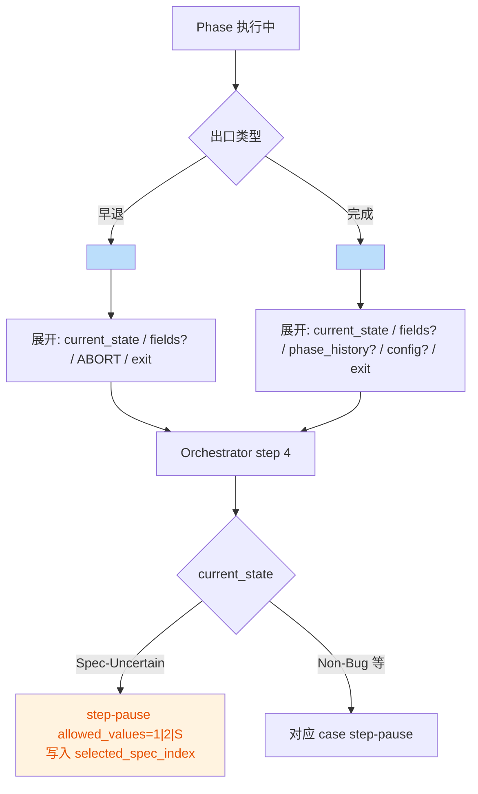

# PR-3' 本地变更 Code Review 报告（v4.2）

- 评审日期：2026-04-21
- 评审范围：
  - 施工文档：
    - [pr-3-prime-phase-exit-macros-and-spec-uncertain-contract.md](file:///Users/bytedance/Code/loupe/mobile-qa-workflow/construction-plans/v4.2/pr-3-prime-phase-exit-macros-and-spec-uncertain-contract.md)
    - [pr-3-prime-appendix-phase-rewrites.md](file:///Users/bytedance/Code/loupe/mobile-qa-workflow/construction-plans/v4.2/pr-3-prime-appendix-phase-rewrites.md)
  - 本地代码变更（`git diff`）：`core/*.xml|yaml`、`phases/*.md`、`scripts/check-phase-abort-structure.sh`、CI workflow、ADR 更新
- 评审结论：`Needs Fixes`（存在 1 个高风险正确性问题 + 1 个守门脚本/口径一致性问题）

## Intent
将 phase 的“早退/完成出口”统一改写为 `<phase-abort>` / `<phase-complete>` 宏（减少 ABORT 漏标导致的 stepsCompleted 错追加），并把 Spec-Uncertain 的用户交互契约统一为 `1|2|S` 三选，同时新增 CI Check 15 做宏结构守门。

## Change Overview


```mermaid
sequenceDiagram
    participant CI as GitHub Actions
    participant Script as check-phase-abort-structure.sh
    participant TPL as workflow-status-template.yaml
    participant Phases as phases/*.md
    CI->>Script: Check 15 (PHASE_ABORT_SEVERITY=warning)
    Script->>TPL: 提取 enum 集 + 顶层字段表
    Script->>Phases: 扫描 phase-abort/complete 宏
    Script-->>CI: warning/notice 汇总（P4 notice; 其余 OK）
```

## Findings
| No. | Issue Title | Suggestion | Code Link |
|---|---|---|---|
| 1 | P2 Non-Bug 出口使用了未定义占位符 `{report_text}`，会导致 `non_bug_context` 写回不可靠 | 不要依赖隐式变量。建议改为：先用显式 `<action>` 生成并“命名”该段文本（例如明确“将上述文本命名为 report_text”），或直接恢复为单独写入 `workflow_status.non_bug_context` 的 `<action>`，再用 `<phase-abort state="Non-Bug" .../>` 只负责 ABORT/退出 | [p2-spec-definition.md](file:///Users/bytedance/Code/loupe/mobile-qa-workflow/phases/p2-spec-definition.md#L80-L91) |
| 2 | Check 15 口径与注释/函数命名不完全一致：注释写“末 step 应包含宏”，但实现是“phase 文件含宏 ≥ 1” | 二选一收口：A. 若接受“含宏 ≥ 1”，把文件头目标描述与 `check_tail_step()` 的报错文案改成同口径；B. 若坚持“末 step 必含宏”，实现一个更可靠的“最后一个 `<step ...>` 块内是否含宏”的检查（避免 P5 step 8 文档保留段误报） | [check-phase-abort-structure.sh](file:///Users/bytedance/Code/loupe/mobile-qa-workflow/scripts/check-phase-abort-structure.sh#L129-L145) |

## Notes (Evidence)
- 已对齐施工文档关键点：
  - `<phase-abort>` / `<phase-complete>` 宏已写入 [core-rules.xml](file:///Users/bytedance/Code/loupe/mobile-qa-workflow/core/core-rules.xml#L179-L215)
  - Spec-Uncertain 交互契约已在 orchestrator 改为 `1|2|S` 且写入 `selected_spec_index`：[workflow.xml](file:///Users/bytedance/Code/loupe/mobile-qa-workflow/core/workflow.xml#L184-L226)
  - `system-prompt.md` 已插入 §0.2 展开规则：[system-prompt.md](file:///Users/bytedance/Code/loupe/mobile-qa-workflow/system-prompt.md#L88-L114)
  - CI 已增加 Check 15：[qa-workflow-schema-check.yml](file:///Users/bytedance/Code/loupe/.github/workflows/qa-workflow-schema-check.yml#L358-L370)
- 本地脚本自检结果（静态守门均通过）：
  - `check-phase-abort-structure.sh`：通过（warning 起步；P4 notice 预期内）
  - `check-state-enum.sh` / `check-system-prompt-sync.sh` / `check-build-system-prompt-precondition.sh`：通过

## Fix Selection
请确认要我处理哪些问题（可多选）：
- Fix All Issues
- Issue 1: P2 Non-Bug `{report_text}` 占位符不可靠
- Issue 2: Check 15 守门口径/注释不一致
