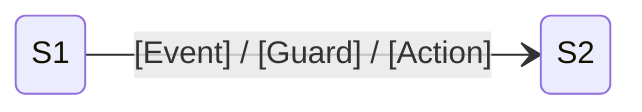

# Deep-Dive Topology — {Issue-ID}

> 可按需独立落盘；默认优先沉入 `functionality-deep-dive-rca.md` 附录。

## State Topology
| State ID | Class | State | Trigger | Liveness |
|----------|-------|-------|---------|----------|
| S1 | [Class] | [State] | [条件] | [Live/Suspect] |

## State Diagram

## Illegal Transitions
- [Sa -> Sb] [描述]

## Data Flow And Dirty Writes
| Location | Description | Line |
|----------|-------------|------|
| [Class.method] | [描述] | [L123 / Line-Uncertain] |
